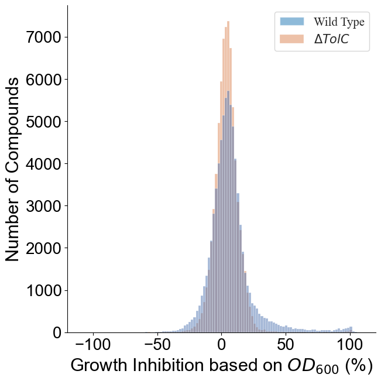
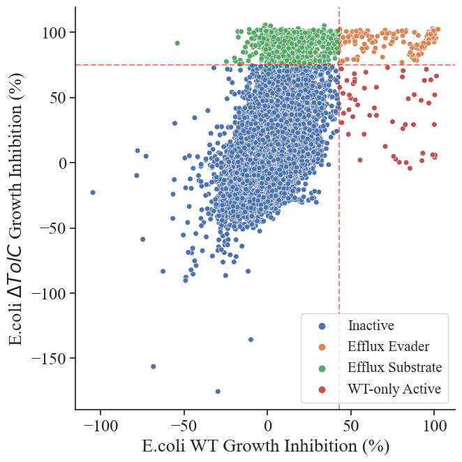
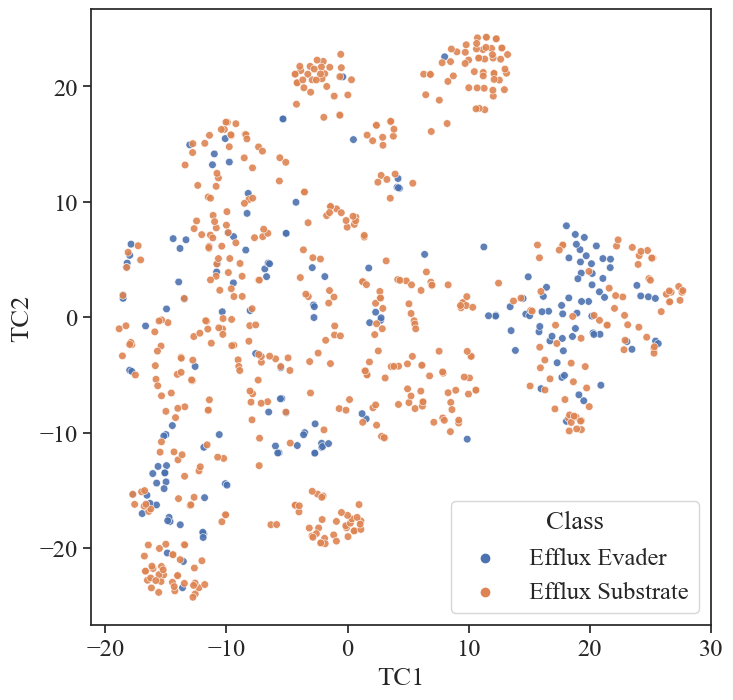
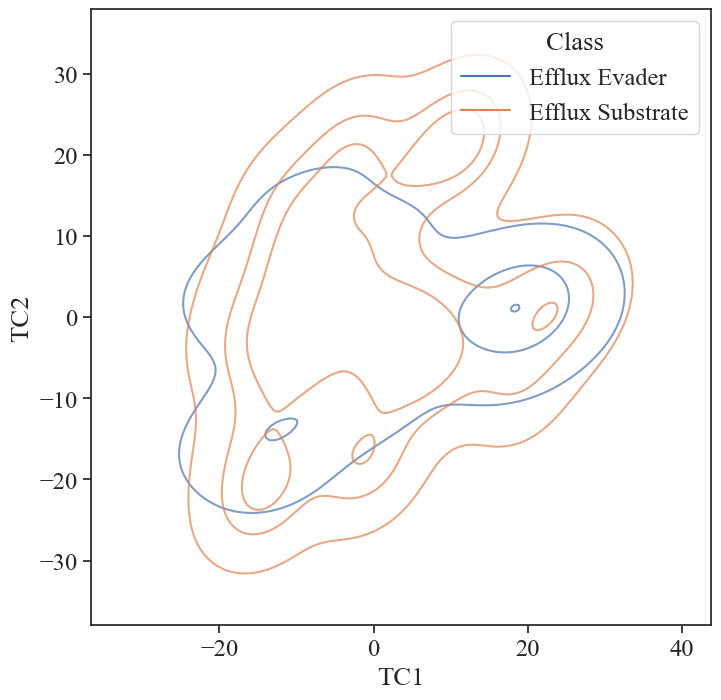
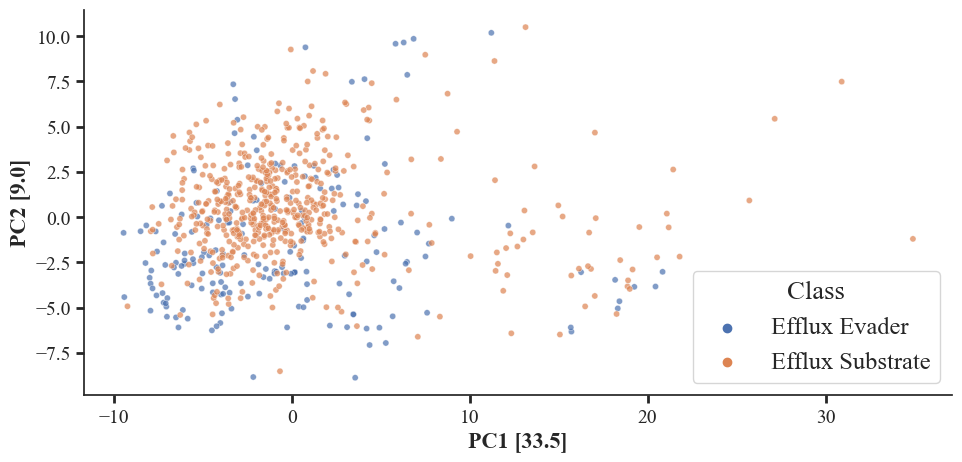
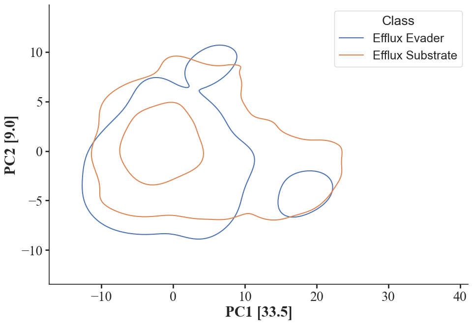
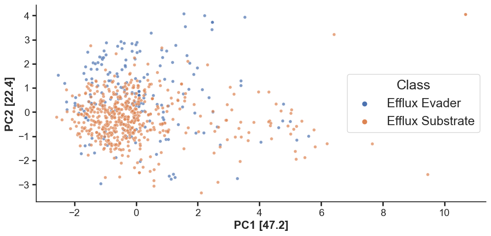
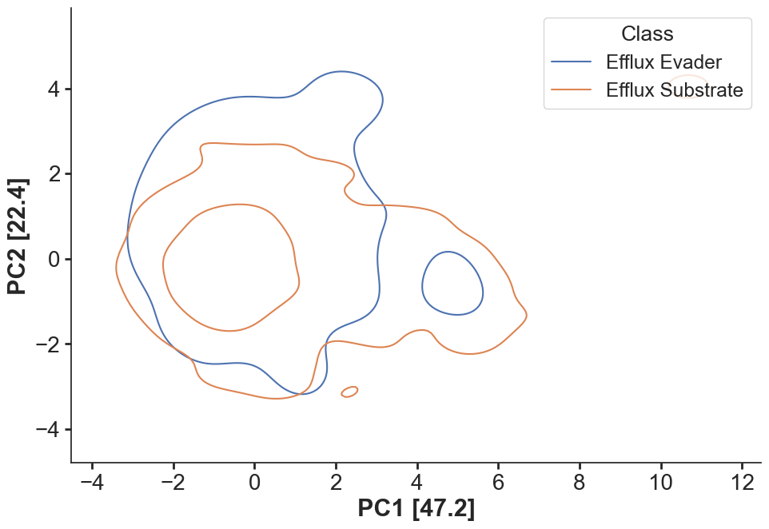

```python
# load conda environment
import sys
sys.path.append("/homes/dgurvic/software/miniconda3/envs/jupt_test/lib/python3.7/site-packages/")

from ml_mmpa import master_functions

# data process
import pandas as pd
import numpy as np
from scipy import stats

import matplotlib.pyplot as plt

import seaborn as sns


from sklearn.decomposition import PCA
from sklearn.preprocessing import StandardScaler
from sklearn.metrics import silhouette_samples, silhouette_score
from sklearn.cluster import KMeans
from sklearn import datasets, decomposition
from sklearn.manifold import TSNE

#chem

from rdkit import Chem, DataStructs
from rdkit.Chem import AllChem, MACCSkeys, Descriptors, Descriptors3D, Draw, rdMolDescriptors, Draw, PandasTools
from rdkit.DataManip.Metric.rdMetricMatrixCalc import GetTanimotoSimMat, GetTanimotoDistMat
from rdkit.Chem.Draw import IPythonConsole
```

# Initial set up

## Importing master dataset


```python
# import master inhibition data
inhibition = pd.read_csv('data/CO-ADD_InhibitionData_r03_01-02-2020_CSV.csv', low_memory=False)
```


```python
# check strains avilable in organism == e. coli
inhibition[inhibition['ORGANISM'] == 'Escherichia coli'].STRAIN.value_counts()
```


    ATCC 25922      82517
    lpxC; MB4902    81058
    tolC; MB5747    74177
    Name: STRAIN, dtype: int64


```python
# one compound has outlying values of -213.7 and -278.75 and -329.47 for WT,  tolC and lpxC respectivley, it skews data, I will drop it.

inhibition = inhibition[inhibition.SMILES != 'S(O)(=O)(=O)c1ccccc1\\C(\\c(cc(C)c(c2Br)O)c2)=C(\\C=C3C)/C=C(C3=O)Br']

```


```python
# define subsets: 

e_coli_wild = inhibition[(inhibition['ORGANISM']=='Escherichia coli') & (inhibition['STRAIN']=='ATCC 25922')][['SMILES', 'INHIB_AVE']].groupby('SMILES').mean().reset_index()

e_coli_efflux = inhibition[(inhibition['ORGANISM']=='Escherichia coli') & (inhibition['STRAIN']=='tolC; MB5747')][['SMILES', 'INHIB_AVE']].groupby('SMILES').mean().reset_index()

e_coli_pore = inhibition[(inhibition['ORGANISM']=='Escherichia coli') & (inhibition['STRAIN']=='lpxC; MB4902')][['SMILES', 'INHIB_AVE']].groupby('SMILES').mean().reset_index()
```


```python
# collect overlping data:

e_coli_wild_efflux = e_coli_wild[['SMILES', 'INHIB_AVE']].merge(e_coli_efflux[['SMILES', 'INHIB_AVE']],  on='SMILES', suffixes=('_wild', '_efflux'))
e_coli_wild_perm = e_coli_wild[['SMILES', 'INHIB_AVE']].merge(e_coli_pore[['SMILES', 'INHIB_AVE']], on='SMILES', suffixes=('_wild', '_lpxC'))
```

## Plotting WT vs tolC


```python
# e_coli_wild_efflux[['INHIB_AVE_wild', 'INHIB_AVE_efflux']].plot.hist(bins=200, alpha=0.5, figsize=[10,7])


# sns.set(rc={"figure.figsize":(10, 7)})

fig, ax = plt.subplots(figsize=(7,7))


sns.set(context='notebook', style='ticks', font='Times New Roman', font_scale=1.9, rc=None)

sns.histplot(e_coli_wild_efflux[['INHIB_AVE_efflux', 'INHIB_AVE_wild']], alpha=0.5, bins=150)

plt.legend(labels = ['Wild Type', '$\Delta TolC$'],  fontsize=15)

plt.xlim([-120, 120])

plt.xlabel('Growth Inhibition based on $OD_{600}$ (%)', fontsize=22);
plt.ylabel('Number of Compounds',  fontsize=22);

plt.yticks(fontsize=20)
plt.xticks(fontsize=20)

plt.tight_layout()
sns.despine()

```


    

    


### Paired t-test


```python
# we can now compoute paired t-test to see if removing TolC made a significant difference or not:

stats.ttest_rel(e_coli_wild_efflux['INHIB_AVE_wild'], e_coli_wild_efflux['INHIB_AVE_efflux'])
```


    Ttest_relResult(statistic=-44.099887587864416, pvalue=0.0)


## Defining evaders and substartes


```python
# calculate z-score:
e_coli_wild_efflux['wild_stds'] = stats.zscore(e_coli_wild_efflux.INHIB_AVE_wild)
e_coli_wild_efflux['tolc_stds'] = stats.zscore(e_coli_wild_efflux.INHIB_AVE_efflux)
```


```python
# label each compounds according to threshold of 4

threshold = 4

def label_it(row):
    if row['wild_stds'] >=threshold:
        return 'active'
    if row['wild_stds'] <threshold:
        return 'inactive'
    
e_coli_wild_efflux['wild_class'] = e_coli_wild_efflux.apply(label_it, axis=1)

def label_it_tolc(row):
    if row['tolc_stds'] >=threshold:
        return 'active'
    if row['tolc_stds'] <threshold:
        return 'inactive'
    
    
e_coli_wild_efflux['tolc_class'] = e_coli_wild_efflux.apply(label_it_tolc, axis=1)
```


```python
# label compounds based on combination of activity defined above

def label_substrate(row):
    if row['tolc_class'] == 'active' and row['wild_class'] == 'inactive':
        return 'Efflux Substrate'
    if row['tolc_class'] == 'active' and row['wild_class'] == 'active':
        return 'Efflux Evader'
    if row['tolc_class'] == 'inactive' and row['wild_class'] == 'inactive':
        return 'Inactive'
    if row['tolc_class'] == 'inactive' and row['wild_class'] == 'active':
        return 'WT-only Active'
```

## Resulting Number of classes


```python
# check the numbers of classified data

e_coli_wild_efflux['Class'] = e_coli_wild_efflux.apply(label_substrate, axis=1)
e_coli_wild_efflux.Class.value_counts()
```


    Inactive            72730
    Efflux Substrate      760
    Efflux Evader         200
    WT-only Active         53
    Name: Class, dtype: int64


## Scatter Plot


```python
sns.set(rc={"figure.figsize":(7, 7)})

sns.set(context='notebook', style='ticks', font='Times New Roman', font_scale=1.6, rc=None)


sns.scatterplot(data = e_coli_wild_efflux, x='INHIB_AVE_wild', y='INHIB_AVE_efflux', hue='Class', s=30)

sns.despine()

# plt.legend(fontsize=20)

# plt.xlim([-120, 120])

plt.xlabel('E.coli WT Growth Inhibition (%)');

plt.ylabel('E.coli $\Delta TolC$ Growth Inhibition (%)');

# plt.yticks(fontsize=20)
# plt.xticks(fontsize=20)

# plt.axvline(x=43.02,  color='red', linestyle='--', alpha=0.5)
# plt.axhline(y=74.98,  color='red', linestyle='--', alpha=0.5)

plt.axvline(x=e_coli_wild_efflux[e_coli_wild_efflux['wild_stds']>=4].sort_values(by='wild_stds').INHIB_AVE_wild.iloc[0],  color='red', linestyle='--', alpha=0.5)
plt.axhline(y=e_coli_wild_efflux[e_coli_wild_efflux['tolc_stds']>=4].sort_values(by='tolc_stds').INHIB_AVE_efflux.iloc[0],  color='red', linestyle='--', alpha=0.5)

plt.legend(fontsize=15)
plt.tight_layout()

# plt.savefig('figures/wild_tolc_class_scatter.png', dpi=600)
```


    

    


```python
# we can save those datasets seperately

efflux_substrate = e_coli_wild_efflux[e_coli_wild_efflux['Class']=='Efflux Substrate']

efflux_evader = e_coli_wild_efflux[e_coli_wild_efflux['Class']=='Efflux Evader']

wt_only = e_coli_wild_efflux[e_coli_wild_efflux['Class']=='WT-only Active']

inactive = e_coli_wild_efflux[e_coli_wild_efflux['Class']=='Inactive']
```

## Resulting evaders and substartes


```python
print('No. of resulting evaders: {} \nNo. of resulting substrates: {}'.format(len(efflux_evader), len(efflux_substrate)))
```

    No. of resulting evaders: 200 
    No. of resulting substrates: 760
    

# OM Bias


```python
# import permeating and non-permeating datapoints, they were achived using same process as described above

om_permeating = pd.read_pickle('data_curated/om_permeating.pkl')
om_non_permeating = pd.read_pickle('data_curated/om_non_permeating.pkl')
```


```python
# to compare the smiles between the two we fisr turn all smiles into same canonical smiles format

efflux_evader['SMILES'] = efflux_evader.SMILES.apply(Chem.CanonSmiles)
efflux_substrate['SMILES'] = efflux_substrate.SMILES.apply(Chem.CanonSmiles)
```

    C:\Users\domin\AppData\Local\Temp\ipykernel_30292\348032441.py:3: SettingWithCopyWarning: 
    A value is trying to be set on a copy of a slice from a DataFrame.
    Try using .loc[row_indexer,col_indexer] = value instead
    
    See the caveats in the documentation: https://pandas.pydata.org/pandas-docs/stable/user_guide/indexing.html#returning-a-view-versus-a-copy
      efflux_evader['SMILES'] = efflux_evader.SMILES.apply(Chem.CanonSmiles)
    C:\Users\domin\AppData\Local\Temp\ipykernel_30292\348032441.py:4: SettingWithCopyWarning: 
    A value is trying to be set on a copy of a slice from a DataFrame.
    Try using .loc[row_indexer,col_indexer] = value instead
    
    See the caveats in the documentation: https://pandas.pydata.org/pandas-docs/stable/user_guide/indexing.html#returning-a-view-versus-a-copy
      efflux_substrate['SMILES'] = efflux_substrate.SMILES.apply(Chem.CanonSmiles)
    


```python
# grab only evaders that are also in OM permeating class
efflux_evaders_om_corrected = efflux_evader[efflux_evader['SMILES'].isin(om_permeating['SMILES'])]
```


```python
# grab only substrates that are not in non-permeating class
efflux_substrates_om_corrected = efflux_substrate[~efflux_substrate['SMILES'].isin(om_non_permeating['SMILES'])]
```

## Resulting evaders and substartes


```python
print('No. of resulting evaders: {} \nNo. of resulting substrates: {}'.format(len(efflux_evaders_om_corrected), len(efflux_substrates_om_corrected)))
```

    No. of resulting evaders: 186 
    No. of resulting substrates: 554
    

### Re-defining inactive mols


```python
e_coli_wild_efflux['mol'] = e_coli_wild_efflux.SMILES.apply(Chem.MolFromSmiles)
```

    [15:50:23] Explicit valence for atom # 2 C, 6, is greater than permitted
    [15:50:27] Explicit valence for atom # 0 B, 6, is greater than permitted
    [15:50:27] Explicit valence for atom # 0 B, 6, is greater than permitted
    [15:50:27] Explicit valence for atom # 0 B, 6, is greater than permitted
    [15:50:27] Explicit valence for atom # 0 B, 6, is greater than permitted
    [15:50:27] Explicit valence for atom # 0 C, 6, is greater than permitted
    


```python
e_coli_wild_efflux = e_coli_wild_efflux.dropna()
```


```python
e_coli_wild_efflux['SMILES'] = e_coli_wild_efflux.SMILES.apply(Chem.CanonSmiles)
```


```python
wt_only['mol'] = wt_only.SMILES.apply(Chem.MolFromSmiles)
```


```python
wt_only = wt_only.dropna()
```


```python
wt_only['SMILES'] = wt_only.SMILES.apply(Chem.CanonSmiles)
```


```python
# Since efflux evaders and substartes have changed we must redifine inactive molecules, as:
#     Original dataset without evaders and substartes and wt-active only
    
inactive = e_coli_wild_efflux[~e_coli_wild_efflux['SMILES'].isin(efflux_evaders_om_corrected['SMILES'])]

inactive = inactive[~inactive['SMILES'].isin(efflux_substrates_om_corrected['SMILES'])]

inactive = inactive[~inactive['SMILES'].isin(wt_only['SMILES'])]
```

# t-SNE of evaders vs substartes


```python
# sample of what the dataset currently looks like
efflux_substrates_om_corrected.head(5)
```


<div>
<style scoped>
    .dataframe tbody tr th:only-of-type {
        vertical-align: middle;
    }

    .dataframe tbody tr th {
        vertical-align: top;
    }

    .dataframe thead th {
        text-align: right;
    }
</style>
<table border="1" class="dataframe">
  <thead>
    <tr style="text-align: right;">
      <th></th>
      <th>SMILES</th>
      <th>INHIB_AVE_wild</th>
      <th>INHIB_AVE_efflux</th>
      <th>wild_stds</th>
      <th>tolc_stds</th>
      <th>wild_class</th>
      <th>tolc_class</th>
      <th>Class</th>
    </tr>
  </thead>
  <tbody>
    <tr>
      <th>145</th>
      <td>Brc1cncc(-c2cc(NCCCn3ccnc3)nc(-c3ccccc3)n2)c1</td>
      <td>4.60</td>
      <td>80.47</td>
      <td>0.054632</td>
      <td>4.326681</td>
      <td>inactive</td>
      <td>active</td>
      <td>Efflux Substrate</td>
    </tr>
    <tr>
      <th>308</th>
      <td>N#C/C(=N\Nc1cccc(C(F)(F)F)c1)C(N)=S</td>
      <td>18.36</td>
      <td>87.98</td>
      <td>1.468423</td>
      <td>4.766621</td>
      <td>inactive</td>
      <td>active</td>
      <td>Efflux Substrate</td>
    </tr>
    <tr>
      <th>403</th>
      <td>CC(C)C(=O)/C(=C/c1ccc(Cl)cc1Cl)n1cncn1</td>
      <td>5.84</td>
      <td>97.31</td>
      <td>0.182037</td>
      <td>5.313179</td>
      <td>inactive</td>
      <td>active</td>
      <td>Efflux Substrate</td>
    </tr>
    <tr>
      <th>585</th>
      <td>O=C(N/N=C(/CC(=O)c1cccs1)C(F)(F)F)c1cccc([N+](...</td>
      <td>-3.58</td>
      <td>88.80</td>
      <td>-0.785834</td>
      <td>4.814658</td>
      <td>inactive</td>
      <td>active</td>
      <td>Efflux Substrate</td>
    </tr>
    <tr>
      <th>589</th>
      <td>O=C(N/N=C(/CC(=O)c1cccs1)C(F)(F)F)c1ccc(Cl)cc1</td>
      <td>20.78</td>
      <td>77.14</td>
      <td>1.717070</td>
      <td>4.131607</td>
      <td>inactive</td>
      <td>active</td>
      <td>Efflux Substrate</td>
    </tr>
  </tbody>
</table>
</div>


```python
# we need to compute fingerprints from SMILES for t-sne:

efflux_evaders_om_corrected['mol'] = efflux_evaders_om_corrected.SMILES.apply(Chem.MolFromSmiles)
efflux_evaders_om_corrected.dropna(subset=['mol'], inplace=True)

efflux_evaders_om_corrected['fps']=efflux_evaders_om_corrected.mol.apply(MACCSkeys.GenMACCSKeys)


# substartes


efflux_substrates_om_corrected['mol'] = efflux_substrates_om_corrected.SMILES.apply(Chem.MolFromSmiles)
efflux_substrates_om_corrected.dropna(subset=['mol'], inplace=True)

efflux_substrates_om_corrected['fps']=efflux_substrates_om_corrected.mol.apply(MACCSkeys.GenMACCSKeys)

```

    C:\Users\domin\AppData\Local\Temp\ipykernel_30292\1773481342.py:3: SettingWithCopyWarning: 
    A value is trying to be set on a copy of a slice from a DataFrame.
    Try using .loc[row_indexer,col_indexer] = value instead
    
    See the caveats in the documentation: https://pandas.pydata.org/pandas-docs/stable/user_guide/indexing.html#returning-a-view-versus-a-copy
      efflux_evaders_om_corrected['mol'] = efflux_evaders_om_corrected.SMILES.apply(Chem.MolFromSmiles)
    C:\Users\domin\AppData\Local\Temp\ipykernel_30292\1773481342.py:4: SettingWithCopyWarning: 
    A value is trying to be set on a copy of a slice from a DataFrame
    
    See the caveats in the documentation: https://pandas.pydata.org/pandas-docs/stable/user_guide/indexing.html#returning-a-view-versus-a-copy
      efflux_evaders_om_corrected.dropna(subset=['mol'], inplace=True)
    C:\Users\domin\AppData\Local\Temp\ipykernel_30292\1773481342.py:6: SettingWithCopyWarning: 
    A value is trying to be set on a copy of a slice from a DataFrame.
    Try using .loc[row_indexer,col_indexer] = value instead
    
    See the caveats in the documentation: https://pandas.pydata.org/pandas-docs/stable/user_guide/indexing.html#returning-a-view-versus-a-copy
      efflux_evaders_om_corrected['fps']=efflux_evaders_om_corrected.mol.apply(MACCSkeys.GenMACCSKeys)
    C:\Users\domin\AppData\Local\Temp\ipykernel_30292\1773481342.py:12: SettingWithCopyWarning: 
    A value is trying to be set on a copy of a slice from a DataFrame.
    Try using .loc[row_indexer,col_indexer] = value instead
    
    See the caveats in the documentation: https://pandas.pydata.org/pandas-docs/stable/user_guide/indexing.html#returning-a-view-versus-a-copy
      efflux_substrates_om_corrected['mol'] = efflux_substrates_om_corrected.SMILES.apply(Chem.MolFromSmiles)
    C:\Users\domin\AppData\Local\Temp\ipykernel_30292\1773481342.py:13: SettingWithCopyWarning: 
    A value is trying to be set on a copy of a slice from a DataFrame
    
    See the caveats in the documentation: https://pandas.pydata.org/pandas-docs/stable/user_guide/indexing.html#returning-a-view-versus-a-copy
      efflux_substrates_om_corrected.dropna(subset=['mol'], inplace=True)
    C:\Users\domin\AppData\Local\Temp\ipykernel_30292\1773481342.py:15: SettingWithCopyWarning: 
    A value is trying to be set on a copy of a slice from a DataFrame.
    Try using .loc[row_indexer,col_indexer] = value instead
    
    See the caveats in the documentation: https://pandas.pydata.org/pandas-docs/stable/user_guide/indexing.html#returning-a-view-versus-a-copy
      efflux_substrates_om_corrected['fps']=efflux_substrates_om_corrected.mol.apply(MACCSkeys.GenMACCSKeys)
    


```python
# combine two datasets and reset index

sub_and_evade_om_corrected = pd.concat([efflux_evaders_om_corrected,efflux_substrates_om_corrected]).reset_index(drop=True)
```


```python
sub_and_evade_om_corrected_tsne = master_functions.tsne_no_plot(sub_and_evade_om_corrected['fps'], perp=50)

fig, ax = plt.subplots(figsize=(8,8))

sns.scatterplot(x='TC1',y='TC2',data=sub_and_evade_om_corrected_tsne, s=30 ,alpha=0.9, hue=sub_and_evade_om_corrected['Class']) 

fig, ax = plt.subplots(figsize=(8,8))

sns.kdeplot(x='TC1',y='TC2',data=sub_and_evade_om_corrected_tsne,alpha=0.7, hue=sub_and_evade_om_corrected['Class'], levels = 4)
```

    [t-SNE] Computing 151 nearest neighbors...
    [t-SNE] Indexed 740 samples in 0.000s...
    [t-SNE] Computed neighbors for 740 samples in 0.141s...
    [t-SNE] Computed conditional probabilities for sample 740 / 740
    [t-SNE] Mean sigma: 1.233915
    [t-SNE] KL divergence after 250 iterations with early exaggeration: 60.352993
    [t-SNE] KL divergence after 1000 iterations: 0.593072
    


    <Axes: xlabel='TC1', ylabel='TC2'>


    

    


    

    


We find some overlapping compounds

# PCA of evaders and substrates


```python
def calcualte_features_single(df, col):
    generator = MakeGenerator(("rdkit2d",))
    names=[name[0] for name in  generator.GetColumns()]
    
    l_feat=[]
    
    print('Computing features: ')
    
    for i in trange(len(df[col].values)):
        l_data = generator.process(df[col].values[i])
        
        if l_data[0]  == True:
            l_feat.append(l_data[1:])
        else:
            print('left: ', l_data[0])
            print(df[col].values[i])
    

    # add descriptors to existing dataframe 
    feats = pd.DataFrame()
    
    for i in trange(len(l_feat)):
        feats = feats.append(pd.Series(l_feat[i]), ignore_index=True)
    
    for i in trange(len(l_feat)):
        feats = feats.append(pd.Series(l_feat[i]), ignore_index=True)
        feats = pd.concat([feats, ])
    feats.columns = names[1:]

    return feats
```


```python
sub_and_evade_features = master_functions.calcualte_features_single(sub_and_evade_om_corrected, 'SMILES')
sub_and_evade_features['Class'] = sub_and_evade_om_corrected['Class']
```

    Computing features: 
    

    100%|███████████████████████████████████████████████████████████████████████████████| 740/740 [00:07<00:00, 100.18it/s]
      0%|                                                                                          | 0/740 [00:00<?, ?it/s]H:\My Drive\co_add_jupyter\ml_mmpa\master_functions.py:235: FutureWarning: The frame.append method is deprecated and will be removed from pandas in a future version. Use pandas.concat instead.
      feats = feats.append(pd.Series(l_feat[i]), ignore_index=True)
    H:\My Drive\co_add_jupyter\ml_mmpa\master_functions.py:235: FutureWarning: The frame.append method is deprecated and will be removed from pandas in a future version. Use pandas.concat instead.
      feats = feats.append(pd.Series(l_feat[i]), ignore_index=True)
    H:\My Drive\co_add_jupyter\ml_mmpa\master_functions.py:235: FutureWarning: The frame.append method is deprecated and will be removed from pandas in a future version. Use pandas.concat instead.
      feats = feats.append(pd.Series(l_feat[i]), ignore_index=True)
    H:\My Drive\co_add_jupyter\ml_mmpa\master_functions.py:235: FutureWarning: The frame.append method is deprecated and will be removed from pandas in a future version. Use pandas.concat instead.
      feats = feats.append(pd.Series(l_feat[i]), ignore_index=True)
    H:\My Drive\co_add_jupyter\ml_mmpa\master_functions.py:235: FutureWarning: The frame.append method is deprecated and will be removed from pandas in a future version. Use pandas.concat instead.
      feats = feats.append(pd.Series(l_feat[i]), ignore_index=True)
    H:\My Drive\co_add_jupyter\ml_mmpa\master_functions.py:235: FutureWarning: The frame.append method is deprecated and will be removed from pandas in a future version. Use pandas.concat instead.
      feats = feats.append(pd.Series(l_feat[i]), ignore_index=True)
    H:\My Drive\co_add_jupyter\ml_mmpa\master_functions.py:235: FutureWarning: The frame.append method is deprecated and will be removed from pandas in a future version. Use pandas.concat instead.
      feats = feats.append(pd.Series(l_feat[i]), ignore_index=True)
    H:\My Drive\co_add_jupyter\ml_mmpa\master_functions.py:235: FutureWarning: The frame.append method is deprecated and will be removed from pandas in a future version. Use pandas.concat instead.
      feats = feats.append(pd.Series(l_feat[i]), ignore_index=True)
    H:\My Drive\co_add_jupyter\ml_mmpa\master_functions.py:235: FutureWarning: The frame.append method is deprecated and will be removed from pandas in a future version. Use pandas.concat instead.
      feats = feats.append(pd.Series(l_feat[i]), ignore_index=True)
    H:\My Drive\co_add_jupyter\ml_mmpa\master_functions.py:235: FutureWarning: The frame.append method is deprecated and will be removed from pandas in a future version. Use pandas.concat instead.
      feats = feats.append(pd.Series(l_feat[i]), ignore_index=True)
    H:\My Drive\co_add_jupyter\ml_mmpa\master_functions.py:235: FutureWarning: The frame.append method is deprecated and will be removed from pandas in a future version. Use pandas.concat instead.
      feats = feats.append(pd.Series(l_feat[i]), ignore_index=True)
    H:\My Drive\co_add_jupyter\ml_mmpa\master_functions.py:235: FutureWarning: The frame.append method is deprecated and will be removed from pandas in a future version. Use pandas.concat instead.
      feats = feats.append(pd.Series(l_feat[i]), ignore_index=True)
    H:\My Drive\co_add_jupyter\ml_mmpa\master_functions.py:235: FutureWarning: The frame.append method is deprecated and will be removed from pandas in a future version. Use pandas.concat instead.
      feats = feats.append(pd.Series(l_feat[i]), ignore_index=True)
    H:\My Drive\co_add_jupyter\ml_mmpa\master_functions.py:235: FutureWarning: The frame.append method is deprecated and will be removed from pandas in a future version. Use pandas.concat instead.
      feats = feats.append(pd.Series(l_feat[i]), ignore_index=True)
    H:\My Drive\co_add_jupyter\ml_mmpa\master_functions.py:235: FutureWarning: The frame.append method is deprecated and will be removed from pandas in a future version. Use pandas.concat instead.
      feats = feats.append(pd.Series(l_feat[i]), ignore_index=True)
    H:\My Drive\co_add_jupyter\ml_mmpa\master_functions.py:235: FutureWarning: The frame.append method is deprecated and will be removed from pandas in a future version. Use pandas.concat instead.
      feats = feats.append(pd.Series(l_feat[i]), ignore_index=True)
    H:\My Drive\co_add_jupyter\ml_mmpa\master_functions.py:235: FutureWarning: The frame.append method is deprecated and will be removed from pandas in a future version. Use pandas.concat instead.
      feats = feats.append(pd.Series(l_feat[i]), ignore_index=True)
    H:\My Drive\co_add_jupyter\ml_mmpa\master_functions.py:235: FutureWarning: The frame.append method is deprecated and will be removed from pandas in a future version. Use pandas.concat instead.
      feats = feats.append(pd.Series(l_feat[i]), ignore_index=True)
    H:\My Drive\co_add_jupyter\ml_mmpa\master_functions.py:235: FutureWarning: The frame.append method is deprecated and will be removed from pandas in a future version. Use pandas.concat instead.
      feats = feats.append(pd.Series(l_feat[i]), ignore_index=True)
    H:\My Drive\co_add_jupyter\ml_mmpa\master_functions.py:235: FutureWarning: The frame.append method is deprecated and will be removed from pandas in a future version. Use pandas.concat instead.
      feats = feats.append(pd.Series(l_feat[i]), ignore_index=True)
    H:\My Drive\co_add_jupyter\ml_mmpa\master_functions.py:235: FutureWarning: The frame.append method is deprecated and will be removed from pandas in a future version. Use pandas.concat instead.
      feats = feats.append(pd.Series(l_feat[i]), ignore_index=True)
    H:\My Drive\co_add_jupyter\ml_mmpa\master_functions.py:235: FutureWarning: The frame.append method is deprecated and will be removed from pandas in a future version. Use pandas.concat instead.
      feats = feats.append(pd.Series(l_feat[i]), ignore_index=True)
    H:\My Drive\co_add_jupyter\ml_mmpa\master_functions.py:235: FutureWarning: The frame.append method is deprecated and will be removed from pandas in a future version. Use pandas.concat instead.
      feats = feats.append(pd.Series(l_feat[i]), ignore_index=True)
    H:\My Drive\co_add_jupyter\ml_mmpa\master_functions.py:235: FutureWarning: The frame.append method is deprecated and will be removed from pandas in a future version. Use pandas.concat instead.
      feats = feats.append(pd.Series(l_feat[i]), ignore_index=True)
    H:\My Drive\co_add_jupyter\ml_mmpa\master_functions.py:235: FutureWarning: The frame.append method is deprecated and will be removed from pandas in a future version. Use pandas.concat instead.
      feats = feats.append(pd.Series(l_feat[i]), ignore_index=True)
    H:\My Drive\co_add_jupyter\ml_mmpa\master_functions.py:235: FutureWarning: The frame.append method is deprecated and will be removed from pandas in a future version. Use pandas.concat instead.
      feats = feats.append(pd.Series(l_feat[i]), ignore_index=True)
    H:\My Drive\co_add_jupyter\ml_mmpa\master_functions.py:235: FutureWarning: The frame.append method is deprecated and will be removed from pandas in a future version. Use pandas.concat instead.
      feats = feats.append(pd.Series(l_feat[i]), ignore_index=True)
    H:\My Drive\co_add_jupyter\ml_mmpa\master_functions.py:235: FutureWarning: The frame.append method is deprecated and will be removed from pandas in a future version. Use pandas.concat instead.
      feats = feats.append(pd.Series(l_feat[i]), ignore_index=True)
    H:\My Drive\co_add_jupyter\ml_mmpa\master_functions.py:235: FutureWarning: The frame.append method is deprecated and will be removed from pandas in a future version. Use pandas.concat instead.
      feats = feats.append(pd.Series(l_feat[i]), ignore_index=True)
    H:\My Drive\co_add_jupyter\ml_mmpa\master_functions.py:235: FutureWarning: The frame.append method is deprecated and will be removed from pandas in a future version. Use pandas.concat instead.
      feats = feats.append(pd.Series(l_feat[i]), ignore_index=True)
    H:\My Drive\co_add_jupyter\ml_mmpa\master_functions.py:235: FutureWarning: The frame.append method is deprecated and will be removed from pandas in a future version. Use pandas.concat instead.
      feats = feats.append(pd.Series(l_feat[i]), ignore_index=True)
    H:\My Drive\co_add_jupyter\ml_mmpa\master_functions.py:235: FutureWarning: The frame.append method is deprecated and will be removed from pandas in a future version. Use pandas.concat instead.
      feats = feats.append(pd.Series(l_feat[i]), ignore_index=True)
    H:\My Drive\co_add_jupyter\ml_mmpa\master_functions.py:235: FutureWarning: The frame.append method is deprecated and will be removed from pandas in a future version. Use pandas.concat instead.
      feats = feats.append(pd.Series(l_feat[i]), ignore_index=True)
    H:\My Drive\co_add_jupyter\ml_mmpa\master_functions.py:235: FutureWarning: The frame.append method is deprecated and will be removed from pandas in a future version. Use pandas.concat instead.
      feats = feats.append(pd.Series(l_feat[i]), ignore_index=True)
    H:\My Drive\co_add_jupyter\ml_mmpa\master_functions.py:235: FutureWarning: The frame.append method is deprecated and will be removed from pandas in a future version. Use pandas.concat instead.
      feats = feats.append(pd.Series(l_feat[i]), ignore_index=True)
    H:\My Drive\co_add_jupyter\ml_mmpa\master_functions.py:235: FutureWarning: The frame.append method is deprecated and will be removed from pandas in a future version. Use pandas.concat instead.
      feats = feats.append(pd.Series(l_feat[i]), ignore_index=True)
    H:\My Drive\co_add_jupyter\ml_mmpa\master_functions.py:235: FutureWarning: The frame.append method is deprecated and will be removed from pandas in a future version. Use pandas.concat instead.
      feats = feats.append(pd.Series(l_feat[i]), ignore_index=True)
    H:\My Drive\co_add_jupyter\ml_mmpa\master_functions.py:235: FutureWarning: The frame.append method is deprecated and will be removed from pandas in a future version. Use pandas.concat instead.
      feats = feats.append(pd.Series(l_feat[i]), ignore_index=True)
    H:\My Drive\co_add_jupyter\ml_mmpa\master_functions.py:235: FutureWarning: The frame.append method is deprecated and will be removed from pandas in a future version. Use pandas.concat instead.
      feats = feats.append(pd.Series(l_feat[i]), ignore_index=True)
    H:\My Drive\co_add_jupyter\ml_mmpa\master_functions.py:235: FutureWarning: The frame.append method is deprecated and will be removed from pandas in a future version. Use pandas.concat instead.
      feats = feats.append(pd.Series(l_feat[i]), ignore_index=True)
    H:\My Drive\co_add_jupyter\ml_mmpa\master_functions.py:235: FutureWarning: The frame.append method is deprecated and will be removed from pandas in a future version. Use pandas.concat instead.
      feats = feats.append(pd.Series(l_feat[i]), ignore_index=True)
    H:\My Drive\co_add_jupyter\ml_mmpa\master_functions.py:235: FutureWarning: The frame.append method is deprecated and will be removed from pandas in a future version. Use pandas.concat instead.
      feats = feats.append(pd.Series(l_feat[i]), ignore_index=True)
    H:\My Drive\co_add_jupyter\ml_mmpa\master_functions.py:235: FutureWarning: The frame.append method is deprecated and will be removed from pandas in a future version. Use pandas.concat instead.
      feats = feats.append(pd.Series(l_feat[i]), ignore_index=True)
    H:\My Drive\co_add_jupyter\ml_mmpa\master_functions.py:235: FutureWarning: The frame.append method is deprecated and will be removed from pandas in a future version. Use pandas.concat instead.
      feats = feats.append(pd.Series(l_feat[i]), ignore_index=True)
    H:\My Drive\co_add_jupyter\ml_mmpa\master_functions.py:235: FutureWarning: The frame.append method is deprecated and will be removed from pandas in a future version. Use pandas.concat instead.
      feats = feats.append(pd.Series(l_feat[i]), ignore_index=True)
    H:\My Drive\co_add_jupyter\ml_mmpa\master_functions.py:235: FutureWarning: The frame.append method is deprecated and will be removed from pandas in a future version. Use pandas.concat instead.
      feats = feats.append(pd.Series(l_feat[i]), ignore_index=True)
    H:\My Drive\co_add_jupyter\ml_mmpa\master_functions.py:235: FutureWarning: The frame.append method is deprecated and will be removed from pandas in a future version. Use pandas.concat instead.
      feats = feats.append(pd.Series(l_feat[i]), ignore_index=True)
    H:\My Drive\co_add_jupyter\ml_mmpa\master_functions.py:235: FutureWarning: The frame.append method is deprecated and will be removed from pandas in a future version. Use pandas.concat instead.
      feats = feats.append(pd.Series(l_feat[i]), ignore_index=True)
    H:\My Drive\co_add_jupyter\ml_mmpa\master_functions.py:235: FutureWarning: The frame.append method is deprecated and will be removed from pandas in a future version. Use pandas.concat instead.
      feats = feats.append(pd.Series(l_feat[i]), ignore_index=True)
    H:\My Drive\co_add_jupyter\ml_mmpa\master_functions.py:235: FutureWarning: The frame.append method is deprecated and will be removed from pandas in a future version. Use pandas.concat instead.
      feats = feats.append(pd.Series(l_feat[i]), ignore_index=True)
    H:\My Drive\co_add_jupyter\ml_mmpa\master_functions.py:235: FutureWarning: The frame.append method is deprecated and will be removed from pandas in a future version. Use pandas.concat instead.
      feats = feats.append(pd.Series(l_feat[i]), ignore_index=True)
    H:\My Drive\co_add_jupyter\ml_mmpa\master_functions.py:235: FutureWarning: The frame.append method is deprecated and will be removed from pandas in a future version. Use pandas.concat instead.
      feats = feats.append(pd.Series(l_feat[i]), ignore_index=True)
    H:\My Drive\co_add_jupyter\ml_mmpa\master_functions.py:235: FutureWarning: The frame.append method is deprecated and will be removed from pandas in a future version. Use pandas.concat instead.
      feats = feats.append(pd.Series(l_feat[i]), ignore_index=True)
    H:\My Drive\co_add_jupyter\ml_mmpa\master_functions.py:235: FutureWarning: The frame.append method is deprecated and will be removed from pandas in a future version. Use pandas.concat instead.
      feats = feats.append(pd.Series(l_feat[i]), ignore_index=True)
    H:\My Drive\co_add_jupyter\ml_mmpa\master_functions.py:235: FutureWarning: The frame.append method is deprecated and will be removed from pandas in a future version. Use pandas.concat instead.
      feats = feats.append(pd.Series(l_feat[i]), ignore_index=True)
    H:\My Drive\co_add_jupyter\ml_mmpa\master_functions.py:235: FutureWarning: The frame.append method is deprecated and will be removed from pandas in a future version. Use pandas.concat instead.
      feats = feats.append(pd.Series(l_feat[i]), ignore_index=True)
    H:\My Drive\co_add_jupyter\ml_mmpa\master_functions.py:235: FutureWarning: The frame.append method is deprecated and will be removed from pandas in a future version. Use pandas.concat instead.
      feats = feats.append(pd.Series(l_feat[i]), ignore_index=True)
    H:\My Drive\co_add_jupyter\ml_mmpa\master_functions.py:235: FutureWarning: The frame.append method is deprecated and will be removed from pandas in a future version. Use pandas.concat instead.
      feats = feats.append(pd.Series(l_feat[i]), ignore_index=True)
    H:\My Drive\co_add_jupyter\ml_mmpa\master_functions.py:235: FutureWarning: The frame.append method is deprecated and will be removed from pandas in a future version. Use pandas.concat instead.
      feats = feats.append(pd.Series(l_feat[i]), ignore_index=True)
    H:\My Drive\co_add_jupyter\ml_mmpa\master_functions.py:235: FutureWarning: The frame.append method is deprecated and will be removed from pandas in a future version. Use pandas.concat instead.
      feats = feats.append(pd.Series(l_feat[i]), ignore_index=True)
    H:\My Drive\co_add_jupyter\ml_mmpa\master_functions.py:235: FutureWarning: The frame.append method is deprecated and will be removed from pandas in a future version. Use pandas.concat instead.
      feats = feats.append(pd.Series(l_feat[i]), ignore_index=True)
    H:\My Drive\co_add_jupyter\ml_mmpa\master_functions.py:235: FutureWarning: The frame.append method is deprecated and will be removed from pandas in a future version. Use pandas.concat instead.
      feats = feats.append(pd.Series(l_feat[i]), ignore_index=True)
    H:\My Drive\co_add_jupyter\ml_mmpa\master_functions.py:235: FutureWarning: The frame.append method is deprecated and will be removed from pandas in a future version. Use pandas.concat instead.
      feats = feats.append(pd.Series(l_feat[i]), ignore_index=True)
    H:\My Drive\co_add_jupyter\ml_mmpa\master_functions.py:235: FutureWarning: The frame.append method is deprecated and will be removed from pandas in a future version. Use pandas.concat instead.
      feats = feats.append(pd.Series(l_feat[i]), ignore_index=True)
    H:\My Drive\co_add_jupyter\ml_mmpa\master_functions.py:235: FutureWarning: The frame.append method is deprecated and will be removed from pandas in a future version. Use pandas.concat instead.
      feats = feats.append(pd.Series(l_feat[i]), ignore_index=True)
    H:\My Drive\co_add_jupyter\ml_mmpa\master_functions.py:235: FutureWarning: The frame.append method is deprecated and will be removed from pandas in a future version. Use pandas.concat instead.
      feats = feats.append(pd.Series(l_feat[i]), ignore_index=True)
    H:\My Drive\co_add_jupyter\ml_mmpa\master_functions.py:235: FutureWarning: The frame.append method is deprecated and will be removed from pandas in a future version. Use pandas.concat instead.
      feats = feats.append(pd.Series(l_feat[i]), ignore_index=True)
    H:\My Drive\co_add_jupyter\ml_mmpa\master_functions.py:235: FutureWarning: The frame.append method is deprecated and will be removed from pandas in a future version. Use pandas.concat instead.
      feats = feats.append(pd.Series(l_feat[i]), ignore_index=True)
    H:\My Drive\co_add_jupyter\ml_mmpa\master_functions.py:235: FutureWarning: The frame.append method is deprecated and will be removed from pandas in a future version. Use pandas.concat instead.
      feats = feats.append(pd.Series(l_feat[i]), ignore_index=True)
    H:\My Drive\co_add_jupyter\ml_mmpa\master_functions.py:235: FutureWarning: The frame.append method is deprecated and will be removed from pandas in a future version. Use pandas.concat instead.
      feats = feats.append(pd.Series(l_feat[i]), ignore_index=True)
    H:\My Drive\co_add_jupyter\ml_mmpa\master_functions.py:235: FutureWarning: The frame.append method is deprecated and will be removed from pandas in a future version. Use pandas.concat instead.
      feats = feats.append(pd.Series(l_feat[i]), ignore_index=True)
    H:\My Drive\co_add_jupyter\ml_mmpa\master_functions.py:235: FutureWarning: The frame.append method is deprecated and will be removed from pandas in a future version. Use pandas.concat instead.
      feats = feats.append(pd.Series(l_feat[i]), ignore_index=True)
    H:\My Drive\co_add_jupyter\ml_mmpa\master_functions.py:235: FutureWarning: The frame.append method is deprecated and will be removed from pandas in a future version. Use pandas.concat instead.
      feats = feats.append(pd.Series(l_feat[i]), ignore_index=True)
    H:\My Drive\co_add_jupyter\ml_mmpa\master_functions.py:235: FutureWarning: The frame.append method is deprecated and will be removed from pandas in a future version. Use pandas.concat instead.
      feats = feats.append(pd.Series(l_feat[i]), ignore_index=True)
    H:\My Drive\co_add_jupyter\ml_mmpa\master_functions.py:235: FutureWarning: The frame.append method is deprecated and will be removed from pandas in a future version. Use pandas.concat instead.
      feats = feats.append(pd.Series(l_feat[i]), ignore_index=True)
    H:\My Drive\co_add_jupyter\ml_mmpa\master_functions.py:235: FutureWarning: The frame.append method is deprecated and will be removed from pandas in a future version. Use pandas.concat instead.
      feats = feats.append(pd.Series(l_feat[i]), ignore_index=True)
    H:\My Drive\co_add_jupyter\ml_mmpa\master_functions.py:235: FutureWarning: The frame.append method is deprecated and will be removed from pandas in a future version. Use pandas.concat instead.
      feats = feats.append(pd.Series(l_feat[i]), ignore_index=True)
    H:\My Drive\co_add_jupyter\ml_mmpa\master_functions.py:235: FutureWarning: The frame.append method is deprecated and will be removed from pandas in a future version. Use pandas.concat instead.
      feats = feats.append(pd.Series(l_feat[i]), ignore_index=True)
    H:\My Drive\co_add_jupyter\ml_mmpa\master_functions.py:235: FutureWarning: The frame.append method is deprecated and will be removed from pandas in a future version. Use pandas.concat instead.
      feats = feats.append(pd.Series(l_feat[i]), ignore_index=True)
    H:\My Drive\co_add_jupyter\ml_mmpa\master_functions.py:235: FutureWarning: The frame.append method is deprecated and will be removed from pandas in a future version. Use pandas.concat instead.
      feats = feats.append(pd.Series(l_feat[i]), ignore_index=True)
    H:\My Drive\co_add_jupyter\ml_mmpa\master_functions.py:235: FutureWarning: The frame.append method is deprecated and will be removed from pandas in a future version. Use pandas.concat instead.
      feats = feats.append(pd.Series(l_feat[i]), ignore_index=True)
    H:\My Drive\co_add_jupyter\ml_mmpa\master_functions.py:235: FutureWarning: The frame.append method is deprecated and will be removed from pandas in a future version. Use pandas.concat instead.
      feats = feats.append(pd.Series(l_feat[i]), ignore_index=True)
    H:\My Drive\co_add_jupyter\ml_mmpa\master_functions.py:235: FutureWarning: The frame.append method is deprecated and will be removed from pandas in a future version. Use pandas.concat instead.
      feats = feats.append(pd.Series(l_feat[i]), ignore_index=True)
    H:\My Drive\co_add_jupyter\ml_mmpa\master_functions.py:235: FutureWarning: The frame.append method is deprecated and will be removed from pandas in a future version. Use pandas.concat instead.
      feats = feats.append(pd.Series(l_feat[i]), ignore_index=True)
    H:\My Drive\co_add_jupyter\ml_mmpa\master_functions.py:235: FutureWarning: The frame.append method is deprecated and will be removed from pandas in a future version. Use pandas.concat instead.
      feats = feats.append(pd.Series(l_feat[i]), ignore_index=True)
    H:\My Drive\co_add_jupyter\ml_mmpa\master_functions.py:235: FutureWarning: The frame.append method is deprecated and will be removed from pandas in a future version. Use pandas.concat instead.
      feats = feats.append(pd.Series(l_feat[i]), ignore_index=True)
    H:\My Drive\co_add_jupyter\ml_mmpa\master_functions.py:235: FutureWarning: The frame.append method is deprecated and will be removed from pandas in a future version. Use pandas.concat instead.
      feats = feats.append(pd.Series(l_feat[i]), ignore_index=True)
    H:\My Drive\co_add_jupyter\ml_mmpa\master_functions.py:235: FutureWarning: The frame.append method is deprecated and will be removed from pandas in a future version. Use pandas.concat instead.
      feats = feats.append(pd.Series(l_feat[i]), ignore_index=True)
    H:\My Drive\co_add_jupyter\ml_mmpa\master_functions.py:235: FutureWarning: The frame.append method is deprecated and will be removed from pandas in a future version. Use pandas.concat instead.
      feats = feats.append(pd.Series(l_feat[i]), ignore_index=True)
    H:\My Drive\co_add_jupyter\ml_mmpa\master_functions.py:235: FutureWarning: The frame.append method is deprecated and will be removed from pandas in a future version. Use pandas.concat instead.
      feats = feats.append(pd.Series(l_feat[i]), ignore_index=True)
    H:\My Drive\co_add_jupyter\ml_mmpa\master_functions.py:235: FutureWarning: The frame.append method is deprecated and will be removed from pandas in a future version. Use pandas.concat instead.
      feats = feats.append(pd.Series(l_feat[i]), ignore_index=True)
    H:\My Drive\co_add_jupyter\ml_mmpa\master_functions.py:235: FutureWarning: The frame.append method is deprecated and will be removed from pandas in a future version. Use pandas.concat instead.
      feats = feats.append(pd.Series(l_feat[i]), ignore_index=True)
    H:\My Drive\co_add_jupyter\ml_mmpa\master_functions.py:235: FutureWarning: The frame.append method is deprecated and will be removed from pandas in a future version. Use pandas.concat instead.
      feats = feats.append(pd.Series(l_feat[i]), ignore_index=True)
    H:\My Drive\co_add_jupyter\ml_mmpa\master_functions.py:235: FutureWarning: The frame.append method is deprecated and will be removed from pandas in a future version. Use pandas.concat instead.
      feats = feats.append(pd.Series(l_feat[i]), ignore_index=True)
    H:\My Drive\co_add_jupyter\ml_mmpa\master_functions.py:235: FutureWarning: The frame.append method is deprecated and will be removed from pandas in a future version. Use pandas.concat instead.
      feats = feats.append(pd.Series(l_feat[i]), ignore_index=True)
    H:\My Drive\co_add_jupyter\ml_mmpa\master_functions.py:235: FutureWarning: The frame.append method is deprecated and will be removed from pandas in a future version. Use pandas.concat instead.
      feats = feats.append(pd.Series(l_feat[i]), ignore_index=True)
    H:\My Drive\co_add_jupyter\ml_mmpa\master_functions.py:235: FutureWarning: The frame.append method is deprecated and will be removed from pandas in a future version. Use pandas.concat instead.
      feats = feats.append(pd.Series(l_feat[i]), ignore_index=True)
    H:\My Drive\co_add_jupyter\ml_mmpa\master_functions.py:235: FutureWarning: The frame.append method is deprecated and will be removed from pandas in a future version. Use pandas.concat instead.
      feats = feats.append(pd.Series(l_feat[i]), ignore_index=True)
    H:\My Drive\co_add_jupyter\ml_mmpa\master_functions.py:235: FutureWarning: The frame.append method is deprecated and will be removed from pandas in a future version. Use pandas.concat instead.
      feats = feats.append(pd.Series(l_feat[i]), ignore_index=True)
    H:\My Drive\co_add_jupyter\ml_mmpa\master_functions.py:235: FutureWarning: The frame.append method is deprecated and will be removed from pandas in a future version. Use pandas.concat instead.
      feats = feats.append(pd.Series(l_feat[i]), ignore_index=True)
    H:\My Drive\co_add_jupyter\ml_mmpa\master_functions.py:235: FutureWarning: The frame.append method is deprecated and will be removed from pandas in a future version. Use pandas.concat instead.
      feats = feats.append(pd.Series(l_feat[i]), ignore_index=True)
    H:\My Drive\co_add_jupyter\ml_mmpa\master_functions.py:235: FutureWarning: The frame.append method is deprecated and will be removed from pandas in a future version. Use pandas.concat instead.
      feats = feats.append(pd.Series(l_feat[i]), ignore_index=True)
    H:\My Drive\co_add_jupyter\ml_mmpa\master_functions.py:235: FutureWarning: The frame.append method is deprecated and will be removed from pandas in a future version. Use pandas.concat instead.
      feats = feats.append(pd.Series(l_feat[i]), ignore_index=True)
    H:\My Drive\co_add_jupyter\ml_mmpa\master_functions.py:235: FutureWarning: The frame.append method is deprecated and will be removed from pandas in a future version. Use pandas.concat instead.
      feats = feats.append(pd.Series(l_feat[i]), ignore_index=True)
    H:\My Drive\co_add_jupyter\ml_mmpa\master_functions.py:235: FutureWarning: The frame.append method is deprecated and will be removed from pandas in a future version. Use pandas.concat instead.
      feats = feats.append(pd.Series(l_feat[i]), ignore_index=True)
    H:\My Drive\co_add_jupyter\ml_mmpa\master_functions.py:235: FutureWarning: The frame.append method is deprecated and will be removed from pandas in a future version. Use pandas.concat instead.
      feats = feats.append(pd.Series(l_feat[i]), ignore_index=True)
    H:\My Drive\co_add_jupyter\ml_mmpa\master_functions.py:235: FutureWarning: The frame.append method is deprecated and will be removed from pandas in a future version. Use pandas.concat instead.
      feats = feats.append(pd.Series(l_feat[i]), ignore_index=True)
    H:\My Drive\co_add_jupyter\ml_mmpa\master_functions.py:235: FutureWarning: The frame.append method is deprecated and will be removed from pandas in a future version. Use pandas.concat instead.
      feats = feats.append(pd.Series(l_feat[i]), ignore_index=True)
    H:\My Drive\co_add_jupyter\ml_mmpa\master_functions.py:235: FutureWarning: The frame.append method is deprecated and will be removed from pandas in a future version. Use pandas.concat instead.
      feats = feats.append(pd.Series(l_feat[i]), ignore_index=True)
    H:\My Drive\co_add_jupyter\ml_mmpa\master_functions.py:235: FutureWarning: The frame.append method is deprecated and will be removed from pandas in a future version. Use pandas.concat instead.
      feats = feats.append(pd.Series(l_feat[i]), ignore_index=True)
    H:\My Drive\co_add_jupyter\ml_mmpa\master_functions.py:235: FutureWarning: The frame.append method is deprecated and will be removed from pandas in a future version. Use pandas.concat instead.
      feats = feats.append(pd.Series(l_feat[i]), ignore_index=True)
    H:\My Drive\co_add_jupyter\ml_mmpa\master_functions.py:235: FutureWarning: The frame.append method is deprecated and will be removed from pandas in a future version. Use pandas.concat instead.
      feats = feats.append(pd.Series(l_feat[i]), ignore_index=True)
    H:\My Drive\co_add_jupyter\ml_mmpa\master_functions.py:235: FutureWarning: The frame.append method is deprecated and will be removed from pandas in a future version. Use pandas.concat instead.
      feats = feats.append(pd.Series(l_feat[i]), ignore_index=True)
    H:\My Drive\co_add_jupyter\ml_mmpa\master_functions.py:235: FutureWarning: The frame.append method is deprecated and will be removed from pandas in a future version. Use pandas.concat instead.
      feats = feats.append(pd.Series(l_feat[i]), ignore_index=True)
    H:\My Drive\co_add_jupyter\ml_mmpa\master_functions.py:235: FutureWarning: The frame.append method is deprecated and will be removed from pandas in a future version. Use pandas.concat instead.
      feats = feats.append(pd.Series(l_feat[i]), ignore_index=True)
    H:\My Drive\co_add_jupyter\ml_mmpa\master_functions.py:235: FutureWarning: The frame.append method is deprecated and will be removed from pandas in a future version. Use pandas.concat instead.
      feats = feats.append(pd.Series(l_feat[i]), ignore_index=True)
    H:\My Drive\co_add_jupyter\ml_mmpa\master_functions.py:235: FutureWarning: The frame.append method is deprecated and will be removed from pandas in a future version. Use pandas.concat instead.
      feats = feats.append(pd.Series(l_feat[i]), ignore_index=True)
    H:\My Drive\co_add_jupyter\ml_mmpa\master_functions.py:235: FutureWarning: The frame.append method is deprecated and will be removed from pandas in a future version. Use pandas.concat instead.
      feats = feats.append(pd.Series(l_feat[i]), ignore_index=True)
    H:\My Drive\co_add_jupyter\ml_mmpa\master_functions.py:235: FutureWarning: The frame.append method is deprecated and will be removed from pandas in a future version. Use pandas.concat instead.
      feats = feats.append(pd.Series(l_feat[i]), ignore_index=True)
    H:\My Drive\co_add_jupyter\ml_mmpa\master_functions.py:235: FutureWarning: The frame.append method is deprecated and will be removed from pandas in a future version. Use pandas.concat instead.
      feats = feats.append(pd.Series(l_feat[i]), ignore_index=True)
    H:\My Drive\co_add_jupyter\ml_mmpa\master_functions.py:235: FutureWarning: The frame.append method is deprecated and will be removed from pandas in a future version. Use pandas.concat instead.
      feats = feats.append(pd.Series(l_feat[i]), ignore_index=True)
    H:\My Drive\co_add_jupyter\ml_mmpa\master_functions.py:235: FutureWarning: The frame.append method is deprecated and will be removed from pandas in a future version. Use pandas.concat instead.
      feats = feats.append(pd.Series(l_feat[i]), ignore_index=True)
    H:\My Drive\co_add_jupyter\ml_mmpa\master_functions.py:235: FutureWarning: The frame.append method is deprecated and will be removed from pandas in a future version. Use pandas.concat instead.
      feats = feats.append(pd.Series(l_feat[i]), ignore_index=True)
    H:\My Drive\co_add_jupyter\ml_mmpa\master_functions.py:235: FutureWarning: The frame.append method is deprecated and will be removed from pandas in a future version. Use pandas.concat instead.
      feats = feats.append(pd.Series(l_feat[i]), ignore_index=True)
    H:\My Drive\co_add_jupyter\ml_mmpa\master_functions.py:235: FutureWarning: The frame.append method is deprecated and will be removed from pandas in a future version. Use pandas.concat instead.
      feats = feats.append(pd.Series(l_feat[i]), ignore_index=True)
    H:\My Drive\co_add_jupyter\ml_mmpa\master_functions.py:235: FutureWarning: The frame.append method is deprecated and will be removed from pandas in a future version. Use pandas.concat instead.
      feats = feats.append(pd.Series(l_feat[i]), ignore_index=True)
    H:\My Drive\co_add_jupyter\ml_mmpa\master_functions.py:235: FutureWarning: The frame.append method is deprecated and will be removed from pandas in a future version. Use pandas.concat instead.
      feats = feats.append(pd.Series(l_feat[i]), ignore_index=True)
    H:\My Drive\co_add_jupyter\ml_mmpa\master_functions.py:235: FutureWarning: The frame.append method is deprecated and will be removed from pandas in a future version. Use pandas.concat instead.
      feats = feats.append(pd.Series(l_feat[i]), ignore_index=True)
    H:\My Drive\co_add_jupyter\ml_mmpa\master_functions.py:235: FutureWarning: The frame.append method is deprecated and will be removed from pandas in a future version. Use pandas.concat instead.
      feats = feats.append(pd.Series(l_feat[i]), ignore_index=True)
    H:\My Drive\co_add_jupyter\ml_mmpa\master_functions.py:235: FutureWarning: The frame.append method is deprecated and will be removed from pandas in a future version. Use pandas.concat instead.
      feats = feats.append(pd.Series(l_feat[i]), ignore_index=True)
    H:\My Drive\co_add_jupyter\ml_mmpa\master_functions.py:235: FutureWarning: The frame.append method is deprecated and will be removed from pandas in a future version. Use pandas.concat instead.
      feats = feats.append(pd.Series(l_feat[i]), ignore_index=True)
    H:\My Drive\co_add_jupyter\ml_mmpa\master_functions.py:235: FutureWarning: The frame.append method is deprecated and will be removed from pandas in a future version. Use pandas.concat instead.
      feats = feats.append(pd.Series(l_feat[i]), ignore_index=True)
    H:\My Drive\co_add_jupyter\ml_mmpa\master_functions.py:235: FutureWarning: The frame.append method is deprecated and will be removed from pandas in a future version. Use pandas.concat instead.
      feats = feats.append(pd.Series(l_feat[i]), ignore_index=True)
    H:\My Drive\co_add_jupyter\ml_mmpa\master_functions.py:235: FutureWarning: The frame.append method is deprecated and will be removed from pandas in a future version. Use pandas.concat instead.
      feats = feats.append(pd.Series(l_feat[i]), ignore_index=True)
    H:\My Drive\co_add_jupyter\ml_mmpa\master_functions.py:235: FutureWarning: The frame.append method is deprecated and will be removed from pandas in a future version. Use pandas.concat instead.
      feats = feats.append(pd.Series(l_feat[i]), ignore_index=True)
    H:\My Drive\co_add_jupyter\ml_mmpa\master_functions.py:235: FutureWarning: The frame.append method is deprecated and will be removed from pandas in a future version. Use pandas.concat instead.
      feats = feats.append(pd.Series(l_feat[i]), ignore_index=True)
    H:\My Drive\co_add_jupyter\ml_mmpa\master_functions.py:235: FutureWarning: The frame.append method is deprecated and will be removed from pandas in a future version. Use pandas.concat instead.
      feats = feats.append(pd.Series(l_feat[i]), ignore_index=True)
    H:\My Drive\co_add_jupyter\ml_mmpa\master_functions.py:235: FutureWarning: The frame.append method is deprecated and will be removed from pandas in a future version. Use pandas.concat instead.
      feats = feats.append(pd.Series(l_feat[i]), ignore_index=True)
    H:\My Drive\co_add_jupyter\ml_mmpa\master_functions.py:235: FutureWarning: The frame.append method is deprecated and will be removed from pandas in a future version. Use pandas.concat instead.
      feats = feats.append(pd.Series(l_feat[i]), ignore_index=True)
    H:\My Drive\co_add_jupyter\ml_mmpa\master_functions.py:235: FutureWarning: The frame.append method is deprecated and will be removed from pandas in a future version. Use pandas.concat instead.
      feats = feats.append(pd.Series(l_feat[i]), ignore_index=True)
    H:\My Drive\co_add_jupyter\ml_mmpa\master_functions.py:235: FutureWarning: The frame.append method is deprecated and will be removed from pandas in a future version. Use pandas.concat instead.
      feats = feats.append(pd.Series(l_feat[i]), ignore_index=True)
    H:\My Drive\co_add_jupyter\ml_mmpa\master_functions.py:235: FutureWarning: The frame.append method is deprecated and will be removed from pandas in a future version. Use pandas.concat instead.
      feats = feats.append(pd.Series(l_feat[i]), ignore_index=True)
    H:\My Drive\co_add_jupyter\ml_mmpa\master_functions.py:235: FutureWarning: The frame.append method is deprecated and will be removed from pandas in a future version. Use pandas.concat instead.
      feats = feats.append(pd.Series(l_feat[i]), ignore_index=True)
    H:\My Drive\co_add_jupyter\ml_mmpa\master_functions.py:235: FutureWarning: The frame.append method is deprecated and will be removed from pandas in a future version. Use pandas.concat instead.
      feats = feats.append(pd.Series(l_feat[i]), ignore_index=True)
    H:\My Drive\co_add_jupyter\ml_mmpa\master_functions.py:235: FutureWarning: The frame.append method is deprecated and will be removed from pandas in a future version. Use pandas.concat instead.
      feats = feats.append(pd.Series(l_feat[i]), ignore_index=True)
    H:\My Drive\co_add_jupyter\ml_mmpa\master_functions.py:235: FutureWarning: The frame.append method is deprecated and will be removed from pandas in a future version. Use pandas.concat instead.
      feats = feats.append(pd.Series(l_feat[i]), ignore_index=True)
    H:\My Drive\co_add_jupyter\ml_mmpa\master_functions.py:235: FutureWarning: The frame.append method is deprecated and will be removed from pandas in a future version. Use pandas.concat instead.
      feats = feats.append(pd.Series(l_feat[i]), ignore_index=True)
    H:\My Drive\co_add_jupyter\ml_mmpa\master_functions.py:235: FutureWarning: The frame.append method is deprecated and will be removed from pandas in a future version. Use pandas.concat instead.
      feats = feats.append(pd.Series(l_feat[i]), ignore_index=True)
    H:\My Drive\co_add_jupyter\ml_mmpa\master_functions.py:235: FutureWarning: The frame.append method is deprecated and will be removed from pandas in a future version. Use pandas.concat instead.
      feats = feats.append(pd.Series(l_feat[i]), ignore_index=True)
    H:\My Drive\co_add_jupyter\ml_mmpa\master_functions.py:235: FutureWarning: The frame.append method is deprecated and will be removed from pandas in a future version. Use pandas.concat instead.
      feats = feats.append(pd.Series(l_feat[i]), ignore_index=True)
    H:\My Drive\co_add_jupyter\ml_mmpa\master_functions.py:235: FutureWarning: The frame.append method is deprecated and will be removed from pandas in a future version. Use pandas.concat instead.
      feats = feats.append(pd.Series(l_feat[i]), ignore_index=True)
    H:\My Drive\co_add_jupyter\ml_mmpa\master_functions.py:235: FutureWarning: The frame.append method is deprecated and will be removed from pandas in a future version. Use pandas.concat instead.
      feats = feats.append(pd.Series(l_feat[i]), ignore_index=True)
    H:\My Drive\co_add_jupyter\ml_mmpa\master_functions.py:235: FutureWarning: The frame.append method is deprecated and will be removed from pandas in a future version. Use pandas.concat instead.
      feats = feats.append(pd.Series(l_feat[i]), ignore_index=True)
    H:\My Drive\co_add_jupyter\ml_mmpa\master_functions.py:235: FutureWarning: The frame.append method is deprecated and will be removed from pandas in a future version. Use pandas.concat instead.
      feats = feats.append(pd.Series(l_feat[i]), ignore_index=True)
    H:\My Drive\co_add_jupyter\ml_mmpa\master_functions.py:235: FutureWarning: The frame.append method is deprecated and will be removed from pandas in a future version. Use pandas.concat instead.
      feats = feats.append(pd.Series(l_feat[i]), ignore_index=True)
    H:\My Drive\co_add_jupyter\ml_mmpa\master_functions.py:235: FutureWarning: The frame.append method is deprecated and will be removed from pandas in a future version. Use pandas.concat instead.
      feats = feats.append(pd.Series(l_feat[i]), ignore_index=True)
    H:\My Drive\co_add_jupyter\ml_mmpa\master_functions.py:235: FutureWarning: The frame.append method is deprecated and will be removed from pandas in a future version. Use pandas.concat instead.
      feats = feats.append(pd.Series(l_feat[i]), ignore_index=True)
     21%|████████████████▌                                                             | 157/740 [00:00<00:00, 1566.78it/s]H:\My Drive\co_add_jupyter\ml_mmpa\master_functions.py:235: FutureWarning: The frame.append method is deprecated and will be removed from pandas in a future version. Use pandas.concat instead.
      feats = feats.append(pd.Series(l_feat[i]), ignore_index=True)
    H:\My Drive\co_add_jupyter\ml_mmpa\master_functions.py:235: FutureWarning: The frame.append method is deprecated and will be removed from pandas in a future version. Use pandas.concat instead.
      feats = feats.append(pd.Series(l_feat[i]), ignore_index=True)
    H:\My Drive\co_add_jupyter\ml_mmpa\master_functions.py:235: FutureWarning: The frame.append method is deprecated and will be removed from pandas in a future version. Use pandas.concat instead.
      feats = feats.append(pd.Series(l_feat[i]), ignore_index=True)
    H:\My Drive\co_add_jupyter\ml_mmpa\master_functions.py:235: FutureWarning: The frame.append method is deprecated and will be removed from pandas in a future version. Use pandas.concat instead.
      feats = feats.append(pd.Series(l_feat[i]), ignore_index=True)
    H:\My Drive\co_add_jupyter\ml_mmpa\master_functions.py:235: FutureWarning: The frame.append method is deprecated and will be removed from pandas in a future version. Use pandas.concat instead.
      feats = feats.append(pd.Series(l_feat[i]), ignore_index=True)
    H:\My Drive\co_add_jupyter\ml_mmpa\master_functions.py:235: FutureWarning: The frame.append method is deprecated and will be removed from pandas in a future version. Use pandas.concat instead.
      feats = feats.append(pd.Series(l_feat[i]), ignore_index=True)
    H:\My Drive\co_add_jupyter\ml_mmpa\master_functions.py:235: FutureWarning: The frame.append method is deprecated and will be removed from pandas in a future version. Use pandas.concat instead.
      feats = feats.append(pd.Series(l_feat[i]), ignore_index=True)
    H:\My Drive\co_add_jupyter\ml_mmpa\master_functions.py:235: FutureWarning: The frame.append method is deprecated and will be removed from pandas in a future version. Use pandas.concat instead.
      feats = feats.append(pd.Series(l_feat[i]), ignore_index=True)
    H:\My Drive\co_add_jupyter\ml_mmpa\master_functions.py:235: FutureWarning: The frame.append method is deprecated and will be removed from pandas in a future version. Use pandas.concat instead.
      feats = feats.append(pd.Series(l_feat[i]), ignore_index=True)
    H:\My Drive\co_add_jupyter\ml_mmpa\master_functions.py:235: FutureWarning: The frame.append method is deprecated and will be removed from pandas in a future version. Use pandas.concat instead.
      feats = feats.append(pd.Series(l_feat[i]), ignore_index=True)
    H:\My Drive\co_add_jupyter\ml_mmpa\master_functions.py:235: FutureWarning: The frame.append method is deprecated and will be removed from pandas in a future version. Use pandas.concat instead.
      feats = feats.append(pd.Series(l_feat[i]), ignore_index=True)
    H:\My Drive\co_add_jupyter\ml_mmpa\master_functions.py:235: FutureWarning: The frame.append method is deprecated and will be removed from pandas in a future version. Use pandas.concat instead.
      feats = feats.append(pd.Series(l_feat[i]), ignore_index=True)
    H:\My Drive\co_add_jupyter\ml_mmpa\master_functions.py:235: FutureWarning: The frame.append method is deprecated and will be removed from pandas in a future version. Use pandas.concat instead.
      feats = feats.append(pd.Series(l_feat[i]), ignore_index=True)
    H:\My Drive\co_add_jupyter\ml_mmpa\master_functions.py:235: FutureWarning: The frame.append method is deprecated and will be removed from pandas in a future version. Use pandas.concat instead.
      feats = feats.append(pd.Series(l_feat[i]), ignore_index=True)
    H:\My Drive\co_add_jupyter\ml_mmpa\master_functions.py:235: FutureWarning: The frame.append method is deprecated and will be removed from pandas in a future version. Use pandas.concat instead.
      feats = feats.append(pd.Series(l_feat[i]), ignore_index=True)
    H:\My Drive\co_add_jupyter\ml_mmpa\master_functions.py:235: FutureWarning: The frame.append method is deprecated and will be removed from pandas in a future version. Use pandas.concat instead.
      feats = feats.append(pd.Series(l_feat[i]), ignore_index=True)
    H:\My Drive\co_add_jupyter\ml_mmpa\master_functions.py:235: FutureWarning: The frame.append method is deprecated and will be removed from pandas in a future version. Use pandas.concat instead.
      feats = feats.append(pd.Series(l_feat[i]), ignore_index=True)
    H:\My Drive\co_add_jupyter\ml_mmpa\master_functions.py:235: FutureWarning: The frame.append method is deprecated and will be removed from pandas in a future version. Use pandas.concat instead.
      feats = feats.append(pd.Series(l_feat[i]), ignore_index=True)
    H:\My Drive\co_add_jupyter\ml_mmpa\master_functions.py:235: FutureWarning: The frame.append method is deprecated and will be removed from pandas in a future version. Use pandas.concat instead.
      feats = feats.append(pd.Series(l_feat[i]), ignore_index=True)
    H:\My Drive\co_add_jupyter\ml_mmpa\master_functions.py:235: FutureWarning: The frame.append method is deprecated and will be removed from pandas in a future version. Use pandas.concat instead.
      feats = feats.append(pd.Series(l_feat[i]), ignore_index=True)
    H:\My Drive\co_add_jupyter\ml_mmpa\master_functions.py:235: FutureWarning: The frame.append method is deprecated and will be removed from pandas in a future version. Use pandas.concat instead.
      feats = feats.append(pd.Series(l_feat[i]), ignore_index=True)
    H:\My Drive\co_add_jupyter\ml_mmpa\master_functions.py:235: FutureWarning: The frame.append method is deprecated and will be removed from pandas in a future version. Use pandas.concat instead.
      feats = feats.append(pd.Series(l_feat[i]), ignore_index=True)
    H:\My Drive\co_add_jupyter\ml_mmpa\master_functions.py:235: FutureWarning: The frame.append method is deprecated and will be removed from pandas in a future version. Use pandas.concat instead.
      feats = feats.append(pd.Series(l_feat[i]), ignore_index=True)
    H:\My Drive\co_add_jupyter\ml_mmpa\master_functions.py:235: FutureWarning: The frame.append method is deprecated and will be removed from pandas in a future version. Use pandas.concat instead.
      feats = feats.append(pd.Series(l_feat[i]), ignore_index=True)
    H:\My Drive\co_add_jupyter\ml_mmpa\master_functions.py:235: FutureWarning: The frame.append method is deprecated and will be removed from pandas in a future version. Use pandas.concat instead.
      feats = feats.append(pd.Series(l_feat[i]), ignore_index=True)
    H:\My Drive\co_add_jupyter\ml_mmpa\master_functions.py:235: FutureWarning: The frame.append method is deprecated and will be removed from pandas in a future version. Use pandas.concat instead.
      feats = feats.append(pd.Series(l_feat[i]), ignore_index=True)
    H:\My Drive\co_add_jupyter\ml_mmpa\master_functions.py:235: FutureWarning: The frame.append method is deprecated and will be removed from pandas in a future version. Use pandas.concat instead.
      feats = feats.append(pd.Series(l_feat[i]), ignore_index=True)
    H:\My Drive\co_add_jupyter\ml_mmpa\master_functions.py:235: FutureWarning: The frame.append method is deprecated and will be removed from pandas in a future version. Use pandas.concat instead.
      feats = feats.append(pd.Series(l_feat[i]), ignore_index=True)
    H:\My Drive\co_add_jupyter\ml_mmpa\master_functions.py:235: FutureWarning: The frame.append method is deprecated and will be removed from pandas in a future version. Use pandas.concat instead.
      feats = feats.append(pd.Series(l_feat[i]), ignore_index=True)
    H:\My Drive\co_add_jupyter\ml_mmpa\master_functions.py:235: FutureWarning: The frame.append method is deprecated and will be removed from pandas in a future version. Use pandas.concat instead.
      feats = feats.append(pd.Series(l_feat[i]), ignore_index=True)
    H:\My Drive\co_add_jupyter\ml_mmpa\master_functions.py:235: FutureWarning: The frame.append method is deprecated and will be removed from pandas in a future version. Use pandas.concat instead.
      feats = feats.append(pd.Series(l_feat[i]), ignore_index=True)
    H:\My Drive\co_add_jupyter\ml_mmpa\master_functions.py:235: FutureWarning: The frame.append method is deprecated and will be removed from pandas in a future version. Use pandas.concat instead.
      feats = feats.append(pd.Series(l_feat[i]), ignore_index=True)
    H:\My Drive\co_add_jupyter\ml_mmpa\master_functions.py:235: FutureWarning: The frame.append method is deprecated and will be removed from pandas in a future version. Use pandas.concat instead.
      feats = feats.append(pd.Series(l_feat[i]), ignore_index=True)
    H:\My Drive\co_add_jupyter\ml_mmpa\master_functions.py:235: FutureWarning: The frame.append method is deprecated and will be removed from pandas in a future version. Use pandas.concat instead.
      feats = feats.append(pd.Series(l_feat[i]), ignore_index=True)
    H:\My Drive\co_add_jupyter\ml_mmpa\master_functions.py:235: FutureWarning: The frame.append method is deprecated and will be removed from pandas in a future version. Use pandas.concat instead.
      feats = feats.append(pd.Series(l_feat[i]), ignore_index=True)
    H:\My Drive\co_add_jupyter\ml_mmpa\master_functions.py:235: FutureWarning: The frame.append method is deprecated and will be removed from pandas in a future version. Use pandas.concat instead.
      feats = feats.append(pd.Series(l_feat[i]), ignore_index=True)
    H:\My Drive\co_add_jupyter\ml_mmpa\master_functions.py:235: FutureWarning: The frame.append method is deprecated and will be removed from pandas in a future version. Use pandas.concat instead.
      feats = feats.append(pd.Series(l_feat[i]), ignore_index=True)
    H:\My Drive\co_add_jupyter\ml_mmpa\master_functions.py:235: FutureWarning: The frame.append method is deprecated and will be removed from pandas in a future version. Use pandas.concat instead.
      feats = feats.append(pd.Series(l_feat[i]), ignore_index=True)
    H:\My Drive\co_add_jupyter\ml_mmpa\master_functions.py:235: FutureWarning: The frame.append method is deprecated and will be removed from pandas in a future version. Use pandas.concat instead.
      feats = feats.append(pd.Series(l_feat[i]), ignore_index=True)
    H:\My Drive\co_add_jupyter\ml_mmpa\master_functions.py:235: FutureWarning: The frame.append method is deprecated and will be removed from pandas in a future version. Use pandas.concat instead.
      feats = feats.append(pd.Series(l_feat[i]), ignore_index=True)
    H:\My Drive\co_add_jupyter\ml_mmpa\master_functions.py:235: FutureWarning: The frame.append method is deprecated and will be removed from pandas in a future version. Use pandas.concat instead.
      feats = feats.append(pd.Series(l_feat[i]), ignore_index=True)
    H:\My Drive\co_add_jupyter\ml_mmpa\master_functions.py:235: FutureWarning: The frame.append method is deprecated and will be removed from pandas in a future version. Use pandas.concat instead.
      feats = feats.append(pd.Series(l_feat[i]), ignore_index=True)
    H:\My Drive\co_add_jupyter\ml_mmpa\master_functions.py:235: FutureWarning: The frame.append method is deprecated and will be removed from pandas in a future version. Use pandas.concat instead.
      feats = feats.append(pd.Series(l_feat[i]), ignore_index=True)
    H:\My Drive\co_add_jupyter\ml_mmpa\master_functions.py:235: FutureWarning: The frame.append method is deprecated and will be removed from pandas in a future version. Use pandas.concat instead.
      feats = feats.append(pd.Series(l_feat[i]), ignore_index=True)
    H:\My Drive\co_add_jupyter\ml_mmpa\master_functions.py:235: FutureWarning: The frame.append method is deprecated and will be removed from pandas in a future version. Use pandas.concat instead.
      feats = feats.append(pd.Series(l_feat[i]), ignore_index=True)
    H:\My Drive\co_add_jupyter\ml_mmpa\master_functions.py:235: FutureWarning: The frame.append method is deprecated and will be removed from pandas in a future version. Use pandas.concat instead.
      feats = feats.append(pd.Series(l_feat[i]), ignore_index=True)
    H:\My Drive\co_add_jupyter\ml_mmpa\master_functions.py:235: FutureWarning: The frame.append method is deprecated and will be removed from pandas in a future version. Use pandas.concat instead.
      feats = feats.append(pd.Series(l_feat[i]), ignore_index=True)
    H:\My Drive\co_add_jupyter\ml_mmpa\master_functions.py:235: FutureWarning: The frame.append method is deprecated and will be removed from pandas in a future version. Use pandas.concat instead.
      feats = feats.append(pd.Series(l_feat[i]), ignore_index=True)
    H:\My Drive\co_add_jupyter\ml_mmpa\master_functions.py:235: FutureWarning: The frame.append method is deprecated and will be removed from pandas in a future version. Use pandas.concat instead.
      feats = feats.append(pd.Series(l_feat[i]), ignore_index=True)
    H:\My Drive\co_add_jupyter\ml_mmpa\master_functions.py:235: FutureWarning: The frame.append method is deprecated and will be removed from pandas in a future version. Use pandas.concat instead.
      feats = feats.append(pd.Series(l_feat[i]), ignore_index=True)
    H:\My Drive\co_add_jupyter\ml_mmpa\master_functions.py:235: FutureWarning: The frame.append method is deprecated and will be removed from pandas in a future version. Use pandas.concat instead.
      feats = feats.append(pd.Series(l_feat[i]), ignore_index=True)
    H:\My Drive\co_add_jupyter\ml_mmpa\master_functions.py:235: FutureWarning: The frame.append method is deprecated and will be removed from pandas in a future version. Use pandas.concat instead.
      feats = feats.append(pd.Series(l_feat[i]), ignore_index=True)
    H:\My Drive\co_add_jupyter\ml_mmpa\master_functions.py:235: FutureWarning: The frame.append method is deprecated and will be removed from pandas in a future version. Use pandas.concat instead.
      feats = feats.append(pd.Series(l_feat[i]), ignore_index=True)
    H:\My Drive\co_add_jupyter\ml_mmpa\master_functions.py:235: FutureWarning: The frame.append method is deprecated and will be removed from pandas in a future version. Use pandas.concat instead.
      feats = feats.append(pd.Series(l_feat[i]), ignore_index=True)
    H:\My Drive\co_add_jupyter\ml_mmpa\master_functions.py:235: FutureWarning: The frame.append method is deprecated and will be removed from pandas in a future version. Use pandas.concat instead.
      feats = feats.append(pd.Series(l_feat[i]), ignore_index=True)
    H:\My Drive\co_add_jupyter\ml_mmpa\master_functions.py:235: FutureWarning: The frame.append method is deprecated and will be removed from pandas in a future version. Use pandas.concat instead.
      feats = feats.append(pd.Series(l_feat[i]), ignore_index=True)
    H:\My Drive\co_add_jupyter\ml_mmpa\master_functions.py:235: FutureWarning: The frame.append method is deprecated and will be removed from pandas in a future version. Use pandas.concat instead.
      feats = feats.append(pd.Series(l_feat[i]), ignore_index=True)
    H:\My Drive\co_add_jupyter\ml_mmpa\master_functions.py:235: FutureWarning: The frame.append method is deprecated and will be removed from pandas in a future version. Use pandas.concat instead.
      feats = feats.append(pd.Series(l_feat[i]), ignore_index=True)
    H:\My Drive\co_add_jupyter\ml_mmpa\master_functions.py:235: FutureWarning: The frame.append method is deprecated and will be removed from pandas in a future version. Use pandas.concat instead.
      feats = feats.append(pd.Series(l_feat[i]), ignore_index=True)
    H:\My Drive\co_add_jupyter\ml_mmpa\master_functions.py:235: FutureWarning: The frame.append method is deprecated and will be removed from pandas in a future version. Use pandas.concat instead.
      feats = feats.append(pd.Series(l_feat[i]), ignore_index=True)
    H:\My Drive\co_add_jupyter\ml_mmpa\master_functions.py:235: FutureWarning: The frame.append method is deprecated and will be removed from pandas in a future version. Use pandas.concat instead.
      feats = feats.append(pd.Series(l_feat[i]), ignore_index=True)
    H:\My Drive\co_add_jupyter\ml_mmpa\master_functions.py:235: FutureWarning: The frame.append method is deprecated and will be removed from pandas in a future version. Use pandas.concat instead.
      feats = feats.append(pd.Series(l_feat[i]), ignore_index=True)
    H:\My Drive\co_add_jupyter\ml_mmpa\master_functions.py:235: FutureWarning: The frame.append method is deprecated and will be removed from pandas in a future version. Use pandas.concat instead.
      feats = feats.append(pd.Series(l_feat[i]), ignore_index=True)
    H:\My Drive\co_add_jupyter\ml_mmpa\master_functions.py:235: FutureWarning: The frame.append method is deprecated and will be removed from pandas in a future version. Use pandas.concat instead.
      feats = feats.append(pd.Series(l_feat[i]), ignore_index=True)
    H:\My Drive\co_add_jupyter\ml_mmpa\master_functions.py:235: FutureWarning: The frame.append method is deprecated and will be removed from pandas in a future version. Use pandas.concat instead.
      feats = feats.append(pd.Series(l_feat[i]), ignore_index=True)
    H:\My Drive\co_add_jupyter\ml_mmpa\master_functions.py:235: FutureWarning: The frame.append method is deprecated and will be removed from pandas in a future version. Use pandas.concat instead.
      feats = feats.append(pd.Series(l_feat[i]), ignore_index=True)
    H:\My Drive\co_add_jupyter\ml_mmpa\master_functions.py:235: FutureWarning: The frame.append method is deprecated and will be removed from pandas in a future version. Use pandas.concat instead.
      feats = feats.append(pd.Series(l_feat[i]), ignore_index=True)
    H:\My Drive\co_add_jupyter\ml_mmpa\master_functions.py:235: FutureWarning: The frame.append method is deprecated and will be removed from pandas in a future version. Use pandas.concat instead.
      feats = feats.append(pd.Series(l_feat[i]), ignore_index=True)
    H:\My Drive\co_add_jupyter\ml_mmpa\master_functions.py:235: FutureWarning: The frame.append method is deprecated and will be removed from pandas in a future version. Use pandas.concat instead.
      feats = feats.append(pd.Series(l_feat[i]), ignore_index=True)
    H:\My Drive\co_add_jupyter\ml_mmpa\master_functions.py:235: FutureWarning: The frame.append method is deprecated and will be removed from pandas in a future version. Use pandas.concat instead.
      feats = feats.append(pd.Series(l_feat[i]), ignore_index=True)
    H:\My Drive\co_add_jupyter\ml_mmpa\master_functions.py:235: FutureWarning: The frame.append method is deprecated and will be removed from pandas in a future version. Use pandas.concat instead.
      feats = feats.append(pd.Series(l_feat[i]), ignore_index=True)
    H:\My Drive\co_add_jupyter\ml_mmpa\master_functions.py:235: FutureWarning: The frame.append method is deprecated and will be removed from pandas in a future version. Use pandas.concat instead.
      feats = feats.append(pd.Series(l_feat[i]), ignore_index=True)
    H:\My Drive\co_add_jupyter\ml_mmpa\master_functions.py:235: FutureWarning: The frame.append method is deprecated and will be removed from pandas in a future version. Use pandas.concat instead.
      feats = feats.append(pd.Series(l_feat[i]), ignore_index=True)
    H:\My Drive\co_add_jupyter\ml_mmpa\master_functions.py:235: FutureWarning: The frame.append method is deprecated and will be removed from pandas in a future version. Use pandas.concat instead.
      feats = feats.append(pd.Series(l_feat[i]), ignore_index=True)
    H:\My Drive\co_add_jupyter\ml_mmpa\master_functions.py:235: FutureWarning: The frame.append method is deprecated and will be removed from pandas in a future version. Use pandas.concat instead.
      feats = feats.append(pd.Series(l_feat[i]), ignore_index=True)
    H:\My Drive\co_add_jupyter\ml_mmpa\master_functions.py:235: FutureWarning: The frame.append method is deprecated and will be removed from pandas in a future version. Use pandas.concat instead.
      feats = feats.append(pd.Series(l_feat[i]), ignore_index=True)
    H:\My Drive\co_add_jupyter\ml_mmpa\master_functions.py:235: FutureWarning: The frame.append method is deprecated and will be removed from pandas in a future version. Use pandas.concat instead.
      feats = feats.append(pd.Series(l_feat[i]), ignore_index=True)
    H:\My Drive\co_add_jupyter\ml_mmpa\master_functions.py:235: FutureWarning: The frame.append method is deprecated and will be removed from pandas in a future version. Use pandas.concat instead.
      feats = feats.append(pd.Series(l_feat[i]), ignore_index=True)
    H:\My Drive\co_add_jupyter\ml_mmpa\master_functions.py:235: FutureWarning: The frame.append method is deprecated and will be removed from pandas in a future version. Use pandas.concat instead.
      feats = feats.append(pd.Series(l_feat[i]), ignore_index=True)
    H:\My Drive\co_add_jupyter\ml_mmpa\master_functions.py:235: FutureWarning: The frame.append method is deprecated and will be removed from pandas in a future version. Use pandas.concat instead.
      feats = feats.append(pd.Series(l_feat[i]), ignore_index=True)
    H:\My Drive\co_add_jupyter\ml_mmpa\master_functions.py:235: FutureWarning: The frame.append method is deprecated and will be removed from pandas in a future version. Use pandas.concat instead.
      feats = feats.append(pd.Series(l_feat[i]), ignore_index=True)
    H:\My Drive\co_add_jupyter\ml_mmpa\master_functions.py:235: FutureWarning: The frame.append method is deprecated and will be removed from pandas in a future version. Use pandas.concat instead.
      feats = feats.append(pd.Series(l_feat[i]), ignore_index=True)
    H:\My Drive\co_add_jupyter\ml_mmpa\master_functions.py:235: FutureWarning: The frame.append method is deprecated and will be removed from pandas in a future version. Use pandas.concat instead.
      feats = feats.append(pd.Series(l_feat[i]), ignore_index=True)
    H:\My Drive\co_add_jupyter\ml_mmpa\master_functions.py:235: FutureWarning: The frame.append method is deprecated and will be removed from pandas in a future version. Use pandas.concat instead.
      feats = feats.append(pd.Series(l_feat[i]), ignore_index=True)
    H:\My Drive\co_add_jupyter\ml_mmpa\master_functions.py:235: FutureWarning: The frame.append method is deprecated and will be removed from pandas in a future version. Use pandas.concat instead.
      feats = feats.append(pd.Series(l_feat[i]), ignore_index=True)
    H:\My Drive\co_add_jupyter\ml_mmpa\master_functions.py:235: FutureWarning: The frame.append method is deprecated and will be removed from pandas in a future version. Use pandas.concat instead.
      feats = feats.append(pd.Series(l_feat[i]), ignore_index=True)
    H:\My Drive\co_add_jupyter\ml_mmpa\master_functions.py:235: FutureWarning: The frame.append method is deprecated and will be removed from pandas in a future version. Use pandas.concat instead.
      feats = feats.append(pd.Series(l_feat[i]), ignore_index=True)
    H:\My Drive\co_add_jupyter\ml_mmpa\master_functions.py:235: FutureWarning: The frame.append method is deprecated and will be removed from pandas in a future version. Use pandas.concat instead.
      feats = feats.append(pd.Series(l_feat[i]), ignore_index=True)
    H:\My Drive\co_add_jupyter\ml_mmpa\master_functions.py:235: FutureWarning: The frame.append method is deprecated and will be removed from pandas in a future version. Use pandas.concat instead.
      feats = feats.append(pd.Series(l_feat[i]), ignore_index=True)
    H:\My Drive\co_add_jupyter\ml_mmpa\master_functions.py:235: FutureWarning: The frame.append method is deprecated and will be removed from pandas in a future version. Use pandas.concat instead.
      feats = feats.append(pd.Series(l_feat[i]), ignore_index=True)
    H:\My Drive\co_add_jupyter\ml_mmpa\master_functions.py:235: FutureWarning: The frame.append method is deprecated and will be removed from pandas in a future version. Use pandas.concat instead.
      feats = feats.append(pd.Series(l_feat[i]), ignore_index=True)
    H:\My Drive\co_add_jupyter\ml_mmpa\master_functions.py:235: FutureWarning: The frame.append method is deprecated and will be removed from pandas in a future version. Use pandas.concat instead.
      feats = feats.append(pd.Series(l_feat[i]), ignore_index=True)
    H:\My Drive\co_add_jupyter\ml_mmpa\master_functions.py:235: FutureWarning: The frame.append method is deprecated and will be removed from pandas in a future version. Use pandas.concat instead.
      feats = feats.append(pd.Series(l_feat[i]), ignore_index=True)
    H:\My Drive\co_add_jupyter\ml_mmpa\master_functions.py:235: FutureWarning: The frame.append method is deprecated and will be removed from pandas in a future version. Use pandas.concat instead.
      feats = feats.append(pd.Series(l_feat[i]), ignore_index=True)
    H:\My Drive\co_add_jupyter\ml_mmpa\master_functions.py:235: FutureWarning: The frame.append method is deprecated and will be removed from pandas in a future version. Use pandas.concat instead.
      feats = feats.append(pd.Series(l_feat[i]), ignore_index=True)
    H:\My Drive\co_add_jupyter\ml_mmpa\master_functions.py:235: FutureWarning: The frame.append method is deprecated and will be removed from pandas in a future version. Use pandas.concat instead.
      feats = feats.append(pd.Series(l_feat[i]), ignore_index=True)
    H:\My Drive\co_add_jupyter\ml_mmpa\master_functions.py:235: FutureWarning: The frame.append method is deprecated and will be removed from pandas in a future version. Use pandas.concat instead.
      feats = feats.append(pd.Series(l_feat[i]), ignore_index=True)
    H:\My Drive\co_add_jupyter\ml_mmpa\master_functions.py:235: FutureWarning: The frame.append method is deprecated and will be removed from pandas in a future version. Use pandas.concat instead.
      feats = feats.append(pd.Series(l_feat[i]), ignore_index=True)
    H:\My Drive\co_add_jupyter\ml_mmpa\master_functions.py:235: FutureWarning: The frame.append method is deprecated and will be removed from pandas in a future version. Use pandas.concat instead.
      feats = feats.append(pd.Series(l_feat[i]), ignore_index=True)
    H:\My Drive\co_add_jupyter\ml_mmpa\master_functions.py:235: FutureWarning: The frame.append method is deprecated and will be removed from pandas in a future version. Use pandas.concat instead.
      feats = feats.append(pd.Series(l_feat[i]), ignore_index=True)
    H:\My Drive\co_add_jupyter\ml_mmpa\master_functions.py:235: FutureWarning: The frame.append method is deprecated and will be removed from pandas in a future version. Use pandas.concat instead.
      feats = feats.append(pd.Series(l_feat[i]), ignore_index=True)
    H:\My Drive\co_add_jupyter\ml_mmpa\master_functions.py:235: FutureWarning: The frame.append method is deprecated and will be removed from pandas in a future version. Use pandas.concat instead.
      feats = feats.append(pd.Series(l_feat[i]), ignore_index=True)
    H:\My Drive\co_add_jupyter\ml_mmpa\master_functions.py:235: FutureWarning: The frame.append method is deprecated and will be removed from pandas in a future version. Use pandas.concat instead.
      feats = feats.append(pd.Series(l_feat[i]), ignore_index=True)
    H:\My Drive\co_add_jupyter\ml_mmpa\master_functions.py:235: FutureWarning: The frame.append method is deprecated and will be removed from pandas in a future version. Use pandas.concat instead.
      feats = feats.append(pd.Series(l_feat[i]), ignore_index=True)
    H:\My Drive\co_add_jupyter\ml_mmpa\master_functions.py:235: FutureWarning: The frame.append method is deprecated and will be removed from pandas in a future version. Use pandas.concat instead.
      feats = feats.append(pd.Series(l_feat[i]), ignore_index=True)
    H:\My Drive\co_add_jupyter\ml_mmpa\master_functions.py:235: FutureWarning: The frame.append method is deprecated and will be removed from pandas in a future version. Use pandas.concat instead.
      feats = feats.append(pd.Series(l_feat[i]), ignore_index=True)
    H:\My Drive\co_add_jupyter\ml_mmpa\master_functions.py:235: FutureWarning: The frame.append method is deprecated and will be removed from pandas in a future version. Use pandas.concat instead.
      feats = feats.append(pd.Series(l_feat[i]), ignore_index=True)
    H:\My Drive\co_add_jupyter\ml_mmpa\master_functions.py:235: FutureWarning: The frame.append method is deprecated and will be removed from pandas in a future version. Use pandas.concat instead.
      feats = feats.append(pd.Series(l_feat[i]), ignore_index=True)
    H:\My Drive\co_add_jupyter\ml_mmpa\master_functions.py:235: FutureWarning: The frame.append method is deprecated and will be removed from pandas in a future version. Use pandas.concat instead.
      feats = feats.append(pd.Series(l_feat[i]), ignore_index=True)
    H:\My Drive\co_add_jupyter\ml_mmpa\master_functions.py:235: FutureWarning: The frame.append method is deprecated and will be removed from pandas in a future version. Use pandas.concat instead.
      feats = feats.append(pd.Series(l_feat[i]), ignore_index=True)
    H:\My Drive\co_add_jupyter\ml_mmpa\master_functions.py:235: FutureWarning: The frame.append method is deprecated and will be removed from pandas in a future version. Use pandas.concat instead.
      feats = feats.append(pd.Series(l_feat[i]), ignore_index=True)
    H:\My Drive\co_add_jupyter\ml_mmpa\master_functions.py:235: FutureWarning: The frame.append method is deprecated and will be removed from pandas in a future version. Use pandas.concat instead.
      feats = feats.append(pd.Series(l_feat[i]), ignore_index=True)
    H:\My Drive\co_add_jupyter\ml_mmpa\master_functions.py:235: FutureWarning: The frame.append method is deprecated and will be removed from pandas in a future version. Use pandas.concat instead.
      feats = feats.append(pd.Series(l_feat[i]), ignore_index=True)
    H:\My Drive\co_add_jupyter\ml_mmpa\master_functions.py:235: FutureWarning: The frame.append method is deprecated and will be removed from pandas in a future version. Use pandas.concat instead.
      feats = feats.append(pd.Series(l_feat[i]), ignore_index=True)
    H:\My Drive\co_add_jupyter\ml_mmpa\master_functions.py:235: FutureWarning: The frame.append method is deprecated and will be removed from pandas in a future version. Use pandas.concat instead.
      feats = feats.append(pd.Series(l_feat[i]), ignore_index=True)
    H:\My Drive\co_add_jupyter\ml_mmpa\master_functions.py:235: FutureWarning: The frame.append method is deprecated and will be removed from pandas in a future version. Use pandas.concat instead.
      feats = feats.append(pd.Series(l_feat[i]), ignore_index=True)
    H:\My Drive\co_add_jupyter\ml_mmpa\master_functions.py:235: FutureWarning: The frame.append method is deprecated and will be removed from pandas in a future version. Use pandas.concat instead.
      feats = feats.append(pd.Series(l_feat[i]), ignore_index=True)
    H:\My Drive\co_add_jupyter\ml_mmpa\master_functions.py:235: FutureWarning: The frame.append method is deprecated and will be removed from pandas in a future version. Use pandas.concat instead.
      feats = feats.append(pd.Series(l_feat[i]), ignore_index=True)
    H:\My Drive\co_add_jupyter\ml_mmpa\master_functions.py:235: FutureWarning: The frame.append method is deprecated and will be removed from pandas in a future version. Use pandas.concat instead.
      feats = feats.append(pd.Series(l_feat[i]), ignore_index=True)
    H:\My Drive\co_add_jupyter\ml_mmpa\master_functions.py:235: FutureWarning: The frame.append method is deprecated and will be removed from pandas in a future version. Use pandas.concat instead.
      feats = feats.append(pd.Series(l_feat[i]), ignore_index=True)
    H:\My Drive\co_add_jupyter\ml_mmpa\master_functions.py:235: FutureWarning: The frame.append method is deprecated and will be removed from pandas in a future version. Use pandas.concat instead.
      feats = feats.append(pd.Series(l_feat[i]), ignore_index=True)
    H:\My Drive\co_add_jupyter\ml_mmpa\master_functions.py:235: FutureWarning: The frame.append method is deprecated and will be removed from pandas in a future version. Use pandas.concat instead.
      feats = feats.append(pd.Series(l_feat[i]), ignore_index=True)
    H:\My Drive\co_add_jupyter\ml_mmpa\master_functions.py:235: FutureWarning: The frame.append method is deprecated and will be removed from pandas in a future version. Use pandas.concat instead.
      feats = feats.append(pd.Series(l_feat[i]), ignore_index=True)
    H:\My Drive\co_add_jupyter\ml_mmpa\master_functions.py:235: FutureWarning: The frame.append method is deprecated and will be removed from pandas in a future version. Use pandas.concat instead.
      feats = feats.append(pd.Series(l_feat[i]), ignore_index=True)
    H:\My Drive\co_add_jupyter\ml_mmpa\master_functions.py:235: FutureWarning: The frame.append method is deprecated and will be removed from pandas in a future version. Use pandas.concat instead.
      feats = feats.append(pd.Series(l_feat[i]), ignore_index=True)
    H:\My Drive\co_add_jupyter\ml_mmpa\master_functions.py:235: FutureWarning: The frame.append method is deprecated and will be removed from pandas in a future version. Use pandas.concat instead.
      feats = feats.append(pd.Series(l_feat[i]), ignore_index=True)
    H:\My Drive\co_add_jupyter\ml_mmpa\master_functions.py:235: FutureWarning: The frame.append method is deprecated and will be removed from pandas in a future version. Use pandas.concat instead.
      feats = feats.append(pd.Series(l_feat[i]), ignore_index=True)
    H:\My Drive\co_add_jupyter\ml_mmpa\master_functions.py:235: FutureWarning: The frame.append method is deprecated and will be removed from pandas in a future version. Use pandas.concat instead.
      feats = feats.append(pd.Series(l_feat[i]), ignore_index=True)
    H:\My Drive\co_add_jupyter\ml_mmpa\master_functions.py:235: FutureWarning: The frame.append method is deprecated and will be removed from pandas in a future version. Use pandas.concat instead.
      feats = feats.append(pd.Series(l_feat[i]), ignore_index=True)
    H:\My Drive\co_add_jupyter\ml_mmpa\master_functions.py:235: FutureWarning: The frame.append method is deprecated and will be removed from pandas in a future version. Use pandas.concat instead.
      feats = feats.append(pd.Series(l_feat[i]), ignore_index=True)
    H:\My Drive\co_add_jupyter\ml_mmpa\master_functions.py:235: FutureWarning: The frame.append method is deprecated and will be removed from pandas in a future version. Use pandas.concat instead.
      feats = feats.append(pd.Series(l_feat[i]), ignore_index=True)
    H:\My Drive\co_add_jupyter\ml_mmpa\master_functions.py:235: FutureWarning: The frame.append method is deprecated and will be removed from pandas in a future version. Use pandas.concat instead.
      feats = feats.append(pd.Series(l_feat[i]), ignore_index=True)
    H:\My Drive\co_add_jupyter\ml_mmpa\master_functions.py:235: FutureWarning: The frame.append method is deprecated and will be removed from pandas in a future version. Use pandas.concat instead.
      feats = feats.append(pd.Series(l_feat[i]), ignore_index=True)
    H:\My Drive\co_add_jupyter\ml_mmpa\master_functions.py:235: FutureWarning: The frame.append method is deprecated and will be removed from pandas in a future version. Use pandas.concat instead.
      feats = feats.append(pd.Series(l_feat[i]), ignore_index=True)
    H:\My Drive\co_add_jupyter\ml_mmpa\master_functions.py:235: FutureWarning: The frame.append method is deprecated and will be removed from pandas in a future version. Use pandas.concat instead.
      feats = feats.append(pd.Series(l_feat[i]), ignore_index=True)
    H:\My Drive\co_add_jupyter\ml_mmpa\master_functions.py:235: FutureWarning: The frame.append method is deprecated and will be removed from pandas in a future version. Use pandas.concat instead.
      feats = feats.append(pd.Series(l_feat[i]), ignore_index=True)
    H:\My Drive\co_add_jupyter\ml_mmpa\master_functions.py:235: FutureWarning: The frame.append method is deprecated and will be removed from pandas in a future version. Use pandas.concat instead.
      feats = feats.append(pd.Series(l_feat[i]), ignore_index=True)
    H:\My Drive\co_add_jupyter\ml_mmpa\master_functions.py:235: FutureWarning: The frame.append method is deprecated and will be removed from pandas in a future version. Use pandas.concat instead.
      feats = feats.append(pd.Series(l_feat[i]), ignore_index=True)
    H:\My Drive\co_add_jupyter\ml_mmpa\master_functions.py:235: FutureWarning: The frame.append method is deprecated and will be removed from pandas in a future version. Use pandas.concat instead.
      feats = feats.append(pd.Series(l_feat[i]), ignore_index=True)
    H:\My Drive\co_add_jupyter\ml_mmpa\master_functions.py:235: FutureWarning: The frame.append method is deprecated and will be removed from pandas in a future version. Use pandas.concat instead.
      feats = feats.append(pd.Series(l_feat[i]), ignore_index=True)
    H:\My Drive\co_add_jupyter\ml_mmpa\master_functions.py:235: FutureWarning: The frame.append method is deprecated and will be removed from pandas in a future version. Use pandas.concat instead.
      feats = feats.append(pd.Series(l_feat[i]), ignore_index=True)
    H:\My Drive\co_add_jupyter\ml_mmpa\master_functions.py:235: FutureWarning: The frame.append method is deprecated and will be removed from pandas in a future version. Use pandas.concat instead.
      feats = feats.append(pd.Series(l_feat[i]), ignore_index=True)
    H:\My Drive\co_add_jupyter\ml_mmpa\master_functions.py:235: FutureWarning: The frame.append method is deprecated and will be removed from pandas in a future version. Use pandas.concat instead.
      feats = feats.append(pd.Series(l_feat[i]), ignore_index=True)
    H:\My Drive\co_add_jupyter\ml_mmpa\master_functions.py:235: FutureWarning: The frame.append method is deprecated and will be removed from pandas in a future version. Use pandas.concat instead.
      feats = feats.append(pd.Series(l_feat[i]), ignore_index=True)
    H:\My Drive\co_add_jupyter\ml_mmpa\master_functions.py:235: FutureWarning: The frame.append method is deprecated and will be removed from pandas in a future version. Use pandas.concat instead.
      feats = feats.append(pd.Series(l_feat[i]), ignore_index=True)
    H:\My Drive\co_add_jupyter\ml_mmpa\master_functions.py:235: FutureWarning: The frame.append method is deprecated and will be removed from pandas in a future version. Use pandas.concat instead.
      feats = feats.append(pd.Series(l_feat[i]), ignore_index=True)
    H:\My Drive\co_add_jupyter\ml_mmpa\master_functions.py:235: FutureWarning: The frame.append method is deprecated and will be removed from pandas in a future version. Use pandas.concat instead.
      feats = feats.append(pd.Series(l_feat[i]), ignore_index=True)
    H:\My Drive\co_add_jupyter\ml_mmpa\master_functions.py:235: FutureWarning: The frame.append method is deprecated and will be removed from pandas in a future version. Use pandas.concat instead.
      feats = feats.append(pd.Series(l_feat[i]), ignore_index=True)
    H:\My Drive\co_add_jupyter\ml_mmpa\master_functions.py:235: FutureWarning: The frame.append method is deprecated and will be removed from pandas in a future version. Use pandas.concat instead.
      feats = feats.append(pd.Series(l_feat[i]), ignore_index=True)
    H:\My Drive\co_add_jupyter\ml_mmpa\master_functions.py:235: FutureWarning: The frame.append method is deprecated and will be removed from pandas in a future version. Use pandas.concat instead.
      feats = feats.append(pd.Series(l_feat[i]), ignore_index=True)
    H:\My Drive\co_add_jupyter\ml_mmpa\master_functions.py:235: FutureWarning: The frame.append method is deprecated and will be removed from pandas in a future version. Use pandas.concat instead.
      feats = feats.append(pd.Series(l_feat[i]), ignore_index=True)
    H:\My Drive\co_add_jupyter\ml_mmpa\master_functions.py:235: FutureWarning: The frame.append method is deprecated and will be removed from pandas in a future version. Use pandas.concat instead.
      feats = feats.append(pd.Series(l_feat[i]), ignore_index=True)
    H:\My Drive\co_add_jupyter\ml_mmpa\master_functions.py:235: FutureWarning: The frame.append method is deprecated and will be removed from pandas in a future version. Use pandas.concat instead.
      feats = feats.append(pd.Series(l_feat[i]), ignore_index=True)
    H:\My Drive\co_add_jupyter\ml_mmpa\master_functions.py:235: FutureWarning: The frame.append method is deprecated and will be removed from pandas in a future version. Use pandas.concat instead.
      feats = feats.append(pd.Series(l_feat[i]), ignore_index=True)
    H:\My Drive\co_add_jupyter\ml_mmpa\master_functions.py:235: FutureWarning: The frame.append method is deprecated and will be removed from pandas in a future version. Use pandas.concat instead.
      feats = feats.append(pd.Series(l_feat[i]), ignore_index=True)
    H:\My Drive\co_add_jupyter\ml_mmpa\master_functions.py:235: FutureWarning: The frame.append method is deprecated and will be removed from pandas in a future version. Use pandas.concat instead.
      feats = feats.append(pd.Series(l_feat[i]), ignore_index=True)
    H:\My Drive\co_add_jupyter\ml_mmpa\master_functions.py:235: FutureWarning: The frame.append method is deprecated and will be removed from pandas in a future version. Use pandas.concat instead.
      feats = feats.append(pd.Series(l_feat[i]), ignore_index=True)
    H:\My Drive\co_add_jupyter\ml_mmpa\master_functions.py:235: FutureWarning: The frame.append method is deprecated and will be removed from pandas in a future version. Use pandas.concat instead.
      feats = feats.append(pd.Series(l_feat[i]), ignore_index=True)
    H:\My Drive\co_add_jupyter\ml_mmpa\master_functions.py:235: FutureWarning: The frame.append method is deprecated and will be removed from pandas in a future version. Use pandas.concat instead.
      feats = feats.append(pd.Series(l_feat[i]), ignore_index=True)
    H:\My Drive\co_add_jupyter\ml_mmpa\master_functions.py:235: FutureWarning: The frame.append method is deprecated and will be removed from pandas in a future version. Use pandas.concat instead.
      feats = feats.append(pd.Series(l_feat[i]), ignore_index=True)
    H:\My Drive\co_add_jupyter\ml_mmpa\master_functions.py:235: FutureWarning: The frame.append method is deprecated and will be removed from pandas in a future version. Use pandas.concat instead.
      feats = feats.append(pd.Series(l_feat[i]), ignore_index=True)
    H:\My Drive\co_add_jupyter\ml_mmpa\master_functions.py:235: FutureWarning: The frame.append method is deprecated and will be removed from pandas in a future version. Use pandas.concat instead.
      feats = feats.append(pd.Series(l_feat[i]), ignore_index=True)
    H:\My Drive\co_add_jupyter\ml_mmpa\master_functions.py:235: FutureWarning: The frame.append method is deprecated and will be removed from pandas in a future version. Use pandas.concat instead.
      feats = feats.append(pd.Series(l_feat[i]), ignore_index=True)
    H:\My Drive\co_add_jupyter\ml_mmpa\master_functions.py:235: FutureWarning: The frame.append method is deprecated and will be removed from pandas in a future version. Use pandas.concat instead.
      feats = feats.append(pd.Series(l_feat[i]), ignore_index=True)
    H:\My Drive\co_add_jupyter\ml_mmpa\master_functions.py:235: FutureWarning: The frame.append method is deprecated and will be removed from pandas in a future version. Use pandas.concat instead.
      feats = feats.append(pd.Series(l_feat[i]), ignore_index=True)
    H:\My Drive\co_add_jupyter\ml_mmpa\master_functions.py:235: FutureWarning: The frame.append method is deprecated and will be removed from pandas in a future version. Use pandas.concat instead.
      feats = feats.append(pd.Series(l_feat[i]), ignore_index=True)
    H:\My Drive\co_add_jupyter\ml_mmpa\master_functions.py:235: FutureWarning: The frame.append method is deprecated and will be removed from pandas in a future version. Use pandas.concat instead.
      feats = feats.append(pd.Series(l_feat[i]), ignore_index=True)
    H:\My Drive\co_add_jupyter\ml_mmpa\master_functions.py:235: FutureWarning: The frame.append method is deprecated and will be removed from pandas in a future version. Use pandas.concat instead.
      feats = feats.append(pd.Series(l_feat[i]), ignore_index=True)
    H:\My Drive\co_add_jupyter\ml_mmpa\master_functions.py:235: FutureWarning: The frame.append method is deprecated and will be removed from pandas in a future version. Use pandas.concat instead.
      feats = feats.append(pd.Series(l_feat[i]), ignore_index=True)
    H:\My Drive\co_add_jupyter\ml_mmpa\master_functions.py:235: FutureWarning: The frame.append method is deprecated and will be removed from pandas in a future version. Use pandas.concat instead.
      feats = feats.append(pd.Series(l_feat[i]), ignore_index=True)
    H:\My Drive\co_add_jupyter\ml_mmpa\master_functions.py:235: FutureWarning: The frame.append method is deprecated and will be removed from pandas in a future version. Use pandas.concat instead.
      feats = feats.append(pd.Series(l_feat[i]), ignore_index=True)
    H:\My Drive\co_add_jupyter\ml_mmpa\master_functions.py:235: FutureWarning: The frame.append method is deprecated and will be removed from pandas in a future version. Use pandas.concat instead.
      feats = feats.append(pd.Series(l_feat[i]), ignore_index=True)
    H:\My Drive\co_add_jupyter\ml_mmpa\master_functions.py:235: FutureWarning: The frame.append method is deprecated and will be removed from pandas in a future version. Use pandas.concat instead.
      feats = feats.append(pd.Series(l_feat[i]), ignore_index=True)
    H:\My Drive\co_add_jupyter\ml_mmpa\master_functions.py:235: FutureWarning: The frame.append method is deprecated and will be removed from pandas in a future version. Use pandas.concat instead.
      feats = feats.append(pd.Series(l_feat[i]), ignore_index=True)
    H:\My Drive\co_add_jupyter\ml_mmpa\master_functions.py:235: FutureWarning: The frame.append method is deprecated and will be removed from pandas in a future version. Use pandas.concat instead.
      feats = feats.append(pd.Series(l_feat[i]), ignore_index=True)
    H:\My Drive\co_add_jupyter\ml_mmpa\master_functions.py:235: FutureWarning: The frame.append method is deprecated and will be removed from pandas in a future version. Use pandas.concat instead.
      feats = feats.append(pd.Series(l_feat[i]), ignore_index=True)
    H:\My Drive\co_add_jupyter\ml_mmpa\master_functions.py:235: FutureWarning: The frame.append method is deprecated and will be removed from pandas in a future version. Use pandas.concat instead.
      feats = feats.append(pd.Series(l_feat[i]), ignore_index=True)
    H:\My Drive\co_add_jupyter\ml_mmpa\master_functions.py:235: FutureWarning: The frame.append method is deprecated and will be removed from pandas in a future version. Use pandas.concat instead.
      feats = feats.append(pd.Series(l_feat[i]), ignore_index=True)
    H:\My Drive\co_add_jupyter\ml_mmpa\master_functions.py:235: FutureWarning: The frame.append method is deprecated and will be removed from pandas in a future version. Use pandas.concat instead.
      feats = feats.append(pd.Series(l_feat[i]), ignore_index=True)
    H:\My Drive\co_add_jupyter\ml_mmpa\master_functions.py:235: FutureWarning: The frame.append method is deprecated and will be removed from pandas in a future version. Use pandas.concat instead.
      feats = feats.append(pd.Series(l_feat[i]), ignore_index=True)
    H:\My Drive\co_add_jupyter\ml_mmpa\master_functions.py:235: FutureWarning: The frame.append method is deprecated and will be removed from pandas in a future version. Use pandas.concat instead.
      feats = feats.append(pd.Series(l_feat[i]), ignore_index=True)
     46%|███████████████████████████████████▋                                          | 338/740 [00:00<00:00, 1707.67it/s]H:\My Drive\co_add_jupyter\ml_mmpa\master_functions.py:235: FutureWarning: The frame.append method is deprecated and will be removed from pandas in a future version. Use pandas.concat instead.
      feats = feats.append(pd.Series(l_feat[i]), ignore_index=True)
    H:\My Drive\co_add_jupyter\ml_mmpa\master_functions.py:235: FutureWarning: The frame.append method is deprecated and will be removed from pandas in a future version. Use pandas.concat instead.
      feats = feats.append(pd.Series(l_feat[i]), ignore_index=True)
    H:\My Drive\co_add_jupyter\ml_mmpa\master_functions.py:235: FutureWarning: The frame.append method is deprecated and will be removed from pandas in a future version. Use pandas.concat instead.
      feats = feats.append(pd.Series(l_feat[i]), ignore_index=True)
    H:\My Drive\co_add_jupyter\ml_mmpa\master_functions.py:235: FutureWarning: The frame.append method is deprecated and will be removed from pandas in a future version. Use pandas.concat instead.
      feats = feats.append(pd.Series(l_feat[i]), ignore_index=True)
    H:\My Drive\co_add_jupyter\ml_mmpa\master_functions.py:235: FutureWarning: The frame.append method is deprecated and will be removed from pandas in a future version. Use pandas.concat instead.
      feats = feats.append(pd.Series(l_feat[i]), ignore_index=True)
    H:\My Drive\co_add_jupyter\ml_mmpa\master_functions.py:235: FutureWarning: The frame.append method is deprecated and will be removed from pandas in a future version. Use pandas.concat instead.
      feats = feats.append(pd.Series(l_feat[i]), ignore_index=True)
    H:\My Drive\co_add_jupyter\ml_mmpa\master_functions.py:235: FutureWarning: The frame.append method is deprecated and will be removed from pandas in a future version. Use pandas.concat instead.
      feats = feats.append(pd.Series(l_feat[i]), ignore_index=True)
    H:\My Drive\co_add_jupyter\ml_mmpa\master_functions.py:235: FutureWarning: The frame.append method is deprecated and will be removed from pandas in a future version. Use pandas.concat instead.
      feats = feats.append(pd.Series(l_feat[i]), ignore_index=True)
    H:\My Drive\co_add_jupyter\ml_mmpa\master_functions.py:235: FutureWarning: The frame.append method is deprecated and will be removed from pandas in a future version. Use pandas.concat instead.
      feats = feats.append(pd.Series(l_feat[i]), ignore_index=True)
    H:\My Drive\co_add_jupyter\ml_mmpa\master_functions.py:235: FutureWarning: The frame.append method is deprecated and will be removed from pandas in a future version. Use pandas.concat instead.
      feats = feats.append(pd.Series(l_feat[i]), ignore_index=True)
    H:\My Drive\co_add_jupyter\ml_mmpa\master_functions.py:235: FutureWarning: The frame.append method is deprecated and will be removed from pandas in a future version. Use pandas.concat instead.
      feats = feats.append(pd.Series(l_feat[i]), ignore_index=True)
    H:\My Drive\co_add_jupyter\ml_mmpa\master_functions.py:235: FutureWarning: The frame.append method is deprecated and will be removed from pandas in a future version. Use pandas.concat instead.
      feats = feats.append(pd.Series(l_feat[i]), ignore_index=True)
    H:\My Drive\co_add_jupyter\ml_mmpa\master_functions.py:235: FutureWarning: The frame.append method is deprecated and will be removed from pandas in a future version. Use pandas.concat instead.
      feats = feats.append(pd.Series(l_feat[i]), ignore_index=True)
    H:\My Drive\co_add_jupyter\ml_mmpa\master_functions.py:235: FutureWarning: The frame.append method is deprecated and will be removed from pandas in a future version. Use pandas.concat instead.
      feats = feats.append(pd.Series(l_feat[i]), ignore_index=True)
    H:\My Drive\co_add_jupyter\ml_mmpa\master_functions.py:235: FutureWarning: The frame.append method is deprecated and will be removed from pandas in a future version. Use pandas.concat instead.
      feats = feats.append(pd.Series(l_feat[i]), ignore_index=True)
    H:\My Drive\co_add_jupyter\ml_mmpa\master_functions.py:235: FutureWarning: The frame.append method is deprecated and will be removed from pandas in a future version. Use pandas.concat instead.
      feats = feats.append(pd.Series(l_feat[i]), ignore_index=True)
    H:\My Drive\co_add_jupyter\ml_mmpa\master_functions.py:235: FutureWarning: The frame.append method is deprecated and will be removed from pandas in a future version. Use pandas.concat instead.
      feats = feats.append(pd.Series(l_feat[i]), ignore_index=True)
    H:\My Drive\co_add_jupyter\ml_mmpa\master_functions.py:235: FutureWarning: The frame.append method is deprecated and will be removed from pandas in a future version. Use pandas.concat instead.
      feats = feats.append(pd.Series(l_feat[i]), ignore_index=True)
    H:\My Drive\co_add_jupyter\ml_mmpa\master_functions.py:235: FutureWarning: The frame.append method is deprecated and will be removed from pandas in a future version. Use pandas.concat instead.
      feats = feats.append(pd.Series(l_feat[i]), ignore_index=True)
    H:\My Drive\co_add_jupyter\ml_mmpa\master_functions.py:235: FutureWarning: The frame.append method is deprecated and will be removed from pandas in a future version. Use pandas.concat instead.
      feats = feats.append(pd.Series(l_feat[i]), ignore_index=True)
    H:\My Drive\co_add_jupyter\ml_mmpa\master_functions.py:235: FutureWarning: The frame.append method is deprecated and will be removed from pandas in a future version. Use pandas.concat instead.
      feats = feats.append(pd.Series(l_feat[i]), ignore_index=True)
    H:\My Drive\co_add_jupyter\ml_mmpa\master_functions.py:235: FutureWarning: The frame.append method is deprecated and will be removed from pandas in a future version. Use pandas.concat instead.
      feats = feats.append(pd.Series(l_feat[i]), ignore_index=True)
    H:\My Drive\co_add_jupyter\ml_mmpa\master_functions.py:235: FutureWarning: The frame.append method is deprecated and will be removed from pandas in a future version. Use pandas.concat instead.
      feats = feats.append(pd.Series(l_feat[i]), ignore_index=True)
    H:\My Drive\co_add_jupyter\ml_mmpa\master_functions.py:235: FutureWarning: The frame.append method is deprecated and will be removed from pandas in a future version. Use pandas.concat instead.
      feats = feats.append(pd.Series(l_feat[i]), ignore_index=True)
    H:\My Drive\co_add_jupyter\ml_mmpa\master_functions.py:235: FutureWarning: The frame.append method is deprecated and will be removed from pandas in a future version. Use pandas.concat instead.
      feats = feats.append(pd.Series(l_feat[i]), ignore_index=True)
    H:\My Drive\co_add_jupyter\ml_mmpa\master_functions.py:235: FutureWarning: The frame.append method is deprecated and will be removed from pandas in a future version. Use pandas.concat instead.
      feats = feats.append(pd.Series(l_feat[i]), ignore_index=True)
    H:\My Drive\co_add_jupyter\ml_mmpa\master_functions.py:235: FutureWarning: The frame.append method is deprecated and will be removed from pandas in a future version. Use pandas.concat instead.
      feats = feats.append(pd.Series(l_feat[i]), ignore_index=True)
    H:\My Drive\co_add_jupyter\ml_mmpa\master_functions.py:235: FutureWarning: The frame.append method is deprecated and will be removed from pandas in a future version. Use pandas.concat instead.
      feats = feats.append(pd.Series(l_feat[i]), ignore_index=True)
    H:\My Drive\co_add_jupyter\ml_mmpa\master_functions.py:235: FutureWarning: The frame.append method is deprecated and will be removed from pandas in a future version. Use pandas.concat instead.
      feats = feats.append(pd.Series(l_feat[i]), ignore_index=True)
    H:\My Drive\co_add_jupyter\ml_mmpa\master_functions.py:235: FutureWarning: The frame.append method is deprecated and will be removed from pandas in a future version. Use pandas.concat instead.
      feats = feats.append(pd.Series(l_feat[i]), ignore_index=True)
    H:\My Drive\co_add_jupyter\ml_mmpa\master_functions.py:235: FutureWarning: The frame.append method is deprecated and will be removed from pandas in a future version. Use pandas.concat instead.
      feats = feats.append(pd.Series(l_feat[i]), ignore_index=True)
    H:\My Drive\co_add_jupyter\ml_mmpa\master_functions.py:235: FutureWarning: The frame.append method is deprecated and will be removed from pandas in a future version. Use pandas.concat instead.
      feats = feats.append(pd.Series(l_feat[i]), ignore_index=True)
    H:\My Drive\co_add_jupyter\ml_mmpa\master_functions.py:235: FutureWarning: The frame.append method is deprecated and will be removed from pandas in a future version. Use pandas.concat instead.
      feats = feats.append(pd.Series(l_feat[i]), ignore_index=True)
    H:\My Drive\co_add_jupyter\ml_mmpa\master_functions.py:235: FutureWarning: The frame.append method is deprecated and will be removed from pandas in a future version. Use pandas.concat instead.
      feats = feats.append(pd.Series(l_feat[i]), ignore_index=True)
    H:\My Drive\co_add_jupyter\ml_mmpa\master_functions.py:235: FutureWarning: The frame.append method is deprecated and will be removed from pandas in a future version. Use pandas.concat instead.
      feats = feats.append(pd.Series(l_feat[i]), ignore_index=True)
    H:\My Drive\co_add_jupyter\ml_mmpa\master_functions.py:235: FutureWarning: The frame.append method is deprecated and will be removed from pandas in a future version. Use pandas.concat instead.
      feats = feats.append(pd.Series(l_feat[i]), ignore_index=True)
    H:\My Drive\co_add_jupyter\ml_mmpa\master_functions.py:235: FutureWarning: The frame.append method is deprecated and will be removed from pandas in a future version. Use pandas.concat instead.
      feats = feats.append(pd.Series(l_feat[i]), ignore_index=True)
    H:\My Drive\co_add_jupyter\ml_mmpa\master_functions.py:235: FutureWarning: The frame.append method is deprecated and will be removed from pandas in a future version. Use pandas.concat instead.
      feats = feats.append(pd.Series(l_feat[i]), ignore_index=True)
    H:\My Drive\co_add_jupyter\ml_mmpa\master_functions.py:235: FutureWarning: The frame.append method is deprecated and will be removed from pandas in a future version. Use pandas.concat instead.
      feats = feats.append(pd.Series(l_feat[i]), ignore_index=True)
    H:\My Drive\co_add_jupyter\ml_mmpa\master_functions.py:235: FutureWarning: The frame.append method is deprecated and will be removed from pandas in a future version. Use pandas.concat instead.
      feats = feats.append(pd.Series(l_feat[i]), ignore_index=True)
    H:\My Drive\co_add_jupyter\ml_mmpa\master_functions.py:235: FutureWarning: The frame.append method is deprecated and will be removed from pandas in a future version. Use pandas.concat instead.
      feats = feats.append(pd.Series(l_feat[i]), ignore_index=True)
    H:\My Drive\co_add_jupyter\ml_mmpa\master_functions.py:235: FutureWarning: The frame.append method is deprecated and will be removed from pandas in a future version. Use pandas.concat instead.
      feats = feats.append(pd.Series(l_feat[i]), ignore_index=True)
    H:\My Drive\co_add_jupyter\ml_mmpa\master_functions.py:235: FutureWarning: The frame.append method is deprecated and will be removed from pandas in a future version. Use pandas.concat instead.
      feats = feats.append(pd.Series(l_feat[i]), ignore_index=True)
    H:\My Drive\co_add_jupyter\ml_mmpa\master_functions.py:235: FutureWarning: The frame.append method is deprecated and will be removed from pandas in a future version. Use pandas.concat instead.
      feats = feats.append(pd.Series(l_feat[i]), ignore_index=True)
    H:\My Drive\co_add_jupyter\ml_mmpa\master_functions.py:235: FutureWarning: The frame.append method is deprecated and will be removed from pandas in a future version. Use pandas.concat instead.
      feats = feats.append(pd.Series(l_feat[i]), ignore_index=True)
    H:\My Drive\co_add_jupyter\ml_mmpa\master_functions.py:235: FutureWarning: The frame.append method is deprecated and will be removed from pandas in a future version. Use pandas.concat instead.
      feats = feats.append(pd.Series(l_feat[i]), ignore_index=True)
    H:\My Drive\co_add_jupyter\ml_mmpa\master_functions.py:235: FutureWarning: The frame.append method is deprecated and will be removed from pandas in a future version. Use pandas.concat instead.
      feats = feats.append(pd.Series(l_feat[i]), ignore_index=True)
    H:\My Drive\co_add_jupyter\ml_mmpa\master_functions.py:235: FutureWarning: The frame.append method is deprecated and will be removed from pandas in a future version. Use pandas.concat instead.
      feats = feats.append(pd.Series(l_feat[i]), ignore_index=True)
    H:\My Drive\co_add_jupyter\ml_mmpa\master_functions.py:235: FutureWarning: The frame.append method is deprecated and will be removed from pandas in a future version. Use pandas.concat instead.
      feats = feats.append(pd.Series(l_feat[i]), ignore_index=True)
    H:\My Drive\co_add_jupyter\ml_mmpa\master_functions.py:235: FutureWarning: The frame.append method is deprecated and will be removed from pandas in a future version. Use pandas.concat instead.
      feats = feats.append(pd.Series(l_feat[i]), ignore_index=True)
    H:\My Drive\co_add_jupyter\ml_mmpa\master_functions.py:235: FutureWarning: The frame.append method is deprecated and will be removed from pandas in a future version. Use pandas.concat instead.
      feats = feats.append(pd.Series(l_feat[i]), ignore_index=True)
    H:\My Drive\co_add_jupyter\ml_mmpa\master_functions.py:235: FutureWarning: The frame.append method is deprecated and will be removed from pandas in a future version. Use pandas.concat instead.
      feats = feats.append(pd.Series(l_feat[i]), ignore_index=True)
    H:\My Drive\co_add_jupyter\ml_mmpa\master_functions.py:235: FutureWarning: The frame.append method is deprecated and will be removed from pandas in a future version. Use pandas.concat instead.
      feats = feats.append(pd.Series(l_feat[i]), ignore_index=True)
    H:\My Drive\co_add_jupyter\ml_mmpa\master_functions.py:235: FutureWarning: The frame.append method is deprecated and will be removed from pandas in a future version. Use pandas.concat instead.
      feats = feats.append(pd.Series(l_feat[i]), ignore_index=True)
    H:\My Drive\co_add_jupyter\ml_mmpa\master_functions.py:235: FutureWarning: The frame.append method is deprecated and will be removed from pandas in a future version. Use pandas.concat instead.
      feats = feats.append(pd.Series(l_feat[i]), ignore_index=True)
    H:\My Drive\co_add_jupyter\ml_mmpa\master_functions.py:235: FutureWarning: The frame.append method is deprecated and will be removed from pandas in a future version. Use pandas.concat instead.
      feats = feats.append(pd.Series(l_feat[i]), ignore_index=True)
    H:\My Drive\co_add_jupyter\ml_mmpa\master_functions.py:235: FutureWarning: The frame.append method is deprecated and will be removed from pandas in a future version. Use pandas.concat instead.
      feats = feats.append(pd.Series(l_feat[i]), ignore_index=True)
    H:\My Drive\co_add_jupyter\ml_mmpa\master_functions.py:235: FutureWarning: The frame.append method is deprecated and will be removed from pandas in a future version. Use pandas.concat instead.
      feats = feats.append(pd.Series(l_feat[i]), ignore_index=True)
    H:\My Drive\co_add_jupyter\ml_mmpa\master_functions.py:235: FutureWarning: The frame.append method is deprecated and will be removed from pandas in a future version. Use pandas.concat instead.
      feats = feats.append(pd.Series(l_feat[i]), ignore_index=True)
    H:\My Drive\co_add_jupyter\ml_mmpa\master_functions.py:235: FutureWarning: The frame.append method is deprecated and will be removed from pandas in a future version. Use pandas.concat instead.
      feats = feats.append(pd.Series(l_feat[i]), ignore_index=True)
    H:\My Drive\co_add_jupyter\ml_mmpa\master_functions.py:235: FutureWarning: The frame.append method is deprecated and will be removed from pandas in a future version. Use pandas.concat instead.
      feats = feats.append(pd.Series(l_feat[i]), ignore_index=True)
    H:\My Drive\co_add_jupyter\ml_mmpa\master_functions.py:235: FutureWarning: The frame.append method is deprecated and will be removed from pandas in a future version. Use pandas.concat instead.
      feats = feats.append(pd.Series(l_feat[i]), ignore_index=True)
    H:\My Drive\co_add_jupyter\ml_mmpa\master_functions.py:235: FutureWarning: The frame.append method is deprecated and will be removed from pandas in a future version. Use pandas.concat instead.
      feats = feats.append(pd.Series(l_feat[i]), ignore_index=True)
    H:\My Drive\co_add_jupyter\ml_mmpa\master_functions.py:235: FutureWarning: The frame.append method is deprecated and will be removed from pandas in a future version. Use pandas.concat instead.
      feats = feats.append(pd.Series(l_feat[i]), ignore_index=True)
    H:\My Drive\co_add_jupyter\ml_mmpa\master_functions.py:235: FutureWarning: The frame.append method is deprecated and will be removed from pandas in a future version. Use pandas.concat instead.
      feats = feats.append(pd.Series(l_feat[i]), ignore_index=True)
    H:\My Drive\co_add_jupyter\ml_mmpa\master_functions.py:235: FutureWarning: The frame.append method is deprecated and will be removed from pandas in a future version. Use pandas.concat instead.
      feats = feats.append(pd.Series(l_feat[i]), ignore_index=True)
    H:\My Drive\co_add_jupyter\ml_mmpa\master_functions.py:235: FutureWarning: The frame.append method is deprecated and will be removed from pandas in a future version. Use pandas.concat instead.
      feats = feats.append(pd.Series(l_feat[i]), ignore_index=True)
    H:\My Drive\co_add_jupyter\ml_mmpa\master_functions.py:235: FutureWarning: The frame.append method is deprecated and will be removed from pandas in a future version. Use pandas.concat instead.
      feats = feats.append(pd.Series(l_feat[i]), ignore_index=True)
    H:\My Drive\co_add_jupyter\ml_mmpa\master_functions.py:235: FutureWarning: The frame.append method is deprecated and will be removed from pandas in a future version. Use pandas.concat instead.
      feats = feats.append(pd.Series(l_feat[i]), ignore_index=True)
    H:\My Drive\co_add_jupyter\ml_mmpa\master_functions.py:235: FutureWarning: The frame.append method is deprecated and will be removed from pandas in a future version. Use pandas.concat instead.
      feats = feats.append(pd.Series(l_feat[i]), ignore_index=True)
    H:\My Drive\co_add_jupyter\ml_mmpa\master_functions.py:235: FutureWarning: The frame.append method is deprecated and will be removed from pandas in a future version. Use pandas.concat instead.
      feats = feats.append(pd.Series(l_feat[i]), ignore_index=True)
    H:\My Drive\co_add_jupyter\ml_mmpa\master_functions.py:235: FutureWarning: The frame.append method is deprecated and will be removed from pandas in a future version. Use pandas.concat instead.
      feats = feats.append(pd.Series(l_feat[i]), ignore_index=True)
    H:\My Drive\co_add_jupyter\ml_mmpa\master_functions.py:235: FutureWarning: The frame.append method is deprecated and will be removed from pandas in a future version. Use pandas.concat instead.
      feats = feats.append(pd.Series(l_feat[i]), ignore_index=True)
    H:\My Drive\co_add_jupyter\ml_mmpa\master_functions.py:235: FutureWarning: The frame.append method is deprecated and will be removed from pandas in a future version. Use pandas.concat instead.
      feats = feats.append(pd.Series(l_feat[i]), ignore_index=True)
    H:\My Drive\co_add_jupyter\ml_mmpa\master_functions.py:235: FutureWarning: The frame.append method is deprecated and will be removed from pandas in a future version. Use pandas.concat instead.
      feats = feats.append(pd.Series(l_feat[i]), ignore_index=True)
    H:\My Drive\co_add_jupyter\ml_mmpa\master_functions.py:235: FutureWarning: The frame.append method is deprecated and will be removed from pandas in a future version. Use pandas.concat instead.
      feats = feats.append(pd.Series(l_feat[i]), ignore_index=True)
    H:\My Drive\co_add_jupyter\ml_mmpa\master_functions.py:235: FutureWarning: The frame.append method is deprecated and will be removed from pandas in a future version. Use pandas.concat instead.
      feats = feats.append(pd.Series(l_feat[i]), ignore_index=True)
    H:\My Drive\co_add_jupyter\ml_mmpa\master_functions.py:235: FutureWarning: The frame.append method is deprecated and will be removed from pandas in a future version. Use pandas.concat instead.
      feats = feats.append(pd.Series(l_feat[i]), ignore_index=True)
    H:\My Drive\co_add_jupyter\ml_mmpa\master_functions.py:235: FutureWarning: The frame.append method is deprecated and will be removed from pandas in a future version. Use pandas.concat instead.
      feats = feats.append(pd.Series(l_feat[i]), ignore_index=True)
    H:\My Drive\co_add_jupyter\ml_mmpa\master_functions.py:235: FutureWarning: The frame.append method is deprecated and will be removed from pandas in a future version. Use pandas.concat instead.
      feats = feats.append(pd.Series(l_feat[i]), ignore_index=True)
    H:\My Drive\co_add_jupyter\ml_mmpa\master_functions.py:235: FutureWarning: The frame.append method is deprecated and will be removed from pandas in a future version. Use pandas.concat instead.
      feats = feats.append(pd.Series(l_feat[i]), ignore_index=True)
    H:\My Drive\co_add_jupyter\ml_mmpa\master_functions.py:235: FutureWarning: The frame.append method is deprecated and will be removed from pandas in a future version. Use pandas.concat instead.
      feats = feats.append(pd.Series(l_feat[i]), ignore_index=True)
    H:\My Drive\co_add_jupyter\ml_mmpa\master_functions.py:235: FutureWarning: The frame.append method is deprecated and will be removed from pandas in a future version. Use pandas.concat instead.
      feats = feats.append(pd.Series(l_feat[i]), ignore_index=True)
    H:\My Drive\co_add_jupyter\ml_mmpa\master_functions.py:235: FutureWarning: The frame.append method is deprecated and will be removed from pandas in a future version. Use pandas.concat instead.
      feats = feats.append(pd.Series(l_feat[i]), ignore_index=True)
    H:\My Drive\co_add_jupyter\ml_mmpa\master_functions.py:235: FutureWarning: The frame.append method is deprecated and will be removed from pandas in a future version. Use pandas.concat instead.
      feats = feats.append(pd.Series(l_feat[i]), ignore_index=True)
    H:\My Drive\co_add_jupyter\ml_mmpa\master_functions.py:235: FutureWarning: The frame.append method is deprecated and will be removed from pandas in a future version. Use pandas.concat instead.
      feats = feats.append(pd.Series(l_feat[i]), ignore_index=True)
    H:\My Drive\co_add_jupyter\ml_mmpa\master_functions.py:235: FutureWarning: The frame.append method is deprecated and will be removed from pandas in a future version. Use pandas.concat instead.
      feats = feats.append(pd.Series(l_feat[i]), ignore_index=True)
    H:\My Drive\co_add_jupyter\ml_mmpa\master_functions.py:235: FutureWarning: The frame.append method is deprecated and will be removed from pandas in a future version. Use pandas.concat instead.
      feats = feats.append(pd.Series(l_feat[i]), ignore_index=True)
    H:\My Drive\co_add_jupyter\ml_mmpa\master_functions.py:235: FutureWarning: The frame.append method is deprecated and will be removed from pandas in a future version. Use pandas.concat instead.
      feats = feats.append(pd.Series(l_feat[i]), ignore_index=True)
    H:\My Drive\co_add_jupyter\ml_mmpa\master_functions.py:235: FutureWarning: The frame.append method is deprecated and will be removed from pandas in a future version. Use pandas.concat instead.
      feats = feats.append(pd.Series(l_feat[i]), ignore_index=True)
    H:\My Drive\co_add_jupyter\ml_mmpa\master_functions.py:235: FutureWarning: The frame.append method is deprecated and will be removed from pandas in a future version. Use pandas.concat instead.
      feats = feats.append(pd.Series(l_feat[i]), ignore_index=True)
    H:\My Drive\co_add_jupyter\ml_mmpa\master_functions.py:235: FutureWarning: The frame.append method is deprecated and will be removed from pandas in a future version. Use pandas.concat instead.
      feats = feats.append(pd.Series(l_feat[i]), ignore_index=True)
    H:\My Drive\co_add_jupyter\ml_mmpa\master_functions.py:235: FutureWarning: The frame.append method is deprecated and will be removed from pandas in a future version. Use pandas.concat instead.
      feats = feats.append(pd.Series(l_feat[i]), ignore_index=True)
    H:\My Drive\co_add_jupyter\ml_mmpa\master_functions.py:235: FutureWarning: The frame.append method is deprecated and will be removed from pandas in a future version. Use pandas.concat instead.
      feats = feats.append(pd.Series(l_feat[i]), ignore_index=True)
    H:\My Drive\co_add_jupyter\ml_mmpa\master_functions.py:235: FutureWarning: The frame.append method is deprecated and will be removed from pandas in a future version. Use pandas.concat instead.
      feats = feats.append(pd.Series(l_feat[i]), ignore_index=True)
    H:\My Drive\co_add_jupyter\ml_mmpa\master_functions.py:235: FutureWarning: The frame.append method is deprecated and will be removed from pandas in a future version. Use pandas.concat instead.
      feats = feats.append(pd.Series(l_feat[i]), ignore_index=True)
    H:\My Drive\co_add_jupyter\ml_mmpa\master_functions.py:235: FutureWarning: The frame.append method is deprecated and will be removed from pandas in a future version. Use pandas.concat instead.
      feats = feats.append(pd.Series(l_feat[i]), ignore_index=True)
    H:\My Drive\co_add_jupyter\ml_mmpa\master_functions.py:235: FutureWarning: The frame.append method is deprecated and will be removed from pandas in a future version. Use pandas.concat instead.
      feats = feats.append(pd.Series(l_feat[i]), ignore_index=True)
    H:\My Drive\co_add_jupyter\ml_mmpa\master_functions.py:235: FutureWarning: The frame.append method is deprecated and will be removed from pandas in a future version. Use pandas.concat instead.
      feats = feats.append(pd.Series(l_feat[i]), ignore_index=True)
    H:\My Drive\co_add_jupyter\ml_mmpa\master_functions.py:235: FutureWarning: The frame.append method is deprecated and will be removed from pandas in a future version. Use pandas.concat instead.
      feats = feats.append(pd.Series(l_feat[i]), ignore_index=True)
    H:\My Drive\co_add_jupyter\ml_mmpa\master_functions.py:235: FutureWarning: The frame.append method is deprecated and will be removed from pandas in a future version. Use pandas.concat instead.
      feats = feats.append(pd.Series(l_feat[i]), ignore_index=True)
    H:\My Drive\co_add_jupyter\ml_mmpa\master_functions.py:235: FutureWarning: The frame.append method is deprecated and will be removed from pandas in a future version. Use pandas.concat instead.
      feats = feats.append(pd.Series(l_feat[i]), ignore_index=True)
    H:\My Drive\co_add_jupyter\ml_mmpa\master_functions.py:235: FutureWarning: The frame.append method is deprecated and will be removed from pandas in a future version. Use pandas.concat instead.
      feats = feats.append(pd.Series(l_feat[i]), ignore_index=True)
    H:\My Drive\co_add_jupyter\ml_mmpa\master_functions.py:235: FutureWarning: The frame.append method is deprecated and will be removed from pandas in a future version. Use pandas.concat instead.
      feats = feats.append(pd.Series(l_feat[i]), ignore_index=True)
    H:\My Drive\co_add_jupyter\ml_mmpa\master_functions.py:235: FutureWarning: The frame.append method is deprecated and will be removed from pandas in a future version. Use pandas.concat instead.
      feats = feats.append(pd.Series(l_feat[i]), ignore_index=True)
    H:\My Drive\co_add_jupyter\ml_mmpa\master_functions.py:235: FutureWarning: The frame.append method is deprecated and will be removed from pandas in a future version. Use pandas.concat instead.
      feats = feats.append(pd.Series(l_feat[i]), ignore_index=True)
    H:\My Drive\co_add_jupyter\ml_mmpa\master_functions.py:235: FutureWarning: The frame.append method is deprecated and will be removed from pandas in a future version. Use pandas.concat instead.
      feats = feats.append(pd.Series(l_feat[i]), ignore_index=True)
    H:\My Drive\co_add_jupyter\ml_mmpa\master_functions.py:235: FutureWarning: The frame.append method is deprecated and will be removed from pandas in a future version. Use pandas.concat instead.
      feats = feats.append(pd.Series(l_feat[i]), ignore_index=True)
    H:\My Drive\co_add_jupyter\ml_mmpa\master_functions.py:235: FutureWarning: The frame.append method is deprecated and will be removed from pandas in a future version. Use pandas.concat instead.
      feats = feats.append(pd.Series(l_feat[i]), ignore_index=True)
    H:\My Drive\co_add_jupyter\ml_mmpa\master_functions.py:235: FutureWarning: The frame.append method is deprecated and will be removed from pandas in a future version. Use pandas.concat instead.
      feats = feats.append(pd.Series(l_feat[i]), ignore_index=True)
    H:\My Drive\co_add_jupyter\ml_mmpa\master_functions.py:235: FutureWarning: The frame.append method is deprecated and will be removed from pandas in a future version. Use pandas.concat instead.
      feats = feats.append(pd.Series(l_feat[i]), ignore_index=True)
    H:\My Drive\co_add_jupyter\ml_mmpa\master_functions.py:235: FutureWarning: The frame.append method is deprecated and will be removed from pandas in a future version. Use pandas.concat instead.
      feats = feats.append(pd.Series(l_feat[i]), ignore_index=True)
    H:\My Drive\co_add_jupyter\ml_mmpa\master_functions.py:235: FutureWarning: The frame.append method is deprecated and will be removed from pandas in a future version. Use pandas.concat instead.
      feats = feats.append(pd.Series(l_feat[i]), ignore_index=True)
    H:\My Drive\co_add_jupyter\ml_mmpa\master_functions.py:235: FutureWarning: The frame.append method is deprecated and will be removed from pandas in a future version. Use pandas.concat instead.
      feats = feats.append(pd.Series(l_feat[i]), ignore_index=True)
    H:\My Drive\co_add_jupyter\ml_mmpa\master_functions.py:235: FutureWarning: The frame.append method is deprecated and will be removed from pandas in a future version. Use pandas.concat instead.
      feats = feats.append(pd.Series(l_feat[i]), ignore_index=True)
    H:\My Drive\co_add_jupyter\ml_mmpa\master_functions.py:235: FutureWarning: The frame.append method is deprecated and will be removed from pandas in a future version. Use pandas.concat instead.
      feats = feats.append(pd.Series(l_feat[i]), ignore_index=True)
    H:\My Drive\co_add_jupyter\ml_mmpa\master_functions.py:235: FutureWarning: The frame.append method is deprecated and will be removed from pandas in a future version. Use pandas.concat instead.
      feats = feats.append(pd.Series(l_feat[i]), ignore_index=True)
    H:\My Drive\co_add_jupyter\ml_mmpa\master_functions.py:235: FutureWarning: The frame.append method is deprecated and will be removed from pandas in a future version. Use pandas.concat instead.
      feats = feats.append(pd.Series(l_feat[i]), ignore_index=True)
    H:\My Drive\co_add_jupyter\ml_mmpa\master_functions.py:235: FutureWarning: The frame.append method is deprecated and will be removed from pandas in a future version. Use pandas.concat instead.
      feats = feats.append(pd.Series(l_feat[i]), ignore_index=True)
    H:\My Drive\co_add_jupyter\ml_mmpa\master_functions.py:235: FutureWarning: The frame.append method is deprecated and will be removed from pandas in a future version. Use pandas.concat instead.
      feats = feats.append(pd.Series(l_feat[i]), ignore_index=True)
    H:\My Drive\co_add_jupyter\ml_mmpa\master_functions.py:235: FutureWarning: The frame.append method is deprecated and will be removed from pandas in a future version. Use pandas.concat instead.
      feats = feats.append(pd.Series(l_feat[i]), ignore_index=True)
    H:\My Drive\co_add_jupyter\ml_mmpa\master_functions.py:235: FutureWarning: The frame.append method is deprecated and will be removed from pandas in a future version. Use pandas.concat instead.
      feats = feats.append(pd.Series(l_feat[i]), ignore_index=True)
    H:\My Drive\co_add_jupyter\ml_mmpa\master_functions.py:235: FutureWarning: The frame.append method is deprecated and will be removed from pandas in a future version. Use pandas.concat instead.
      feats = feats.append(pd.Series(l_feat[i]), ignore_index=True)
    H:\My Drive\co_add_jupyter\ml_mmpa\master_functions.py:235: FutureWarning: The frame.append method is deprecated and will be removed from pandas in a future version. Use pandas.concat instead.
      feats = feats.append(pd.Series(l_feat[i]), ignore_index=True)
    H:\My Drive\co_add_jupyter\ml_mmpa\master_functions.py:235: FutureWarning: The frame.append method is deprecated and will be removed from pandas in a future version. Use pandas.concat instead.
      feats = feats.append(pd.Series(l_feat[i]), ignore_index=True)
    H:\My Drive\co_add_jupyter\ml_mmpa\master_functions.py:235: FutureWarning: The frame.append method is deprecated and will be removed from pandas in a future version. Use pandas.concat instead.
      feats = feats.append(pd.Series(l_feat[i]), ignore_index=True)
    H:\My Drive\co_add_jupyter\ml_mmpa\master_functions.py:235: FutureWarning: The frame.append method is deprecated and will be removed from pandas in a future version. Use pandas.concat instead.
      feats = feats.append(pd.Series(l_feat[i]), ignore_index=True)
    H:\My Drive\co_add_jupyter\ml_mmpa\master_functions.py:235: FutureWarning: The frame.append method is deprecated and will be removed from pandas in a future version. Use pandas.concat instead.
      feats = feats.append(pd.Series(l_feat[i]), ignore_index=True)
    H:\My Drive\co_add_jupyter\ml_mmpa\master_functions.py:235: FutureWarning: The frame.append method is deprecated and will be removed from pandas in a future version. Use pandas.concat instead.
      feats = feats.append(pd.Series(l_feat[i]), ignore_index=True)
    H:\My Drive\co_add_jupyter\ml_mmpa\master_functions.py:235: FutureWarning: The frame.append method is deprecated and will be removed from pandas in a future version. Use pandas.concat instead.
      feats = feats.append(pd.Series(l_feat[i]), ignore_index=True)
    H:\My Drive\co_add_jupyter\ml_mmpa\master_functions.py:235: FutureWarning: The frame.append method is deprecated and will be removed from pandas in a future version. Use pandas.concat instead.
      feats = feats.append(pd.Series(l_feat[i]), ignore_index=True)
    H:\My Drive\co_add_jupyter\ml_mmpa\master_functions.py:235: FutureWarning: The frame.append method is deprecated and will be removed from pandas in a future version. Use pandas.concat instead.
      feats = feats.append(pd.Series(l_feat[i]), ignore_index=True)
    H:\My Drive\co_add_jupyter\ml_mmpa\master_functions.py:235: FutureWarning: The frame.append method is deprecated and will be removed from pandas in a future version. Use pandas.concat instead.
      feats = feats.append(pd.Series(l_feat[i]), ignore_index=True)
    H:\My Drive\co_add_jupyter\ml_mmpa\master_functions.py:235: FutureWarning: The frame.append method is deprecated and will be removed from pandas in a future version. Use pandas.concat instead.
      feats = feats.append(pd.Series(l_feat[i]), ignore_index=True)
    H:\My Drive\co_add_jupyter\ml_mmpa\master_functions.py:235: FutureWarning: The frame.append method is deprecated and will be removed from pandas in a future version. Use pandas.concat instead.
      feats = feats.append(pd.Series(l_feat[i]), ignore_index=True)
    H:\My Drive\co_add_jupyter\ml_mmpa\master_functions.py:235: FutureWarning: The frame.append method is deprecated and will be removed from pandas in a future version. Use pandas.concat instead.
      feats = feats.append(pd.Series(l_feat[i]), ignore_index=True)
    H:\My Drive\co_add_jupyter\ml_mmpa\master_functions.py:235: FutureWarning: The frame.append method is deprecated and will be removed from pandas in a future version. Use pandas.concat instead.
      feats = feats.append(pd.Series(l_feat[i]), ignore_index=True)
    H:\My Drive\co_add_jupyter\ml_mmpa\master_functions.py:235: FutureWarning: The frame.append method is deprecated and will be removed from pandas in a future version. Use pandas.concat instead.
      feats = feats.append(pd.Series(l_feat[i]), ignore_index=True)
    H:\My Drive\co_add_jupyter\ml_mmpa\master_functions.py:235: FutureWarning: The frame.append method is deprecated and will be removed from pandas in a future version. Use pandas.concat instead.
      feats = feats.append(pd.Series(l_feat[i]), ignore_index=True)
    H:\My Drive\co_add_jupyter\ml_mmpa\master_functions.py:235: FutureWarning: The frame.append method is deprecated and will be removed from pandas in a future version. Use pandas.concat instead.
      feats = feats.append(pd.Series(l_feat[i]), ignore_index=True)
    H:\My Drive\co_add_jupyter\ml_mmpa\master_functions.py:235: FutureWarning: The frame.append method is deprecated and will be removed from pandas in a future version. Use pandas.concat instead.
      feats = feats.append(pd.Series(l_feat[i]), ignore_index=True)
    H:\My Drive\co_add_jupyter\ml_mmpa\master_functions.py:235: FutureWarning: The frame.append method is deprecated and will be removed from pandas in a future version. Use pandas.concat instead.
      feats = feats.append(pd.Series(l_feat[i]), ignore_index=True)
    H:\My Drive\co_add_jupyter\ml_mmpa\master_functions.py:235: FutureWarning: The frame.append method is deprecated and will be removed from pandas in a future version. Use pandas.concat instead.
      feats = feats.append(pd.Series(l_feat[i]), ignore_index=True)
    H:\My Drive\co_add_jupyter\ml_mmpa\master_functions.py:235: FutureWarning: The frame.append method is deprecated and will be removed from pandas in a future version. Use pandas.concat instead.
      feats = feats.append(pd.Series(l_feat[i]), ignore_index=True)
    H:\My Drive\co_add_jupyter\ml_mmpa\master_functions.py:235: FutureWarning: The frame.append method is deprecated and will be removed from pandas in a future version. Use pandas.concat instead.
      feats = feats.append(pd.Series(l_feat[i]), ignore_index=True)
    H:\My Drive\co_add_jupyter\ml_mmpa\master_functions.py:235: FutureWarning: The frame.append method is deprecated and will be removed from pandas in a future version. Use pandas.concat instead.
      feats = feats.append(pd.Series(l_feat[i]), ignore_index=True)
    H:\My Drive\co_add_jupyter\ml_mmpa\master_functions.py:235: FutureWarning: The frame.append method is deprecated and will be removed from pandas in a future version. Use pandas.concat instead.
      feats = feats.append(pd.Series(l_feat[i]), ignore_index=True)
    H:\My Drive\co_add_jupyter\ml_mmpa\master_functions.py:235: FutureWarning: The frame.append method is deprecated and will be removed from pandas in a future version. Use pandas.concat instead.
      feats = feats.append(pd.Series(l_feat[i]), ignore_index=True)
    H:\My Drive\co_add_jupyter\ml_mmpa\master_functions.py:235: FutureWarning: The frame.append method is deprecated and will be removed from pandas in a future version. Use pandas.concat instead.
      feats = feats.append(pd.Series(l_feat[i]), ignore_index=True)
    H:\My Drive\co_add_jupyter\ml_mmpa\master_functions.py:235: FutureWarning: The frame.append method is deprecated and will be removed from pandas in a future version. Use pandas.concat instead.
      feats = feats.append(pd.Series(l_feat[i]), ignore_index=True)
    H:\My Drive\co_add_jupyter\ml_mmpa\master_functions.py:235: FutureWarning: The frame.append method is deprecated and will be removed from pandas in a future version. Use pandas.concat instead.
      feats = feats.append(pd.Series(l_feat[i]), ignore_index=True)
    H:\My Drive\co_add_jupyter\ml_mmpa\master_functions.py:235: FutureWarning: The frame.append method is deprecated and will be removed from pandas in a future version. Use pandas.concat instead.
      feats = feats.append(pd.Series(l_feat[i]), ignore_index=True)
    H:\My Drive\co_add_jupyter\ml_mmpa\master_functions.py:235: FutureWarning: The frame.append method is deprecated and will be removed from pandas in a future version. Use pandas.concat instead.
      feats = feats.append(pd.Series(l_feat[i]), ignore_index=True)
    H:\My Drive\co_add_jupyter\ml_mmpa\master_functions.py:235: FutureWarning: The frame.append method is deprecated and will be removed from pandas in a future version. Use pandas.concat instead.
      feats = feats.append(pd.Series(l_feat[i]), ignore_index=True)
    H:\My Drive\co_add_jupyter\ml_mmpa\master_functions.py:235: FutureWarning: The frame.append method is deprecated and will be removed from pandas in a future version. Use pandas.concat instead.
      feats = feats.append(pd.Series(l_feat[i]), ignore_index=True)
    H:\My Drive\co_add_jupyter\ml_mmpa\master_functions.py:235: FutureWarning: The frame.append method is deprecated and will be removed from pandas in a future version. Use pandas.concat instead.
      feats = feats.append(pd.Series(l_feat[i]), ignore_index=True)
    H:\My Drive\co_add_jupyter\ml_mmpa\master_functions.py:235: FutureWarning: The frame.append method is deprecated and will be removed from pandas in a future version. Use pandas.concat instead.
      feats = feats.append(pd.Series(l_feat[i]), ignore_index=True)
    H:\My Drive\co_add_jupyter\ml_mmpa\master_functions.py:235: FutureWarning: The frame.append method is deprecated and will be removed from pandas in a future version. Use pandas.concat instead.
      feats = feats.append(pd.Series(l_feat[i]), ignore_index=True)
    H:\My Drive\co_add_jupyter\ml_mmpa\master_functions.py:235: FutureWarning: The frame.append method is deprecated and will be removed from pandas in a future version. Use pandas.concat instead.
      feats = feats.append(pd.Series(l_feat[i]), ignore_index=True)
    H:\My Drive\co_add_jupyter\ml_mmpa\master_functions.py:235: FutureWarning: The frame.append method is deprecated and will be removed from pandas in a future version. Use pandas.concat instead.
      feats = feats.append(pd.Series(l_feat[i]), ignore_index=True)
    H:\My Drive\co_add_jupyter\ml_mmpa\master_functions.py:235: FutureWarning: The frame.append method is deprecated and will be removed from pandas in a future version. Use pandas.concat instead.
      feats = feats.append(pd.Series(l_feat[i]), ignore_index=True)
    H:\My Drive\co_add_jupyter\ml_mmpa\master_functions.py:235: FutureWarning: The frame.append method is deprecated and will be removed from pandas in a future version. Use pandas.concat instead.
      feats = feats.append(pd.Series(l_feat[i]), ignore_index=True)
    H:\My Drive\co_add_jupyter\ml_mmpa\master_functions.py:235: FutureWarning: The frame.append method is deprecated and will be removed from pandas in a future version. Use pandas.concat instead.
      feats = feats.append(pd.Series(l_feat[i]), ignore_index=True)
    H:\My Drive\co_add_jupyter\ml_mmpa\master_functions.py:235: FutureWarning: The frame.append method is deprecated and will be removed from pandas in a future version. Use pandas.concat instead.
      feats = feats.append(pd.Series(l_feat[i]), ignore_index=True)
    H:\My Drive\co_add_jupyter\ml_mmpa\master_functions.py:235: FutureWarning: The frame.append method is deprecated and will be removed from pandas in a future version. Use pandas.concat instead.
      feats = feats.append(pd.Series(l_feat[i]), ignore_index=True)
    H:\My Drive\co_add_jupyter\ml_mmpa\master_functions.py:235: FutureWarning: The frame.append method is deprecated and will be removed from pandas in a future version. Use pandas.concat instead.
      feats = feats.append(pd.Series(l_feat[i]), ignore_index=True)
    H:\My Drive\co_add_jupyter\ml_mmpa\master_functions.py:235: FutureWarning: The frame.append method is deprecated and will be removed from pandas in a future version. Use pandas.concat instead.
      feats = feats.append(pd.Series(l_feat[i]), ignore_index=True)
    H:\My Drive\co_add_jupyter\ml_mmpa\master_functions.py:235: FutureWarning: The frame.append method is deprecated and will be removed from pandas in a future version. Use pandas.concat instead.
      feats = feats.append(pd.Series(l_feat[i]), ignore_index=True)
    H:\My Drive\co_add_jupyter\ml_mmpa\master_functions.py:235: FutureWarning: The frame.append method is deprecated and will be removed from pandas in a future version. Use pandas.concat instead.
      feats = feats.append(pd.Series(l_feat[i]), ignore_index=True)
    H:\My Drive\co_add_jupyter\ml_mmpa\master_functions.py:235: FutureWarning: The frame.append method is deprecated and will be removed from pandas in a future version. Use pandas.concat instead.
      feats = feats.append(pd.Series(l_feat[i]), ignore_index=True)
    H:\My Drive\co_add_jupyter\ml_mmpa\master_functions.py:235: FutureWarning: The frame.append method is deprecated and will be removed from pandas in a future version. Use pandas.concat instead.
      feats = feats.append(pd.Series(l_feat[i]), ignore_index=True)
    H:\My Drive\co_add_jupyter\ml_mmpa\master_functions.py:235: FutureWarning: The frame.append method is deprecated and will be removed from pandas in a future version. Use pandas.concat instead.
      feats = feats.append(pd.Series(l_feat[i]), ignore_index=True)
    H:\My Drive\co_add_jupyter\ml_mmpa\master_functions.py:235: FutureWarning: The frame.append method is deprecated and will be removed from pandas in a future version. Use pandas.concat instead.
      feats = feats.append(pd.Series(l_feat[i]), ignore_index=True)
    H:\My Drive\co_add_jupyter\ml_mmpa\master_functions.py:235: FutureWarning: The frame.append method is deprecated and will be removed from pandas in a future version. Use pandas.concat instead.
      feats = feats.append(pd.Series(l_feat[i]), ignore_index=True)
    H:\My Drive\co_add_jupyter\ml_mmpa\master_functions.py:235: FutureWarning: The frame.append method is deprecated and will be removed from pandas in a future version. Use pandas.concat instead.
      feats = feats.append(pd.Series(l_feat[i]), ignore_index=True)
    H:\My Drive\co_add_jupyter\ml_mmpa\master_functions.py:235: FutureWarning: The frame.append method is deprecated and will be removed from pandas in a future version. Use pandas.concat instead.
      feats = feats.append(pd.Series(l_feat[i]), ignore_index=True)
    H:\My Drive\co_add_jupyter\ml_mmpa\master_functions.py:235: FutureWarning: The frame.append method is deprecated and will be removed from pandas in a future version. Use pandas.concat instead.
      feats = feats.append(pd.Series(l_feat[i]), ignore_index=True)
    H:\My Drive\co_add_jupyter\ml_mmpa\master_functions.py:235: FutureWarning: The frame.append method is deprecated and will be removed from pandas in a future version. Use pandas.concat instead.
      feats = feats.append(pd.Series(l_feat[i]), ignore_index=True)
    H:\My Drive\co_add_jupyter\ml_mmpa\master_functions.py:235: FutureWarning: The frame.append method is deprecated and will be removed from pandas in a future version. Use pandas.concat instead.
      feats = feats.append(pd.Series(l_feat[i]), ignore_index=True)
    H:\My Drive\co_add_jupyter\ml_mmpa\master_functions.py:235: FutureWarning: The frame.append method is deprecated and will be removed from pandas in a future version. Use pandas.concat instead.
      feats = feats.append(pd.Series(l_feat[i]), ignore_index=True)
    H:\My Drive\co_add_jupyter\ml_mmpa\master_functions.py:235: FutureWarning: The frame.append method is deprecated and will be removed from pandas in a future version. Use pandas.concat instead.
      feats = feats.append(pd.Series(l_feat[i]), ignore_index=True)
    H:\My Drive\co_add_jupyter\ml_mmpa\master_functions.py:235: FutureWarning: The frame.append method is deprecated and will be removed from pandas in a future version. Use pandas.concat instead.
      feats = feats.append(pd.Series(l_feat[i]), ignore_index=True)
    H:\My Drive\co_add_jupyter\ml_mmpa\master_functions.py:235: FutureWarning: The frame.append method is deprecated and will be removed from pandas in a future version. Use pandas.concat instead.
      feats = feats.append(pd.Series(l_feat[i]), ignore_index=True)
    H:\My Drive\co_add_jupyter\ml_mmpa\master_functions.py:235: FutureWarning: The frame.append method is deprecated and will be removed from pandas in a future version. Use pandas.concat instead.
      feats = feats.append(pd.Series(l_feat[i]), ignore_index=True)
    H:\My Drive\co_add_jupyter\ml_mmpa\master_functions.py:235: FutureWarning: The frame.append method is deprecated and will be removed from pandas in a future version. Use pandas.concat instead.
      feats = feats.append(pd.Series(l_feat[i]), ignore_index=True)
    H:\My Drive\co_add_jupyter\ml_mmpa\master_functions.py:235: FutureWarning: The frame.append method is deprecated and will be removed from pandas in a future version. Use pandas.concat instead.
      feats = feats.append(pd.Series(l_feat[i]), ignore_index=True)
     71%|███████████████████████████████████████████████████████▏                      | 524/740 [00:00<00:00, 1775.48it/s]H:\My Drive\co_add_jupyter\ml_mmpa\master_functions.py:235: FutureWarning: The frame.append method is deprecated and will be removed from pandas in a future version. Use pandas.concat instead.
      feats = feats.append(pd.Series(l_feat[i]), ignore_index=True)
    H:\My Drive\co_add_jupyter\ml_mmpa\master_functions.py:235: FutureWarning: The frame.append method is deprecated and will be removed from pandas in a future version. Use pandas.concat instead.
      feats = feats.append(pd.Series(l_feat[i]), ignore_index=True)
    H:\My Drive\co_add_jupyter\ml_mmpa\master_functions.py:235: FutureWarning: The frame.append method is deprecated and will be removed from pandas in a future version. Use pandas.concat instead.
      feats = feats.append(pd.Series(l_feat[i]), ignore_index=True)
    H:\My Drive\co_add_jupyter\ml_mmpa\master_functions.py:235: FutureWarning: The frame.append method is deprecated and will be removed from pandas in a future version. Use pandas.concat instead.
      feats = feats.append(pd.Series(l_feat[i]), ignore_index=True)
    H:\My Drive\co_add_jupyter\ml_mmpa\master_functions.py:235: FutureWarning: The frame.append method is deprecated and will be removed from pandas in a future version. Use pandas.concat instead.
      feats = feats.append(pd.Series(l_feat[i]), ignore_index=True)
    H:\My Drive\co_add_jupyter\ml_mmpa\master_functions.py:235: FutureWarning: The frame.append method is deprecated and will be removed from pandas in a future version. Use pandas.concat instead.
      feats = feats.append(pd.Series(l_feat[i]), ignore_index=True)
    H:\My Drive\co_add_jupyter\ml_mmpa\master_functions.py:235: FutureWarning: The frame.append method is deprecated and will be removed from pandas in a future version. Use pandas.concat instead.
      feats = feats.append(pd.Series(l_feat[i]), ignore_index=True)
    H:\My Drive\co_add_jupyter\ml_mmpa\master_functions.py:235: FutureWarning: The frame.append method is deprecated and will be removed from pandas in a future version. Use pandas.concat instead.
      feats = feats.append(pd.Series(l_feat[i]), ignore_index=True)
    H:\My Drive\co_add_jupyter\ml_mmpa\master_functions.py:235: FutureWarning: The frame.append method is deprecated and will be removed from pandas in a future version. Use pandas.concat instead.
      feats = feats.append(pd.Series(l_feat[i]), ignore_index=True)
    H:\My Drive\co_add_jupyter\ml_mmpa\master_functions.py:235: FutureWarning: The frame.append method is deprecated and will be removed from pandas in a future version. Use pandas.concat instead.
      feats = feats.append(pd.Series(l_feat[i]), ignore_index=True)
    H:\My Drive\co_add_jupyter\ml_mmpa\master_functions.py:235: FutureWarning: The frame.append method is deprecated and will be removed from pandas in a future version. Use pandas.concat instead.
      feats = feats.append(pd.Series(l_feat[i]), ignore_index=True)
    H:\My Drive\co_add_jupyter\ml_mmpa\master_functions.py:235: FutureWarning: The frame.append method is deprecated and will be removed from pandas in a future version. Use pandas.concat instead.
      feats = feats.append(pd.Series(l_feat[i]), ignore_index=True)
    H:\My Drive\co_add_jupyter\ml_mmpa\master_functions.py:235: FutureWarning: The frame.append method is deprecated and will be removed from pandas in a future version. Use pandas.concat instead.
      feats = feats.append(pd.Series(l_feat[i]), ignore_index=True)
    H:\My Drive\co_add_jupyter\ml_mmpa\master_functions.py:235: FutureWarning: The frame.append method is deprecated and will be removed from pandas in a future version. Use pandas.concat instead.
      feats = feats.append(pd.Series(l_feat[i]), ignore_index=True)
    H:\My Drive\co_add_jupyter\ml_mmpa\master_functions.py:235: FutureWarning: The frame.append method is deprecated and will be removed from pandas in a future version. Use pandas.concat instead.
      feats = feats.append(pd.Series(l_feat[i]), ignore_index=True)
    H:\My Drive\co_add_jupyter\ml_mmpa\master_functions.py:235: FutureWarning: The frame.append method is deprecated and will be removed from pandas in a future version. Use pandas.concat instead.
      feats = feats.append(pd.Series(l_feat[i]), ignore_index=True)
    H:\My Drive\co_add_jupyter\ml_mmpa\master_functions.py:235: FutureWarning: The frame.append method is deprecated and will be removed from pandas in a future version. Use pandas.concat instead.
      feats = feats.append(pd.Series(l_feat[i]), ignore_index=True)
    H:\My Drive\co_add_jupyter\ml_mmpa\master_functions.py:235: FutureWarning: The frame.append method is deprecated and will be removed from pandas in a future version. Use pandas.concat instead.
      feats = feats.append(pd.Series(l_feat[i]), ignore_index=True)
    H:\My Drive\co_add_jupyter\ml_mmpa\master_functions.py:235: FutureWarning: The frame.append method is deprecated and will be removed from pandas in a future version. Use pandas.concat instead.
      feats = feats.append(pd.Series(l_feat[i]), ignore_index=True)
    H:\My Drive\co_add_jupyter\ml_mmpa\master_functions.py:235: FutureWarning: The frame.append method is deprecated and will be removed from pandas in a future version. Use pandas.concat instead.
      feats = feats.append(pd.Series(l_feat[i]), ignore_index=True)
    H:\My Drive\co_add_jupyter\ml_mmpa\master_functions.py:235: FutureWarning: The frame.append method is deprecated and will be removed from pandas in a future version. Use pandas.concat instead.
      feats = feats.append(pd.Series(l_feat[i]), ignore_index=True)
    H:\My Drive\co_add_jupyter\ml_mmpa\master_functions.py:235: FutureWarning: The frame.append method is deprecated and will be removed from pandas in a future version. Use pandas.concat instead.
      feats = feats.append(pd.Series(l_feat[i]), ignore_index=True)
    H:\My Drive\co_add_jupyter\ml_mmpa\master_functions.py:235: FutureWarning: The frame.append method is deprecated and will be removed from pandas in a future version. Use pandas.concat instead.
      feats = feats.append(pd.Series(l_feat[i]), ignore_index=True)
    H:\My Drive\co_add_jupyter\ml_mmpa\master_functions.py:235: FutureWarning: The frame.append method is deprecated and will be removed from pandas in a future version. Use pandas.concat instead.
      feats = feats.append(pd.Series(l_feat[i]), ignore_index=True)
    H:\My Drive\co_add_jupyter\ml_mmpa\master_functions.py:235: FutureWarning: The frame.append method is deprecated and will be removed from pandas in a future version. Use pandas.concat instead.
      feats = feats.append(pd.Series(l_feat[i]), ignore_index=True)
    H:\My Drive\co_add_jupyter\ml_mmpa\master_functions.py:235: FutureWarning: The frame.append method is deprecated and will be removed from pandas in a future version. Use pandas.concat instead.
      feats = feats.append(pd.Series(l_feat[i]), ignore_index=True)
    H:\My Drive\co_add_jupyter\ml_mmpa\master_functions.py:235: FutureWarning: The frame.append method is deprecated and will be removed from pandas in a future version. Use pandas.concat instead.
      feats = feats.append(pd.Series(l_feat[i]), ignore_index=True)
    H:\My Drive\co_add_jupyter\ml_mmpa\master_functions.py:235: FutureWarning: The frame.append method is deprecated and will be removed from pandas in a future version. Use pandas.concat instead.
      feats = feats.append(pd.Series(l_feat[i]), ignore_index=True)
    H:\My Drive\co_add_jupyter\ml_mmpa\master_functions.py:235: FutureWarning: The frame.append method is deprecated and will be removed from pandas in a future version. Use pandas.concat instead.
      feats = feats.append(pd.Series(l_feat[i]), ignore_index=True)
    H:\My Drive\co_add_jupyter\ml_mmpa\master_functions.py:235: FutureWarning: The frame.append method is deprecated and will be removed from pandas in a future version. Use pandas.concat instead.
      feats = feats.append(pd.Series(l_feat[i]), ignore_index=True)
    H:\My Drive\co_add_jupyter\ml_mmpa\master_functions.py:235: FutureWarning: The frame.append method is deprecated and will be removed from pandas in a future version. Use pandas.concat instead.
      feats = feats.append(pd.Series(l_feat[i]), ignore_index=True)
    H:\My Drive\co_add_jupyter\ml_mmpa\master_functions.py:235: FutureWarning: The frame.append method is deprecated and will be removed from pandas in a future version. Use pandas.concat instead.
      feats = feats.append(pd.Series(l_feat[i]), ignore_index=True)
    H:\My Drive\co_add_jupyter\ml_mmpa\master_functions.py:235: FutureWarning: The frame.append method is deprecated and will be removed from pandas in a future version. Use pandas.concat instead.
      feats = feats.append(pd.Series(l_feat[i]), ignore_index=True)
    H:\My Drive\co_add_jupyter\ml_mmpa\master_functions.py:235: FutureWarning: The frame.append method is deprecated and will be removed from pandas in a future version. Use pandas.concat instead.
      feats = feats.append(pd.Series(l_feat[i]), ignore_index=True)
    H:\My Drive\co_add_jupyter\ml_mmpa\master_functions.py:235: FutureWarning: The frame.append method is deprecated and will be removed from pandas in a future version. Use pandas.concat instead.
      feats = feats.append(pd.Series(l_feat[i]), ignore_index=True)
    H:\My Drive\co_add_jupyter\ml_mmpa\master_functions.py:235: FutureWarning: The frame.append method is deprecated and will be removed from pandas in a future version. Use pandas.concat instead.
      feats = feats.append(pd.Series(l_feat[i]), ignore_index=True)
    H:\My Drive\co_add_jupyter\ml_mmpa\master_functions.py:235: FutureWarning: The frame.append method is deprecated and will be removed from pandas in a future version. Use pandas.concat instead.
      feats = feats.append(pd.Series(l_feat[i]), ignore_index=True)
    H:\My Drive\co_add_jupyter\ml_mmpa\master_functions.py:235: FutureWarning: The frame.append method is deprecated and will be removed from pandas in a future version. Use pandas.concat instead.
      feats = feats.append(pd.Series(l_feat[i]), ignore_index=True)
    H:\My Drive\co_add_jupyter\ml_mmpa\master_functions.py:235: FutureWarning: The frame.append method is deprecated and will be removed from pandas in a future version. Use pandas.concat instead.
      feats = feats.append(pd.Series(l_feat[i]), ignore_index=True)
    H:\My Drive\co_add_jupyter\ml_mmpa\master_functions.py:235: FutureWarning: The frame.append method is deprecated and will be removed from pandas in a future version. Use pandas.concat instead.
      feats = feats.append(pd.Series(l_feat[i]), ignore_index=True)
    H:\My Drive\co_add_jupyter\ml_mmpa\master_functions.py:235: FutureWarning: The frame.append method is deprecated and will be removed from pandas in a future version. Use pandas.concat instead.
      feats = feats.append(pd.Series(l_feat[i]), ignore_index=True)
    H:\My Drive\co_add_jupyter\ml_mmpa\master_functions.py:235: FutureWarning: The frame.append method is deprecated and will be removed from pandas in a future version. Use pandas.concat instead.
      feats = feats.append(pd.Series(l_feat[i]), ignore_index=True)
    H:\My Drive\co_add_jupyter\ml_mmpa\master_functions.py:235: FutureWarning: The frame.append method is deprecated and will be removed from pandas in a future version. Use pandas.concat instead.
      feats = feats.append(pd.Series(l_feat[i]), ignore_index=True)
    H:\My Drive\co_add_jupyter\ml_mmpa\master_functions.py:235: FutureWarning: The frame.append method is deprecated and will be removed from pandas in a future version. Use pandas.concat instead.
      feats = feats.append(pd.Series(l_feat[i]), ignore_index=True)
    H:\My Drive\co_add_jupyter\ml_mmpa\master_functions.py:235: FutureWarning: The frame.append method is deprecated and will be removed from pandas in a future version. Use pandas.concat instead.
      feats = feats.append(pd.Series(l_feat[i]), ignore_index=True)
    H:\My Drive\co_add_jupyter\ml_mmpa\master_functions.py:235: FutureWarning: The frame.append method is deprecated and will be removed from pandas in a future version. Use pandas.concat instead.
      feats = feats.append(pd.Series(l_feat[i]), ignore_index=True)
    H:\My Drive\co_add_jupyter\ml_mmpa\master_functions.py:235: FutureWarning: The frame.append method is deprecated and will be removed from pandas in a future version. Use pandas.concat instead.
      feats = feats.append(pd.Series(l_feat[i]), ignore_index=True)
    H:\My Drive\co_add_jupyter\ml_mmpa\master_functions.py:235: FutureWarning: The frame.append method is deprecated and will be removed from pandas in a future version. Use pandas.concat instead.
      feats = feats.append(pd.Series(l_feat[i]), ignore_index=True)
    H:\My Drive\co_add_jupyter\ml_mmpa\master_functions.py:235: FutureWarning: The frame.append method is deprecated and will be removed from pandas in a future version. Use pandas.concat instead.
      feats = feats.append(pd.Series(l_feat[i]), ignore_index=True)
    H:\My Drive\co_add_jupyter\ml_mmpa\master_functions.py:235: FutureWarning: The frame.append method is deprecated and will be removed from pandas in a future version. Use pandas.concat instead.
      feats = feats.append(pd.Series(l_feat[i]), ignore_index=True)
    H:\My Drive\co_add_jupyter\ml_mmpa\master_functions.py:235: FutureWarning: The frame.append method is deprecated and will be removed from pandas in a future version. Use pandas.concat instead.
      feats = feats.append(pd.Series(l_feat[i]), ignore_index=True)
    H:\My Drive\co_add_jupyter\ml_mmpa\master_functions.py:235: FutureWarning: The frame.append method is deprecated and will be removed from pandas in a future version. Use pandas.concat instead.
      feats = feats.append(pd.Series(l_feat[i]), ignore_index=True)
    H:\My Drive\co_add_jupyter\ml_mmpa\master_functions.py:235: FutureWarning: The frame.append method is deprecated and will be removed from pandas in a future version. Use pandas.concat instead.
      feats = feats.append(pd.Series(l_feat[i]), ignore_index=True)
    H:\My Drive\co_add_jupyter\ml_mmpa\master_functions.py:235: FutureWarning: The frame.append method is deprecated and will be removed from pandas in a future version. Use pandas.concat instead.
      feats = feats.append(pd.Series(l_feat[i]), ignore_index=True)
    H:\My Drive\co_add_jupyter\ml_mmpa\master_functions.py:235: FutureWarning: The frame.append method is deprecated and will be removed from pandas in a future version. Use pandas.concat instead.
      feats = feats.append(pd.Series(l_feat[i]), ignore_index=True)
    H:\My Drive\co_add_jupyter\ml_mmpa\master_functions.py:235: FutureWarning: The frame.append method is deprecated and will be removed from pandas in a future version. Use pandas.concat instead.
      feats = feats.append(pd.Series(l_feat[i]), ignore_index=True)
    H:\My Drive\co_add_jupyter\ml_mmpa\master_functions.py:235: FutureWarning: The frame.append method is deprecated and will be removed from pandas in a future version. Use pandas.concat instead.
      feats = feats.append(pd.Series(l_feat[i]), ignore_index=True)
    H:\My Drive\co_add_jupyter\ml_mmpa\master_functions.py:235: FutureWarning: The frame.append method is deprecated and will be removed from pandas in a future version. Use pandas.concat instead.
      feats = feats.append(pd.Series(l_feat[i]), ignore_index=True)
    H:\My Drive\co_add_jupyter\ml_mmpa\master_functions.py:235: FutureWarning: The frame.append method is deprecated and will be removed from pandas in a future version. Use pandas.concat instead.
      feats = feats.append(pd.Series(l_feat[i]), ignore_index=True)
    H:\My Drive\co_add_jupyter\ml_mmpa\master_functions.py:235: FutureWarning: The frame.append method is deprecated and will be removed from pandas in a future version. Use pandas.concat instead.
      feats = feats.append(pd.Series(l_feat[i]), ignore_index=True)
    H:\My Drive\co_add_jupyter\ml_mmpa\master_functions.py:235: FutureWarning: The frame.append method is deprecated and will be removed from pandas in a future version. Use pandas.concat instead.
      feats = feats.append(pd.Series(l_feat[i]), ignore_index=True)
    H:\My Drive\co_add_jupyter\ml_mmpa\master_functions.py:235: FutureWarning: The frame.append method is deprecated and will be removed from pandas in a future version. Use pandas.concat instead.
      feats = feats.append(pd.Series(l_feat[i]), ignore_index=True)
    H:\My Drive\co_add_jupyter\ml_mmpa\master_functions.py:235: FutureWarning: The frame.append method is deprecated and will be removed from pandas in a future version. Use pandas.concat instead.
      feats = feats.append(pd.Series(l_feat[i]), ignore_index=True)
    H:\My Drive\co_add_jupyter\ml_mmpa\master_functions.py:235: FutureWarning: The frame.append method is deprecated and will be removed from pandas in a future version. Use pandas.concat instead.
      feats = feats.append(pd.Series(l_feat[i]), ignore_index=True)
    H:\My Drive\co_add_jupyter\ml_mmpa\master_functions.py:235: FutureWarning: The frame.append method is deprecated and will be removed from pandas in a future version. Use pandas.concat instead.
      feats = feats.append(pd.Series(l_feat[i]), ignore_index=True)
    H:\My Drive\co_add_jupyter\ml_mmpa\master_functions.py:235: FutureWarning: The frame.append method is deprecated and will be removed from pandas in a future version. Use pandas.concat instead.
      feats = feats.append(pd.Series(l_feat[i]), ignore_index=True)
    H:\My Drive\co_add_jupyter\ml_mmpa\master_functions.py:235: FutureWarning: The frame.append method is deprecated and will be removed from pandas in a future version. Use pandas.concat instead.
      feats = feats.append(pd.Series(l_feat[i]), ignore_index=True)
    H:\My Drive\co_add_jupyter\ml_mmpa\master_functions.py:235: FutureWarning: The frame.append method is deprecated and will be removed from pandas in a future version. Use pandas.concat instead.
      feats = feats.append(pd.Series(l_feat[i]), ignore_index=True)
    H:\My Drive\co_add_jupyter\ml_mmpa\master_functions.py:235: FutureWarning: The frame.append method is deprecated and will be removed from pandas in a future version. Use pandas.concat instead.
      feats = feats.append(pd.Series(l_feat[i]), ignore_index=True)
    H:\My Drive\co_add_jupyter\ml_mmpa\master_functions.py:235: FutureWarning: The frame.append method is deprecated and will be removed from pandas in a future version. Use pandas.concat instead.
      feats = feats.append(pd.Series(l_feat[i]), ignore_index=True)
    H:\My Drive\co_add_jupyter\ml_mmpa\master_functions.py:235: FutureWarning: The frame.append method is deprecated and will be removed from pandas in a future version. Use pandas.concat instead.
      feats = feats.append(pd.Series(l_feat[i]), ignore_index=True)
    H:\My Drive\co_add_jupyter\ml_mmpa\master_functions.py:235: FutureWarning: The frame.append method is deprecated and will be removed from pandas in a future version. Use pandas.concat instead.
      feats = feats.append(pd.Series(l_feat[i]), ignore_index=True)
    H:\My Drive\co_add_jupyter\ml_mmpa\master_functions.py:235: FutureWarning: The frame.append method is deprecated and will be removed from pandas in a future version. Use pandas.concat instead.
      feats = feats.append(pd.Series(l_feat[i]), ignore_index=True)
    H:\My Drive\co_add_jupyter\ml_mmpa\master_functions.py:235: FutureWarning: The frame.append method is deprecated and will be removed from pandas in a future version. Use pandas.concat instead.
      feats = feats.append(pd.Series(l_feat[i]), ignore_index=True)
    H:\My Drive\co_add_jupyter\ml_mmpa\master_functions.py:235: FutureWarning: The frame.append method is deprecated and will be removed from pandas in a future version. Use pandas.concat instead.
      feats = feats.append(pd.Series(l_feat[i]), ignore_index=True)
    H:\My Drive\co_add_jupyter\ml_mmpa\master_functions.py:235: FutureWarning: The frame.append method is deprecated and will be removed from pandas in a future version. Use pandas.concat instead.
      feats = feats.append(pd.Series(l_feat[i]), ignore_index=True)
    H:\My Drive\co_add_jupyter\ml_mmpa\master_functions.py:235: FutureWarning: The frame.append method is deprecated and will be removed from pandas in a future version. Use pandas.concat instead.
      feats = feats.append(pd.Series(l_feat[i]), ignore_index=True)
    H:\My Drive\co_add_jupyter\ml_mmpa\master_functions.py:235: FutureWarning: The frame.append method is deprecated and will be removed from pandas in a future version. Use pandas.concat instead.
      feats = feats.append(pd.Series(l_feat[i]), ignore_index=True)
    H:\My Drive\co_add_jupyter\ml_mmpa\master_functions.py:235: FutureWarning: The frame.append method is deprecated and will be removed from pandas in a future version. Use pandas.concat instead.
      feats = feats.append(pd.Series(l_feat[i]), ignore_index=True)
    H:\My Drive\co_add_jupyter\ml_mmpa\master_functions.py:235: FutureWarning: The frame.append method is deprecated and will be removed from pandas in a future version. Use pandas.concat instead.
      feats = feats.append(pd.Series(l_feat[i]), ignore_index=True)
    H:\My Drive\co_add_jupyter\ml_mmpa\master_functions.py:235: FutureWarning: The frame.append method is deprecated and will be removed from pandas in a future version. Use pandas.concat instead.
      feats = feats.append(pd.Series(l_feat[i]), ignore_index=True)
    H:\My Drive\co_add_jupyter\ml_mmpa\master_functions.py:235: FutureWarning: The frame.append method is deprecated and will be removed from pandas in a future version. Use pandas.concat instead.
      feats = feats.append(pd.Series(l_feat[i]), ignore_index=True)
    H:\My Drive\co_add_jupyter\ml_mmpa\master_functions.py:235: FutureWarning: The frame.append method is deprecated and will be removed from pandas in a future version. Use pandas.concat instead.
      feats = feats.append(pd.Series(l_feat[i]), ignore_index=True)
    H:\My Drive\co_add_jupyter\ml_mmpa\master_functions.py:235: FutureWarning: The frame.append method is deprecated and will be removed from pandas in a future version. Use pandas.concat instead.
      feats = feats.append(pd.Series(l_feat[i]), ignore_index=True)
    H:\My Drive\co_add_jupyter\ml_mmpa\master_functions.py:235: FutureWarning: The frame.append method is deprecated and will be removed from pandas in a future version. Use pandas.concat instead.
      feats = feats.append(pd.Series(l_feat[i]), ignore_index=True)
    H:\My Drive\co_add_jupyter\ml_mmpa\master_functions.py:235: FutureWarning: The frame.append method is deprecated and will be removed from pandas in a future version. Use pandas.concat instead.
      feats = feats.append(pd.Series(l_feat[i]), ignore_index=True)
    H:\My Drive\co_add_jupyter\ml_mmpa\master_functions.py:235: FutureWarning: The frame.append method is deprecated and will be removed from pandas in a future version. Use pandas.concat instead.
      feats = feats.append(pd.Series(l_feat[i]), ignore_index=True)
    H:\My Drive\co_add_jupyter\ml_mmpa\master_functions.py:235: FutureWarning: The frame.append method is deprecated and will be removed from pandas in a future version. Use pandas.concat instead.
      feats = feats.append(pd.Series(l_feat[i]), ignore_index=True)
    H:\My Drive\co_add_jupyter\ml_mmpa\master_functions.py:235: FutureWarning: The frame.append method is deprecated and will be removed from pandas in a future version. Use pandas.concat instead.
      feats = feats.append(pd.Series(l_feat[i]), ignore_index=True)
    H:\My Drive\co_add_jupyter\ml_mmpa\master_functions.py:235: FutureWarning: The frame.append method is deprecated and will be removed from pandas in a future version. Use pandas.concat instead.
      feats = feats.append(pd.Series(l_feat[i]), ignore_index=True)
    H:\My Drive\co_add_jupyter\ml_mmpa\master_functions.py:235: FutureWarning: The frame.append method is deprecated and will be removed from pandas in a future version. Use pandas.concat instead.
      feats = feats.append(pd.Series(l_feat[i]), ignore_index=True)
    H:\My Drive\co_add_jupyter\ml_mmpa\master_functions.py:235: FutureWarning: The frame.append method is deprecated and will be removed from pandas in a future version. Use pandas.concat instead.
      feats = feats.append(pd.Series(l_feat[i]), ignore_index=True)
    H:\My Drive\co_add_jupyter\ml_mmpa\master_functions.py:235: FutureWarning: The frame.append method is deprecated and will be removed from pandas in a future version. Use pandas.concat instead.
      feats = feats.append(pd.Series(l_feat[i]), ignore_index=True)
    H:\My Drive\co_add_jupyter\ml_mmpa\master_functions.py:235: FutureWarning: The frame.append method is deprecated and will be removed from pandas in a future version. Use pandas.concat instead.
      feats = feats.append(pd.Series(l_feat[i]), ignore_index=True)
    H:\My Drive\co_add_jupyter\ml_mmpa\master_functions.py:235: FutureWarning: The frame.append method is deprecated and will be removed from pandas in a future version. Use pandas.concat instead.
      feats = feats.append(pd.Series(l_feat[i]), ignore_index=True)
    H:\My Drive\co_add_jupyter\ml_mmpa\master_functions.py:235: FutureWarning: The frame.append method is deprecated and will be removed from pandas in a future version. Use pandas.concat instead.
      feats = feats.append(pd.Series(l_feat[i]), ignore_index=True)
    H:\My Drive\co_add_jupyter\ml_mmpa\master_functions.py:235: FutureWarning: The frame.append method is deprecated and will be removed from pandas in a future version. Use pandas.concat instead.
      feats = feats.append(pd.Series(l_feat[i]), ignore_index=True)
    H:\My Drive\co_add_jupyter\ml_mmpa\master_functions.py:235: FutureWarning: The frame.append method is deprecated and will be removed from pandas in a future version. Use pandas.concat instead.
      feats = feats.append(pd.Series(l_feat[i]), ignore_index=True)
    H:\My Drive\co_add_jupyter\ml_mmpa\master_functions.py:235: FutureWarning: The frame.append method is deprecated and will be removed from pandas in a future version. Use pandas.concat instead.
      feats = feats.append(pd.Series(l_feat[i]), ignore_index=True)
    H:\My Drive\co_add_jupyter\ml_mmpa\master_functions.py:235: FutureWarning: The frame.append method is deprecated and will be removed from pandas in a future version. Use pandas.concat instead.
      feats = feats.append(pd.Series(l_feat[i]), ignore_index=True)
    H:\My Drive\co_add_jupyter\ml_mmpa\master_functions.py:235: FutureWarning: The frame.append method is deprecated and will be removed from pandas in a future version. Use pandas.concat instead.
      feats = feats.append(pd.Series(l_feat[i]), ignore_index=True)
    H:\My Drive\co_add_jupyter\ml_mmpa\master_functions.py:235: FutureWarning: The frame.append method is deprecated and will be removed from pandas in a future version. Use pandas.concat instead.
      feats = feats.append(pd.Series(l_feat[i]), ignore_index=True)
    H:\My Drive\co_add_jupyter\ml_mmpa\master_functions.py:235: FutureWarning: The frame.append method is deprecated and will be removed from pandas in a future version. Use pandas.concat instead.
      feats = feats.append(pd.Series(l_feat[i]), ignore_index=True)
    H:\My Drive\co_add_jupyter\ml_mmpa\master_functions.py:235: FutureWarning: The frame.append method is deprecated and will be removed from pandas in a future version. Use pandas.concat instead.
      feats = feats.append(pd.Series(l_feat[i]), ignore_index=True)
    H:\My Drive\co_add_jupyter\ml_mmpa\master_functions.py:235: FutureWarning: The frame.append method is deprecated and will be removed from pandas in a future version. Use pandas.concat instead.
      feats = feats.append(pd.Series(l_feat[i]), ignore_index=True)
    H:\My Drive\co_add_jupyter\ml_mmpa\master_functions.py:235: FutureWarning: The frame.append method is deprecated and will be removed from pandas in a future version. Use pandas.concat instead.
      feats = feats.append(pd.Series(l_feat[i]), ignore_index=True)
    H:\My Drive\co_add_jupyter\ml_mmpa\master_functions.py:235: FutureWarning: The frame.append method is deprecated and will be removed from pandas in a future version. Use pandas.concat instead.
      feats = feats.append(pd.Series(l_feat[i]), ignore_index=True)
    H:\My Drive\co_add_jupyter\ml_mmpa\master_functions.py:235: FutureWarning: The frame.append method is deprecated and will be removed from pandas in a future version. Use pandas.concat instead.
      feats = feats.append(pd.Series(l_feat[i]), ignore_index=True)
    H:\My Drive\co_add_jupyter\ml_mmpa\master_functions.py:235: FutureWarning: The frame.append method is deprecated and will be removed from pandas in a future version. Use pandas.concat instead.
      feats = feats.append(pd.Series(l_feat[i]), ignore_index=True)
    H:\My Drive\co_add_jupyter\ml_mmpa\master_functions.py:235: FutureWarning: The frame.append method is deprecated and will be removed from pandas in a future version. Use pandas.concat instead.
      feats = feats.append(pd.Series(l_feat[i]), ignore_index=True)
    H:\My Drive\co_add_jupyter\ml_mmpa\master_functions.py:235: FutureWarning: The frame.append method is deprecated and will be removed from pandas in a future version. Use pandas.concat instead.
      feats = feats.append(pd.Series(l_feat[i]), ignore_index=True)
    H:\My Drive\co_add_jupyter\ml_mmpa\master_functions.py:235: FutureWarning: The frame.append method is deprecated and will be removed from pandas in a future version. Use pandas.concat instead.
      feats = feats.append(pd.Series(l_feat[i]), ignore_index=True)
    H:\My Drive\co_add_jupyter\ml_mmpa\master_functions.py:235: FutureWarning: The frame.append method is deprecated and will be removed from pandas in a future version. Use pandas.concat instead.
      feats = feats.append(pd.Series(l_feat[i]), ignore_index=True)
    H:\My Drive\co_add_jupyter\ml_mmpa\master_functions.py:235: FutureWarning: The frame.append method is deprecated and will be removed from pandas in a future version. Use pandas.concat instead.
      feats = feats.append(pd.Series(l_feat[i]), ignore_index=True)
    H:\My Drive\co_add_jupyter\ml_mmpa\master_functions.py:235: FutureWarning: The frame.append method is deprecated and will be removed from pandas in a future version. Use pandas.concat instead.
      feats = feats.append(pd.Series(l_feat[i]), ignore_index=True)
    H:\My Drive\co_add_jupyter\ml_mmpa\master_functions.py:235: FutureWarning: The frame.append method is deprecated and will be removed from pandas in a future version. Use pandas.concat instead.
      feats = feats.append(pd.Series(l_feat[i]), ignore_index=True)
    H:\My Drive\co_add_jupyter\ml_mmpa\master_functions.py:235: FutureWarning: The frame.append method is deprecated and will be removed from pandas in a future version. Use pandas.concat instead.
      feats = feats.append(pd.Series(l_feat[i]), ignore_index=True)
    H:\My Drive\co_add_jupyter\ml_mmpa\master_functions.py:235: FutureWarning: The frame.append method is deprecated and will be removed from pandas in a future version. Use pandas.concat instead.
      feats = feats.append(pd.Series(l_feat[i]), ignore_index=True)
    H:\My Drive\co_add_jupyter\ml_mmpa\master_functions.py:235: FutureWarning: The frame.append method is deprecated and will be removed from pandas in a future version. Use pandas.concat instead.
      feats = feats.append(pd.Series(l_feat[i]), ignore_index=True)
    H:\My Drive\co_add_jupyter\ml_mmpa\master_functions.py:235: FutureWarning: The frame.append method is deprecated and will be removed from pandas in a future version. Use pandas.concat instead.
      feats = feats.append(pd.Series(l_feat[i]), ignore_index=True)
    H:\My Drive\co_add_jupyter\ml_mmpa\master_functions.py:235: FutureWarning: The frame.append method is deprecated and will be removed from pandas in a future version. Use pandas.concat instead.
      feats = feats.append(pd.Series(l_feat[i]), ignore_index=True)
    H:\My Drive\co_add_jupyter\ml_mmpa\master_functions.py:235: FutureWarning: The frame.append method is deprecated and will be removed from pandas in a future version. Use pandas.concat instead.
      feats = feats.append(pd.Series(l_feat[i]), ignore_index=True)
    H:\My Drive\co_add_jupyter\ml_mmpa\master_functions.py:235: FutureWarning: The frame.append method is deprecated and will be removed from pandas in a future version. Use pandas.concat instead.
      feats = feats.append(pd.Series(l_feat[i]), ignore_index=True)
    H:\My Drive\co_add_jupyter\ml_mmpa\master_functions.py:235: FutureWarning: The frame.append method is deprecated and will be removed from pandas in a future version. Use pandas.concat instead.
      feats = feats.append(pd.Series(l_feat[i]), ignore_index=True)
    H:\My Drive\co_add_jupyter\ml_mmpa\master_functions.py:235: FutureWarning: The frame.append method is deprecated and will be removed from pandas in a future version. Use pandas.concat instead.
      feats = feats.append(pd.Series(l_feat[i]), ignore_index=True)
    H:\My Drive\co_add_jupyter\ml_mmpa\master_functions.py:235: FutureWarning: The frame.append method is deprecated and will be removed from pandas in a future version. Use pandas.concat instead.
      feats = feats.append(pd.Series(l_feat[i]), ignore_index=True)
    H:\My Drive\co_add_jupyter\ml_mmpa\master_functions.py:235: FutureWarning: The frame.append method is deprecated and will be removed from pandas in a future version. Use pandas.concat instead.
      feats = feats.append(pd.Series(l_feat[i]), ignore_index=True)
    H:\My Drive\co_add_jupyter\ml_mmpa\master_functions.py:235: FutureWarning: The frame.append method is deprecated and will be removed from pandas in a future version. Use pandas.concat instead.
      feats = feats.append(pd.Series(l_feat[i]), ignore_index=True)
    H:\My Drive\co_add_jupyter\ml_mmpa\master_functions.py:235: FutureWarning: The frame.append method is deprecated and will be removed from pandas in a future version. Use pandas.concat instead.
      feats = feats.append(pd.Series(l_feat[i]), ignore_index=True)
    H:\My Drive\co_add_jupyter\ml_mmpa\master_functions.py:235: FutureWarning: The frame.append method is deprecated and will be removed from pandas in a future version. Use pandas.concat instead.
      feats = feats.append(pd.Series(l_feat[i]), ignore_index=True)
    H:\My Drive\co_add_jupyter\ml_mmpa\master_functions.py:235: FutureWarning: The frame.append method is deprecated and will be removed from pandas in a future version. Use pandas.concat instead.
      feats = feats.append(pd.Series(l_feat[i]), ignore_index=True)
    H:\My Drive\co_add_jupyter\ml_mmpa\master_functions.py:235: FutureWarning: The frame.append method is deprecated and will be removed from pandas in a future version. Use pandas.concat instead.
      feats = feats.append(pd.Series(l_feat[i]), ignore_index=True)
    H:\My Drive\co_add_jupyter\ml_mmpa\master_functions.py:235: FutureWarning: The frame.append method is deprecated and will be removed from pandas in a future version. Use pandas.concat instead.
      feats = feats.append(pd.Series(l_feat[i]), ignore_index=True)
    H:\My Drive\co_add_jupyter\ml_mmpa\master_functions.py:235: FutureWarning: The frame.append method is deprecated and will be removed from pandas in a future version. Use pandas.concat instead.
      feats = feats.append(pd.Series(l_feat[i]), ignore_index=True)
    H:\My Drive\co_add_jupyter\ml_mmpa\master_functions.py:235: FutureWarning: The frame.append method is deprecated and will be removed from pandas in a future version. Use pandas.concat instead.
      feats = feats.append(pd.Series(l_feat[i]), ignore_index=True)
    H:\My Drive\co_add_jupyter\ml_mmpa\master_functions.py:235: FutureWarning: The frame.append method is deprecated and will be removed from pandas in a future version. Use pandas.concat instead.
      feats = feats.append(pd.Series(l_feat[i]), ignore_index=True)
    H:\My Drive\co_add_jupyter\ml_mmpa\master_functions.py:235: FutureWarning: The frame.append method is deprecated and will be removed from pandas in a future version. Use pandas.concat instead.
      feats = feats.append(pd.Series(l_feat[i]), ignore_index=True)
    H:\My Drive\co_add_jupyter\ml_mmpa\master_functions.py:235: FutureWarning: The frame.append method is deprecated and will be removed from pandas in a future version. Use pandas.concat instead.
      feats = feats.append(pd.Series(l_feat[i]), ignore_index=True)
    H:\My Drive\co_add_jupyter\ml_mmpa\master_functions.py:235: FutureWarning: The frame.append method is deprecated and will be removed from pandas in a future version. Use pandas.concat instead.
      feats = feats.append(pd.Series(l_feat[i]), ignore_index=True)
    H:\My Drive\co_add_jupyter\ml_mmpa\master_functions.py:235: FutureWarning: The frame.append method is deprecated and will be removed from pandas in a future version. Use pandas.concat instead.
      feats = feats.append(pd.Series(l_feat[i]), ignore_index=True)
    H:\My Drive\co_add_jupyter\ml_mmpa\master_functions.py:235: FutureWarning: The frame.append method is deprecated and will be removed from pandas in a future version. Use pandas.concat instead.
      feats = feats.append(pd.Series(l_feat[i]), ignore_index=True)
    H:\My Drive\co_add_jupyter\ml_mmpa\master_functions.py:235: FutureWarning: The frame.append method is deprecated and will be removed from pandas in a future version. Use pandas.concat instead.
      feats = feats.append(pd.Series(l_feat[i]), ignore_index=True)
    H:\My Drive\co_add_jupyter\ml_mmpa\master_functions.py:235: FutureWarning: The frame.append method is deprecated and will be removed from pandas in a future version. Use pandas.concat instead.
      feats = feats.append(pd.Series(l_feat[i]), ignore_index=True)
    H:\My Drive\co_add_jupyter\ml_mmpa\master_functions.py:235: FutureWarning: The frame.append method is deprecated and will be removed from pandas in a future version. Use pandas.concat instead.
      feats = feats.append(pd.Series(l_feat[i]), ignore_index=True)
    H:\My Drive\co_add_jupyter\ml_mmpa\master_functions.py:235: FutureWarning: The frame.append method is deprecated and will be removed from pandas in a future version. Use pandas.concat instead.
      feats = feats.append(pd.Series(l_feat[i]), ignore_index=True)
    H:\My Drive\co_add_jupyter\ml_mmpa\master_functions.py:235: FutureWarning: The frame.append method is deprecated and will be removed from pandas in a future version. Use pandas.concat instead.
      feats = feats.append(pd.Series(l_feat[i]), ignore_index=True)
    H:\My Drive\co_add_jupyter\ml_mmpa\master_functions.py:235: FutureWarning: The frame.append method is deprecated and will be removed from pandas in a future version. Use pandas.concat instead.
      feats = feats.append(pd.Series(l_feat[i]), ignore_index=True)
    H:\My Drive\co_add_jupyter\ml_mmpa\master_functions.py:235: FutureWarning: The frame.append method is deprecated and will be removed from pandas in a future version. Use pandas.concat instead.
      feats = feats.append(pd.Series(l_feat[i]), ignore_index=True)
    H:\My Drive\co_add_jupyter\ml_mmpa\master_functions.py:235: FutureWarning: The frame.append method is deprecated and will be removed from pandas in a future version. Use pandas.concat instead.
      feats = feats.append(pd.Series(l_feat[i]), ignore_index=True)
    H:\My Drive\co_add_jupyter\ml_mmpa\master_functions.py:235: FutureWarning: The frame.append method is deprecated and will be removed from pandas in a future version. Use pandas.concat instead.
      feats = feats.append(pd.Series(l_feat[i]), ignore_index=True)
    H:\My Drive\co_add_jupyter\ml_mmpa\master_functions.py:235: FutureWarning: The frame.append method is deprecated and will be removed from pandas in a future version. Use pandas.concat instead.
      feats = feats.append(pd.Series(l_feat[i]), ignore_index=True)
    H:\My Drive\co_add_jupyter\ml_mmpa\master_functions.py:235: FutureWarning: The frame.append method is deprecated and will be removed from pandas in a future version. Use pandas.concat instead.
      feats = feats.append(pd.Series(l_feat[i]), ignore_index=True)
    H:\My Drive\co_add_jupyter\ml_mmpa\master_functions.py:235: FutureWarning: The frame.append method is deprecated and will be removed from pandas in a future version. Use pandas.concat instead.
      feats = feats.append(pd.Series(l_feat[i]), ignore_index=True)
    H:\My Drive\co_add_jupyter\ml_mmpa\master_functions.py:235: FutureWarning: The frame.append method is deprecated and will be removed from pandas in a future version. Use pandas.concat instead.
      feats = feats.append(pd.Series(l_feat[i]), ignore_index=True)
    H:\My Drive\co_add_jupyter\ml_mmpa\master_functions.py:235: FutureWarning: The frame.append method is deprecated and will be removed from pandas in a future version. Use pandas.concat instead.
      feats = feats.append(pd.Series(l_feat[i]), ignore_index=True)
    H:\My Drive\co_add_jupyter\ml_mmpa\master_functions.py:235: FutureWarning: The frame.append method is deprecated and will be removed from pandas in a future version. Use pandas.concat instead.
      feats = feats.append(pd.Series(l_feat[i]), ignore_index=True)
    H:\My Drive\co_add_jupyter\ml_mmpa\master_functions.py:235: FutureWarning: The frame.append method is deprecated and will be removed from pandas in a future version. Use pandas.concat instead.
      feats = feats.append(pd.Series(l_feat[i]), ignore_index=True)
    H:\My Drive\co_add_jupyter\ml_mmpa\master_functions.py:235: FutureWarning: The frame.append method is deprecated and will be removed from pandas in a future version. Use pandas.concat instead.
      feats = feats.append(pd.Series(l_feat[i]), ignore_index=True)
    H:\My Drive\co_add_jupyter\ml_mmpa\master_functions.py:235: FutureWarning: The frame.append method is deprecated and will be removed from pandas in a future version. Use pandas.concat instead.
      feats = feats.append(pd.Series(l_feat[i]), ignore_index=True)
    H:\My Drive\co_add_jupyter\ml_mmpa\master_functions.py:235: FutureWarning: The frame.append method is deprecated and will be removed from pandas in a future version. Use pandas.concat instead.
      feats = feats.append(pd.Series(l_feat[i]), ignore_index=True)
    H:\My Drive\co_add_jupyter\ml_mmpa\master_functions.py:235: FutureWarning: The frame.append method is deprecated and will be removed from pandas in a future version. Use pandas.concat instead.
      feats = feats.append(pd.Series(l_feat[i]), ignore_index=True)
    H:\My Drive\co_add_jupyter\ml_mmpa\master_functions.py:235: FutureWarning: The frame.append method is deprecated and will be removed from pandas in a future version. Use pandas.concat instead.
      feats = feats.append(pd.Series(l_feat[i]), ignore_index=True)
    H:\My Drive\co_add_jupyter\ml_mmpa\master_functions.py:235: FutureWarning: The frame.append method is deprecated and will be removed from pandas in a future version. Use pandas.concat instead.
      feats = feats.append(pd.Series(l_feat[i]), ignore_index=True)
    H:\My Drive\co_add_jupyter\ml_mmpa\master_functions.py:235: FutureWarning: The frame.append method is deprecated and will be removed from pandas in a future version. Use pandas.concat instead.
      feats = feats.append(pd.Series(l_feat[i]), ignore_index=True)
    H:\My Drive\co_add_jupyter\ml_mmpa\master_functions.py:235: FutureWarning: The frame.append method is deprecated and will be removed from pandas in a future version. Use pandas.concat instead.
      feats = feats.append(pd.Series(l_feat[i]), ignore_index=True)
    H:\My Drive\co_add_jupyter\ml_mmpa\master_functions.py:235: FutureWarning: The frame.append method is deprecated and will be removed from pandas in a future version. Use pandas.concat instead.
      feats = feats.append(pd.Series(l_feat[i]), ignore_index=True)
    H:\My Drive\co_add_jupyter\ml_mmpa\master_functions.py:235: FutureWarning: The frame.append method is deprecated and will be removed from pandas in a future version. Use pandas.concat instead.
      feats = feats.append(pd.Series(l_feat[i]), ignore_index=True)
    H:\My Drive\co_add_jupyter\ml_mmpa\master_functions.py:235: FutureWarning: The frame.append method is deprecated and will be removed from pandas in a future version. Use pandas.concat instead.
      feats = feats.append(pd.Series(l_feat[i]), ignore_index=True)
    H:\My Drive\co_add_jupyter\ml_mmpa\master_functions.py:235: FutureWarning: The frame.append method is deprecated and will be removed from pandas in a future version. Use pandas.concat instead.
      feats = feats.append(pd.Series(l_feat[i]), ignore_index=True)
    H:\My Drive\co_add_jupyter\ml_mmpa\master_functions.py:235: FutureWarning: The frame.append method is deprecated and will be removed from pandas in a future version. Use pandas.concat instead.
      feats = feats.append(pd.Series(l_feat[i]), ignore_index=True)
    H:\My Drive\co_add_jupyter\ml_mmpa\master_functions.py:235: FutureWarning: The frame.append method is deprecated and will be removed from pandas in a future version. Use pandas.concat instead.
      feats = feats.append(pd.Series(l_feat[i]), ignore_index=True)
    H:\My Drive\co_add_jupyter\ml_mmpa\master_functions.py:235: FutureWarning: The frame.append method is deprecated and will be removed from pandas in a future version. Use pandas.concat instead.
      feats = feats.append(pd.Series(l_feat[i]), ignore_index=True)
    H:\My Drive\co_add_jupyter\ml_mmpa\master_functions.py:235: FutureWarning: The frame.append method is deprecated and will be removed from pandas in a future version. Use pandas.concat instead.
      feats = feats.append(pd.Series(l_feat[i]), ignore_index=True)
    H:\My Drive\co_add_jupyter\ml_mmpa\master_functions.py:235: FutureWarning: The frame.append method is deprecated and will be removed from pandas in a future version. Use pandas.concat instead.
      feats = feats.append(pd.Series(l_feat[i]), ignore_index=True)
    H:\My Drive\co_add_jupyter\ml_mmpa\master_functions.py:235: FutureWarning: The frame.append method is deprecated and will be removed from pandas in a future version. Use pandas.concat instead.
      feats = feats.append(pd.Series(l_feat[i]), ignore_index=True)
    H:\My Drive\co_add_jupyter\ml_mmpa\master_functions.py:235: FutureWarning: The frame.append method is deprecated and will be removed from pandas in a future version. Use pandas.concat instead.
      feats = feats.append(pd.Series(l_feat[i]), ignore_index=True)
    H:\My Drive\co_add_jupyter\ml_mmpa\master_functions.py:235: FutureWarning: The frame.append method is deprecated and will be removed from pandas in a future version. Use pandas.concat instead.
      feats = feats.append(pd.Series(l_feat[i]), ignore_index=True)
    H:\My Drive\co_add_jupyter\ml_mmpa\master_functions.py:235: FutureWarning: The frame.append method is deprecated and will be removed from pandas in a future version. Use pandas.concat instead.
      feats = feats.append(pd.Series(l_feat[i]), ignore_index=True)
     95%|█████████████████████████████████████████████████████████████████████████▉    | 702/740 [00:00<00:00, 1699.44it/s]H:\My Drive\co_add_jupyter\ml_mmpa\master_functions.py:235: FutureWarning: The frame.append method is deprecated and will be removed from pandas in a future version. Use pandas.concat instead.
      feats = feats.append(pd.Series(l_feat[i]), ignore_index=True)
    H:\My Drive\co_add_jupyter\ml_mmpa\master_functions.py:235: FutureWarning: The frame.append method is deprecated and will be removed from pandas in a future version. Use pandas.concat instead.
      feats = feats.append(pd.Series(l_feat[i]), ignore_index=True)
    H:\My Drive\co_add_jupyter\ml_mmpa\master_functions.py:235: FutureWarning: The frame.append method is deprecated and will be removed from pandas in a future version. Use pandas.concat instead.
      feats = feats.append(pd.Series(l_feat[i]), ignore_index=True)
    H:\My Drive\co_add_jupyter\ml_mmpa\master_functions.py:235: FutureWarning: The frame.append method is deprecated and will be removed from pandas in a future version. Use pandas.concat instead.
      feats = feats.append(pd.Series(l_feat[i]), ignore_index=True)
    H:\My Drive\co_add_jupyter\ml_mmpa\master_functions.py:235: FutureWarning: The frame.append method is deprecated and will be removed from pandas in a future version. Use pandas.concat instead.
      feats = feats.append(pd.Series(l_feat[i]), ignore_index=True)
    H:\My Drive\co_add_jupyter\ml_mmpa\master_functions.py:235: FutureWarning: The frame.append method is deprecated and will be removed from pandas in a future version. Use pandas.concat instead.
      feats = feats.append(pd.Series(l_feat[i]), ignore_index=True)
    H:\My Drive\co_add_jupyter\ml_mmpa\master_functions.py:235: FutureWarning: The frame.append method is deprecated and will be removed from pandas in a future version. Use pandas.concat instead.
      feats = feats.append(pd.Series(l_feat[i]), ignore_index=True)
    H:\My Drive\co_add_jupyter\ml_mmpa\master_functions.py:235: FutureWarning: The frame.append method is deprecated and will be removed from pandas in a future version. Use pandas.concat instead.
      feats = feats.append(pd.Series(l_feat[i]), ignore_index=True)
    H:\My Drive\co_add_jupyter\ml_mmpa\master_functions.py:235: FutureWarning: The frame.append method is deprecated and will be removed from pandas in a future version. Use pandas.concat instead.
      feats = feats.append(pd.Series(l_feat[i]), ignore_index=True)
    H:\My Drive\co_add_jupyter\ml_mmpa\master_functions.py:235: FutureWarning: The frame.append method is deprecated and will be removed from pandas in a future version. Use pandas.concat instead.
      feats = feats.append(pd.Series(l_feat[i]), ignore_index=True)
    H:\My Drive\co_add_jupyter\ml_mmpa\master_functions.py:235: FutureWarning: The frame.append method is deprecated and will be removed from pandas in a future version. Use pandas.concat instead.
      feats = feats.append(pd.Series(l_feat[i]), ignore_index=True)
    H:\My Drive\co_add_jupyter\ml_mmpa\master_functions.py:235: FutureWarning: The frame.append method is deprecated and will be removed from pandas in a future version. Use pandas.concat instead.
      feats = feats.append(pd.Series(l_feat[i]), ignore_index=True)
    H:\My Drive\co_add_jupyter\ml_mmpa\master_functions.py:235: FutureWarning: The frame.append method is deprecated and will be removed from pandas in a future version. Use pandas.concat instead.
      feats = feats.append(pd.Series(l_feat[i]), ignore_index=True)
    H:\My Drive\co_add_jupyter\ml_mmpa\master_functions.py:235: FutureWarning: The frame.append method is deprecated and will be removed from pandas in a future version. Use pandas.concat instead.
      feats = feats.append(pd.Series(l_feat[i]), ignore_index=True)
    H:\My Drive\co_add_jupyter\ml_mmpa\master_functions.py:235: FutureWarning: The frame.append method is deprecated and will be removed from pandas in a future version. Use pandas.concat instead.
      feats = feats.append(pd.Series(l_feat[i]), ignore_index=True)
    H:\My Drive\co_add_jupyter\ml_mmpa\master_functions.py:235: FutureWarning: The frame.append method is deprecated and will be removed from pandas in a future version. Use pandas.concat instead.
      feats = feats.append(pd.Series(l_feat[i]), ignore_index=True)
    H:\My Drive\co_add_jupyter\ml_mmpa\master_functions.py:235: FutureWarning: The frame.append method is deprecated and will be removed from pandas in a future version. Use pandas.concat instead.
      feats = feats.append(pd.Series(l_feat[i]), ignore_index=True)
    H:\My Drive\co_add_jupyter\ml_mmpa\master_functions.py:235: FutureWarning: The frame.append method is deprecated and will be removed from pandas in a future version. Use pandas.concat instead.
      feats = feats.append(pd.Series(l_feat[i]), ignore_index=True)
    H:\My Drive\co_add_jupyter\ml_mmpa\master_functions.py:235: FutureWarning: The frame.append method is deprecated and will be removed from pandas in a future version. Use pandas.concat instead.
      feats = feats.append(pd.Series(l_feat[i]), ignore_index=True)
    H:\My Drive\co_add_jupyter\ml_mmpa\master_functions.py:235: FutureWarning: The frame.append method is deprecated and will be removed from pandas in a future version. Use pandas.concat instead.
      feats = feats.append(pd.Series(l_feat[i]), ignore_index=True)
    H:\My Drive\co_add_jupyter\ml_mmpa\master_functions.py:235: FutureWarning: The frame.append method is deprecated and will be removed from pandas in a future version. Use pandas.concat instead.
      feats = feats.append(pd.Series(l_feat[i]), ignore_index=True)
    H:\My Drive\co_add_jupyter\ml_mmpa\master_functions.py:235: FutureWarning: The frame.append method is deprecated and will be removed from pandas in a future version. Use pandas.concat instead.
      feats = feats.append(pd.Series(l_feat[i]), ignore_index=True)
    H:\My Drive\co_add_jupyter\ml_mmpa\master_functions.py:235: FutureWarning: The frame.append method is deprecated and will be removed from pandas in a future version. Use pandas.concat instead.
      feats = feats.append(pd.Series(l_feat[i]), ignore_index=True)
    H:\My Drive\co_add_jupyter\ml_mmpa\master_functions.py:235: FutureWarning: The frame.append method is deprecated and will be removed from pandas in a future version. Use pandas.concat instead.
      feats = feats.append(pd.Series(l_feat[i]), ignore_index=True)
    H:\My Drive\co_add_jupyter\ml_mmpa\master_functions.py:235: FutureWarning: The frame.append method is deprecated and will be removed from pandas in a future version. Use pandas.concat instead.
      feats = feats.append(pd.Series(l_feat[i]), ignore_index=True)
    H:\My Drive\co_add_jupyter\ml_mmpa\master_functions.py:235: FutureWarning: The frame.append method is deprecated and will be removed from pandas in a future version. Use pandas.concat instead.
      feats = feats.append(pd.Series(l_feat[i]), ignore_index=True)
    H:\My Drive\co_add_jupyter\ml_mmpa\master_functions.py:235: FutureWarning: The frame.append method is deprecated and will be removed from pandas in a future version. Use pandas.concat instead.
      feats = feats.append(pd.Series(l_feat[i]), ignore_index=True)
    H:\My Drive\co_add_jupyter\ml_mmpa\master_functions.py:235: FutureWarning: The frame.append method is deprecated and will be removed from pandas in a future version. Use pandas.concat instead.
      feats = feats.append(pd.Series(l_feat[i]), ignore_index=True)
    H:\My Drive\co_add_jupyter\ml_mmpa\master_functions.py:235: FutureWarning: The frame.append method is deprecated and will be removed from pandas in a future version. Use pandas.concat instead.
      feats = feats.append(pd.Series(l_feat[i]), ignore_index=True)
    H:\My Drive\co_add_jupyter\ml_mmpa\master_functions.py:235: FutureWarning: The frame.append method is deprecated and will be removed from pandas in a future version. Use pandas.concat instead.
      feats = feats.append(pd.Series(l_feat[i]), ignore_index=True)
    H:\My Drive\co_add_jupyter\ml_mmpa\master_functions.py:235: FutureWarning: The frame.append method is deprecated and will be removed from pandas in a future version. Use pandas.concat instead.
      feats = feats.append(pd.Series(l_feat[i]), ignore_index=True)
    H:\My Drive\co_add_jupyter\ml_mmpa\master_functions.py:235: FutureWarning: The frame.append method is deprecated and will be removed from pandas in a future version. Use pandas.concat instead.
      feats = feats.append(pd.Series(l_feat[i]), ignore_index=True)
    H:\My Drive\co_add_jupyter\ml_mmpa\master_functions.py:235: FutureWarning: The frame.append method is deprecated and will be removed from pandas in a future version. Use pandas.concat instead.
      feats = feats.append(pd.Series(l_feat[i]), ignore_index=True)
    H:\My Drive\co_add_jupyter\ml_mmpa\master_functions.py:235: FutureWarning: The frame.append method is deprecated and will be removed from pandas in a future version. Use pandas.concat instead.
      feats = feats.append(pd.Series(l_feat[i]), ignore_index=True)
    H:\My Drive\co_add_jupyter\ml_mmpa\master_functions.py:235: FutureWarning: The frame.append method is deprecated and will be removed from pandas in a future version. Use pandas.concat instead.
      feats = feats.append(pd.Series(l_feat[i]), ignore_index=True)
    H:\My Drive\co_add_jupyter\ml_mmpa\master_functions.py:235: FutureWarning: The frame.append method is deprecated and will be removed from pandas in a future version. Use pandas.concat instead.
      feats = feats.append(pd.Series(l_feat[i]), ignore_index=True)
    H:\My Drive\co_add_jupyter\ml_mmpa\master_functions.py:235: FutureWarning: The frame.append method is deprecated and will be removed from pandas in a future version. Use pandas.concat instead.
      feats = feats.append(pd.Series(l_feat[i]), ignore_index=True)
    H:\My Drive\co_add_jupyter\ml_mmpa\master_functions.py:235: FutureWarning: The frame.append method is deprecated and will be removed from pandas in a future version. Use pandas.concat instead.
      feats = feats.append(pd.Series(l_feat[i]), ignore_index=True)
    100%|██████████████████████████████████████████████████████████████████████████████| 740/740 [00:00<00:00, 1666.71it/s]
    


```python
# sub_and_evade_features = master_functions.calc_feats(sub_and_evade_om_corrected['mol'])
# sub_and_evade_features['Class'] = sub_and_evade_om_corrected['Class']
```


```python
# drop feature columns that contain Nans, its only 4 columns

sub_and_evade_features=sub_and_evade_features.dropna(axis=1)
```


```python
# pca on all physcicochemical features:

table = sub_and_evade_features

#The non-redundant molecular descriptors chosen for PCA

descriptors  = table.iloc[:,:-87]

descriptors_std = StandardScaler().fit_transform(descriptors) #Important to avoid scaling problems between our different descriptors
pca = PCA()
descriptors_2d = pca.fit_transform(descriptors_std)
descriptors_pca= pd.DataFrame(descriptors_2d) # Saving PCA values to a new table
descriptors_pca.index = table.index
descriptors_pca.columns = ['PC{}'.format(i+1) for i in descriptors_pca.columns]
descriptors_pca.head(5) #Displays the PCA table

scale1 = 1.0/(max(descriptors_pca['PC1']) - min(descriptors_pca['PC1'])) 
scale2 = 1.0/(max(descriptors_pca['PC2']) - min(descriptors_pca['PC2']))

# And we add the new values to our PCA table
descriptors_pca['PC1_normalized']=[i*scale1 for i in descriptors_pca['PC1']]
descriptors_pca['PC2_normalized']=[i*scale2 for i in descriptors_pca['PC2']]


descriptors_pca['Class'] = sub_and_evade_features['Class']


# plt.rcParams['axes.linewidth'] = 1.5


cmap = sns.diverging_palette(133, 10, as_cmap=True)

fig, ax = plt.subplots(figsize=(10,5))

sns.scatterplot(x='PC1',y='PC2',data=descriptors_pca, alpha=0.7, hue='Class', s=20)#, palette=["C0", "C1", "C2", "k"])


pca_lab = ('PC1 '+str([np.round(pca.explained_variance_ratio_[0]*100, 1)]), 'PC2 '+str([np.round(pca.explained_variance_ratio_[1]*100, 1)]))


plt.xlabel(pca_lab[0],fontsize=16,fontweight='bold')
plt.ylabel(pca_lab[1],fontsize=16,fontweight='bold')

plt.tick_params ('both',width=2,labelsize=14)

ax.spines['top'].set_visible(False)
ax.spines['right'].set_visible(False)

handles, labels = ax.get_legend_handles_labels()

#ax.legend(handles=handles[1:], labels=labels[1:])

#plt.legend(loc='lower right',frameon=False,prop={'size': 22},ncol=1)

plt.tight_layout()

# plt.savefig('figures/pca_evade_substrate.png', dpi=600)

plt.show()

print('same but in contours, for ease of read')

cmap = sns.diverging_palette(133, 10, as_cmap=True)


############ kdeplot


fig, ax = plt.subplots(figsize=(10,7))

sns.set_style("ticks")

# sns.set(font_scale=2)

sns.kdeplot(x='PC1',y='PC2',data=descriptors_pca, hue='Class' , levels=3,)


pca_lab= ('PC1 '+str([np.round(pca.explained_variance_ratio_[0]*100, 1)]), 'PC2 '+str([np.round(pca.explained_variance_ratio_[1]*100, 1)]))


plt.xlabel(pca_lab[0],fontweight='bold',fontsize=22)
plt.ylabel(pca_lab[1],fontweight='bold', fontsize=22)

plt.tick_params ('both',width=2,labelsize=20)

ax.spines['top'].set_visible(False)
ax.spines['right'].set_visible(False)

handles, labels = ax.get_legend_handles_labels()

#ax.legend(handles=handles[1:], labels=labels[1:])

#plt.legend(loc='lower right',frameon=False,prop={'size': 22},ncol=1)

# plt.legend()

plt.tight_layout()

# plt.savefig('figures/pca_evade_substrate_contour.png', dpi=600)
```


    

    


    same but in contours, for ease of read
    


    

    


explained variance is too low, I will chose only 6 mian features for PCA next:


```python
# pca on only 6 main physcicochemical features:

table = sub_and_evade_features

#The non-redundant molecular descriptors chosen for PCA

descriptors = table[['MolWt', 'MolLogP','NumHeteroatoms','RingCount','FractionCSP3', 'TPSA']].values

# descriptors  = table.iloc[:,:-87]

descriptors_std = StandardScaler().fit_transform(descriptors) #Important to avoid scaling problems between our different descriptors
pca = PCA()
descriptors_2d = pca.fit_transform(descriptors_std)
descriptors_pca= pd.DataFrame(descriptors_2d) # Saving PCA values to a new table
descriptors_pca.index = table.index
descriptors_pca.columns = ['PC{}'.format(i+1) for i in descriptors_pca.columns]
descriptors_pca.head(5) #Displays the PCA table

scale1 = 1.0/(max(descriptors_pca['PC1']) - min(descriptors_pca['PC1'])) 
scale2 = 1.0/(max(descriptors_pca['PC2']) - min(descriptors_pca['PC2']))

# And we add the new values to our PCA table
descriptors_pca['PC1_normalized']=[i*scale1 for i in descriptors_pca['PC1']]
descriptors_pca['PC2_normalized']=[i*scale2 for i in descriptors_pca['PC2']]


descriptors_pca['Class'] = sub_and_evade_features['Class']


# plt.rcParams['axes.linewidth'] = 1.5


cmap = sns.diverging_palette(133, 10, as_cmap=True)

fig, ax = plt.subplots(figsize=(10,5))

sns.scatterplot(x='PC1',y='PC2',data=descriptors_pca, alpha=0.7, hue='Class', s=20)#, palette=["C0", "C1", "C2", "k"])


pca_lab = ('PC1 '+str([np.round(pca.explained_variance_ratio_[0]*100, 1)]), 'PC2 '+str([np.round(pca.explained_variance_ratio_[1]*100, 1)]))


plt.xlabel(pca_lab[0],fontsize=16,fontweight='bold')
plt.ylabel(pca_lab[1],fontsize=16,fontweight='bold')

plt.tick_params ('both',width=2,labelsize=14)

ax.spines['top'].set_visible(False)
ax.spines['right'].set_visible(False)

handles, labels = ax.get_legend_handles_labels()

#ax.legend(handles=handles[1:], labels=labels[1:])

#plt.legend(loc='lower right',frameon=False,prop={'size': 22},ncol=1)

plt.tight_layout()

# plt.savefig('figures/pca_evade_substrate.png', dpi=600)

plt.show()

print('same but in contours, for ease of read')

cmap = sns.diverging_palette(133, 10, as_cmap=True)


############ kdeplot


fig, ax = plt.subplots(figsize=(10,7))

sns.set_style("ticks")

# sns.set(font_scale=2)

sns.kdeplot(x='PC1',y='PC2',data=descriptors_pca, hue='Class' , levels=3,)


pca_lab= ('PC1 '+str([np.round(pca.explained_variance_ratio_[0]*100, 1)]), 'PC2 '+str([np.round(pca.explained_variance_ratio_[1]*100, 1)]))


plt.xlabel(pca_lab[0],fontweight='bold',fontsize=22)
plt.ylabel(pca_lab[1],fontweight='bold', fontsize=22)

plt.tick_params ('both',width=2,labelsize=20)

ax.spines['top'].set_visible(False)
ax.spines['right'].set_visible(False)

handles, labels = ax.get_legend_handles_labels()

#ax.legend(handles=handles[1:], labels=labels[1:])

#plt.legend(loc='lower right',frameon=False,prop={'size': 22},ncol=1)

# plt.legend()

plt.tight_layout()

# plt.savefig('figures/pca_evade_substrate_contour.png', dpi=600)
```


    

    


    same but in contours, for ease of read
    


    

    


similar result where exlpained variance is about 70% but classes are still not seperated at all

# MMPA

To carry out mmpa I used modified mmpdb : https://github.com/rdkit/mmpdb

publication : https://doi.org/10.1021/acs.jcim.8b00173


```python
# import results from MMPA: 

efflux_mmpa_index = pd.read_pickle('data_curated/efflux_mmpa_index.pkl')

# it cntains 1.4M pairs
```

# Evader Transforms


```python
def clean_mmpa_pairs_len(mmpa_df):
    temp=pd.DataFrame() # temp dataframe
    if 'LHS' not in mmpa_df.columns: # add LHS and RHS if not present
        mmpa_df = master_functions.split_transition(mmpa_df, 'smirks')     # produce LHS and RHS
    else:
        temp['common_core_HA'] = mmpa_df['common_core'].apply(mols_to_NHA) # produce number of heavy atoms
        temp['LHS_HA'] = mmpa_df['LHS'].apply(mols_to_NHA)
        temp['RHS_HA'] = mmpa_df['LHS'].apply(mols_to_NHA)
        
        temp['len_check'] = np.where((temp['LHS_HA'] >= temp['common_core_HA']) & (temp['RHS_HA'] >= temp['common_core_HA'])
                     , 'fail', 'pass') # compare lengths of heavy atoms
        
        mmpa_df = mmpa_df.drop(temp[temp['len_check']=='fail'].index) # drop index that failed length check
        
        print('Initial number of transofrms: {} \nNumber fo transforms disqualified based on length discrepancy: {} \nRemaining number of transforms: {}'.format(len(temp[temp['len_check']=='fail']) +  len(mmpa_df) , len(temp[temp['len_check']=='fail']), len(mmpa_df)))
        # return temp to debug
    return mmpa_df
```


```python
# Clean the pairs according to our criteria:

```


```python
inactive['mol'] = inactive.SMILES.apply(Chem.MolFromSmiles)
```


```python
inactive = inactive.dropna(subset=['mol'])
inactive.reset_index(drop=True, inplace=True)
```


```python
inactive['SMILES'] = inactive.SMILES.apply(Chem.CanonSmiles)
```


```python

```


```python

```


```python
# find evader transforms:

evader_transforms = efflux_mmpa_index[(efflux_mmpa_index['compound_structure_B'].isin(efflux_evaders_om_corrected.SMILES)) & (efflux_mmpa_index['compound_structure_A'].isin(inactive.SMILES))]

evader_transforms = master_functions.clean_mmpa_pairs_len(evader_transforms)
```

    Initial number of transofrms: 2468 
    Number fo transforms disqualified based on length discrepancy: 1856 
    Remaining number of transforms: 612
    


```python
len(evader_transforms.compound_structure_B.unique())
```


    77


```python
len(evader_transforms.compound_structure_A.unique())
```


    397


# Substrate Transforms


```python
substrate_transforms = efflux_mmpa_index[(efflux_mmpa_index['compound_structure_B'].isin(efflux_substrates_om_corrected.SMILES)) & (efflux_mmpa_index['compound_structure_A'].isin(inactive.SMILES)) ]

substrate_transforms = master_functions.clean_mmpa_pairs_len(substrate_transforms)
```

    Initial number of transofrms: 6827 
    Number fo transforms disqualified based on length discrepancy: 1927 
    Remaining number of transforms: 4900
    


```python
len(substrate_transforms.compound_structure_A.unique())
```


    2053


```python
len(substrate_transforms.compound_structure_B.unique())
```


    349


```python
substrate_transforms.reset_index(drop=True, inplace=True)
```


```python
evader_transforms.reset_index(drop=True, inplace=True)
```


```python
substrate_transforms.to_csv('substrate_transforms.csv', index=False)
```


```python
evader_transforms.to_csv('evader_transforms.csv', index=False)
```

# CHASER on Transfroms


```python

```

# Tripple Transforms


```python

```
