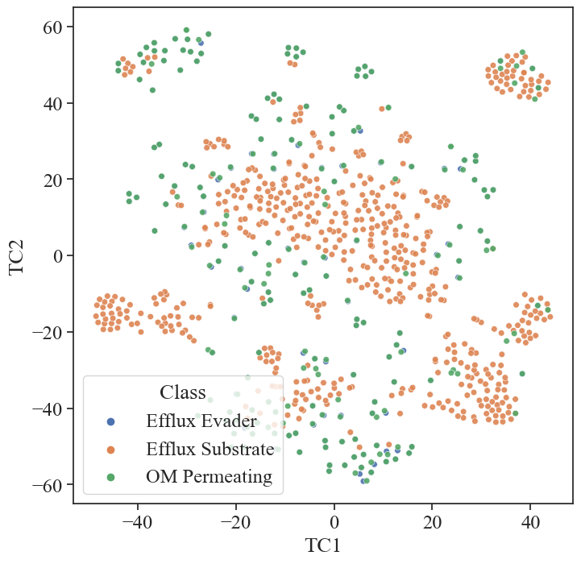

## E. coli efflux evaders and substrates - chemical space 


```python
# load conda environment

from master_functions import master_functions

# data process
import pandas as pd
import numpy as np
from scipy import stats

import matplotlib.pyplot as plt

import seaborn as sns

from sklearn.decomposition import PCA
from sklearn.preprocessing import StandardScaler
from sklearn.manifold import TSNE

#chem

from rdkit import Chem, DataStructs
from rdkit.Chem import AllChem, MACCSkeys, Descriptors, Descriptors3D, Draw, rdMolDescriptors, Draw, PandasTools, rdFingerprintGenerator
from rdkit.DataManip.Metric.rdMetricMatrixCalc import GetTanimotoSimMat, GetTanimotoDistMat
# from rdkit.Chem.Draw import IPythonConsole
```


```python
# import curated datasets

efflux_evaders_om_corrected = pd.read_pickle('data_curated/efflux_evaders_om_corrected.pkl')
efflux_substrates_om_corrected = pd.read_pickle('data_curated/efflux_substrates_om_corrected.pkl')
inactive = pd.read_pickle('data_curated/new_inactive.pkl')
```

# Initial set up

## Importing master dataset


```python
# import master inhibition data
inhibition = pd.read_csv('data/CO-ADD_InhibitionData_r03_01-02-2020_CSV.csv', low_memory=False)
# this dataset can be downlaoded from: "https://www.co-add.org/"
```


```python
# check strains avilable in organism == e. coli
inhibition[inhibition['ORGANISM'] == 'Escherichia coli'].STRAIN.value_counts()
```


    ATCC 25922      82517
    lpxC; MB4902    81058
    tolC; MB5747    74177
    Name: STRAIN, dtype: int64


```python
# one compound has outlying values of -213.7 and -278.75 and -329.47 for WT,  tolC and lpxC respectivley, it skews data, I will drop it.

inhibition = inhibition[inhibition.SMILES != 'S(O)(=O)(=O)c1ccccc1\\C(\\c(cc(C)c(c2Br)O)c2)=C(\\C=C3C)/C=C(C3=O)Br']

```


```python
# define subsets: 

e_coli_wild = inhibition[(inhibition['ORGANISM']=='Escherichia coli') & (inhibition['STRAIN']=='ATCC 25922')][['SMILES', 'INHIB_AVE']].groupby('SMILES').mean().reset_index()

e_coli_efflux = inhibition[(inhibition['ORGANISM']=='Escherichia coli') & (inhibition['STRAIN']=='tolC; MB5747')][['SMILES', 'INHIB_AVE']].groupby('SMILES').mean().reset_index()

e_coli_pore = inhibition[(inhibition['ORGANISM']=='Escherichia coli') & (inhibition['STRAIN']=='lpxC; MB4902')][['SMILES', 'INHIB_AVE']].groupby('SMILES').mean().reset_index()
```


```python
# collect overlping data:

e_coli_wild_efflux = e_coli_wild[['SMILES', 'INHIB_AVE']].merge(e_coli_efflux[['SMILES', 'INHIB_AVE']],  on='SMILES', suffixes=('_wild', '_efflux'))
e_coli_wild_perm = e_coli_wild[['SMILES', 'INHIB_AVE']].merge(e_coli_pore[['SMILES', 'INHIB_AVE']], on='SMILES', suffixes=('_wild', '_lpxC'))
```

## Plotting WT vs tolC


```python
# e_coli_wild_efflux[['INHIB_AVE_wild', 'INHIB_AVE_efflux']].plot.hist(bins=200, alpha=0.5, figsize=[10,7])


sns.set(context='notebook', style='ticks', font='Times New Roman', font_scale=1.6, rc=None)

fig, ax = plt.subplots(figsize=(7,7))


sns.set(context='notebook', style='ticks', font='Times New Roman', font_scale=1.9, rc=None)

sns.histplot(e_coli_wild_efflux[['INHIB_AVE_efflux', 'INHIB_AVE_wild']], alpha=0.5, bins=150)

plt.legend(labels = ['Wild Type', '$\Delta TolC$'],  fontsize=15)

plt.xlim([-120, 120])

plt.xlabel('Growth Inhibition based on $OD_{600}$ (%)', fontsize=22);
plt.ylabel('Number of Compounds',  fontsize=22);

plt.yticks(fontsize=20)
plt.xticks(fontsize=20)

plt.tight_layout()
sns.despine()

```


    

    


### Paired t-test


```python
# we can now compoute paired t-test to see if removing TolC made a significant difference or not:

stats.ttest_rel(e_coli_wild_efflux['INHIB_AVE_wild'], e_coli_wild_efflux['INHIB_AVE_efflux'])
```


    Ttest_relResult(statistic=-44.099887587864416, pvalue=0.0)


## Defining evaders and substartes


```python
# calculate z-score:
e_coli_wild_efflux['wild_stds'] = stats.zscore(e_coli_wild_efflux.INHIB_AVE_wild)
e_coli_wild_efflux['tolc_stds'] = stats.zscore(e_coli_wild_efflux.INHIB_AVE_efflux)
```


```python
# label each compounds according to threshold of 4

threshold = 4

def label_it(row):
    if row['wild_stds'] >=threshold:
        return 'active'
    if row['wild_stds'] <threshold:
        return 'inactive'
    
e_coli_wild_efflux['wild_class'] = e_coli_wild_efflux.apply(label_it, axis=1)

def label_it_tolc(row):
    if row['tolc_stds'] >=threshold:
        return 'active'
    if row['tolc_stds'] <threshold:
        return 'inactive'
    
    
e_coli_wild_efflux['tolc_class'] = e_coli_wild_efflux.apply(label_it_tolc, axis=1)
```


```python
# label compounds based on combination of activity defined above

def label_substrate(row):
    if row['tolc_class'] == 'active' and row['wild_class'] == 'inactive':
        return 'Efflux Substrate'
    if row['tolc_class'] == 'active' and row['wild_class'] == 'active':
        return 'Efflux Evader'
    if row['tolc_class'] == 'inactive' and row['wild_class'] == 'inactive':
        return 'Inactive'
    if row['tolc_class'] == 'inactive' and row['wild_class'] == 'active':
        return 'WT-only Active'
```

## Resulting Number of classes


```python
# check the numbers of classified data

e_coli_wild_efflux['Class'] = e_coli_wild_efflux.apply(label_substrate, axis=1)
e_coli_wild_efflux.Class.value_counts()
```


    Inactive            72730
    Efflux Substrate      760
    Efflux Evader         200
    WT-only Active         53
    Name: Class, dtype: int64


## Scatter Plot


```python
sns.set(context='notebook', style='ticks', font='Times New Roman', font_scale=1.6, rc=None)
fig, ax = plt.subplots(figsize=(7,7))

sns.scatterplot(data = e_coli_wild_efflux, x='INHIB_AVE_wild', y='INHIB_AVE_efflux', hue='Class', s=30)

sns.despine()

# plt.legend(fontsize=20)

# plt.xlim([-120, 120])

plt.xlabel('$\it{E. coli}$ WT Growth Inhibition (%)', font='Sans serif');

plt.ylabel('$\it{E. coli}$ $\it{tolC}$ Growth Inhibition (%)', font='Sans serif');

# plt.yticks(fontsize=20)
# plt.xticks(fontsize=20)

# plt.axvline(x=43.02,  color='red', linestyle='--', alpha=0.5)
# plt.axhline(y=74.98,  color='red', linestyle='--', alpha=0.5)

plt.axvline(x=e_coli_wild_efflux[e_coli_wild_efflux['wild_stds']>=4].sort_values(by='wild_stds').INHIB_AVE_wild.iloc[0],  color='red', linestyle='--', alpha=0.5)
plt.axhline(y=e_coli_wild_efflux[e_coli_wild_efflux['tolc_stds']>=4].sort_values(by='tolc_stds').INHIB_AVE_efflux.iloc[0],  color='red', linestyle='--', alpha=0.5)

plt.legend(fontsize=15)
plt.tight_layout()

plt.savefig('figures/wild_tolc_class_scatter.png', dpi=600)
```


    

    


```python
# we can save those datasets seperately

efflux_substrate = e_coli_wild_efflux[e_coli_wild_efflux['Class']=='Efflux Substrate']

efflux_evader = e_coli_wild_efflux[e_coli_wild_efflux['Class']=='Efflux Evader']

wt_only = e_coli_wild_efflux[e_coli_wild_efflux['Class']=='WT-only Active']

inactive = e_coli_wild_efflux[e_coli_wild_efflux['Class']=='Inactive']
```

## Resulting evaders and substartes


```python
print('No. of resulting evaders: {} \nNo. of resulting substrates: {}'.format(len(efflux_evader), len(efflux_substrate)))
```

    No. of resulting evaders: 200 
    No. of resulting substrates: 760
    

# OM Bias


```python
# import permeating and non-permeating datapoints, they were achived using same process as described above

om_permeating = pd.read_pickle('data_curated/om_permeating.pkl')
om_non_permeating = pd.read_pickle('data_curated/om_non_permeating.pkl')
```


```python
# to compare the smiles between the two we fisr turn all smiles into same canonical smiles format

efflux_evader['SMILES'] = efflux_evader.SMILES.apply(Chem.CanonSmiles)
efflux_substrate['SMILES'] = efflux_substrate.SMILES.apply(Chem.CanonSmiles)
```

    C:\Users\domin\AppData\Local\Temp\ipykernel_23268\348032441.py:3: SettingWithCopyWarning: 
    A value is trying to be set on a copy of a slice from a DataFrame.
    Try using .loc[row_indexer,col_indexer] = value instead
    
    See the caveats in the documentation: https://pandas.pydata.org/pandas-docs/stable/user_guide/indexing.html#returning-a-view-versus-a-copy
      efflux_evader['SMILES'] = efflux_evader.SMILES.apply(Chem.CanonSmiles)
    C:\Users\domin\AppData\Local\Temp\ipykernel_23268\348032441.py:4: SettingWithCopyWarning: 
    A value is trying to be set on a copy of a slice from a DataFrame.
    Try using .loc[row_indexer,col_indexer] = value instead
    
    See the caveats in the documentation: https://pandas.pydata.org/pandas-docs/stable/user_guide/indexing.html#returning-a-view-versus-a-copy
      efflux_substrate['SMILES'] = efflux_substrate.SMILES.apply(Chem.CanonSmiles)
    


```python
# grab only evaders that are also in OM permeating class
efflux_evaders_om_corrected = efflux_evader[efflux_evader['SMILES'].isin(om_permeating['SMILES'])]
```


```python
# grab only substrates that are not in non-permeating class
efflux_substrates_om_corrected = efflux_substrate[~efflux_substrate['SMILES'].isin(om_non_permeating['SMILES'])]
```

## Resulting evaders and substartes


```python
print('No. of resulting evaders: {} \nNo. of resulting substrates: {}'.format(len(efflux_evaders_om_corrected), len(efflux_substrates_om_corrected)))
```

    No. of resulting evaders: 186 
    No. of resulting substrates: 554
    

### Re-defining inactive mols


```python
e_coli_wild_efflux['mol'] = e_coli_wild_efflux.SMILES.apply(Chem.MolFromSmiles)
```

    [20:56:01] Explicit valence for atom # 2 C, 6, is greater than permitted
    [20:56:04] Explicit valence for atom # 0 B, 6, is greater than permitted
    [20:56:04] Explicit valence for atom # 0 B, 6, is greater than permitted
    [20:56:04] Explicit valence for atom # 0 B, 6, is greater than permitted
    [20:56:04] Explicit valence for atom # 0 B, 6, is greater than permitted
    [20:56:04] Explicit valence for atom # 0 C, 6, is greater than permitted
    


```python
e_coli_wild_efflux = e_coli_wild_efflux.dropna()
```


```python
e_coli_wild_efflux['SMILES'] = e_coli_wild_efflux.SMILES.apply(Chem.CanonSmiles)
```

    C:\Users\domin\AppData\Local\Temp\ipykernel_3876\1164120927.py:1: SettingWithCopyWarning: 
    A value is trying to be set on a copy of a slice from a DataFrame.
    Try using .loc[row_indexer,col_indexer] = value instead
    
    See the caveats in the documentation: https://pandas.pydata.org/pandas-docs/stable/user_guide/indexing.html#returning-a-view-versus-a-copy
      e_coli_wild_efflux['SMILES'] = e_coli_wild_efflux.SMILES.apply(Chem.CanonSmiles)
    


```python
wt_only['mol'] = wt_only.SMILES.apply(Chem.MolFromSmiles)
```


```python
wt_only = wt_only.dropna()
```


```python
wt_only['SMILES'] = wt_only.SMILES.apply(Chem.CanonSmiles)
```


```python
# Since efflux evaders and substartes have changed we must redifine inactive molecules, as:
#     Original dataset without evaders and substartes and wt-active only

not_inactive = pd.concat([efflux_evaders_om_corrected, efflux_substrates_om_corrected, wt_only])

inactive = e_coli_wild_efflux[~e_coli_wild_efflux['SMILES'].isin(not_inactive['SMILES'])]
```


```python
inactive['mol'] = inactive.SMILES.apply(Chem.MolFromSmiles)

inactive = inactive.dropna(subset=['mol'])
inactive.reset_index(drop=True, inplace=True)

inactive['SMILES'] = inactive.SMILES.apply(Chem.CanonSmiles)
```

    C:\Users\domin\AppData\Local\Temp\ipykernel_23268\1771852805.py:1: SettingWithCopyWarning: 
    A value is trying to be set on a copy of a slice from a DataFrame.
    Try using .loc[row_indexer,col_indexer] = value instead
    
    See the caveats in the documentation: https://pandas.pydata.org/pandas-docs/stable/user_guide/indexing.html#returning-a-view-versus-a-copy
      inactive['mol'] = inactive.SMILES.apply(Chem.MolFromSmiles)
    


```python
inactive.to_pickle('data_curated/new_inactive.pkl')
```

# t-SNE of evaders vs substartes


```python
# sample of what the dataset currently looks like
efflux_substrates_om_corrected.head(5)
```


<div>
<style scoped>
    .dataframe tbody tr th:only-of-type {
        vertical-align: middle;
    }

    .dataframe tbody tr th {
        vertical-align: top;
    }

    .dataframe thead th {
        text-align: right;
    }
</style>
<table border="1" class="dataframe">
  <thead>
    <tr style="text-align: right;">
      <th></th>
      <th>SMILES</th>
      <th>INHIB_AVE_wild</th>
      <th>INHIB_AVE_efflux</th>
      <th>Mol</th>
      <th>fps</th>
      <th>abs_diff</th>
      <th>sub_class</th>
      <th>wild_stds</th>
      <th>tolc_stds</th>
      <th>wild_class</th>
      <th>tolc_class</th>
      <th>Class</th>
    </tr>
  </thead>
  <tbody>
    <tr>
      <th>145</th>
      <td>Brc1cncc(-c2cc(NCCCn3ccnc3)nc(-c3ccccc3)n2)c1</td>
      <td>4.60</td>
      <td>80.47</td>
      <td>&lt;rdkit.Chem.rdchem.Mol object at 0x000002164E6...</td>
      <td>[0, 0, 0, 0, 0, 0, 0, 0, 0, 0, 0, 0, 0, 0, 0, ...</td>
      <td>75.87</td>
      <td>increase</td>
      <td>0.054629</td>
      <td>4.326538</td>
      <td>inactive</td>
      <td>active</td>
      <td>Efflux Substrate</td>
    </tr>
    <tr>
      <th>308</th>
      <td>N#C/C(=N\Nc1cccc(C(F)(F)F)c1)C(N)=S</td>
      <td>18.36</td>
      <td>87.98</td>
      <td>&lt;rdkit.Chem.rdchem.Mol object at 0x000002164E6...</td>
      <td>[0, 0, 0, 0, 0, 0, 0, 0, 0, 0, 0, 0, 0, 0, 0, ...</td>
      <td>69.62</td>
      <td>increase</td>
      <td>1.468421</td>
      <td>4.766464</td>
      <td>inactive</td>
      <td>active</td>
      <td>Efflux Substrate</td>
    </tr>
    <tr>
      <th>403</th>
      <td>CC(C)C(=O)/C(=C/c1ccc(Cl)cc1Cl)n1cncn1</td>
      <td>5.84</td>
      <td>97.31</td>
      <td>&lt;rdkit.Chem.rdchem.Mol object at 0x00000215D73...</td>
      <td>[0, 0, 0, 0, 0, 0, 0, 0, 0, 0, 0, 0, 0, 0, 0, ...</td>
      <td>91.47</td>
      <td>increase</td>
      <td>0.182034</td>
      <td>5.313003</td>
      <td>inactive</td>
      <td>active</td>
      <td>Efflux Substrate</td>
    </tr>
    <tr>
      <th>585</th>
      <td>O=C(N/N=C(/CC(=O)c1cccs1)C(F)(F)F)c1cccc([N+](...</td>
      <td>-3.58</td>
      <td>88.80</td>
      <td>&lt;rdkit.Chem.rdchem.Mol object at 0x000002164E6...</td>
      <td>[0, 0, 0, 0, 0, 0, 0, 0, 0, 0, 0, 0, 0, 0, 0, ...</td>
      <td>92.38</td>
      <td>increase</td>
      <td>-0.785838</td>
      <td>4.814498</td>
      <td>inactive</td>
      <td>active</td>
      <td>Efflux Substrate</td>
    </tr>
    <tr>
      <th>589</th>
      <td>O=C(N/N=C(/CC(=O)c1cccs1)C(F)(F)F)c1ccc(Cl)cc1</td>
      <td>20.78</td>
      <td>77.14</td>
      <td>&lt;rdkit.Chem.rdchem.Mol object at 0x000002164E6...</td>
      <td>[0, 0, 0, 0, 0, 0, 0, 0, 0, 0, 0, 0, 0, 0, 0, ...</td>
      <td>56.36</td>
      <td>increase</td>
      <td>1.717067</td>
      <td>4.131471</td>
      <td>inactive</td>
      <td>active</td>
      <td>Efflux Substrate</td>
    </tr>
  </tbody>
</table>
</div>


```python
# we need to compute fingerprints from SMILES for t-sne:

mfpgen =rdFingerprintGenerator.GetMorganGenerator(radius=2,fpSize=2048)

efflux_evaders_om_corrected['mol'] = efflux_evaders_om_corrected.SMILES.apply(Chem.MolFromSmiles)
efflux_evaders_om_corrected.dropna(subset=['mol'], inplace=True)

efflux_evaders_om_corrected['fps']=efflux_evaders_om_corrected.mol.apply(mfpgen.GetFingerprint)

# substartes

efflux_substrates_om_corrected['mol'] = efflux_substrates_om_corrected.SMILES.apply(Chem.MolFromSmiles)
efflux_substrates_om_corrected.dropna(subset=['mol'], inplace=True)

efflux_substrates_om_corrected['fps']=efflux_substrates_om_corrected.mol.apply(mfpgen.GetFingerprint)

```

    C:\Users\domin\AppData\Local\Temp\ipykernel_4000\1058469890.py:5: SettingWithCopyWarning: 
    A value is trying to be set on a copy of a slice from a DataFrame.
    Try using .loc[row_indexer,col_indexer] = value instead
    
    See the caveats in the documentation: https://pandas.pydata.org/pandas-docs/stable/user_guide/indexing.html#returning-a-view-versus-a-copy
      efflux_evaders_om_corrected['mol'] = efflux_evaders_om_corrected.SMILES.apply(Chem.MolFromSmiles)
    C:\Users\domin\AppData\Local\Temp\ipykernel_4000\1058469890.py:6: SettingWithCopyWarning: 
    A value is trying to be set on a copy of a slice from a DataFrame
    
    See the caveats in the documentation: https://pandas.pydata.org/pandas-docs/stable/user_guide/indexing.html#returning-a-view-versus-a-copy
      efflux_evaders_om_corrected.dropna(subset=['mol'], inplace=True)
    C:\Users\domin\AppData\Local\Temp\ipykernel_4000\1058469890.py:8: SettingWithCopyWarning: 
    A value is trying to be set on a copy of a slice from a DataFrame.
    Try using .loc[row_indexer,col_indexer] = value instead
    
    See the caveats in the documentation: https://pandas.pydata.org/pandas-docs/stable/user_guide/indexing.html#returning-a-view-versus-a-copy
      efflux_evaders_om_corrected['fps']=efflux_evaders_om_corrected.mol.apply(mfpgen.GetFingerprint)
    C:\Users\domin\AppData\Local\Temp\ipykernel_4000\1058469890.py:12: SettingWithCopyWarning: 
    A value is trying to be set on a copy of a slice from a DataFrame.
    Try using .loc[row_indexer,col_indexer] = value instead
    
    See the caveats in the documentation: https://pandas.pydata.org/pandas-docs/stable/user_guide/indexing.html#returning-a-view-versus-a-copy
      efflux_substrates_om_corrected['mol'] = efflux_substrates_om_corrected.SMILES.apply(Chem.MolFromSmiles)
    C:\Users\domin\AppData\Local\Temp\ipykernel_4000\1058469890.py:13: SettingWithCopyWarning: 
    A value is trying to be set on a copy of a slice from a DataFrame
    
    See the caveats in the documentation: https://pandas.pydata.org/pandas-docs/stable/user_guide/indexing.html#returning-a-view-versus-a-copy
      efflux_substrates_om_corrected.dropna(subset=['mol'], inplace=True)
    C:\Users\domin\AppData\Local\Temp\ipykernel_4000\1058469890.py:15: SettingWithCopyWarning: 
    A value is trying to be set on a copy of a slice from a DataFrame.
    Try using .loc[row_indexer,col_indexer] = value instead
    
    See the caveats in the documentation: https://pandas.pydata.org/pandas-docs/stable/user_guide/indexing.html#returning-a-view-versus-a-copy
      efflux_substrates_om_corrected['fps']=efflux_substrates_om_corrected.mol.apply(mfpgen.GetFingerprint)
    


```python
# combine two datasets and reset index

sub_and_evade_om_corrected = pd.concat([efflux_evaders_om_corrected,efflux_substrates_om_corrected]).reset_index(drop=True)
```


```python
def tsne_no_plot(df, perp):
    
    sample=df.values
    tanimoto_sim_mat_lower_triangle=GetTanimotoSimMat(sample) # similartity matrix 
    n_mol = len(sample)
    similarity_matrix = np.ones([n_mol,n_mol])
    i_lower= np.tril_indices(n=n_mol,m=n_mol,k=-1)
    i_upper= np.triu_indices(n=n_mol,m=n_mol,k=1)
    similarity_matrix[i_lower] = tanimoto_sim_mat_lower_triangle
    similarity_matrix[i_upper] = similarity_matrix.T[i_upper] 
    distance_matrix = np.subtract(1,similarity_matrix) 

    TSNE_sim = TSNE(verbose=1, n_components=2, init='pca', method='barnes_hut', perplexity=perp).fit_transform(distance_matrix) 

    tsne_result = pd.DataFrame(data = TSNE_sim , columns=["TC1","TC2"]) 
    return tsne_result
```


```python
sub_and_evade_om_corrected_tsne = tsne_no_plot(sub_and_evade_om_corrected['fps'], perp=50)

fig, ax = plt.subplots(figsize=(8,8))

sns.scatterplot(x='TC1',y='TC2',data=sub_and_evade_om_corrected_tsne, s=30 ,alpha=0.9, hue=sub_and_evade_om_corrected['Class']) 
# plt.legend(fontsize=20)
fig, ax = plt.subplots(figsize=(8,8))

sns.kdeplot(x='TC1',y='TC2',data=sub_and_evade_om_corrected_tsne,alpha=0.7, hue=sub_and_evade_om_corrected['Class'], levels = 4)
# plt.legend(fontsize=20)

```

    [t-SNE] Computing 151 nearest neighbors...
    [t-SNE] Indexed 740 samples in 0.001s...
    [t-SNE] Computed neighbors for 740 samples in 0.126s...
    [t-SNE] Computed conditional probabilities for sample 740 / 740
    [t-SNE] Mean sigma: 0.709102
    [t-SNE] KL divergence after 250 iterations with early exaggeration: 59.515961
    [t-SNE] KL divergence after 1000 iterations: 0.638264
    


    <Axes: xlabel='TC1', ylabel='TC2'>


    

    


    

    


## t-SNE of evader + substrate + inactive


```python
inactive_sample = inactive.sample(500, random_state= 42)

inactive_sample['mol'] = inactive_sample.SMILES.apply(Chem.MolFromSmiles)
inactive_sample.dropna(subset=['mol'], inplace=True)

inactive_sample['fps']=inactive_sample.mol.apply(mfpgen.GetFingerprint)


```


```python
# add sample of inactive mols into the mix

sub_evade_inactive = pd.concat([sub_and_evade_om_corrected, inactive_sample])
```


```python
sub_evade_inactive.reset_index(drop=True, inplace=True)
```


```python
sub_evade_inactive_tsne = tsne_no_plot(sub_evade_inactive['fps'], perp=50)
```

    [t-SNE] Computing 151 nearest neighbors...
    [t-SNE] Indexed 1240 samples in 0.002s...
    [t-SNE] Computed neighbors for 1240 samples in 0.083s...
    [t-SNE] Computed conditional probabilities for sample 1000 / 1240
    [t-SNE] Computed conditional probabilities for sample 1240 / 1240
    [t-SNE] Mean sigma: 0.725025
    [t-SNE] KL divergence after 250 iterations with early exaggeration: 65.622444
    [t-SNE] KL divergence after 1000 iterations: 0.954569
    


```python
sns.set(context='notebook', style='ticks', font='Times New Roman', font_scale=1.6, rc=None)

fig, ax = plt.subplots(figsize=(8,8))

sns.scatterplot(x='TC1',y='TC2',data=sub_evade_inactive_tsne, s=20 ,alpha=0.5, hue=sub_evade_inactive['Class'], legend=False) 
sns.kdeplot(x='TC1',y='TC2',data=sub_evade_inactive_tsne, hue=sub_evade_inactive['Class'], levels = 2, linewidths=2)
sns.despine()

plt.savefig('tsne_all.svg')
```


    

    


We find some overlapping compounds


```python
om_permeating = pd.read_pickle('data_curated/om_permeating.pkl')
```


```python
mfpgen =rdFingerprintGenerator.GetMorganGenerator(radius=2,fpSize=2048)

om_permeating['mol'] = om_permeating.SMILES.apply(Chem.MolFromSmiles)
om_permeating.dropna(subset=['mol'], inplace=True)

om_permeating['fps']=om_permeating.mol.apply(mfpgen.GetFingerprint)
```


```python
sub_evade_om_permeating = pd.concat([sub_and_evade_om_corrected, om_permeating])
```


```python
sub_evade_om_permeating.reset_index(drop=True, inplace=True)
```


```python
sub_evade_om_permeating_tsne = tsne_no_plot(sub_evade_om_permeating['fps'], perp=50)
fig, ax = plt.subplots(figsize=(8,8))

sns.scatterplot(x='TC1',y='TC2',data=sub_evade_om_permeating_tsne, s=30 ,alpha=0.9, hue=sub_evade_om_permeating['Class']) 
# plt.legend(fontsize=20)
fig, ax = plt.subplots(figsize=(8,8))

sns.kdeplot(x='TC1',y='TC2',data=sub_evade_om_permeating_tsne,alpha=0.7, hue=sub_evade_om_permeating['Class'], levels = 4)
# plt.legend(fontsize=20)

```

    [t-SNE] Computing 151 nearest neighbors...
    [t-SNE] Indexed 961 samples in 0.001s...
    [t-SNE] Computed neighbors for 961 samples in 0.068s...
    [t-SNE] Computed conditional probabilities for sample 961 / 961
    [t-SNE] Mean sigma: 0.854897
    [t-SNE] KL divergence after 250 iterations with early exaggeration: 61.729122
    [t-SNE] KL divergence after 1000 iterations: 0.519036
    


    <Axes: xlabel='TC1', ylabel='TC2'>


    

    


    

    


# PCA of evaders, substrates and inactives

we'll sue same dataset as for t-sne


```python
from descriptastorus.descriptors.DescriptorGenerator import MakeGenerator
from tqdm import trange, tqdm

import warnings
warnings.simplefilter(action='ignore', category=FutureWarning)

def calcualte_features_single(df, col):
    generator = MakeGenerator(("rdkit2d",))
    names=[name[0] for name in  generator.GetColumns()]
    
    l_feat=[]
    
    print('Computing features: ')
    
    for i in trange(len(df[col].values)):
        l_data = generator.process(df[col].values[i])
        
        if l_data[0]  == True:
            l_feat.append(l_data[1:])
        else:
            print('left: ', l_data[0])
            print(df[col].values[i])
    

    # add descriptors to existing dataframe 
    feats = pd.DataFrame()
    
    for i in trange(len(l_feat)):
        feats = feats.append(pd.Series(l_feat[i]), ignore_index=True)
    feats.columns = names[1:]

    return feats

```


```python
sub_evade_inactive_features = calcualte_features_single(sub_evade_inactive, 'SMILES')
sub_evade_inactive_features['Class'] = sub_evade_inactive['Class']
```

    Computing features: 
    

    100%|██████████████████████████████████████████████████████████████████████████████| 1240/1240 [00:13<00:00, 90.43it/s]
    100%|████████████████████████████████████████████████████████████████████████████| 1240/1240 [00:00<00:00, 1435.85it/s]
    


```python
sub_evade_inactive_features
```


<div>
<style scoped>
    .dataframe tbody tr th:only-of-type {
        vertical-align: middle;
    }

    .dataframe tbody tr th {
        vertical-align: top;
    }

    .dataframe thead th {
        text-align: right;
    }
</style>
<table border="1" class="dataframe">
  <thead>
    <tr style="text-align: right;">
      <th></th>
      <th>BalabanJ</th>
      <th>BertzCT</th>
      <th>Chi0</th>
      <th>Chi0n</th>
      <th>Chi0v</th>
      <th>Chi1</th>
      <th>Chi1n</th>
      <th>Chi1v</th>
      <th>Chi2n</th>
      <th>Chi2v</th>
      <th>...</th>
      <th>fr_sulfone</th>
      <th>fr_term_acetylene</th>
      <th>fr_tetrazole</th>
      <th>fr_thiazole</th>
      <th>fr_thiocyan</th>
      <th>fr_thiophene</th>
      <th>fr_unbrch_alkane</th>
      <th>fr_urea</th>
      <th>qed</th>
      <th>Class</th>
    </tr>
  </thead>
  <tbody>
    <tr>
      <th>0</th>
      <td>2.508772</td>
      <td>249.116352</td>
      <td>6.974691</td>
      <td>5.449320</td>
      <td>5.449320</td>
      <td>4.877010</td>
      <td>3.252155</td>
      <td>3.252155</td>
      <td>2.362178</td>
      <td>2.362178</td>
      <td>...</td>
      <td>0.0</td>
      <td>0.0</td>
      <td>0.0</td>
      <td>0.0</td>
      <td>0.0</td>
      <td>0.0</td>
      <td>0.0</td>
      <td>0.0</td>
      <td>0.501865</td>
      <td>Efflux Evader</td>
    </tr>
    <tr>
      <th>1</th>
      <td>1.508609</td>
      <td>845.728650</td>
      <td>20.597801</td>
      <td>16.576049</td>
      <td>18.162045</td>
      <td>14.775990</td>
      <td>9.905963</td>
      <td>10.698961</td>
      <td>6.767766</td>
      <td>7.683442</td>
      <td>...</td>
      <td>0.0</td>
      <td>0.0</td>
      <td>0.0</td>
      <td>0.0</td>
      <td>0.0</td>
      <td>0.0</td>
      <td>0.0</td>
      <td>0.0</td>
      <td>0.504707</td>
      <td>Efflux Evader</td>
    </tr>
    <tr>
      <th>2</th>
      <td>0.000001</td>
      <td>653.569301</td>
      <td>14.396977</td>
      <td>11.850173</td>
      <td>15.811520</td>
      <td>10.203510</td>
      <td>7.173237</td>
      <td>9.562159</td>
      <td>5.658176</td>
      <td>9.088344</td>
      <td>...</td>
      <td>0.0</td>
      <td>0.0</td>
      <td>0.0</td>
      <td>0.0</td>
      <td>0.0</td>
      <td>2.0</td>
      <td>0.0</td>
      <td>0.0</td>
      <td>0.599582</td>
      <td>Efflux Evader</td>
    </tr>
    <tr>
      <th>3</th>
      <td>2.939539</td>
      <td>420.685437</td>
      <td>12.344935</td>
      <td>7.754071</td>
      <td>9.340068</td>
      <td>7.303549</td>
      <td>4.082377</td>
      <td>4.875376</td>
      <td>2.898481</td>
      <td>3.814156</td>
      <td>...</td>
      <td>0.0</td>
      <td>0.0</td>
      <td>0.0</td>
      <td>0.0</td>
      <td>0.0</td>
      <td>0.0</td>
      <td>0.0</td>
      <td>0.0</td>
      <td>0.669689</td>
      <td>Efflux Evader</td>
    </tr>
    <tr>
      <th>4</th>
      <td>2.603746</td>
      <td>310.650557</td>
      <td>9.681798</td>
      <td>6.788319</td>
      <td>7.544248</td>
      <td>6.236382</td>
      <td>3.689747</td>
      <td>4.224269</td>
      <td>2.376957</td>
      <td>2.644218</td>
      <td>...</td>
      <td>0.0</td>
      <td>0.0</td>
      <td>0.0</td>
      <td>0.0</td>
      <td>0.0</td>
      <td>0.0</td>
      <td>0.0</td>
      <td>0.0</td>
      <td>0.588792</td>
      <td>Efflux Evader</td>
    </tr>
    <tr>
      <th>...</th>
      <td>...</td>
      <td>...</td>
      <td>...</td>
      <td>...</td>
      <td>...</td>
      <td>...</td>
      <td>...</td>
      <td>...</td>
      <td>...</td>
      <td>...</td>
      <td>...</td>
      <td>...</td>
      <td>...</td>
      <td>...</td>
      <td>...</td>
      <td>...</td>
      <td>...</td>
      <td>...</td>
      <td>...</td>
      <td>...</td>
      <td>...</td>
    </tr>
    <tr>
      <th>1235</th>
      <td>1.003357</td>
      <td>1984.841727</td>
      <td>34.329487</td>
      <td>27.979443</td>
      <td>27.979443</td>
      <td>23.749555</td>
      <td>16.372378</td>
      <td>16.372378</td>
      <td>12.307394</td>
      <td>12.307394</td>
      <td>...</td>
      <td>0.0</td>
      <td>0.0</td>
      <td>0.0</td>
      <td>0.0</td>
      <td>0.0</td>
      <td>0.0</td>
      <td>0.0</td>
      <td>0.0</td>
      <td>0.174004</td>
      <td>Inactive</td>
    </tr>
    <tr>
      <th>1236</th>
      <td>1.749666</td>
      <td>1383.833437</td>
      <td>21.957455</td>
      <td>16.503270</td>
      <td>17.259199</td>
      <td>15.011570</td>
      <td>9.340691</td>
      <td>9.718655</td>
      <td>6.803797</td>
      <td>7.210998</td>
      <td>...</td>
      <td>0.0</td>
      <td>0.0</td>
      <td>0.0</td>
      <td>0.0</td>
      <td>0.0</td>
      <td>0.0</td>
      <td>0.0</td>
      <td>0.0</td>
      <td>0.427471</td>
      <td>Inactive</td>
    </tr>
    <tr>
      <th>1237</th>
      <td>1.531621</td>
      <td>1346.959571</td>
      <td>25.070339</td>
      <td>20.361266</td>
      <td>21.947263</td>
      <td>17.546045</td>
      <td>12.317981</td>
      <td>13.110979</td>
      <td>9.033422</td>
      <td>9.887759</td>
      <td>...</td>
      <td>0.0</td>
      <td>0.0</td>
      <td>0.0</td>
      <td>0.0</td>
      <td>0.0</td>
      <td>0.0</td>
      <td>0.0</td>
      <td>0.0</td>
      <td>0.302495</td>
      <td>Inactive</td>
    </tr>
    <tr>
      <th>1238</th>
      <td>1.868993</td>
      <td>1028.780943</td>
      <td>15.648054</td>
      <td>12.477331</td>
      <td>12.477331</td>
      <td>11.326500</td>
      <td>7.553489</td>
      <td>7.553489</td>
      <td>5.475973</td>
      <td>5.475973</td>
      <td>...</td>
      <td>0.0</td>
      <td>0.0</td>
      <td>0.0</td>
      <td>0.0</td>
      <td>0.0</td>
      <td>0.0</td>
      <td>0.0</td>
      <td>0.0</td>
      <td>0.490238</td>
      <td>Inactive</td>
    </tr>
    <tr>
      <th>1239</th>
      <td>2.184490</td>
      <td>517.236837</td>
      <td>13.120956</td>
      <td>10.329726</td>
      <td>11.146223</td>
      <td>8.592224</td>
      <td>5.624243</td>
      <td>6.503896</td>
      <td>4.230048</td>
      <td>5.177742</td>
      <td>...</td>
      <td>0.0</td>
      <td>0.0</td>
      <td>0.0</td>
      <td>0.0</td>
      <td>0.0</td>
      <td>1.0</td>
      <td>0.0</td>
      <td>0.0</td>
      <td>0.860297</td>
      <td>Inactive</td>
    </tr>
  </tbody>
</table>
<p>1240 rows × 201 columns</p>
</div>


```python
# drop feature columns that contain Nans, its only 4 columns

sub_evade_inactive_features=sub_evade_inactive_features.dropna(axis=1)
```


```python
# pca on all physcicochemical features:

table = sub_evade_inactive_features

#The non-redundant molecular descriptors chosen for PCA

descriptors  = table.iloc[:,:-87] # grab only physicochemical values

descriptors_std = StandardScaler().fit_transform(descriptors) #Important to avoid scaling problems between our different descriptors
pca = PCA()
descriptors_2d = pca.fit_transform(descriptors_std)
descriptors_pca= pd.DataFrame(descriptors_2d) # Saving PCA values to a new table
descriptors_pca.index = table.index
descriptors_pca.columns = ['PC{}'.format(i+1) for i in descriptors_pca.columns]
descriptors_pca.head(5) #Displays the PCA table

scale1 = 1.0/(max(descriptors_pca['PC1']) - min(descriptors_pca['PC1'])) 
scale2 = 1.0/(max(descriptors_pca['PC2']) - min(descriptors_pca['PC2']))

# And we add the new values to our PCA table
descriptors_pca['PC1_normalized']=[i*scale1 for i in descriptors_pca['PC1']]
descriptors_pca['PC2_normalized']=[i*scale2 for i in descriptors_pca['PC2']]


descriptors_pca['Class'] = sub_evade_inactive_features['Class']


# plt.rcParams['axes.linewidth'] = 1.5


cmap = sns.diverging_palette(133, 10, as_cmap=True)

fig, ax = plt.subplots(figsize=(10,5))

sns.scatterplot(x='PC1',y='PC2',data=descriptors_pca, alpha=0.7, hue='Class', s=20)#, palette=["C0", "C1", "C2", "k"])


pca_lab = ('PC1 '+str([np.round(pca.explained_variance_ratio_[0]*100, 1)]), 'PC2 '+str([np.round(pca.explained_variance_ratio_[1]*100, 1)]))


plt.xlabel(pca_lab[0],fontsize=16,fontweight='bold')
plt.ylabel(pca_lab[1],fontsize=16,fontweight='bold')

plt.tick_params ('both',width=2,labelsize=14)

ax.spines['top'].set_visible(False)
ax.spines['right'].set_visible(False)

handles, labels = ax.get_legend_handles_labels()

#ax.legend(handles=handles[1:], labels=labels[1:])

#plt.legend(loc='lower right',frameon=False,prop={'size': 22},ncol=1)

plt.tight_layout()

# plt.savefig('figures/pca_evade_substrate.png', dpi=600)

plt.show()

print('same but in contours, for ease of read')

cmap = sns.diverging_palette(133, 10, as_cmap=True)


############ kdeplot


fig, ax = plt.subplots(figsize=(10,7))

sns.set_style("ticks")

# sns.set(font_scale=2)

sns.kdeplot(x='PC1',y='PC2',data=descriptors_pca, hue='Class' , levels=3,)


pca_lab= ('PC1 '+str([np.round(pca.explained_variance_ratio_[0]*100, 1)]), 'PC2 '+str([np.round(pca.explained_variance_ratio_[1]*100, 1)]))


plt.xlabel(pca_lab[0],fontweight='bold',fontsize=22)
plt.ylabel(pca_lab[1],fontweight='bold', fontsize=22)

plt.tick_params ('both',width=2,labelsize=20)

ax.spines['top'].set_visible(False)
ax.spines['right'].set_visible(False)

handles, labels = ax.get_legend_handles_labels()

#ax.legend(handles=handles[1:], labels=labels[1:])

#plt.legend(loc='lower right',frameon=False,prop={'size': 22},ncol=1)

# plt.legend()

plt.tight_layout()

# plt.savefig('figures/pca_evade_substrate_contour.png', dpi=600)
```


    

    


    same but in contours, for ease of read
    


    

    


explained variance is too low, I will chose only 7 mian features for PCA next:


```python
# pca on only 8 main physcicochemical features:

table = sub_evade_inactive_features

#The non-redundant molecular descriptors chosen for PCA

descriptors = table[['MolWt', 'MolLogP', 'RingCount','FractionCSP3', 'TPSA','NumHAcceptors', 'NumHDonors', 'NumRotatableBonds' ]].values

# descriptors  = table.iloc[:,:-87]

descriptors_std = StandardScaler().fit_transform(descriptors) 
pca = PCA()
descriptors_2d = pca.fit_transform(descriptors_std)
descriptors_pca= pd.DataFrame(descriptors_2d)
descriptors_pca.index = table.index
descriptors_pca.columns = ['PC{}'.format(i+1) for i in descriptors_pca.columns]


scale1 = 1.0/(max(descriptors_pca['PC1']) - min(descriptors_pca['PC1'])) 
scale2 = 1.0/(max(descriptors_pca['PC2']) - min(descriptors_pca['PC2']))

# And we add the new values to our PCA table
descriptors_pca['PC1_normalized']=[i*scale1 for i in descriptors_pca['PC1']]
descriptors_pca['PC2_normalized']=[i*scale2 for i in descriptors_pca['PC2']]


descriptors_pca['Class'] = sub_evade_inactive_features['Class']


# plt.rcParams['axes.linewidth'] = 1.5


cmap = sns.diverging_palette(133, 10, as_cmap=True)

fig, ax = plt.subplots(figsize=(10,5))

sns.scatterplot(x='PC1',y='PC2',data=descriptors_pca, alpha=0.7, hue='Class', s=20)#, palette=["C0", "C1", "C2", "k"])


pca_lab = ('PC1 '+str([np.round(pca.explained_variance_ratio_[0]*100, 1)]), 'PC2 '+str([np.round(pca.explained_variance_ratio_[1]*100, 1)]))


plt.xlabel(pca_lab[0],fontsize=16,fontweight='bold')
plt.ylabel(pca_lab[1],fontsize=16,fontweight='bold')

plt.tick_params ('both',width=2,labelsize=14)

ax.spines['top'].set_visible(False)
ax.spines['right'].set_visible(False)

handles, labels = ax.get_legend_handles_labels()

#ax.legend(handles=handles[1:], labels=labels[1:])

#plt.legend(loc='lower right',frameon=False,prop={'size': 22},ncol=1)

plt.tight_layout()

# plt.savefig('figures/pca_evade_substrate.png', dpi=600)

plt.show()

print('same but in contours, for ease of read')

cmap = sns.diverging_palette(133, 10, as_cmap=True)


############ kdeplot


fig, ax = plt.subplots(figsize=(10,7))

sns.set_style("ticks")

# sns.set(font_scale=2)

sns.kdeplot(x='PC1',y='PC2',data=descriptors_pca, hue='Class' , levels=3,)


pca_lab= ('PC1 '+str([np.round(pca.explained_variance_ratio_[0]*100, 1)]), 'PC2 '+str([np.round(pca.explained_variance_ratio_[1]*100, 1)]))


plt.xlabel(pca_lab[0],fontweight='bold',fontsize=22)
plt.ylabel(pca_lab[1],fontweight='bold', fontsize=22)

plt.tick_params ('both',width=2,labelsize=20)

ax.spines['top'].set_visible(False)
ax.spines['right'].set_visible(False)

handles, labels = ax.get_legend_handles_labels()

#ax.legend(handles=handles[1:], labels=labels[1:])

#plt.legend(loc='lower right',frameon=False,prop={'size': 22},ncol=1)

# plt.legend()

plt.tight_layout()

# plt.savefig('figures/pca_evade_substrate_contour.png', dpi=600)
```


    

    


    same but in contours, for ease of read
    


    

    


```python
sns.set(context='notebook', style='ticks', font='Times New Roman', font_scale=1.6, rc=None)
fig, ax = plt.subplots(figsize=(8,8))

sns.scatterplot(x='PC1',y='PC2',data=descriptors_pca, alpha=0.5, hue='Class', s=20)

pca_lab = ('PC1 '+str([np.round(pca.explained_variance_ratio_[0]*100, 1)]), 'PC2 '+str([np.round(pca.explained_variance_ratio_[1]*100, 1)]))


plt.xlabel(pca_lab[0])
plt.ylabel(pca_lab[1])


sns.kdeplot(x='PC1',y='PC2',data=descriptors_pca, hue='Class' , levels=2, linewidths=2)

pca_lab= ('PC1 - '+str(np.round(pca.explained_variance_ratio_[0]*100, 1)) + '%', 'PC2 - '+str(np.round(pca.explained_variance_ratio_[1]*100, 1)) + '%')
plt.xlabel(pca_lab[0])
plt.ylabel(pca_lab[1])

sns.despine()

# plt.savefig('pca_all.svg')
```


    

    


similar result where exlpained variance is about 70% but classes are still not seperated at all

# MMPA

To carry out mmpa I used modified mmpdb : https://github.com/rdkit/mmpdb

publication : https://doi.org/10.1021/acs.jcim.8b00173


```python
# import results from MMPA: 

efflux_mmpa_index = pd.read_pickle('data_curated/efflux_mmpa_index.pkl')

# it contains 1.4M pairs
```

# Evader Transforms


```python
def split_transition(df, col):
    df['LHS'] = [re.split('>>',df[col].values[i])[0] for i in range(len(df)) ]
    df['RHS'] = [re.split('>>',df[col].values[i])[1] for i in range(len(df)) ]
    return df

def mols_to_NHA(mol):
    return Chem.MolFromSmarts(mol).GetNumHeavyAtoms()

def clean_mmpa_pairs_len(mmpa_df):
    temp=pd.DataFrame() # temp dataframe
    if 'LHS' not in mmpa_df.columns: # add LHS and RHS if not present
        mmpa_df = split_transition(mmpa_df, 'smirks')     # produce LHS and RHS
    else:
        temp['common_core_HA'] = mmpa_df['common_core'].apply(mols_to_NHA) # produce number of heavy atoms
        temp['LHS_HA'] = mmpa_df['LHS'].apply(mols_to_NHA)
        temp['RHS_HA'] = mmpa_df['LHS'].apply(mols_to_NHA)
        
        temp['len_check'] = np.where((temp['LHS_HA'] >= temp['common_core_HA']) & (temp['RHS_HA'] >= temp['common_core_HA'])
                     , 'fail', 'pass') # compare lengths of heavy atoms
        
        mmpa_df = mmpa_df.drop(temp[temp['len_check']=='fail'].index) # drop index that failed length check
        
        print('Initial number of transofrms: {} \nNumber fo transforms disqualified based on length discrepancy: {} \nRemaining number of transforms: {}'.format(len(temp[temp['len_check']=='fail']) +  len(mmpa_df) , len(temp[temp['len_check']=='fail']), len(mmpa_df)))
        # return temp to debug
    return mmpa_df
```


```python
# find evader transforms:

evader_transforms = efflux_mmpa_index[(efflux_mmpa_index['compound_structure_B'].isin(efflux_evaders_om_corrected.SMILES)) & (efflux_mmpa_index['compound_structure_A'].isin(inactive.SMILES))]

evader_transforms = clean_mmpa_pairs_len(evader_transforms)
```

    Initial number of transofrms: 2468 
    Number fo transforms disqualified based on length discrepancy: 1856 
    Remaining number of transforms: 612
    


```python
len(evader_transforms.compound_structure_B.unique())
```


    77


```python
len(evader_transforms.compound_structure_A.unique())
```


    397


# Substrate Transforms


```python
substrate_transforms = efflux_mmpa_index[(efflux_mmpa_index['compound_structure_B'].isin(efflux_substrates_om_corrected.SMILES)) & (efflux_mmpa_index['compound_structure_A'].isin(inactive.SMILES)) ]

substrate_transforms = clean_mmpa_pairs_len(substrate_transforms)
```

    Initial number of transofrms: 6827 
    Number fo transforms disqualified based on length discrepancy: 1927 
    Remaining number of transforms: 4900
    


```python
len(substrate_transforms.compound_structure_A.unique())
```


    2053


```python
len(substrate_transforms.compound_structure_B.unique())
```


    349


# Transforming substarte into evaders


```python
def calculate_fractions_mk7_new_smarts_spec(df, smirks, measurement_delta, measurement_A, measurement_B):
    
    mol_substructures, name_substructure = new_smarts()

    name_substructure = name_substructure + ['smirks', 'measurement' ,'target']
    
    smirks=smirks
    measurement_delta=measurement_delta
    measurement_A = measurement_A
    measurement_B = measurement_B
    
    # Comapre left hand side

    #     frame_left=pd.DataFrame(columns=name_substructure)

    frame_left=[]
    frame_right=[]
    

    print('Calcualting LHS+RHS matches')

    #for index in enumerate(df.LHS.values)):

    for index in range(len(df)):  

        #grab structure
        frame_temp_left=pd.DataFrame(0, index=range(1), columns=name_substructure)
        frame_temp_right=pd.DataFrame(0, index=range(1), columns=name_substructure)

        frame_temp_left['smirks'] = df[smirks].values[index]
        frame_temp_left['target'] = df[measurement_delta].values[index]    
        frame_temp_left['measurement'] = df[measurement_A].values[index]
        
        
        for sub_nr, sub in enumerate(mol_substructures):
            if df['mol_a'].iloc[index].HasSubstructMatch(sub):
                frame_temp_left[name_substructure[sub_nr]] = [1]
            
#             if mol_target_left.HasSubstructMatch(sub):
#                 frame_temp_left[name_substructure[sub_nr]] = [1]

        frame_temp_right['smirks'] = df[smirks].values[index]
        frame_temp_right['target'] = df[measurement_delta].values[index]    
        frame_temp_right['measurement'] = df[measurement_B].values[index]
        
        for sub_nr, sub in enumerate(mol_substructures):
            if df['mol_b'].iloc[index].HasSubstructMatch(sub):
                frame_temp_right[name_substructure[sub_nr]] = [1]

        frame_left.append(frame_temp_left.values)
        frame_right.append(frame_temp_right.values)

    frame_left_df = pd.DataFrame(np.concatenate(frame_left), columns = name_substructure)
    # compare right hand side
    frame_right_df = pd.DataFrame(np.concatenate(frame_right), columns = name_substructure)

    diff = frame_right_df.iloc[:,:-3] - frame_left_df.iloc[:,:-3] 

    diff['smirks'] = frame_right_df['smirks']
    diff['measurement_A'] = frame_left_df['measurement']
    diff['measurement_B'] = frame_right_df['measurement']
    diff['target'] = frame_right_df['target']

    return diff.reset_index(drop=True), frame_left_df.reset_index(drop=True), frame_right_df.reset_index(drop=True)


def new_smarts():
#     print(os.getcwd())
    func_groups=pd.read_csv('ml_mmpa/fg_smarts_2.csv')
    
        #fetch all substructure definitions and calculate mosl for them
    print('Generating molecular objects from pre-defined substructures')
    mol_substructures=[]
    for substructure in func_groups.SMARTS:
        mol_substructures.append(Chem.MolFromSmarts(substructure))

    return mol_substructures,  func_groups.name.to_list()
```


```python
def calculate_fractions_mk7_new_smarts(df):
    
    mol_substructures, name_substructure = new_smarts()

    name_substructure = name_substructure + ['smirks', 'measurement' ,'target']

    # Comapre left hand side

    #     frame_left=pd.DataFrame(columns=name_substructure)

    frame_left=[]
    frame_right=[]

    print('Calcualting LHS+RHS matches')

    #for index in enumerate(df.LHS.values)):

    for index in range(len(df)):  

        #grab structure
        frame_temp_left=pd.DataFrame(0, index=range(1), columns=name_substructure)
        frame_temp_right=pd.DataFrame(0, index=range(1), columns=name_substructure)

        frame_temp_left['smirks'] = df.smirks.values[index]
        frame_temp_left['target'] = df.measurement_delta.values[index]    
        frame_temp_left['measurement'] = df.measurement_A.values[index]
        
        
        for sub_nr, sub in enumerate(mol_substructures):
            if df['mol_a'].iloc[index].HasSubstructMatch(sub):
                frame_temp_left[name_substructure[sub_nr]] = [1]
            
#             if mol_target_left.HasSubstructMatch(sub):
#                 frame_temp_left[name_substructure[sub_nr]] = [1]

        frame_temp_right['smirks'] = df.smirks.values[index]
        frame_temp_right['target'] = df.measurement_delta.values[index]    
        frame_temp_right['measurement'] = df.measurement_B.values[index]
        
        for sub_nr, sub in enumerate(mol_substructures):
            if df['mol_b'].iloc[index].HasSubstructMatch(sub):
                frame_temp_right[name_substructure[sub_nr]] = [1]

        frame_left.append(frame_temp_left.values)
        frame_right.append(frame_temp_right.values)

    frame_left_df = pd.DataFrame(np.concatenate(frame_left), columns = name_substructure)
    # compare right hand side
    frame_right_df = pd.DataFrame(np.concatenate(frame_right), columns = name_substructure)

    diff = frame_right_df.iloc[:,:-3] - frame_left_df.iloc[:,:-3] 

    diff['smirks'] = frame_right_df['smirks']
    diff['measurement_A'] = frame_left_df['measurement']
    diff['measurement_B'] = frame_right_df['measurement']
    diff['target'] = frame_right_df['target']

    return diff.reset_index(drop=True), frame_left_df.reset_index(drop=True), frame_right_df.reset_index(drop=True)


def new_smarts():
#     print(os.getcwd())
    func_groups=pd.read_csv('ml_mmpa/fg_smarts_2.csv')
    
        #fetch all substructure definitions and calculate mosl for them
    print('Generating molecular objects from pre-defined substructures')
    mol_substructures=[]
    for substructure in func_groups.SMARTS:
        mol_substructures.append(Chem.MolFromSmarts(substructure))

    return mol_substructures,  func_groups.name.to_list()
```


```python
# find substrate to evader transforms:

sub_to_evader_transforms = efflux_mmpa_index[(efflux_mmpa_index['compound_structure_B'].isin(efflux_evaders_om_corrected.SMILES)) & (efflux_mmpa_index['compound_structure_A'].isin(efflux_substrates_om_corrected.SMILES))]

```


```python
len(sub_to_evader_transforms), len(sub_to_evader_transforms.compound_structure_A.unique()), len(sub_to_evader_transforms.compound_structure_B.unique())
```


    (60, 26, 24)


```python
sub_to_evader_transforms[sub_to_evader_transforms['compound_structure_B']=='O=[N+]([O-])c1ccc2no[n+]([O-])c2c1']
```


<div>
<style scoped>
    .dataframe tbody tr th:only-of-type {
        vertical-align: middle;
    }

    .dataframe tbody tr th {
        vertical-align: top;
    }

    .dataframe thead th {
        text-align: right;
    }
</style>
<table border="1" class="dataframe">
  <thead>
    <tr style="text-align: right;">
      <th></th>
      <th>compound_structure_A</th>
      <th>compound_structure_B</th>
      <th>idsmiles_A</th>
      <th>idsmiles_B</th>
      <th>smirks</th>
      <th>common_core</th>
      <th>measurement_A</th>
      <th>measurement_B</th>
      <th>measurement_delta</th>
      <th>LHS</th>
      <th>RHS</th>
      <th>mol_a</th>
      <th>mol_b</th>
    </tr>
  </thead>
  <tbody>
    <tr>
      <th>1037285</th>
      <td>O=Cc1cc([N+](=O)[O-])cc(I)c1O</td>
      <td>O=[N+]([O-])c1ccc2no[n+]([O-])c2c1</td>
      <td>43577</td>
      <td>47709</td>
      <td>[*:1]c1cc(I)c(O)c(C=O)c1&gt;&gt;[*:1]c1ccc2no[n+]([O...</td>
      <td>[*:1][N+](=O)[O-]</td>
      <td>55.67</td>
      <td>-1.98</td>
      <td>-57.65</td>
      <td>[*:1]c1cc(I)c(O)c(C=O)c1</td>
      <td>[*:1]c1ccc2no[n+]([O-])c2c1</td>
      <td>&lt;rdkit.Chem.rdchem.Mol object at 0x000002AA5A4...</td>
      <td>&lt;rdkit.Chem.rdchem.Mol object at 0x000002AA5A2...</td>
    </tr>
    <tr>
      <th>1038977</th>
      <td>Cn1nc([N+](=O)[O-])c[n+]1[O-]</td>
      <td>O=[N+]([O-])c1ccc2no[n+]([O-])c2c1</td>
      <td>47632</td>
      <td>47709</td>
      <td>[*:1]c1c[n+]([O-])n(C)n1&gt;&gt;[*:1]c1ccc2no[n+]([O...</td>
      <td>[*:1][N+](=O)[O-]</td>
      <td>42.16</td>
      <td>-1.98</td>
      <td>-44.14</td>
      <td>[*:1]c1c[n+]([O-])n(C)n1</td>
      <td>[*:1]c1ccc2no[n+]([O-])c2c1</td>
      <td>&lt;rdkit.Chem.rdchem.Mol object at 0x000002AA5A4...</td>
      <td>&lt;rdkit.Chem.rdchem.Mol object at 0x000002AA5A2...</td>
    </tr>
  </tbody>
</table>
</div>


```python
new_df = sub_to_evader_transforms.groupby(['compound_structure_A', 'compound_structure_B']).size().reset_index(name='Freq')
```


```python
new_df.drop_duplicates(subset=['compound_structure_B'])
```


<div>
<style scoped>
    .dataframe tbody tr th:only-of-type {
        vertical-align: middle;
    }

    .dataframe tbody tr th {
        vertical-align: top;
    }

    .dataframe thead th {
        text-align: right;
    }
</style>
<table border="1" class="dataframe">
  <thead>
    <tr style="text-align: right;">
      <th></th>
      <th>compound_structure_A</th>
      <th>compound_structure_B</th>
      <th>Freq</th>
    </tr>
  </thead>
  <tbody>
    <tr>
      <th>0</th>
      <td>CC(=O)Cn1cc([N+](=O)[O-])c([N+](=O)[O-])n1</td>
      <td>CC(=O)Cn1nnc([N+](=O)[O-])n1</td>
      <td>4</td>
    </tr>
    <tr>
      <th>1</th>
      <td>CC(=O)Cn1cc([N+](=O)[O-])c([N+](=O)[O-])n1</td>
      <td>Nc1ncc([N+](=O)[O-])cc1[N+](=O)[O-]</td>
      <td>1</td>
    </tr>
    <tr>
      <th>2</th>
      <td>CC(=O)Cn1cc([N+](=O)[O-])c([N+](=O)[O-])n1</td>
      <td>O=[N+]([O-])c1ncn(CCO)c1[N+](=O)[O-]</td>
      <td>1</td>
    </tr>
    <tr>
      <th>3</th>
      <td>CCCCCCCn1ccc(=N)cc1.I</td>
      <td>Br.CCCCCCCCCCn1ccc(=N)cc1</td>
      <td>1</td>
    </tr>
    <tr>
      <th>4</th>
      <td>CCCCCCCn1ccc(=N)cc1.I</td>
      <td>Br.CCCCCCCCn1ccc(=N)cc1</td>
      <td>1</td>
    </tr>
    <tr>
      <th>5</th>
      <td>CCc1ccc(O)c(/N=C/c2cc(I)cc(I)c2O)c1</td>
      <td>Oc1cccnc1/N=C/c1cc(I)cc(I)c1O</td>
      <td>3</td>
    </tr>
    <tr>
      <th>6</th>
      <td>CCc1ccc(OCCNc2cc(N3CC(C)NC(C)C3)ccc2[N+](=O)[O...</td>
      <td>CCc1ccc(OCCNc2cc(N3CCNC(C)C3)ccc2[N+](=O)[O-])cc1</td>
      <td>3</td>
    </tr>
    <tr>
      <th>8</th>
      <td>CCn1cc(C(=O)O)c(=O)c2cc(F)c(N/N=C/c3ccccc3)cc21</td>
      <td>CCn1cc(C(=O)O)c(=O)c2cc(F)c(N3CCN(C)CC3)cc21.C...</td>
      <td>1</td>
    </tr>
    <tr>
      <th>9</th>
      <td>CCn1cc(C(=O)O)c(=O)c2cc(F)c(N/N=C/c3ccccc3)cc21</td>
      <td>CCn1cc(C(=O)O)c(=O)c2cc(F)c(N3CCNCC3)cc21</td>
      <td>1</td>
    </tr>
    <tr>
      <th>10</th>
      <td>CCn1cc(C(=O)O)c(=O)c2cc(F)c(N3CCN(C(=S)NC(=O)C...</td>
      <td>CCn1cc(C(=O)O)c(=O)c2cc(F)c(N3CCN(C(=S)NC(=O)c...</td>
      <td>1</td>
    </tr>
    <tr>
      <th>11</th>
      <td>CCn1cc(C(=O)O)c(=O)c2cnc(N3CCN(C(=S)Nc4ccc(OC)...</td>
      <td>CCn1cc(C(=O)O)c(=O)c2cnc(N3CCN(C(=S)Nc4ccc(C(=...</td>
      <td>1</td>
    </tr>
    <tr>
      <th>12</th>
      <td>COc1ccc(/C=C/c2ccc(C(=O)Nc3cc(C(=O)Nc4cc(C(=O)...</td>
      <td>COc1ccc(/C=C/c2ccc(C(=O)Nc3cc(C(=O)Nc4cc(C(=O)...</td>
      <td>2</td>
    </tr>
    <tr>
      <th>15</th>
      <td>Cc1cc(C)c2nc3nc(C)cc(C)c3c(N)c2c1</td>
      <td>Cc1ccc2nc3nc(C)cc(C)c3c(N)c2c1</td>
      <td>1</td>
    </tr>
    <tr>
      <th>16</th>
      <td>Cn1cnc([N+](=O)[O-])c1Oc1ccccc1</td>
      <td>Cn1cnc([N+](=O)[O-])c1S(=O)CC#N</td>
      <td>1</td>
    </tr>
    <tr>
      <th>17</th>
      <td>Cn1cnc([N+](=O)[O-])c1Oc1ccccc1</td>
      <td>Cn1cnc([N+](=O)[O-])c1Sc1nnnn1C</td>
      <td>1</td>
    </tr>
    <tr>
      <th>18</th>
      <td>Cn1nc([N+](=O)[O-])c[n+]1[O-]</td>
      <td>C=CCNc1c([N+](=O)[O-])nn(C)[n+]1[O-]</td>
      <td>1</td>
    </tr>
    <tr>
      <th>22</th>
      <td>Cn1nc([N+](=O)[O-])c[n+]1[O-]</td>
      <td>Nc1nonc1[N+](=O)[O-]</td>
      <td>1</td>
    </tr>
    <tr>
      <th>23</th>
      <td>Cn1nc([N+](=O)[O-])c[n+]1[O-]</td>
      <td>O=C(O)/C=C/c1ccc([N+](=O)[O-])o1</td>
      <td>1</td>
    </tr>
    <tr>
      <th>24</th>
      <td>Cn1nc([N+](=O)[O-])c[n+]1[O-]</td>
      <td>O=[N+]([O-])c1ccc2no[n+]([O-])c2c1</td>
      <td>1</td>
    </tr>
    <tr>
      <th>25</th>
      <td>N#Cc1c(Cl)nc(NN)c(Cl)c1Cl</td>
      <td>N#Cc1nc(Cl)c2sc(=O)sc2c1Cl</td>
      <td>1</td>
    </tr>
    <tr>
      <th>26</th>
      <td>N/C(=C\C(=O)/C=C/c1cccs1)C(Cl)(Cl)Cl</td>
      <td>O=C(/C=C/c1cccs1)CC(=O)C(F)(F)F</td>
      <td>2</td>
    </tr>
    <tr>
      <th>33</th>
      <td>O=[N+]([O-])c1ccc(/N=C/c2cc(I)cc(I)c2O)cc1</td>
      <td>O=C(NC(CO)C(O)c1ccc([N+](=O)[O-])cc1)C(Cl)Cl</td>
      <td>2</td>
    </tr>
    <tr>
      <th>34</th>
      <td>Oc1c(Cl)cc(Br)cc1/C=N/c1ccc(F)cc1</td>
      <td>O=[N+]([O-])c1ccc(/C=N/c2ccc(F)cc2)o1</td>
      <td>1</td>
    </tr>
    <tr>
      <th>35</th>
      <td>Oc1c(Cl)cc(Br)cc1/C=N/c1ccccc1</td>
      <td>O=C(CCl)C(=O)Nc1ccccc1</td>
      <td>1</td>
    </tr>
  </tbody>
</table>
</div>


```python
len(sub_to_evader_transforms.drop_duplicates(subset=['compound_structure_B']))
```


    24


```python
e_coli_wild_efflux[e_coli_wild_efflux['SMILES'] == 'N/C(=C\C(=O)/C=C/c1cccs1)C(Cl)(Cl)Cl'][['INHIB_AVE_wild', 'INHIB_AVE_efflux']].values[0]

```


    array([21.71, 90.83])


```python
e_coli_wild_efflux[e_coli_wild_efflux['SMILES'] == 'O=C(/C=C/c1cccs1)CC(=O)C(F)(F)F'][['INHIB_AVE_wild', 'INHIB_AVE_efflux']].values[0]

```


    array([48.74, 93.  ])


```python
sub_to_evader_transforms.drop_duplicates(subset=['compound_structure_B']).iloc[0].compound_structure_A
```


    'N/C(=C\\C(=O)/C=C/c1cccs1)C(Cl)(Cl)Cl'


```python
for i in range(24):
    
    trans = sub_to_evader_transforms.drop_duplicates(subset=['compound_structure_B'])
    # smiles:

    comp_a = sub_to_evader_transforms[sub_to_evader_transforms['smirks'] == dex.iloc[int(a/2)].smirks].compound_structure_A.values[0]

    comp_b = sub_to_evader_transforms[sub_to_evader_transforms['smirks'] == dex.iloc[int(a/2)].smirks].compound_structure_B.values[0]

    


    # wt and efflux pre
    pre =  e_coli_wild_efflux[e_coli_wild_efflux['SMILES'] == trans.iloc[i].compound_structure_A][['INHIB_AVE_wild', 'INHIB_AVE_efflux']].values[0]
    # wt and efflux post
    post = e_coli_wild_efflux[e_coli_wild_efflux['SMILES'] == trans.iloc[i].compound_structure_B][['INHIB_AVE_wild', 'INHIB_AVE_efflux']].values[0]
    print(i+1)

    print(trans.iloc[i].compound_structure_A)

    print('WT: {}%, tolC: {}%'.format(pre[0], pre[1]))

    print(trans.iloc[i].compound_structure_B)

    print('WT: {}%, tolC: {}%'.format(post[0], post[1]))
```

    1
    N/C(=C\C(=O)/C=C/c1cccs1)C(Cl)(Cl)Cl
    WT: 21.71%, tolC: 90.83%
    O=C(/C=C/c1cccs1)CC(=O)C(F)(F)F
    WT: 48.74%, tolC: 93.0%
    2
    Oc1c(Cl)cc(Br)cc1/C=N/c1ccc(F)cc1
    WT: 39.12%, tolC: 96.44%
    O=[N+]([O-])c1ccc(/C=N/c2ccc(F)cc2)o1
    WT: 93.81%, tolC: 91.72%
    3
    Oc1c(I)cc(I)cc1/C=N/c1ccc(F)cc1
    WT: 37.97%, tolC: 100.98%
    Oc1cccnc1/N=C/c1cc(I)cc(I)c1O
    WT: 60.66%, tolC: 97.11%
    4
    N#Cc1c(Cl)nc(NN)c(Cl)c1Cl
    WT: -0.99%, tolC: 86.71%
    N#Cc1nc(Cl)c2sc(=O)sc2c1Cl
    WT: 80.76%, tolC: 76.9%
    5
    CCn1cc(C(=O)O)c(=O)c2cc(F)c(N3CCN(C(=S)NC(=O)C45CC6CC(CC(C6)C4)C5)CC3)cc21
    WT: 9.66%, tolC: 97.46%
    CCn1cc(C(=O)O)c(=O)c2cc(F)c(N3CCN(C(=S)NC(=O)c4c(OC)cccc4OC)CC3)cc21
    WT: 92.72%, tolC: 91.71%
    6
    CC(=O)Cn1cc([N+](=O)[O-])c([N+](=O)[O-])n1
    WT: 14.09%, tolC: 100.19%
    CC(=O)Cn1nnc([N+](=O)[O-])n1
    WT: 45.0%, tolC: 77.9%
    7
    Cn1nc([N+](=O)[O-])c[n+]1[O-]
    WT: 36.64%, tolC: 78.8%
    Cn1cnc([N+](=O)[O-])c1S(=O)CC#N
    WT: 93.87%, tolC: 90.29%
    8
    Cn1nc([N+](=O)[O-])c[n+]1[O-]
    WT: 36.64%, tolC: 78.8%
    C=CCNc1c([N+](=O)[O-])nn(C)[n+]1[O-]
    WT: 100.62%, tolC: 102.1%
    9
    CCn1cc(C(=O)O)c(=O)c2cnc(N3CCN(C(=S)Nc4ccc(OC)cc4)CC3)nc21
    WT: -0.57%, tolC: 80.9%
    CCn1cc(C(=O)O)c(=O)c2cnc(N3CCN(C(=S)Nc4ccc(C(=O)OC)cc4)CC3)nc21
    WT: 96.96%, tolC: 100.34%
    10
    CCc1ccc(OCCNc2cc(N3CC(C)NC(C)C3)ccc2[N+](=O)[O-])cc1
    WT: 33.9%, tolC: 95.53%
    CCc1ccc(OCCNc2cc(N3CCNC(C)C3)ccc2[N+](=O)[O-])cc1
    WT: 52.44%, tolC: 96.71%
    11
    COc1ccc(/C=C/c2ccc(C(=O)Nc3cc(C(=O)Nc4cc(C(=O)NCCN5CCC(OC)CC5)n(C)c4)n(C)c3)cn2)cc1.O=C(O)C(F)(F)F.O=C(O)C(F)(F)F
    WT: 5.08%, tolC: 100.53%
    COc1ccc(/C=C/c2ccc(C(=O)Nc3cc(C(=O)Nc4cc(C(=O)NCCN5CCOCC5)n(C)c4)n(C)c3)cn2)cc1.O=C(O)C(F)(F)F.O=C(O)C(F)(F)F
    WT: 100.46%, tolC: 100.31%
    12
    Oc1c(Cl)cc(Br)cc1/C=N/c1ccccc1
    WT: 27.69%, tolC: 101.73%
    O=C(CCl)C(=O)Nc1ccccc1
    WT: 95.28%, tolC: 92.56%
    13
    O=[N+]([O-])c1ccc(/N=C/c2cc(I)cc(I)c2O)cc1
    WT: 40.13%, tolC: 96.13%
    O=C(NC(CO)C(O)c1ccc([N+](=O)[O-])cc1)C(Cl)Cl
    WT: 98.55%, tolC: 98.37%
    14
    O=Cc1cc([N+](=O)[O-])cc(I)c1O
    WT: 27.87%, tolC: 83.54%
    O=[N+]([O-])c1ccc2no[n+]([O-])c2c1
    WT: 96.24%, tolC: 94.26%
    15
    O=Cc1cc([N+](=O)[O-])cc(I)c1O
    WT: 27.87%, tolC: 83.54%
    Nc1ncc([N+](=O)[O-])cc1[N+](=O)[O-]
    WT: 59.06%, tolC: 98.91%
    16
    O=Cc1cc([N+](=O)[O-])cc(I)c1O
    WT: 27.87%, tolC: 83.54%
    O=C(O)/C=C/c1ccc([N+](=O)[O-])o1
    WT: 75.57%, tolC: 98.52%
    17
    O=Cc1cc([N+](=O)[O-])cc(I)c1O
    WT: 27.87%, tolC: 83.54%
    Nc1nonc1[N+](=O)[O-]
    WT: 99.21%, tolC: 96.12%
    18
    CC(=O)Cn1cc([N+](=O)[O-])c([N+](=O)[O-])n1
    WT: 14.09%, tolC: 100.19%
    O=[N+]([O-])c1ncn(CCO)c1[N+](=O)[O-]
    WT: 96.69%, tolC: 93.83%
    19
    Cn1cnc([N+](=O)[O-])c1Oc1ccccc1
    WT: 15.81%, tolC: 94.86%
    Cn1cnc([N+](=O)[O-])c1Sc1nnnn1C
    WT: 53.09%, tolC: 100.9%
    20
    Cc1cc(C)c2nc3nc(C)cc(C)c3c(N)c2c1
    WT: 42.19%, tolC: 100.93%
    Cc1ccc2nc3nc(C)cc(C)c3c(N)c2c1
    WT: 53.27%, tolC: 100.78%
    21
    CCn1cc(C(=O)O)c(=O)c2cc(F)c(N/N=C/c3ccccc3)cc21
    WT: -2.02%, tolC: 81.37%
    CCn1cc(C(=O)O)c(=O)c2cc(F)c(N3CCN(C)CC3)cc21.CS(=O)(=O)O
    WT: 100.16%, tolC: 100.18%
    22
    CCn1cc(C(=O)O)c(=O)c2cc(F)c(N/N=C/c3ccccc3)cc21
    WT: -2.02%, tolC: 81.37%
    CCn1cc(C(=O)O)c(=O)c2cc(F)c(N3CCNCC3)cc21
    WT: 98.83%, tolC: 98.54%
    23
    CCCCCCCn1ccc(=N)cc1.I
    WT: 38.66%, tolC: 95.65%
    Br.CCCCCCCCn1ccc(=N)cc1
    WT: 58.22%, tolC: 90.97%
    24
    CCCCCCCn1ccc(=N)cc1.I
    WT: 38.66%, tolC: 95.65%
    Br.CCCCCCCCCCn1ccc(=N)cc1
    WT: 101.08%, tolC: 95.52%
    


```python
sub_to_evader_transforms['mol_a'] = sub_to_evader_transforms.LHS.apply(Chem.MolFromSmiles)
```

    C:\Users\domin\AppData\Local\Temp\ipykernel_3876\1271073621.py:1: SettingWithCopyWarning: 
    A value is trying to be set on a copy of a slice from a DataFrame.
    Try using .loc[row_indexer,col_indexer] = value instead
    
    See the caveats in the documentation: https://pandas.pydata.org/pandas-docs/stable/user_guide/indexing.html#returning-a-view-versus-a-copy
      sub_to_evader_transforms['mol_a'] = sub_to_evader_transforms.LHS.apply(Chem.MolFromSmiles)
    


```python
sub_to_evader_transforms['mol_b'] = sub_to_evader_transforms.RHS.apply(Chem.MolFromSmiles)
```

    [17:06:47] WARNING: not removing hydrogen atom with dummy atom neighbors
    [17:06:47] WARNING: not removing hydrogen atom with dummy atom neighbors
    C:\Users\domin\AppData\Local\Temp\ipykernel_3876\1879633430.py:1: SettingWithCopyWarning: 
    A value is trying to be set on a copy of a slice from a DataFrame.
    Try using .loc[row_indexer,col_indexer] = value instead
    
    See the caveats in the documentation: https://pandas.pydata.org/pandas-docs/stable/user_guide/indexing.html#returning-a-view-versus-a-copy
      sub_to_evader_transforms['mol_b'] = sub_to_evader_transforms.RHS.apply(Chem.MolFromSmiles)
    


```python
sub_to_evader_transforms.mol_b.isna().any()
```


    False


```python
feat_diff, feat_left, feat_right = master_functions.calculate_fractions_mk7_new_smarts(sub_to_evader_transforms)
```

    H:\My Drive\co_add_jupyter
    Generating molecular objects from pre-defined substructures
    Calcualting LHS+RHS matches
    


```python
feat_diff, feat_left, feat_right = calculate_fractions_mk7_new_smarts(sub_to_evader_transforms)
```

    Generating molecular objects from pre-defined substructures
    Calcualting LHS+RHS matches
    


```python
#drop zeros
feat_diff = feat_diff.loc[:, (feat_diff != 0).any(axis=0)]
```


```python
feat_diff
```


<div>
<style scoped>
    .dataframe tbody tr th:only-of-type {
        vertical-align: middle;
    }

    .dataframe tbody tr th {
        vertical-align: top;
    }

    .dataframe thead th {
        text-align: right;
    }
</style>
<table border="1" class="dataframe">
  <thead>
    <tr style="text-align: right;">
      <th></th>
      <th>1 - Alkane group</th>
      <th>1,2-Dicarbonyl not in ring</th>
      <th>10 - Aldehyde</th>
      <th>13 - Ether</th>
      <th>15 - Secondary amine group</th>
      <th>16 - Tertiary amine</th>
      <th>17 - Aromatic amine</th>
      <th>18 - Pyridine</th>
      <th>19 - CCN</th>
      <th>2 - Olefin group</th>
      <th>...</th>
      <th>Thionyl</th>
      <th>Vinyl michael acceptor1</th>
      <th>Primary amine, not amide</th>
      <th>Primary or secondary amine, not amide.</th>
      <th>tertiary aliphatic amine</th>
      <th>carboxylic acid</th>
      <th>smirks</th>
      <th>measurement_A</th>
      <th>measurement_B</th>
      <th>target</th>
    </tr>
  </thead>
  <tbody>
    <tr>
      <th>0</th>
      <td>0</td>
      <td>0</td>
      <td>0</td>
      <td>0</td>
      <td>0</td>
      <td>0</td>
      <td>0</td>
      <td>0</td>
      <td>0</td>
      <td>-1</td>
      <td>...</td>
      <td>0</td>
      <td>0</td>
      <td>-1</td>
      <td>-1</td>
      <td>0</td>
      <td>0</td>
      <td>[*:1]C(=O)/C=C(\N)C(Cl)(Cl)Cl&gt;&gt;[*:1]C(=O)CC(=O...</td>
      <td>69.12</td>
      <td>44.26</td>
      <td>-24.86</td>
    </tr>
    <tr>
      <th>1</th>
      <td>0</td>
      <td>0</td>
      <td>0</td>
      <td>0</td>
      <td>0</td>
      <td>0</td>
      <td>0</td>
      <td>0</td>
      <td>0</td>
      <td>0</td>
      <td>...</td>
      <td>0</td>
      <td>0</td>
      <td>0</td>
      <td>0</td>
      <td>0</td>
      <td>0</td>
      <td>[*:1]c1cc(Br)cc(Cl)c1O&gt;&gt;[*:1]c1ccc([N+](=O)[O-...</td>
      <td>57.32</td>
      <td>-2.09</td>
      <td>-59.41</td>
    </tr>
    <tr>
      <th>2</th>
      <td>0</td>
      <td>0</td>
      <td>0</td>
      <td>0</td>
      <td>0</td>
      <td>0</td>
      <td>0</td>
      <td>0</td>
      <td>0</td>
      <td>0</td>
      <td>...</td>
      <td>0</td>
      <td>0</td>
      <td>0</td>
      <td>0</td>
      <td>0</td>
      <td>0</td>
      <td>[*:1]c1cc(I)cc(I)c1O&gt;&gt;[*:1]c1ccc([N+](=O)[O-])o1</td>
      <td>63.01</td>
      <td>-2.09</td>
      <td>-65.1</td>
    </tr>
    <tr>
      <th>3</th>
      <td>0</td>
      <td>0</td>
      <td>0</td>
      <td>0</td>
      <td>0</td>
      <td>0</td>
      <td>0</td>
      <td>1</td>
      <td>0</td>
      <td>0</td>
      <td>...</td>
      <td>0</td>
      <td>0</td>
      <td>0</td>
      <td>0</td>
      <td>0</td>
      <td>0</td>
      <td>[*:1]c1ccc(F)cc1&gt;&gt;[*:1]c1ncccc1O</td>
      <td>63.01</td>
      <td>36.45</td>
      <td>-26.56</td>
    </tr>
    <tr>
      <th>4</th>
      <td>-1</td>
      <td>0</td>
      <td>0</td>
      <td>0</td>
      <td>0</td>
      <td>0</td>
      <td>0</td>
      <td>1</td>
      <td>0</td>
      <td>0</td>
      <td>...</td>
      <td>0</td>
      <td>0</td>
      <td>0</td>
      <td>0</td>
      <td>0</td>
      <td>0</td>
      <td>[*:1]c1cc(CC)ccc1O&gt;&gt;[*:1]c1ncccc1O</td>
      <td>53.18</td>
      <td>36.45</td>
      <td>-16.73</td>
    </tr>
    <tr>
      <th>5</th>
      <td>0</td>
      <td>0</td>
      <td>0</td>
      <td>0</td>
      <td>0</td>
      <td>0</td>
      <td>0</td>
      <td>1</td>
      <td>0</td>
      <td>0</td>
      <td>...</td>
      <td>0</td>
      <td>0</td>
      <td>0</td>
      <td>0</td>
      <td>0</td>
      <td>0</td>
      <td>[*:1]c1cccc(Cl)c1Cl&gt;&gt;[*:1]c1ncccc1O</td>
      <td>72.7</td>
      <td>36.45</td>
      <td>-36.25</td>
    </tr>
    <tr>
      <th>6</th>
      <td>0</td>
      <td>0</td>
      <td>0</td>
      <td>0</td>
      <td>0</td>
      <td>0</td>
      <td>0</td>
      <td>1</td>
      <td>0</td>
      <td>0</td>
      <td>...</td>
      <td>0</td>
      <td>0</td>
      <td>0</td>
      <td>0</td>
      <td>0</td>
      <td>0</td>
      <td>[*:1]c1cccc(F)c1&gt;&gt;[*:1]c1ncccc1O</td>
      <td>55.41</td>
      <td>36.45</td>
      <td>-18.96</td>
    </tr>
    <tr>
      <th>7</th>
      <td>0</td>
      <td>0</td>
      <td>0</td>
      <td>-1</td>
      <td>0</td>
      <td>0</td>
      <td>0</td>
      <td>1</td>
      <td>0</td>
      <td>0</td>
      <td>...</td>
      <td>0</td>
      <td>0</td>
      <td>0</td>
      <td>0</td>
      <td>0</td>
      <td>0</td>
      <td>[*:1]c1cccc(OC)c1&gt;&gt;[*:1]c1ncccc1O</td>
      <td>59.53</td>
      <td>36.45</td>
      <td>-23.08</td>
    </tr>
    <tr>
      <th>8</th>
      <td>0</td>
      <td>0</td>
      <td>0</td>
      <td>0</td>
      <td>0</td>
      <td>0</td>
      <td>0</td>
      <td>1</td>
      <td>0</td>
      <td>0</td>
      <td>...</td>
      <td>0</td>
      <td>0</td>
      <td>0</td>
      <td>0</td>
      <td>0</td>
      <td>0</td>
      <td>[*:1]c1cccc2ccccc12&gt;&gt;[*:1]c1ncccc1O</td>
      <td>64.42</td>
      <td>36.45</td>
      <td>-27.97</td>
    </tr>
    <tr>
      <th>9</th>
      <td>0</td>
      <td>0</td>
      <td>0</td>
      <td>0</td>
      <td>0</td>
      <td>0</td>
      <td>0</td>
      <td>1</td>
      <td>0</td>
      <td>0</td>
      <td>...</td>
      <td>0</td>
      <td>0</td>
      <td>0</td>
      <td>0</td>
      <td>0</td>
      <td>0</td>
      <td>[*:1]c1ccccc1I&gt;&gt;[*:1]c1ncccc1O</td>
      <td>62.45</td>
      <td>36.45</td>
      <td>-26.0</td>
    </tr>
    <tr>
      <th>10</th>
      <td>0</td>
      <td>0</td>
      <td>0</td>
      <td>-1</td>
      <td>0</td>
      <td>0</td>
      <td>0</td>
      <td>1</td>
      <td>0</td>
      <td>0</td>
      <td>...</td>
      <td>0</td>
      <td>0</td>
      <td>0</td>
      <td>0</td>
      <td>0</td>
      <td>0</td>
      <td>[*:1]c1ccccc1OC&gt;&gt;[*:1]c1ncccc1O</td>
      <td>64.28</td>
      <td>36.45</td>
      <td>-27.83</td>
    </tr>
    <tr>
      <th>11</th>
      <td>-1</td>
      <td>0</td>
      <td>0</td>
      <td>0</td>
      <td>0</td>
      <td>0</td>
      <td>0</td>
      <td>1</td>
      <td>0</td>
      <td>0</td>
      <td>...</td>
      <td>0</td>
      <td>0</td>
      <td>0</td>
      <td>0</td>
      <td>0</td>
      <td>0</td>
      <td>[*:1]c1ccc(CC)cc1[*:2]&gt;&gt;[*:1]c1cccnc1[*:2]</td>
      <td>53.18</td>
      <td>36.45</td>
      <td>-16.73</td>
    </tr>
    <tr>
      <th>12</th>
      <td>0</td>
      <td>0</td>
      <td>0</td>
      <td>0</td>
      <td>0</td>
      <td>0</td>
      <td>0</td>
      <td>0</td>
      <td>0</td>
      <td>0</td>
      <td>...</td>
      <td>0</td>
      <td>0</td>
      <td>0</td>
      <td>-1</td>
      <td>0</td>
      <td>0</td>
      <td>[*:1]c1c(Cl)nc(NN)c([*:2])c1[*:3]&gt;&gt;[*:1]c1nc([...</td>
      <td>87.7</td>
      <td>-3.86</td>
      <td>-91.56</td>
    </tr>
    <tr>
      <th>13</th>
      <td>0</td>
      <td>0</td>
      <td>0</td>
      <td>0</td>
      <td>0</td>
      <td>0</td>
      <td>0</td>
      <td>0</td>
      <td>0</td>
      <td>-1</td>
      <td>...</td>
      <td>0</td>
      <td>0</td>
      <td>-1</td>
      <td>-1</td>
      <td>0</td>
      <td>0</td>
      <td>[*:1]/C=C(\N)C(Cl)(Cl)Cl&gt;&gt;[*:1]CC(=O)C(F)(F)F</td>
      <td>69.12</td>
      <td>44.26</td>
      <td>-24.86</td>
    </tr>
    <tr>
      <th>14</th>
      <td>-1</td>
      <td>0</td>
      <td>0</td>
      <td>1</td>
      <td>0</td>
      <td>0</td>
      <td>0</td>
      <td>0</td>
      <td>0</td>
      <td>0</td>
      <td>...</td>
      <td>0</td>
      <td>0</td>
      <td>0</td>
      <td>0</td>
      <td>0</td>
      <td>0</td>
      <td>[*:1]C12CC3CC(CC(C3)C1)C2&gt;&gt;[*:1]c1c(OC)cccc1OC</td>
      <td>87.8</td>
      <td>-1.01</td>
      <td>-88.81</td>
    </tr>
    <tr>
      <th>15</th>
      <td>0</td>
      <td>0</td>
      <td>0</td>
      <td>0</td>
      <td>0</td>
      <td>0</td>
      <td>0</td>
      <td>0</td>
      <td>0</td>
      <td>0</td>
      <td>...</td>
      <td>0</td>
      <td>0</td>
      <td>0</td>
      <td>0</td>
      <td>0</td>
      <td>0</td>
      <td>[*:1]Cn1cc([*:2])c([N+](=O)[O-])n1&gt;&gt;[*:1]Cn1nn...</td>
      <td>86.1</td>
      <td>32.9</td>
      <td>-53.2</td>
    </tr>
    <tr>
      <th>16</th>
      <td>0</td>
      <td>0</td>
      <td>0</td>
      <td>0</td>
      <td>0</td>
      <td>0</td>
      <td>0</td>
      <td>0</td>
      <td>0</td>
      <td>0</td>
      <td>...</td>
      <td>0</td>
      <td>0</td>
      <td>0</td>
      <td>0</td>
      <td>0</td>
      <td>0</td>
      <td>[*:1]Cn1cc([N+](=O)[O-])c([*:2])n1&gt;&gt;[*:1]Cn1nn...</td>
      <td>86.1</td>
      <td>32.9</td>
      <td>-53.2</td>
    </tr>
    <tr>
      <th>17</th>
      <td>0</td>
      <td>0</td>
      <td>0</td>
      <td>0</td>
      <td>0</td>
      <td>0</td>
      <td>0</td>
      <td>0</td>
      <td>1</td>
      <td>0</td>
      <td>...</td>
      <td>1</td>
      <td>0</td>
      <td>0</td>
      <td>0</td>
      <td>0</td>
      <td>0</td>
      <td>[*:1]c1c[n+]([O-])n([*:2])n1&gt;&gt;[*:1]c1ncn([*:2]...</td>
      <td>42.16</td>
      <td>-3.58</td>
      <td>-45.74</td>
    </tr>
    <tr>
      <th>18</th>
      <td>0</td>
      <td>0</td>
      <td>0</td>
      <td>0</td>
      <td>1</td>
      <td>0</td>
      <td>0</td>
      <td>0</td>
      <td>0</td>
      <td>1</td>
      <td>...</td>
      <td>0</td>
      <td>0</td>
      <td>0</td>
      <td>1</td>
      <td>0</td>
      <td>0</td>
      <td>[*:1]c1c[n+]([O-])n([*:2])n1&gt;&gt;[*:1]c1nn([*:2])...</td>
      <td>42.16</td>
      <td>1.48</td>
      <td>-40.68</td>
    </tr>
    <tr>
      <th>19</th>
      <td>0</td>
      <td>0</td>
      <td>0</td>
      <td>0</td>
      <td>0</td>
      <td>0</td>
      <td>0</td>
      <td>0</td>
      <td>0</td>
      <td>0</td>
      <td>...</td>
      <td>0</td>
      <td>0</td>
      <td>0</td>
      <td>0</td>
      <td>0</td>
      <td>0</td>
      <td>[*:1]O[*:2]&gt;&gt;[*:1]OC([*:2])=O</td>
      <td>81.47</td>
      <td>3.38</td>
      <td>-78.09</td>
    </tr>
    <tr>
      <th>20</th>
      <td>0</td>
      <td>0</td>
      <td>0</td>
      <td>0</td>
      <td>0</td>
      <td>0</td>
      <td>0</td>
      <td>0</td>
      <td>0</td>
      <td>0</td>
      <td>...</td>
      <td>0</td>
      <td>0</td>
      <td>0</td>
      <td>0</td>
      <td>0</td>
      <td>0</td>
      <td>[*:1]C1CN([*:2])CC(C)N1&gt;&gt;[*:1]C1CN([*:2])CCN1</td>
      <td>61.63</td>
      <td>44.27</td>
      <td>-17.36</td>
    </tr>
    <tr>
      <th>21</th>
      <td>-1</td>
      <td>0</td>
      <td>0</td>
      <td>0</td>
      <td>0</td>
      <td>0</td>
      <td>0</td>
      <td>0</td>
      <td>0</td>
      <td>0</td>
      <td>...</td>
      <td>0</td>
      <td>0</td>
      <td>0</td>
      <td>0</td>
      <td>0</td>
      <td>0</td>
      <td>[*:1]C&gt;&gt;[*:1][H]</td>
      <td>61.63</td>
      <td>44.27</td>
      <td>-17.36</td>
    </tr>
    <tr>
      <th>22</th>
      <td>0</td>
      <td>0</td>
      <td>0</td>
      <td>0</td>
      <td>0</td>
      <td>0</td>
      <td>0</td>
      <td>0</td>
      <td>0</td>
      <td>0</td>
      <td>...</td>
      <td>0</td>
      <td>0</td>
      <td>0</td>
      <td>0</td>
      <td>0</td>
      <td>0</td>
      <td>[*:1]c1cn([*:2])nc1[N+](=O)[O-]&gt;&gt;[*:1]c1nnn([*...</td>
      <td>86.1</td>
      <td>32.9</td>
      <td>-53.2</td>
    </tr>
    <tr>
      <th>23</th>
      <td>0</td>
      <td>0</td>
      <td>0</td>
      <td>0</td>
      <td>0</td>
      <td>0</td>
      <td>0</td>
      <td>0</td>
      <td>0</td>
      <td>0</td>
      <td>...</td>
      <td>0</td>
      <td>0</td>
      <td>0</td>
      <td>0</td>
      <td>0</td>
      <td>0</td>
      <td>[*:1]c1nn([*:2])cc1[N+](=O)[O-]&gt;&gt;[*:1]c1nnn([*...</td>
      <td>86.1</td>
      <td>32.9</td>
      <td>-53.2</td>
    </tr>
    <tr>
      <th>24</th>
      <td>0</td>
      <td>0</td>
      <td>0</td>
      <td>0</td>
      <td>0</td>
      <td>0</td>
      <td>0</td>
      <td>0</td>
      <td>0</td>
      <td>0</td>
      <td>...</td>
      <td>0</td>
      <td>0</td>
      <td>0</td>
      <td>0</td>
      <td>0</td>
      <td>0</td>
      <td>[*:1]N1CCC(OC)CC1&gt;&gt;[*:1]N1CCOCC1</td>
      <td>95.45</td>
      <td>-0.15</td>
      <td>-95.6</td>
    </tr>
    <tr>
      <th>25</th>
      <td>0</td>
      <td>1</td>
      <td>0</td>
      <td>0</td>
      <td>0</td>
      <td>0</td>
      <td>0</td>
      <td>0</td>
      <td>0</td>
      <td>0</td>
      <td>...</td>
      <td>0</td>
      <td>0</td>
      <td>0</td>
      <td>0</td>
      <td>0</td>
      <td>0</td>
      <td>[*:1]/N=C/c1cc(Br)cc([*:2])c1O&gt;&gt;[*:2]CC(=O)C(=...</td>
      <td>74.04</td>
      <td>-2.72</td>
      <td>-76.76</td>
    </tr>
    <tr>
      <th>26</th>
      <td>0</td>
      <td>0</td>
      <td>0</td>
      <td>0</td>
      <td>0</td>
      <td>0</td>
      <td>0</td>
      <td>0</td>
      <td>0</td>
      <td>0</td>
      <td>...</td>
      <td>0</td>
      <td>0</td>
      <td>0</td>
      <td>0</td>
      <td>0</td>
      <td>0</td>
      <td>[*:1]CCN1CCC(OC)CC1&gt;&gt;[*:1]CCN1CCOCC1</td>
      <td>95.45</td>
      <td>-0.15</td>
      <td>-95.6</td>
    </tr>
    <tr>
      <th>27</th>
      <td>-1</td>
      <td>0</td>
      <td>0</td>
      <td>0</td>
      <td>0</td>
      <td>0</td>
      <td>0</td>
      <td>1</td>
      <td>0</td>
      <td>0</td>
      <td>...</td>
      <td>0</td>
      <td>0</td>
      <td>0</td>
      <td>0</td>
      <td>0</td>
      <td>0</td>
      <td>[*:1]/C=N\c1cc(CC)ccc1[*:2]&gt;&gt;[*:1]/C=N\c1ncccc...</td>
      <td>53.18</td>
      <td>36.45</td>
      <td>-16.73</td>
    </tr>
    <tr>
      <th>28</th>
      <td>1</td>
      <td>0</td>
      <td>0</td>
      <td>0</td>
      <td>1</td>
      <td>0</td>
      <td>0</td>
      <td>0</td>
      <td>0</td>
      <td>0</td>
      <td>...</td>
      <td>0</td>
      <td>0</td>
      <td>0</td>
      <td>0</td>
      <td>0</td>
      <td>0</td>
      <td>[*:1]/N=C\c1cc(I)cc(I)c1[*:2]&gt;&gt;[*:1]C([*:2])C(...</td>
      <td>56.0</td>
      <td>-0.18</td>
      <td>-56.18</td>
    </tr>
    <tr>
      <th>29</th>
      <td>1</td>
      <td>0</td>
      <td>0</td>
      <td>0</td>
      <td>1</td>
      <td>0</td>
      <td>0</td>
      <td>0</td>
      <td>0</td>
      <td>0</td>
      <td>...</td>
      <td>0</td>
      <td>0</td>
      <td>0</td>
      <td>0</td>
      <td>0</td>
      <td>0</td>
      <td>[*:1]/N=C\c1cc(I)cc(I)c1[*:2]&gt;&gt;[*:2]CC(NC(=O)C...</td>
      <td>56.0</td>
      <td>-0.18</td>
      <td>-56.18</td>
    </tr>
    <tr>
      <th>30</th>
      <td>0</td>
      <td>0</td>
      <td>-1</td>
      <td>0</td>
      <td>0</td>
      <td>0</td>
      <td>0</td>
      <td>0</td>
      <td>0</td>
      <td>0</td>
      <td>...</td>
      <td>0</td>
      <td>0</td>
      <td>0</td>
      <td>0</td>
      <td>0</td>
      <td>0</td>
      <td>[*:1]c1cc(I)c(O)c(C=O)c1&gt;&gt;[*:1]c1ccc2no[n+]([O...</td>
      <td>55.67</td>
      <td>-1.98</td>
      <td>-57.65</td>
    </tr>
    <tr>
      <th>31</th>
      <td>0</td>
      <td>0</td>
      <td>-1</td>
      <td>0</td>
      <td>0</td>
      <td>0</td>
      <td>1</td>
      <td>0</td>
      <td>0</td>
      <td>0</td>
      <td>...</td>
      <td>0</td>
      <td>0</td>
      <td>1</td>
      <td>1</td>
      <td>0</td>
      <td>0</td>
      <td>[*:1]c1cc(I)c(O)c(C=O)c1&gt;&gt;[*:1]c1cc([N+](=O)[O...</td>
      <td>55.67</td>
      <td>39.85</td>
      <td>-15.82</td>
    </tr>
    <tr>
      <th>32</th>
      <td>0</td>
      <td>0</td>
      <td>-1</td>
      <td>0</td>
      <td>0</td>
      <td>0</td>
      <td>1</td>
      <td>0</td>
      <td>0</td>
      <td>0</td>
      <td>...</td>
      <td>0</td>
      <td>0</td>
      <td>1</td>
      <td>1</td>
      <td>0</td>
      <td>0</td>
      <td>[*:1]c1cc(I)c(O)c(C=O)c1&gt;&gt;[*:1]c1cnc(N)c([N+](...</td>
      <td>55.67</td>
      <td>39.85</td>
      <td>-15.82</td>
    </tr>
    <tr>
      <th>33</th>
      <td>1</td>
      <td>0</td>
      <td>-1</td>
      <td>0</td>
      <td>0</td>
      <td>0</td>
      <td>0</td>
      <td>0</td>
      <td>0</td>
      <td>0</td>
      <td>...</td>
      <td>0</td>
      <td>0</td>
      <td>0</td>
      <td>0</td>
      <td>0</td>
      <td>0</td>
      <td>[*:1]c1cc(I)c(O)c(C=O)c1&gt;&gt;[*:1]c1nnn(CC(C)=O)n1</td>
      <td>55.67</td>
      <td>32.9</td>
      <td>-22.77</td>
    </tr>
    <tr>
      <th>34</th>
      <td>0</td>
      <td>0</td>
      <td>-1</td>
      <td>0</td>
      <td>0</td>
      <td>0</td>
      <td>0</td>
      <td>0</td>
      <td>0</td>
      <td>1</td>
      <td>...</td>
      <td>0</td>
      <td>1</td>
      <td>0</td>
      <td>0</td>
      <td>0</td>
      <td>1</td>
      <td>[*:1]c1cc(I)c(O)c(C=O)c1&gt;&gt;[*:1]c1ccc(/C=C/C(=O...</td>
      <td>55.67</td>
      <td>22.95</td>
      <td>-32.72</td>
    </tr>
    <tr>
      <th>35</th>
      <td>0</td>
      <td>0</td>
      <td>-1</td>
      <td>0</td>
      <td>0</td>
      <td>0</td>
      <td>1</td>
      <td>0</td>
      <td>0</td>
      <td>0</td>
      <td>...</td>
      <td>0</td>
      <td>0</td>
      <td>1</td>
      <td>1</td>
      <td>0</td>
      <td>0</td>
      <td>[*:1]c1cc(I)c(O)c(C=O)c1&gt;&gt;[*:1]c1nonc1N</td>
      <td>55.67</td>
      <td>-3.09</td>
      <td>-58.76</td>
    </tr>
    <tr>
      <th>36</th>
      <td>-1</td>
      <td>0</td>
      <td>0</td>
      <td>0</td>
      <td>0</td>
      <td>0</td>
      <td>0</td>
      <td>0</td>
      <td>0</td>
      <td>0</td>
      <td>...</td>
      <td>0</td>
      <td>0</td>
      <td>0</td>
      <td>0</td>
      <td>0</td>
      <td>0</td>
      <td>[*:1]c1c[n+]([O-])n(C)n1&gt;&gt;[*:1]c1ccc2no[n+]([O...</td>
      <td>42.16</td>
      <td>-1.98</td>
      <td>-44.14</td>
    </tr>
    <tr>
      <th>37</th>
      <td>-1</td>
      <td>0</td>
      <td>0</td>
      <td>0</td>
      <td>0</td>
      <td>0</td>
      <td>1</td>
      <td>0</td>
      <td>0</td>
      <td>0</td>
      <td>...</td>
      <td>0</td>
      <td>0</td>
      <td>1</td>
      <td>1</td>
      <td>0</td>
      <td>0</td>
      <td>[*:1]c1c[n+]([O-])n(C)n1&gt;&gt;[*:1]c1cc([N+](=O)[O...</td>
      <td>42.16</td>
      <td>39.85</td>
      <td>-2.31</td>
    </tr>
    <tr>
      <th>38</th>
      <td>-1</td>
      <td>0</td>
      <td>0</td>
      <td>0</td>
      <td>0</td>
      <td>0</td>
      <td>1</td>
      <td>0</td>
      <td>0</td>
      <td>0</td>
      <td>...</td>
      <td>0</td>
      <td>0</td>
      <td>1</td>
      <td>1</td>
      <td>0</td>
      <td>0</td>
      <td>[*:1]c1c[n+]([O-])n(C)n1&gt;&gt;[*:1]c1cnc(N)c([N+](...</td>
      <td>42.16</td>
      <td>39.85</td>
      <td>-2.31</td>
    </tr>
    <tr>
      <th>39</th>
      <td>0</td>
      <td>0</td>
      <td>0</td>
      <td>0</td>
      <td>0</td>
      <td>0</td>
      <td>0</td>
      <td>0</td>
      <td>0</td>
      <td>0</td>
      <td>...</td>
      <td>0</td>
      <td>0</td>
      <td>0</td>
      <td>0</td>
      <td>0</td>
      <td>0</td>
      <td>[*:1]c1c[n+]([O-])n(C)n1&gt;&gt;[*:1]c1nnn(CC(C)=O)n1</td>
      <td>42.16</td>
      <td>32.9</td>
      <td>-9.26</td>
    </tr>
    <tr>
      <th>40</th>
      <td>-1</td>
      <td>0</td>
      <td>0</td>
      <td>0</td>
      <td>0</td>
      <td>0</td>
      <td>0</td>
      <td>0</td>
      <td>0</td>
      <td>1</td>
      <td>...</td>
      <td>0</td>
      <td>1</td>
      <td>0</td>
      <td>0</td>
      <td>0</td>
      <td>1</td>
      <td>[*:1]c1c[n+]([O-])n(C)n1&gt;&gt;[*:1]c1ccc(/C=C/C(=O...</td>
      <td>42.16</td>
      <td>22.95</td>
      <td>-19.21</td>
    </tr>
    <tr>
      <th>41</th>
      <td>-1</td>
      <td>0</td>
      <td>0</td>
      <td>0</td>
      <td>0</td>
      <td>0</td>
      <td>1</td>
      <td>0</td>
      <td>0</td>
      <td>0</td>
      <td>...</td>
      <td>0</td>
      <td>0</td>
      <td>1</td>
      <td>1</td>
      <td>0</td>
      <td>0</td>
      <td>[*:1]c1c[n+]([O-])n(C)n1&gt;&gt;[*:1]c1nonc1N</td>
      <td>42.16</td>
      <td>-3.09</td>
      <td>-45.25</td>
    </tr>
    <tr>
      <th>42</th>
      <td>-1</td>
      <td>0</td>
      <td>0</td>
      <td>0</td>
      <td>0</td>
      <td>0</td>
      <td>1</td>
      <td>0</td>
      <td>0</td>
      <td>0</td>
      <td>...</td>
      <td>0</td>
      <td>0</td>
      <td>1</td>
      <td>1</td>
      <td>0</td>
      <td>0</td>
      <td>[*:1]c1cn(CC(C)=O)nc1[*:2]&gt;&gt;[*:1]c1cnc(N)c([*:...</td>
      <td>86.1</td>
      <td>39.85</td>
      <td>-46.25</td>
    </tr>
    <tr>
      <th>43</th>
      <td>0</td>
      <td>0</td>
      <td>0</td>
      <td>0</td>
      <td>0</td>
      <td>0</td>
      <td>0</td>
      <td>0</td>
      <td>0</td>
      <td>0</td>
      <td>...</td>
      <td>0</td>
      <td>0</td>
      <td>0</td>
      <td>0</td>
      <td>0</td>
      <td>0</td>
      <td>[*:1]c1cn(CC(C)=O)nc1[*:2]&gt;&gt;[*:1]c1ncn(CCO)c1[...</td>
      <td>86.1</td>
      <td>-2.86</td>
      <td>-88.96</td>
    </tr>
    <tr>
      <th>44</th>
      <td>0</td>
      <td>0</td>
      <td>0</td>
      <td>0</td>
      <td>0</td>
      <td>0</td>
      <td>0</td>
      <td>0</td>
      <td>1</td>
      <td>0</td>
      <td>...</td>
      <td>1</td>
      <td>0</td>
      <td>0</td>
      <td>0</td>
      <td>0</td>
      <td>0</td>
      <td>[*:1]Oc1ccccc1&gt;&gt;[*:1]S(=O)CC#N</td>
      <td>79.05</td>
      <td>-3.58</td>
      <td>-82.63</td>
    </tr>
    <tr>
      <th>45</th>
      <td>1</td>
      <td>0</td>
      <td>0</td>
      <td>0</td>
      <td>0</td>
      <td>0</td>
      <td>0</td>
      <td>0</td>
      <td>0</td>
      <td>0</td>
      <td>...</td>
      <td>0</td>
      <td>0</td>
      <td>0</td>
      <td>0</td>
      <td>0</td>
      <td>0</td>
      <td>[*:1]Oc1ccccc1&gt;&gt;[*:1]Sc1nnnn1C</td>
      <td>79.05</td>
      <td>47.81</td>
      <td>-31.24</td>
    </tr>
    <tr>
      <th>46</th>
      <td>-1</td>
      <td>0</td>
      <td>0</td>
      <td>0</td>
      <td>0</td>
      <td>0</td>
      <td>0</td>
      <td>0</td>
      <td>0</td>
      <td>0</td>
      <td>...</td>
      <td>0</td>
      <td>0</td>
      <td>0</td>
      <td>0</td>
      <td>0</td>
      <td>0</td>
      <td>[*:1]C&gt;&gt;[*:1][H]</td>
      <td>58.74</td>
      <td>47.51</td>
      <td>-11.23</td>
    </tr>
    <tr>
      <th>47</th>
      <td>0</td>
      <td>0</td>
      <td>0</td>
      <td>0</td>
      <td>0</td>
      <td>0</td>
      <td>0</td>
      <td>1</td>
      <td>0</td>
      <td>0</td>
      <td>...</td>
      <td>0</td>
      <td>0</td>
      <td>0</td>
      <td>0</td>
      <td>0</td>
      <td>0</td>
      <td>[*:1]/C=N\c1ccc(F)cc1&gt;&gt;[*:1]/C=N\c1ncccc1O</td>
      <td>63.01</td>
      <td>36.45</td>
      <td>-26.56</td>
    </tr>
    <tr>
      <th>48</th>
      <td>0</td>
      <td>0</td>
      <td>0</td>
      <td>0</td>
      <td>0</td>
      <td>0</td>
      <td>0</td>
      <td>1</td>
      <td>0</td>
      <td>0</td>
      <td>...</td>
      <td>0</td>
      <td>0</td>
      <td>0</td>
      <td>0</td>
      <td>0</td>
      <td>0</td>
      <td>[*:1]/C=N\c1cccc(Cl)c1Cl&gt;&gt;[*:1]/C=N\c1ncccc1O</td>
      <td>72.7</td>
      <td>36.45</td>
      <td>-36.25</td>
    </tr>
    <tr>
      <th>49</th>
      <td>0</td>
      <td>0</td>
      <td>0</td>
      <td>0</td>
      <td>0</td>
      <td>0</td>
      <td>0</td>
      <td>1</td>
      <td>0</td>
      <td>0</td>
      <td>...</td>
      <td>0</td>
      <td>0</td>
      <td>0</td>
      <td>0</td>
      <td>0</td>
      <td>0</td>
      <td>[*:1]/C=N\c1cccc(F)c1&gt;&gt;[*:1]/C=N\c1ncccc1O</td>
      <td>55.41</td>
      <td>36.45</td>
      <td>-18.96</td>
    </tr>
    <tr>
      <th>50</th>
      <td>0</td>
      <td>0</td>
      <td>0</td>
      <td>-1</td>
      <td>0</td>
      <td>0</td>
      <td>0</td>
      <td>1</td>
      <td>0</td>
      <td>0</td>
      <td>...</td>
      <td>0</td>
      <td>0</td>
      <td>0</td>
      <td>0</td>
      <td>0</td>
      <td>0</td>
      <td>[*:1]/C=N\c1cccc(OC)c1&gt;&gt;[*:1]/C=N\c1ncccc1O</td>
      <td>59.53</td>
      <td>36.45</td>
      <td>-23.08</td>
    </tr>
    <tr>
      <th>51</th>
      <td>0</td>
      <td>0</td>
      <td>0</td>
      <td>0</td>
      <td>0</td>
      <td>0</td>
      <td>0</td>
      <td>1</td>
      <td>0</td>
      <td>0</td>
      <td>...</td>
      <td>0</td>
      <td>0</td>
      <td>0</td>
      <td>0</td>
      <td>0</td>
      <td>0</td>
      <td>[*:1]/C=N\c1ccccc1I&gt;&gt;[*:1]/C=N\c1ncccc1O</td>
      <td>62.45</td>
      <td>36.45</td>
      <td>-26.0</td>
    </tr>
    <tr>
      <th>52</th>
      <td>0</td>
      <td>0</td>
      <td>0</td>
      <td>-1</td>
      <td>0</td>
      <td>0</td>
      <td>0</td>
      <td>1</td>
      <td>0</td>
      <td>0</td>
      <td>...</td>
      <td>0</td>
      <td>0</td>
      <td>0</td>
      <td>0</td>
      <td>0</td>
      <td>0</td>
      <td>[*:1]/C=N\c1ccccc1OC&gt;&gt;[*:1]/C=N\c1ncccc1O</td>
      <td>64.28</td>
      <td>36.45</td>
      <td>-27.83</td>
    </tr>
    <tr>
      <th>53</th>
      <td>0</td>
      <td>0</td>
      <td>0</td>
      <td>0</td>
      <td>0</td>
      <td>0</td>
      <td>-1</td>
      <td>1</td>
      <td>0</td>
      <td>0</td>
      <td>...</td>
      <td>0</td>
      <td>0</td>
      <td>-1</td>
      <td>-1</td>
      <td>0</td>
      <td>0</td>
      <td>[*:1]/C=N/c1nonc1N&gt;&gt;[*:1]/C=N\c1ncccc1O</td>
      <td>70.9</td>
      <td>36.45</td>
      <td>-34.45</td>
    </tr>
    <tr>
      <th>54</th>
      <td>1</td>
      <td>0</td>
      <td>0</td>
      <td>0</td>
      <td>0</td>
      <td>1</td>
      <td>0</td>
      <td>0</td>
      <td>0</td>
      <td>0</td>
      <td>...</td>
      <td>0</td>
      <td>0</td>
      <td>0</td>
      <td>-1</td>
      <td>1</td>
      <td>0</td>
      <td>[*:1]N/N=C/c1ccccc1&gt;&gt;[*:1]N1CCN(C)CC1</td>
      <td>83.39</td>
      <td>0.02</td>
      <td>-83.37</td>
    </tr>
    <tr>
      <th>55</th>
      <td>1</td>
      <td>0</td>
      <td>0</td>
      <td>0</td>
      <td>1</td>
      <td>0</td>
      <td>0</td>
      <td>0</td>
      <td>0</td>
      <td>0</td>
      <td>...</td>
      <td>0</td>
      <td>0</td>
      <td>0</td>
      <td>0</td>
      <td>0</td>
      <td>0</td>
      <td>[*:1]N/N=C/c1ccccc1&gt;&gt;[*:1]N1CCNCC1</td>
      <td>83.39</td>
      <td>-0.29</td>
      <td>-83.68</td>
    </tr>
    <tr>
      <th>56</th>
      <td>0</td>
      <td>0</td>
      <td>0</td>
      <td>0</td>
      <td>1</td>
      <td>-1</td>
      <td>0</td>
      <td>0</td>
      <td>0</td>
      <td>0</td>
      <td>...</td>
      <td>0</td>
      <td>0</td>
      <td>0</td>
      <td>1</td>
      <td>-1</td>
      <td>0</td>
      <td>[*:1]N1CCN(CCO)CC1&gt;&gt;[*:1]N1CCNC(C)C1</td>
      <td>70.95</td>
      <td>44.27</td>
      <td>-26.68</td>
    </tr>
    <tr>
      <th>57</th>
      <td>0</td>
      <td>0</td>
      <td>0</td>
      <td>0</td>
      <td>0</td>
      <td>0</td>
      <td>0</td>
      <td>0</td>
      <td>0</td>
      <td>0</td>
      <td>...</td>
      <td>0</td>
      <td>0</td>
      <td>0</td>
      <td>0</td>
      <td>0</td>
      <td>0</td>
      <td>[*:1]N1CC(C)NC(C)C1&gt;&gt;[*:1]N1CCNC(C)C1</td>
      <td>61.63</td>
      <td>44.27</td>
      <td>-17.36</td>
    </tr>
    <tr>
      <th>58</th>
      <td>0</td>
      <td>0</td>
      <td>0</td>
      <td>0</td>
      <td>0</td>
      <td>0</td>
      <td>0</td>
      <td>0</td>
      <td>0</td>
      <td>0</td>
      <td>...</td>
      <td>0</td>
      <td>0</td>
      <td>0</td>
      <td>0</td>
      <td>0</td>
      <td>0</td>
      <td>[*:1]CCCCCCC&gt;&gt;[*:1]CCCCCCCC</td>
      <td>56.99</td>
      <td>32.75</td>
      <td>-24.24</td>
    </tr>
    <tr>
      <th>59</th>
      <td>0</td>
      <td>0</td>
      <td>0</td>
      <td>0</td>
      <td>0</td>
      <td>0</td>
      <td>0</td>
      <td>0</td>
      <td>0</td>
      <td>0</td>
      <td>...</td>
      <td>0</td>
      <td>0</td>
      <td>0</td>
      <td>0</td>
      <td>0</td>
      <td>0</td>
      <td>[*:1]CCCCCCC&gt;&gt;[*:1]CCCCCCCCCC</td>
      <td>56.99</td>
      <td>-5.56</td>
      <td>-62.55</td>
    </tr>
  </tbody>
</table>
<p>60 rows × 119 columns</p>
</div>


```python
feat_diff.iloc[:,:-4].sum().sort_values(ascending=False).head(25)
```


    B7                                        22
    18 - Pyridine                             17
    NUC                                       16
    sp2 hybridized carbon atoms (12)          10
    Nitrogen atoms (5)                         9
    sp3 hybridized carbon atoms (10)           7
    B9                                         7
    Nitrogen atoms (2)                         7
    N6                                         7
    N9                                         7
    ACID                                       7
    17 - Aromatic amine                        6
    sp3 hybridized carbon atoms (5)            5
    A33 - phenol                               5
    E3 - e.g., carbonates                      5
    15 - Secondary amine group                 5
    sp2 hybridized carbon atoms (10)           4
    Primary amine, not amide                   4
    Primary or secondary amine, not amide.     4
    Alpha halo carbonyl                        4
    9 - Đ¡arbonyl                              3
    Ketone                                     3
    Imines_(not_ring)                          3
    sp3 hybridized carbon atoms (2)            3
    Aromatic NO2                               2
    dtype: object


```python
feat_diff.iloc[:,:-4].sum().sort_values(ascending=False).tail(25)
```


    4 - Aromatic carbon-alkane                               -3
    B8EXC                                                    -3
    N4EXC                                                    -3
    Positively charged atoms                                 -3
    ELEC                                                     -3
    Negatively charged atoms                                 -3
    13 - Ether                                               -3
    Acyclic N-,=N and not N bound to carbonyl or sulfone     -3
    25 - Aromatic chloro                                     -4
    38 - Aromatic fluoro                                     -4
    N oxide                                                  -5
    sp2 hybridized carbon atoms (8)                          -5
    10 - Aldehyde                                            -6
    1 - Alkane group                                         -6
    sp2 hybridized carbon atoms (7)                          -6
    Aldehyde carbon atoms                                    -6
    E1 - alkyl and aryl ketones and aldehydes                -6
    Quaternary nitrogen (1)                                  -7
    8 - Aromatic carbon-alcohol                             -10
    32 - Iodo compounds                                     -11
    Aryl iodide                                             -11
    Iodine                                                  -11
    sp3 hybridized carbon atoms (11)                        -14
    sp2 hybridized carbon atoms (11)                        -18
    3 - Aromatic carbon                                     -22
    dtype: object


```python
feat_diff
```


<div>
<style scoped>
    .dataframe tbody tr th:only-of-type {
        vertical-align: middle;
    }

    .dataframe tbody tr th {
        vertical-align: top;
    }

    .dataframe thead th {
        text-align: right;
    }
</style>
<table border="1" class="dataframe">
  <thead>
    <tr style="text-align: right;">
      <th></th>
      <th>1 - Alkane group</th>
      <th>1,2-Dicarbonyl not in ring</th>
      <th>10 - Aldehyde</th>
      <th>13 - Ether</th>
      <th>15 - Secondary amine group</th>
      <th>16 - Tertiary amine</th>
      <th>17 - Aromatic amine</th>
      <th>18 - Pyridine</th>
      <th>19 - CCN</th>
      <th>2 - Olefin group</th>
      <th>...</th>
      <th>Thionyl</th>
      <th>Vinyl michael acceptor1</th>
      <th>Primary amine, not amide</th>
      <th>Primary or secondary amine, not amide.</th>
      <th>tertiary aliphatic amine</th>
      <th>carboxylic acid</th>
      <th>smirks</th>
      <th>measurement_A</th>
      <th>measurement_B</th>
      <th>target</th>
    </tr>
  </thead>
  <tbody>
    <tr>
      <th>0</th>
      <td>0</td>
      <td>0</td>
      <td>0</td>
      <td>0</td>
      <td>0</td>
      <td>0</td>
      <td>0</td>
      <td>0</td>
      <td>0</td>
      <td>-1</td>
      <td>...</td>
      <td>0</td>
      <td>0</td>
      <td>-1</td>
      <td>-1</td>
      <td>0</td>
      <td>0</td>
      <td>[*:1]C(=O)/C=C(\N)C(Cl)(Cl)Cl&gt;&gt;[*:1]C(=O)CC(=O...</td>
      <td>69.12</td>
      <td>44.26</td>
      <td>-24.86</td>
    </tr>
    <tr>
      <th>1</th>
      <td>0</td>
      <td>0</td>
      <td>0</td>
      <td>0</td>
      <td>0</td>
      <td>0</td>
      <td>0</td>
      <td>0</td>
      <td>0</td>
      <td>0</td>
      <td>...</td>
      <td>0</td>
      <td>0</td>
      <td>0</td>
      <td>0</td>
      <td>0</td>
      <td>0</td>
      <td>[*:1]c1cc(Br)cc(Cl)c1O&gt;&gt;[*:1]c1ccc([N+](=O)[O-...</td>
      <td>57.32</td>
      <td>-2.09</td>
      <td>-59.41</td>
    </tr>
    <tr>
      <th>2</th>
      <td>0</td>
      <td>0</td>
      <td>0</td>
      <td>0</td>
      <td>0</td>
      <td>0</td>
      <td>0</td>
      <td>0</td>
      <td>0</td>
      <td>0</td>
      <td>...</td>
      <td>0</td>
      <td>0</td>
      <td>0</td>
      <td>0</td>
      <td>0</td>
      <td>0</td>
      <td>[*:1]c1cc(I)cc(I)c1O&gt;&gt;[*:1]c1ccc([N+](=O)[O-])o1</td>
      <td>63.01</td>
      <td>-2.09</td>
      <td>-65.1</td>
    </tr>
    <tr>
      <th>3</th>
      <td>0</td>
      <td>0</td>
      <td>0</td>
      <td>0</td>
      <td>0</td>
      <td>0</td>
      <td>0</td>
      <td>1</td>
      <td>0</td>
      <td>0</td>
      <td>...</td>
      <td>0</td>
      <td>0</td>
      <td>0</td>
      <td>0</td>
      <td>0</td>
      <td>0</td>
      <td>[*:1]c1ccc(F)cc1&gt;&gt;[*:1]c1ncccc1O</td>
      <td>63.01</td>
      <td>36.45</td>
      <td>-26.56</td>
    </tr>
    <tr>
      <th>4</th>
      <td>-1</td>
      <td>0</td>
      <td>0</td>
      <td>0</td>
      <td>0</td>
      <td>0</td>
      <td>0</td>
      <td>1</td>
      <td>0</td>
      <td>0</td>
      <td>...</td>
      <td>0</td>
      <td>0</td>
      <td>0</td>
      <td>0</td>
      <td>0</td>
      <td>0</td>
      <td>[*:1]c1cc(CC)ccc1O&gt;&gt;[*:1]c1ncccc1O</td>
      <td>53.18</td>
      <td>36.45</td>
      <td>-16.73</td>
    </tr>
    <tr>
      <th>5</th>
      <td>0</td>
      <td>0</td>
      <td>0</td>
      <td>0</td>
      <td>0</td>
      <td>0</td>
      <td>0</td>
      <td>1</td>
      <td>0</td>
      <td>0</td>
      <td>...</td>
      <td>0</td>
      <td>0</td>
      <td>0</td>
      <td>0</td>
      <td>0</td>
      <td>0</td>
      <td>[*:1]c1cccc(Cl)c1Cl&gt;&gt;[*:1]c1ncccc1O</td>
      <td>72.7</td>
      <td>36.45</td>
      <td>-36.25</td>
    </tr>
    <tr>
      <th>6</th>
      <td>0</td>
      <td>0</td>
      <td>0</td>
      <td>0</td>
      <td>0</td>
      <td>0</td>
      <td>0</td>
      <td>1</td>
      <td>0</td>
      <td>0</td>
      <td>...</td>
      <td>0</td>
      <td>0</td>
      <td>0</td>
      <td>0</td>
      <td>0</td>
      <td>0</td>
      <td>[*:1]c1cccc(F)c1&gt;&gt;[*:1]c1ncccc1O</td>
      <td>55.41</td>
      <td>36.45</td>
      <td>-18.96</td>
    </tr>
    <tr>
      <th>7</th>
      <td>0</td>
      <td>0</td>
      <td>0</td>
      <td>-1</td>
      <td>0</td>
      <td>0</td>
      <td>0</td>
      <td>1</td>
      <td>0</td>
      <td>0</td>
      <td>...</td>
      <td>0</td>
      <td>0</td>
      <td>0</td>
      <td>0</td>
      <td>0</td>
      <td>0</td>
      <td>[*:1]c1cccc(OC)c1&gt;&gt;[*:1]c1ncccc1O</td>
      <td>59.53</td>
      <td>36.45</td>
      <td>-23.08</td>
    </tr>
    <tr>
      <th>8</th>
      <td>0</td>
      <td>0</td>
      <td>0</td>
      <td>0</td>
      <td>0</td>
      <td>0</td>
      <td>0</td>
      <td>1</td>
      <td>0</td>
      <td>0</td>
      <td>...</td>
      <td>0</td>
      <td>0</td>
      <td>0</td>
      <td>0</td>
      <td>0</td>
      <td>0</td>
      <td>[*:1]c1cccc2ccccc12&gt;&gt;[*:1]c1ncccc1O</td>
      <td>64.42</td>
      <td>36.45</td>
      <td>-27.97</td>
    </tr>
    <tr>
      <th>9</th>
      <td>0</td>
      <td>0</td>
      <td>0</td>
      <td>0</td>
      <td>0</td>
      <td>0</td>
      <td>0</td>
      <td>1</td>
      <td>0</td>
      <td>0</td>
      <td>...</td>
      <td>0</td>
      <td>0</td>
      <td>0</td>
      <td>0</td>
      <td>0</td>
      <td>0</td>
      <td>[*:1]c1ccccc1I&gt;&gt;[*:1]c1ncccc1O</td>
      <td>62.45</td>
      <td>36.45</td>
      <td>-26.0</td>
    </tr>
    <tr>
      <th>10</th>
      <td>0</td>
      <td>0</td>
      <td>0</td>
      <td>-1</td>
      <td>0</td>
      <td>0</td>
      <td>0</td>
      <td>1</td>
      <td>0</td>
      <td>0</td>
      <td>...</td>
      <td>0</td>
      <td>0</td>
      <td>0</td>
      <td>0</td>
      <td>0</td>
      <td>0</td>
      <td>[*:1]c1ccccc1OC&gt;&gt;[*:1]c1ncccc1O</td>
      <td>64.28</td>
      <td>36.45</td>
      <td>-27.83</td>
    </tr>
    <tr>
      <th>11</th>
      <td>-1</td>
      <td>0</td>
      <td>0</td>
      <td>0</td>
      <td>0</td>
      <td>0</td>
      <td>0</td>
      <td>1</td>
      <td>0</td>
      <td>0</td>
      <td>...</td>
      <td>0</td>
      <td>0</td>
      <td>0</td>
      <td>0</td>
      <td>0</td>
      <td>0</td>
      <td>[*:1]c1ccc(CC)cc1[*:2]&gt;&gt;[*:1]c1cccnc1[*:2]</td>
      <td>53.18</td>
      <td>36.45</td>
      <td>-16.73</td>
    </tr>
    <tr>
      <th>12</th>
      <td>0</td>
      <td>0</td>
      <td>0</td>
      <td>0</td>
      <td>0</td>
      <td>0</td>
      <td>0</td>
      <td>0</td>
      <td>0</td>
      <td>0</td>
      <td>...</td>
      <td>0</td>
      <td>0</td>
      <td>0</td>
      <td>-1</td>
      <td>0</td>
      <td>0</td>
      <td>[*:1]c1c(Cl)nc(NN)c([*:2])c1[*:3]&gt;&gt;[*:1]c1nc([...</td>
      <td>87.7</td>
      <td>-3.86</td>
      <td>-91.56</td>
    </tr>
    <tr>
      <th>13</th>
      <td>0</td>
      <td>0</td>
      <td>0</td>
      <td>0</td>
      <td>0</td>
      <td>0</td>
      <td>0</td>
      <td>0</td>
      <td>0</td>
      <td>-1</td>
      <td>...</td>
      <td>0</td>
      <td>0</td>
      <td>-1</td>
      <td>-1</td>
      <td>0</td>
      <td>0</td>
      <td>[*:1]/C=C(\N)C(Cl)(Cl)Cl&gt;&gt;[*:1]CC(=O)C(F)(F)F</td>
      <td>69.12</td>
      <td>44.26</td>
      <td>-24.86</td>
    </tr>
    <tr>
      <th>14</th>
      <td>-1</td>
      <td>0</td>
      <td>0</td>
      <td>1</td>
      <td>0</td>
      <td>0</td>
      <td>0</td>
      <td>0</td>
      <td>0</td>
      <td>0</td>
      <td>...</td>
      <td>0</td>
      <td>0</td>
      <td>0</td>
      <td>0</td>
      <td>0</td>
      <td>0</td>
      <td>[*:1]C12CC3CC(CC(C3)C1)C2&gt;&gt;[*:1]c1c(OC)cccc1OC</td>
      <td>87.8</td>
      <td>-1.01</td>
      <td>-88.81</td>
    </tr>
    <tr>
      <th>15</th>
      <td>0</td>
      <td>0</td>
      <td>0</td>
      <td>0</td>
      <td>0</td>
      <td>0</td>
      <td>0</td>
      <td>0</td>
      <td>0</td>
      <td>0</td>
      <td>...</td>
      <td>0</td>
      <td>0</td>
      <td>0</td>
      <td>0</td>
      <td>0</td>
      <td>0</td>
      <td>[*:1]Cn1cc([*:2])c([N+](=O)[O-])n1&gt;&gt;[*:1]Cn1nn...</td>
      <td>86.1</td>
      <td>32.9</td>
      <td>-53.2</td>
    </tr>
    <tr>
      <th>16</th>
      <td>0</td>
      <td>0</td>
      <td>0</td>
      <td>0</td>
      <td>0</td>
      <td>0</td>
      <td>0</td>
      <td>0</td>
      <td>0</td>
      <td>0</td>
      <td>...</td>
      <td>0</td>
      <td>0</td>
      <td>0</td>
      <td>0</td>
      <td>0</td>
      <td>0</td>
      <td>[*:1]Cn1cc([N+](=O)[O-])c([*:2])n1&gt;&gt;[*:1]Cn1nn...</td>
      <td>86.1</td>
      <td>32.9</td>
      <td>-53.2</td>
    </tr>
    <tr>
      <th>17</th>
      <td>0</td>
      <td>0</td>
      <td>0</td>
      <td>0</td>
      <td>0</td>
      <td>0</td>
      <td>0</td>
      <td>0</td>
      <td>1</td>
      <td>0</td>
      <td>...</td>
      <td>1</td>
      <td>0</td>
      <td>0</td>
      <td>0</td>
      <td>0</td>
      <td>0</td>
      <td>[*:1]c1c[n+]([O-])n([*:2])n1&gt;&gt;[*:1]c1ncn([*:2]...</td>
      <td>42.16</td>
      <td>-3.58</td>
      <td>-45.74</td>
    </tr>
    <tr>
      <th>18</th>
      <td>0</td>
      <td>0</td>
      <td>0</td>
      <td>0</td>
      <td>1</td>
      <td>0</td>
      <td>0</td>
      <td>0</td>
      <td>0</td>
      <td>1</td>
      <td>...</td>
      <td>0</td>
      <td>0</td>
      <td>0</td>
      <td>1</td>
      <td>0</td>
      <td>0</td>
      <td>[*:1]c1c[n+]([O-])n([*:2])n1&gt;&gt;[*:1]c1nn([*:2])...</td>
      <td>42.16</td>
      <td>1.48</td>
      <td>-40.68</td>
    </tr>
    <tr>
      <th>19</th>
      <td>0</td>
      <td>0</td>
      <td>0</td>
      <td>0</td>
      <td>0</td>
      <td>0</td>
      <td>0</td>
      <td>0</td>
      <td>0</td>
      <td>0</td>
      <td>...</td>
      <td>0</td>
      <td>0</td>
      <td>0</td>
      <td>0</td>
      <td>0</td>
      <td>0</td>
      <td>[*:1]O[*:2]&gt;&gt;[*:1]OC([*:2])=O</td>
      <td>81.47</td>
      <td>3.38</td>
      <td>-78.09</td>
    </tr>
    <tr>
      <th>20</th>
      <td>0</td>
      <td>0</td>
      <td>0</td>
      <td>0</td>
      <td>0</td>
      <td>0</td>
      <td>0</td>
      <td>0</td>
      <td>0</td>
      <td>0</td>
      <td>...</td>
      <td>0</td>
      <td>0</td>
      <td>0</td>
      <td>0</td>
      <td>0</td>
      <td>0</td>
      <td>[*:1]C1CN([*:2])CC(C)N1&gt;&gt;[*:1]C1CN([*:2])CCN1</td>
      <td>61.63</td>
      <td>44.27</td>
      <td>-17.36</td>
    </tr>
    <tr>
      <th>21</th>
      <td>-1</td>
      <td>0</td>
      <td>0</td>
      <td>0</td>
      <td>0</td>
      <td>0</td>
      <td>0</td>
      <td>0</td>
      <td>0</td>
      <td>0</td>
      <td>...</td>
      <td>0</td>
      <td>0</td>
      <td>0</td>
      <td>0</td>
      <td>0</td>
      <td>0</td>
      <td>[*:1]C&gt;&gt;[*:1][H]</td>
      <td>61.63</td>
      <td>44.27</td>
      <td>-17.36</td>
    </tr>
    <tr>
      <th>22</th>
      <td>0</td>
      <td>0</td>
      <td>0</td>
      <td>0</td>
      <td>0</td>
      <td>0</td>
      <td>0</td>
      <td>0</td>
      <td>0</td>
      <td>0</td>
      <td>...</td>
      <td>0</td>
      <td>0</td>
      <td>0</td>
      <td>0</td>
      <td>0</td>
      <td>0</td>
      <td>[*:1]c1cn([*:2])nc1[N+](=O)[O-]&gt;&gt;[*:1]c1nnn([*...</td>
      <td>86.1</td>
      <td>32.9</td>
      <td>-53.2</td>
    </tr>
    <tr>
      <th>23</th>
      <td>0</td>
      <td>0</td>
      <td>0</td>
      <td>0</td>
      <td>0</td>
      <td>0</td>
      <td>0</td>
      <td>0</td>
      <td>0</td>
      <td>0</td>
      <td>...</td>
      <td>0</td>
      <td>0</td>
      <td>0</td>
      <td>0</td>
      <td>0</td>
      <td>0</td>
      <td>[*:1]c1nn([*:2])cc1[N+](=O)[O-]&gt;&gt;[*:1]c1nnn([*...</td>
      <td>86.1</td>
      <td>32.9</td>
      <td>-53.2</td>
    </tr>
    <tr>
      <th>24</th>
      <td>0</td>
      <td>0</td>
      <td>0</td>
      <td>0</td>
      <td>0</td>
      <td>0</td>
      <td>0</td>
      <td>0</td>
      <td>0</td>
      <td>0</td>
      <td>...</td>
      <td>0</td>
      <td>0</td>
      <td>0</td>
      <td>0</td>
      <td>0</td>
      <td>0</td>
      <td>[*:1]N1CCC(OC)CC1&gt;&gt;[*:1]N1CCOCC1</td>
      <td>95.45</td>
      <td>-0.15</td>
      <td>-95.6</td>
    </tr>
    <tr>
      <th>25</th>
      <td>0</td>
      <td>1</td>
      <td>0</td>
      <td>0</td>
      <td>0</td>
      <td>0</td>
      <td>0</td>
      <td>0</td>
      <td>0</td>
      <td>0</td>
      <td>...</td>
      <td>0</td>
      <td>0</td>
      <td>0</td>
      <td>0</td>
      <td>0</td>
      <td>0</td>
      <td>[*:1]/N=C/c1cc(Br)cc([*:2])c1O&gt;&gt;[*:2]CC(=O)C(=...</td>
      <td>74.04</td>
      <td>-2.72</td>
      <td>-76.76</td>
    </tr>
    <tr>
      <th>26</th>
      <td>0</td>
      <td>0</td>
      <td>0</td>
      <td>0</td>
      <td>0</td>
      <td>0</td>
      <td>0</td>
      <td>0</td>
      <td>0</td>
      <td>0</td>
      <td>...</td>
      <td>0</td>
      <td>0</td>
      <td>0</td>
      <td>0</td>
      <td>0</td>
      <td>0</td>
      <td>[*:1]CCN1CCC(OC)CC1&gt;&gt;[*:1]CCN1CCOCC1</td>
      <td>95.45</td>
      <td>-0.15</td>
      <td>-95.6</td>
    </tr>
    <tr>
      <th>27</th>
      <td>-1</td>
      <td>0</td>
      <td>0</td>
      <td>0</td>
      <td>0</td>
      <td>0</td>
      <td>0</td>
      <td>1</td>
      <td>0</td>
      <td>0</td>
      <td>...</td>
      <td>0</td>
      <td>0</td>
      <td>0</td>
      <td>0</td>
      <td>0</td>
      <td>0</td>
      <td>[*:1]/C=N\c1cc(CC)ccc1[*:2]&gt;&gt;[*:1]/C=N\c1ncccc...</td>
      <td>53.18</td>
      <td>36.45</td>
      <td>-16.73</td>
    </tr>
    <tr>
      <th>28</th>
      <td>1</td>
      <td>0</td>
      <td>0</td>
      <td>0</td>
      <td>1</td>
      <td>0</td>
      <td>0</td>
      <td>0</td>
      <td>0</td>
      <td>0</td>
      <td>...</td>
      <td>0</td>
      <td>0</td>
      <td>0</td>
      <td>0</td>
      <td>0</td>
      <td>0</td>
      <td>[*:1]/N=C\c1cc(I)cc(I)c1[*:2]&gt;&gt;[*:1]C([*:2])C(...</td>
      <td>56.0</td>
      <td>-0.18</td>
      <td>-56.18</td>
    </tr>
    <tr>
      <th>29</th>
      <td>1</td>
      <td>0</td>
      <td>0</td>
      <td>0</td>
      <td>1</td>
      <td>0</td>
      <td>0</td>
      <td>0</td>
      <td>0</td>
      <td>0</td>
      <td>...</td>
      <td>0</td>
      <td>0</td>
      <td>0</td>
      <td>0</td>
      <td>0</td>
      <td>0</td>
      <td>[*:1]/N=C\c1cc(I)cc(I)c1[*:2]&gt;&gt;[*:2]CC(NC(=O)C...</td>
      <td>56.0</td>
      <td>-0.18</td>
      <td>-56.18</td>
    </tr>
    <tr>
      <th>30</th>
      <td>0</td>
      <td>0</td>
      <td>-1</td>
      <td>0</td>
      <td>0</td>
      <td>0</td>
      <td>0</td>
      <td>0</td>
      <td>0</td>
      <td>0</td>
      <td>...</td>
      <td>0</td>
      <td>0</td>
      <td>0</td>
      <td>0</td>
      <td>0</td>
      <td>0</td>
      <td>[*:1]c1cc(I)c(O)c(C=O)c1&gt;&gt;[*:1]c1ccc2no[n+]([O...</td>
      <td>55.67</td>
      <td>-1.98</td>
      <td>-57.65</td>
    </tr>
    <tr>
      <th>31</th>
      <td>0</td>
      <td>0</td>
      <td>-1</td>
      <td>0</td>
      <td>0</td>
      <td>0</td>
      <td>1</td>
      <td>0</td>
      <td>0</td>
      <td>0</td>
      <td>...</td>
      <td>0</td>
      <td>0</td>
      <td>1</td>
      <td>1</td>
      <td>0</td>
      <td>0</td>
      <td>[*:1]c1cc(I)c(O)c(C=O)c1&gt;&gt;[*:1]c1cc([N+](=O)[O...</td>
      <td>55.67</td>
      <td>39.85</td>
      <td>-15.82</td>
    </tr>
    <tr>
      <th>32</th>
      <td>0</td>
      <td>0</td>
      <td>-1</td>
      <td>0</td>
      <td>0</td>
      <td>0</td>
      <td>1</td>
      <td>0</td>
      <td>0</td>
      <td>0</td>
      <td>...</td>
      <td>0</td>
      <td>0</td>
      <td>1</td>
      <td>1</td>
      <td>0</td>
      <td>0</td>
      <td>[*:1]c1cc(I)c(O)c(C=O)c1&gt;&gt;[*:1]c1cnc(N)c([N+](...</td>
      <td>55.67</td>
      <td>39.85</td>
      <td>-15.82</td>
    </tr>
    <tr>
      <th>33</th>
      <td>1</td>
      <td>0</td>
      <td>-1</td>
      <td>0</td>
      <td>0</td>
      <td>0</td>
      <td>0</td>
      <td>0</td>
      <td>0</td>
      <td>0</td>
      <td>...</td>
      <td>0</td>
      <td>0</td>
      <td>0</td>
      <td>0</td>
      <td>0</td>
      <td>0</td>
      <td>[*:1]c1cc(I)c(O)c(C=O)c1&gt;&gt;[*:1]c1nnn(CC(C)=O)n1</td>
      <td>55.67</td>
      <td>32.9</td>
      <td>-22.77</td>
    </tr>
    <tr>
      <th>34</th>
      <td>0</td>
      <td>0</td>
      <td>-1</td>
      <td>0</td>
      <td>0</td>
      <td>0</td>
      <td>0</td>
      <td>0</td>
      <td>0</td>
      <td>1</td>
      <td>...</td>
      <td>0</td>
      <td>1</td>
      <td>0</td>
      <td>0</td>
      <td>0</td>
      <td>1</td>
      <td>[*:1]c1cc(I)c(O)c(C=O)c1&gt;&gt;[*:1]c1ccc(/C=C/C(=O...</td>
      <td>55.67</td>
      <td>22.95</td>
      <td>-32.72</td>
    </tr>
    <tr>
      <th>35</th>
      <td>0</td>
      <td>0</td>
      <td>-1</td>
      <td>0</td>
      <td>0</td>
      <td>0</td>
      <td>1</td>
      <td>0</td>
      <td>0</td>
      <td>0</td>
      <td>...</td>
      <td>0</td>
      <td>0</td>
      <td>1</td>
      <td>1</td>
      <td>0</td>
      <td>0</td>
      <td>[*:1]c1cc(I)c(O)c(C=O)c1&gt;&gt;[*:1]c1nonc1N</td>
      <td>55.67</td>
      <td>-3.09</td>
      <td>-58.76</td>
    </tr>
    <tr>
      <th>36</th>
      <td>-1</td>
      <td>0</td>
      <td>0</td>
      <td>0</td>
      <td>0</td>
      <td>0</td>
      <td>0</td>
      <td>0</td>
      <td>0</td>
      <td>0</td>
      <td>...</td>
      <td>0</td>
      <td>0</td>
      <td>0</td>
      <td>0</td>
      <td>0</td>
      <td>0</td>
      <td>[*:1]c1c[n+]([O-])n(C)n1&gt;&gt;[*:1]c1ccc2no[n+]([O...</td>
      <td>42.16</td>
      <td>-1.98</td>
      <td>-44.14</td>
    </tr>
    <tr>
      <th>37</th>
      <td>-1</td>
      <td>0</td>
      <td>0</td>
      <td>0</td>
      <td>0</td>
      <td>0</td>
      <td>1</td>
      <td>0</td>
      <td>0</td>
      <td>0</td>
      <td>...</td>
      <td>0</td>
      <td>0</td>
      <td>1</td>
      <td>1</td>
      <td>0</td>
      <td>0</td>
      <td>[*:1]c1c[n+]([O-])n(C)n1&gt;&gt;[*:1]c1cc([N+](=O)[O...</td>
      <td>42.16</td>
      <td>39.85</td>
      <td>-2.31</td>
    </tr>
    <tr>
      <th>38</th>
      <td>-1</td>
      <td>0</td>
      <td>0</td>
      <td>0</td>
      <td>0</td>
      <td>0</td>
      <td>1</td>
      <td>0</td>
      <td>0</td>
      <td>0</td>
      <td>...</td>
      <td>0</td>
      <td>0</td>
      <td>1</td>
      <td>1</td>
      <td>0</td>
      <td>0</td>
      <td>[*:1]c1c[n+]([O-])n(C)n1&gt;&gt;[*:1]c1cnc(N)c([N+](...</td>
      <td>42.16</td>
      <td>39.85</td>
      <td>-2.31</td>
    </tr>
    <tr>
      <th>39</th>
      <td>0</td>
      <td>0</td>
      <td>0</td>
      <td>0</td>
      <td>0</td>
      <td>0</td>
      <td>0</td>
      <td>0</td>
      <td>0</td>
      <td>0</td>
      <td>...</td>
      <td>0</td>
      <td>0</td>
      <td>0</td>
      <td>0</td>
      <td>0</td>
      <td>0</td>
      <td>[*:1]c1c[n+]([O-])n(C)n1&gt;&gt;[*:1]c1nnn(CC(C)=O)n1</td>
      <td>42.16</td>
      <td>32.9</td>
      <td>-9.26</td>
    </tr>
    <tr>
      <th>40</th>
      <td>-1</td>
      <td>0</td>
      <td>0</td>
      <td>0</td>
      <td>0</td>
      <td>0</td>
      <td>0</td>
      <td>0</td>
      <td>0</td>
      <td>1</td>
      <td>...</td>
      <td>0</td>
      <td>1</td>
      <td>0</td>
      <td>0</td>
      <td>0</td>
      <td>1</td>
      <td>[*:1]c1c[n+]([O-])n(C)n1&gt;&gt;[*:1]c1ccc(/C=C/C(=O...</td>
      <td>42.16</td>
      <td>22.95</td>
      <td>-19.21</td>
    </tr>
    <tr>
      <th>41</th>
      <td>-1</td>
      <td>0</td>
      <td>0</td>
      <td>0</td>
      <td>0</td>
      <td>0</td>
      <td>1</td>
      <td>0</td>
      <td>0</td>
      <td>0</td>
      <td>...</td>
      <td>0</td>
      <td>0</td>
      <td>1</td>
      <td>1</td>
      <td>0</td>
      <td>0</td>
      <td>[*:1]c1c[n+]([O-])n(C)n1&gt;&gt;[*:1]c1nonc1N</td>
      <td>42.16</td>
      <td>-3.09</td>
      <td>-45.25</td>
    </tr>
    <tr>
      <th>42</th>
      <td>-1</td>
      <td>0</td>
      <td>0</td>
      <td>0</td>
      <td>0</td>
      <td>0</td>
      <td>1</td>
      <td>0</td>
      <td>0</td>
      <td>0</td>
      <td>...</td>
      <td>0</td>
      <td>0</td>
      <td>1</td>
      <td>1</td>
      <td>0</td>
      <td>0</td>
      <td>[*:1]c1cn(CC(C)=O)nc1[*:2]&gt;&gt;[*:1]c1cnc(N)c([*:...</td>
      <td>86.1</td>
      <td>39.85</td>
      <td>-46.25</td>
    </tr>
    <tr>
      <th>43</th>
      <td>0</td>
      <td>0</td>
      <td>0</td>
      <td>0</td>
      <td>0</td>
      <td>0</td>
      <td>0</td>
      <td>0</td>
      <td>0</td>
      <td>0</td>
      <td>...</td>
      <td>0</td>
      <td>0</td>
      <td>0</td>
      <td>0</td>
      <td>0</td>
      <td>0</td>
      <td>[*:1]c1cn(CC(C)=O)nc1[*:2]&gt;&gt;[*:1]c1ncn(CCO)c1[...</td>
      <td>86.1</td>
      <td>-2.86</td>
      <td>-88.96</td>
    </tr>
    <tr>
      <th>44</th>
      <td>0</td>
      <td>0</td>
      <td>0</td>
      <td>0</td>
      <td>0</td>
      <td>0</td>
      <td>0</td>
      <td>0</td>
      <td>1</td>
      <td>0</td>
      <td>...</td>
      <td>1</td>
      <td>0</td>
      <td>0</td>
      <td>0</td>
      <td>0</td>
      <td>0</td>
      <td>[*:1]Oc1ccccc1&gt;&gt;[*:1]S(=O)CC#N</td>
      <td>79.05</td>
      <td>-3.58</td>
      <td>-82.63</td>
    </tr>
    <tr>
      <th>45</th>
      <td>1</td>
      <td>0</td>
      <td>0</td>
      <td>0</td>
      <td>0</td>
      <td>0</td>
      <td>0</td>
      <td>0</td>
      <td>0</td>
      <td>0</td>
      <td>...</td>
      <td>0</td>
      <td>0</td>
      <td>0</td>
      <td>0</td>
      <td>0</td>
      <td>0</td>
      <td>[*:1]Oc1ccccc1&gt;&gt;[*:1]Sc1nnnn1C</td>
      <td>79.05</td>
      <td>47.81</td>
      <td>-31.24</td>
    </tr>
    <tr>
      <th>46</th>
      <td>-1</td>
      <td>0</td>
      <td>0</td>
      <td>0</td>
      <td>0</td>
      <td>0</td>
      <td>0</td>
      <td>0</td>
      <td>0</td>
      <td>0</td>
      <td>...</td>
      <td>0</td>
      <td>0</td>
      <td>0</td>
      <td>0</td>
      <td>0</td>
      <td>0</td>
      <td>[*:1]C&gt;&gt;[*:1][H]</td>
      <td>58.74</td>
      <td>47.51</td>
      <td>-11.23</td>
    </tr>
    <tr>
      <th>47</th>
      <td>0</td>
      <td>0</td>
      <td>0</td>
      <td>0</td>
      <td>0</td>
      <td>0</td>
      <td>0</td>
      <td>1</td>
      <td>0</td>
      <td>0</td>
      <td>...</td>
      <td>0</td>
      <td>0</td>
      <td>0</td>
      <td>0</td>
      <td>0</td>
      <td>0</td>
      <td>[*:1]/C=N\c1ccc(F)cc1&gt;&gt;[*:1]/C=N\c1ncccc1O</td>
      <td>63.01</td>
      <td>36.45</td>
      <td>-26.56</td>
    </tr>
    <tr>
      <th>48</th>
      <td>0</td>
      <td>0</td>
      <td>0</td>
      <td>0</td>
      <td>0</td>
      <td>0</td>
      <td>0</td>
      <td>1</td>
      <td>0</td>
      <td>0</td>
      <td>...</td>
      <td>0</td>
      <td>0</td>
      <td>0</td>
      <td>0</td>
      <td>0</td>
      <td>0</td>
      <td>[*:1]/C=N\c1cccc(Cl)c1Cl&gt;&gt;[*:1]/C=N\c1ncccc1O</td>
      <td>72.7</td>
      <td>36.45</td>
      <td>-36.25</td>
    </tr>
    <tr>
      <th>49</th>
      <td>0</td>
      <td>0</td>
      <td>0</td>
      <td>0</td>
      <td>0</td>
      <td>0</td>
      <td>0</td>
      <td>1</td>
      <td>0</td>
      <td>0</td>
      <td>...</td>
      <td>0</td>
      <td>0</td>
      <td>0</td>
      <td>0</td>
      <td>0</td>
      <td>0</td>
      <td>[*:1]/C=N\c1cccc(F)c1&gt;&gt;[*:1]/C=N\c1ncccc1O</td>
      <td>55.41</td>
      <td>36.45</td>
      <td>-18.96</td>
    </tr>
    <tr>
      <th>50</th>
      <td>0</td>
      <td>0</td>
      <td>0</td>
      <td>-1</td>
      <td>0</td>
      <td>0</td>
      <td>0</td>
      <td>1</td>
      <td>0</td>
      <td>0</td>
      <td>...</td>
      <td>0</td>
      <td>0</td>
      <td>0</td>
      <td>0</td>
      <td>0</td>
      <td>0</td>
      <td>[*:1]/C=N\c1cccc(OC)c1&gt;&gt;[*:1]/C=N\c1ncccc1O</td>
      <td>59.53</td>
      <td>36.45</td>
      <td>-23.08</td>
    </tr>
    <tr>
      <th>51</th>
      <td>0</td>
      <td>0</td>
      <td>0</td>
      <td>0</td>
      <td>0</td>
      <td>0</td>
      <td>0</td>
      <td>1</td>
      <td>0</td>
      <td>0</td>
      <td>...</td>
      <td>0</td>
      <td>0</td>
      <td>0</td>
      <td>0</td>
      <td>0</td>
      <td>0</td>
      <td>[*:1]/C=N\c1ccccc1I&gt;&gt;[*:1]/C=N\c1ncccc1O</td>
      <td>62.45</td>
      <td>36.45</td>
      <td>-26.0</td>
    </tr>
    <tr>
      <th>52</th>
      <td>0</td>
      <td>0</td>
      <td>0</td>
      <td>-1</td>
      <td>0</td>
      <td>0</td>
      <td>0</td>
      <td>1</td>
      <td>0</td>
      <td>0</td>
      <td>...</td>
      <td>0</td>
      <td>0</td>
      <td>0</td>
      <td>0</td>
      <td>0</td>
      <td>0</td>
      <td>[*:1]/C=N\c1ccccc1OC&gt;&gt;[*:1]/C=N\c1ncccc1O</td>
      <td>64.28</td>
      <td>36.45</td>
      <td>-27.83</td>
    </tr>
    <tr>
      <th>53</th>
      <td>0</td>
      <td>0</td>
      <td>0</td>
      <td>0</td>
      <td>0</td>
      <td>0</td>
      <td>-1</td>
      <td>1</td>
      <td>0</td>
      <td>0</td>
      <td>...</td>
      <td>0</td>
      <td>0</td>
      <td>-1</td>
      <td>-1</td>
      <td>0</td>
      <td>0</td>
      <td>[*:1]/C=N/c1nonc1N&gt;&gt;[*:1]/C=N\c1ncccc1O</td>
      <td>70.9</td>
      <td>36.45</td>
      <td>-34.45</td>
    </tr>
    <tr>
      <th>54</th>
      <td>1</td>
      <td>0</td>
      <td>0</td>
      <td>0</td>
      <td>0</td>
      <td>1</td>
      <td>0</td>
      <td>0</td>
      <td>0</td>
      <td>0</td>
      <td>...</td>
      <td>0</td>
      <td>0</td>
      <td>0</td>
      <td>-1</td>
      <td>1</td>
      <td>0</td>
      <td>[*:1]N/N=C/c1ccccc1&gt;&gt;[*:1]N1CCN(C)CC1</td>
      <td>83.39</td>
      <td>0.02</td>
      <td>-83.37</td>
    </tr>
    <tr>
      <th>55</th>
      <td>1</td>
      <td>0</td>
      <td>0</td>
      <td>0</td>
      <td>1</td>
      <td>0</td>
      <td>0</td>
      <td>0</td>
      <td>0</td>
      <td>0</td>
      <td>...</td>
      <td>0</td>
      <td>0</td>
      <td>0</td>
      <td>0</td>
      <td>0</td>
      <td>0</td>
      <td>[*:1]N/N=C/c1ccccc1&gt;&gt;[*:1]N1CCNCC1</td>
      <td>83.39</td>
      <td>-0.29</td>
      <td>-83.68</td>
    </tr>
    <tr>
      <th>56</th>
      <td>0</td>
      <td>0</td>
      <td>0</td>
      <td>0</td>
      <td>1</td>
      <td>-1</td>
      <td>0</td>
      <td>0</td>
      <td>0</td>
      <td>0</td>
      <td>...</td>
      <td>0</td>
      <td>0</td>
      <td>0</td>
      <td>1</td>
      <td>-1</td>
      <td>0</td>
      <td>[*:1]N1CCN(CCO)CC1&gt;&gt;[*:1]N1CCNC(C)C1</td>
      <td>70.95</td>
      <td>44.27</td>
      <td>-26.68</td>
    </tr>
    <tr>
      <th>57</th>
      <td>0</td>
      <td>0</td>
      <td>0</td>
      <td>0</td>
      <td>0</td>
      <td>0</td>
      <td>0</td>
      <td>0</td>
      <td>0</td>
      <td>0</td>
      <td>...</td>
      <td>0</td>
      <td>0</td>
      <td>0</td>
      <td>0</td>
      <td>0</td>
      <td>0</td>
      <td>[*:1]N1CC(C)NC(C)C1&gt;&gt;[*:1]N1CCNC(C)C1</td>
      <td>61.63</td>
      <td>44.27</td>
      <td>-17.36</td>
    </tr>
    <tr>
      <th>58</th>
      <td>0</td>
      <td>0</td>
      <td>0</td>
      <td>0</td>
      <td>0</td>
      <td>0</td>
      <td>0</td>
      <td>0</td>
      <td>0</td>
      <td>0</td>
      <td>...</td>
      <td>0</td>
      <td>0</td>
      <td>0</td>
      <td>0</td>
      <td>0</td>
      <td>0</td>
      <td>[*:1]CCCCCCC&gt;&gt;[*:1]CCCCCCCC</td>
      <td>56.99</td>
      <td>32.75</td>
      <td>-24.24</td>
    </tr>
    <tr>
      <th>59</th>
      <td>0</td>
      <td>0</td>
      <td>0</td>
      <td>0</td>
      <td>0</td>
      <td>0</td>
      <td>0</td>
      <td>0</td>
      <td>0</td>
      <td>0</td>
      <td>...</td>
      <td>0</td>
      <td>0</td>
      <td>0</td>
      <td>0</td>
      <td>0</td>
      <td>0</td>
      <td>[*:1]CCCCCCC&gt;&gt;[*:1]CCCCCCCCCC</td>
      <td>56.99</td>
      <td>-5.56</td>
      <td>-62.55</td>
    </tr>
  </tbody>
</table>
<p>60 rows × 119 columns</p>
</div>


# find correlated feats:


```python
corr_feat = feat_diff.iloc[:,:-4].astype(float)
```


```python

corr = corr_feat.corr()

```


```python
feat_diff.iloc[:,:-4][(feat_diff.iloc[:,:-4]['3 - Aromatic carbon']<0)].sum().sort_values(ascending=False).head(20)
```


    sp2 hybridized carbon atoms (12)    17
    18 - Pyridine                       17
    B7                                  17
    NUC                                 15
    N6                                  15
    ACID                                13
    A33 - phenol                        13
    Nitrogen atoms (5)                   4
    sp2 hybridized carbon atoms (10)     4
    15 - Secondary amine group           3
    sp3 hybridized carbon atoms (10)     3
    Enamine                              3
    Alpha halo carbonyl                  2
    22 - CCl2                            2
    5 - Alcohol                          2
    Alkyl halide                         2
    Nitrogen atoms (1)                   2
    sp3 hybridized carbon atoms (5)      2
    sp3 hybridized carbon atoms (2)      2
    sp3 hybridized carbon atoms (12)     2
    dtype: object


```python
sub_to_evader_index_reset = sub_to_evader_transforms.reset_index(drop=True)
```


```python
feat_diff[feat_diff['Iodine']<0]
```


<div>
<style scoped>
    .dataframe tbody tr th:only-of-type {
        vertical-align: middle;
    }

    .dataframe tbody tr th {
        vertical-align: top;
    }

    .dataframe thead th {
        text-align: right;
    }
</style>
<table border="1" class="dataframe">
  <thead>
    <tr style="text-align: right;">
      <th></th>
      <th>1 - Alkane group</th>
      <th>1,2-Dicarbonyl not in ring</th>
      <th>10 - Aldehyde</th>
      <th>13 - Ether</th>
      <th>15 - Secondary amine group</th>
      <th>16 - Tertiary amine</th>
      <th>17 - Aromatic amine</th>
      <th>18 - Pyridine</th>
      <th>19 - CCN</th>
      <th>2 - Olefin group</th>
      <th>...</th>
      <th>Thionyl</th>
      <th>Vinyl michael acceptor1</th>
      <th>Primary amine, not amide</th>
      <th>Primary or secondary amine, not amide.</th>
      <th>tertiary aliphatic amine</th>
      <th>carboxylic acid</th>
      <th>smirks</th>
      <th>measurement_A</th>
      <th>measurement_B</th>
      <th>target</th>
    </tr>
  </thead>
  <tbody>
    <tr>
      <th>2</th>
      <td>0</td>
      <td>0</td>
      <td>0</td>
      <td>0</td>
      <td>0</td>
      <td>0</td>
      <td>0</td>
      <td>0</td>
      <td>0</td>
      <td>0</td>
      <td>...</td>
      <td>0</td>
      <td>0</td>
      <td>0</td>
      <td>0</td>
      <td>0</td>
      <td>0</td>
      <td>[*:1]c1cc(I)cc(I)c1O&gt;&gt;[*:1]c1ccc([N+](=O)[O-])o1</td>
      <td>63.01</td>
      <td>-2.09</td>
      <td>-65.1</td>
    </tr>
    <tr>
      <th>9</th>
      <td>0</td>
      <td>0</td>
      <td>0</td>
      <td>0</td>
      <td>0</td>
      <td>0</td>
      <td>0</td>
      <td>1</td>
      <td>0</td>
      <td>0</td>
      <td>...</td>
      <td>0</td>
      <td>0</td>
      <td>0</td>
      <td>0</td>
      <td>0</td>
      <td>0</td>
      <td>[*:1]c1ccccc1I&gt;&gt;[*:1]c1ncccc1O</td>
      <td>62.45</td>
      <td>36.45</td>
      <td>-26.0</td>
    </tr>
    <tr>
      <th>28</th>
      <td>1</td>
      <td>0</td>
      <td>0</td>
      <td>0</td>
      <td>1</td>
      <td>0</td>
      <td>0</td>
      <td>0</td>
      <td>0</td>
      <td>0</td>
      <td>...</td>
      <td>0</td>
      <td>0</td>
      <td>0</td>
      <td>0</td>
      <td>0</td>
      <td>0</td>
      <td>[*:1]/N=C\c1cc(I)cc(I)c1[*:2]&gt;&gt;[*:1]C([*:2])C(...</td>
      <td>56.0</td>
      <td>-0.18</td>
      <td>-56.18</td>
    </tr>
    <tr>
      <th>29</th>
      <td>1</td>
      <td>0</td>
      <td>0</td>
      <td>0</td>
      <td>1</td>
      <td>0</td>
      <td>0</td>
      <td>0</td>
      <td>0</td>
      <td>0</td>
      <td>...</td>
      <td>0</td>
      <td>0</td>
      <td>0</td>
      <td>0</td>
      <td>0</td>
      <td>0</td>
      <td>[*:1]/N=C\c1cc(I)cc(I)c1[*:2]&gt;&gt;[*:2]CC(NC(=O)C...</td>
      <td>56.0</td>
      <td>-0.18</td>
      <td>-56.18</td>
    </tr>
    <tr>
      <th>30</th>
      <td>0</td>
      <td>0</td>
      <td>-1</td>
      <td>0</td>
      <td>0</td>
      <td>0</td>
      <td>0</td>
      <td>0</td>
      <td>0</td>
      <td>0</td>
      <td>...</td>
      <td>0</td>
      <td>0</td>
      <td>0</td>
      <td>0</td>
      <td>0</td>
      <td>0</td>
      <td>[*:1]c1cc(I)c(O)c(C=O)c1&gt;&gt;[*:1]c1ccc2no[n+]([O...</td>
      <td>55.67</td>
      <td>-1.98</td>
      <td>-57.65</td>
    </tr>
    <tr>
      <th>31</th>
      <td>0</td>
      <td>0</td>
      <td>-1</td>
      <td>0</td>
      <td>0</td>
      <td>0</td>
      <td>1</td>
      <td>0</td>
      <td>0</td>
      <td>0</td>
      <td>...</td>
      <td>0</td>
      <td>0</td>
      <td>1</td>
      <td>1</td>
      <td>0</td>
      <td>0</td>
      <td>[*:1]c1cc(I)c(O)c(C=O)c1&gt;&gt;[*:1]c1cc([N+](=O)[O...</td>
      <td>55.67</td>
      <td>39.85</td>
      <td>-15.82</td>
    </tr>
    <tr>
      <th>32</th>
      <td>0</td>
      <td>0</td>
      <td>-1</td>
      <td>0</td>
      <td>0</td>
      <td>0</td>
      <td>1</td>
      <td>0</td>
      <td>0</td>
      <td>0</td>
      <td>...</td>
      <td>0</td>
      <td>0</td>
      <td>1</td>
      <td>1</td>
      <td>0</td>
      <td>0</td>
      <td>[*:1]c1cc(I)c(O)c(C=O)c1&gt;&gt;[*:1]c1cnc(N)c([N+](...</td>
      <td>55.67</td>
      <td>39.85</td>
      <td>-15.82</td>
    </tr>
    <tr>
      <th>33</th>
      <td>1</td>
      <td>0</td>
      <td>-1</td>
      <td>0</td>
      <td>0</td>
      <td>0</td>
      <td>0</td>
      <td>0</td>
      <td>0</td>
      <td>0</td>
      <td>...</td>
      <td>0</td>
      <td>0</td>
      <td>0</td>
      <td>0</td>
      <td>0</td>
      <td>0</td>
      <td>[*:1]c1cc(I)c(O)c(C=O)c1&gt;&gt;[*:1]c1nnn(CC(C)=O)n1</td>
      <td>55.67</td>
      <td>32.9</td>
      <td>-22.77</td>
    </tr>
    <tr>
      <th>34</th>
      <td>0</td>
      <td>0</td>
      <td>-1</td>
      <td>0</td>
      <td>0</td>
      <td>0</td>
      <td>0</td>
      <td>0</td>
      <td>0</td>
      <td>1</td>
      <td>...</td>
      <td>0</td>
      <td>1</td>
      <td>0</td>
      <td>0</td>
      <td>0</td>
      <td>1</td>
      <td>[*:1]c1cc(I)c(O)c(C=O)c1&gt;&gt;[*:1]c1ccc(/C=C/C(=O...</td>
      <td>55.67</td>
      <td>22.95</td>
      <td>-32.72</td>
    </tr>
    <tr>
      <th>35</th>
      <td>0</td>
      <td>0</td>
      <td>-1</td>
      <td>0</td>
      <td>0</td>
      <td>0</td>
      <td>1</td>
      <td>0</td>
      <td>0</td>
      <td>0</td>
      <td>...</td>
      <td>0</td>
      <td>0</td>
      <td>1</td>
      <td>1</td>
      <td>0</td>
      <td>0</td>
      <td>[*:1]c1cc(I)c(O)c(C=O)c1&gt;&gt;[*:1]c1nonc1N</td>
      <td>55.67</td>
      <td>-3.09</td>
      <td>-58.76</td>
    </tr>
    <tr>
      <th>51</th>
      <td>0</td>
      <td>0</td>
      <td>0</td>
      <td>0</td>
      <td>0</td>
      <td>0</td>
      <td>0</td>
      <td>1</td>
      <td>0</td>
      <td>0</td>
      <td>...</td>
      <td>0</td>
      <td>0</td>
      <td>0</td>
      <td>0</td>
      <td>0</td>
      <td>0</td>
      <td>[*:1]/C=N\c1ccccc1I&gt;&gt;[*:1]/C=N\c1ncccc1O</td>
      <td>62.45</td>
      <td>36.45</td>
      <td>-26.0</td>
    </tr>
  </tbody>
</table>
<p>11 rows × 119 columns</p>
</div>


```python
len(sub_to_evader_index_reset.iloc[feat_diff[feat_diff['Iodine']<0].index].compound_structure_B.unique())
```


    8


```python
feat_diff.iloc[:,:-4].sum().sort_values(ascending=False).tail(20)
```


    Negatively charged atoms                                 -3
    13 - Ether                                               -3
    Acyclic N-,=N and not N bound to carbonyl or sulfone     -3
    25 - Aromatic chloro                                     -4
    38 - Aromatic fluoro                                     -4
    N oxide                                                  -5
    sp2 hybridized carbon atoms (8)                          -5
    10 - Aldehyde                                            -6
    1 - Alkane group                                         -6
    sp2 hybridized carbon atoms (7)                          -6
    Aldehyde carbon atoms                                    -6
    E1 - alkyl and aryl ketones and aldehydes                -6
    Quaternary nitrogen (1)                                  -7
    8 - Aromatic carbon-alcohol                             -10
    32 - Iodo compounds                                     -11
    Aryl iodide                                             -11
    Iodine                                                  -11
    sp3 hybridized carbon atoms (11)                        -14
    sp2 hybridized carbon atoms (11)                        -18
    3 - Aromatic carbon                                     -22
    dtype: object


```python
feat_diff.iloc[:,:-4].sum().sort_values(ascending=False).head(20)
```


    B7                                        22
    18 - Pyridine                             17
    NUC                                       16
    sp2 hybridized carbon atoms (12)          10
    Nitrogen atoms (5)                         9
    sp3 hybridized carbon atoms (10)           7
    B9                                         7
    Nitrogen atoms (2)                         7
    N6                                         7
    N9                                         7
    ACID                                       7
    17 - Aromatic amine                        6
    sp3 hybridized carbon atoms (5)            5
    A33 - phenol                               5
    E3 - e.g., carbonates                      5
    15 - Secondary amine group                 5
    sp2 hybridized carbon atoms (10)           4
    Primary amine, not amide                   4
    Primary or secondary amine, not amide.     4
    Alpha halo carbonyl                        4
    dtype: object


# vis


```python
search = feat_diff.iloc[:,:-4][(feat_diff.iloc[:,:-4]['B7']>0)].index

len(sub_to_evader_index_reset.iloc[search].compound_structure_B.unique())
```


    2


```python
feat_diff.iloc[:,:-4][(feat_diff.iloc[:,:-4]['E1 - alkyl and aryl ketones and aldehydes']<0)].sum().sort_values(ascending=False).head(20)
```


    Primary or secondary amine, not amide.    3
    Primary amine, not amide                  3
    B8EXC                                     3
    17 - Aromatic amine                       3
    B9                                        3
    Negatively charged atoms                  3
    Positively charged atoms                  3
    Nitrogen atoms (2)                        3
    Nitrogen atoms (7)                        3
    Nitrogen atoms (4)                        2
    Nitrogen atoms (5)                        2
    B7                                        2
    Dye 16 (1)                                2
    E3 - e.g., carbonates                     2
    N4EXC                                     2
    Nitro group                               2
    Aromatic NO2                              2
    27 - Aromatic nitro                       2
    sp2 hybridized carbon atoms (12)          2
    Oxygen-nitrogen single bond               2
    dtype: object


```python
feat_diff = feat_diff.drop(['N9'], axis=1)
```


```python
to_drop=['18 - Pyridine', 'N9']

# to_drop=[]

feat_diff = feat_diff.drop(to_drop, axis = 1)

feat_left =  feat_left.drop(to_drop, axis = 1)
feat_right =  feat_right.drop(to_drop, axis = 1)

fr_sig_descriptors_evade = master_functions.find_sig_feats_mk2(feat_left, feat_right, 0.05)

fractions_to_drop=[]

results_evader = master_functions.results_arr(feat_diff, fr_sig_descriptors_evade, feat_right, feat_left, fractions_to_drop )
```

    Found significant fractions:  21
    10 - Aldehyde has negative correlation 
    percentage_loss 100
    15 - Secondary amine group has positive correlation 
    0/1/2 loss
    [('3 - Aromatic carbon', 'Nitrogen atoms (5)', 'N4EXC'), 'sp2 hybridized carbon atoms (11)', 'Iodine']
    [-60.0, -40.0, -40.0]
    percentage gain under -100
    17 - Aromatic amine has positive correlation 
    0/1/2 loss
    [('1 - Alkane group', 'ELEC', 'sp3 hybridized carbon atoms (11)'), 'E1 - alkyl and aryl ketones and aldehydes', 'Iodine']
    [-57.14, -42.86, -42.86]
    percentage gain under -100
    25 - Aromatic chloro has negative correlation 
    first_gain
    [('sp2 hybridized carbon atoms (12)', 'B7'), 'ACID', 'N4EXC']
    [50.0, 25.0, 25.0]
    3 - Aromatic carbon has negative correlation 
    first_gain
    [('sp2 hybridized carbon atoms (12)', 'B7'), 'NUC', 'N6']
    [73.91, 65.22, 65.22]
    percentage_loss 100
    32 - Iodo compounds has negative correlation 
    percentage_loss 100
    38 - Aromatic fluoro has negative correlation 
    percentage_loss 100
    8 - Aromatic carbon-alcohol has negative correlation 
    all gain
    [('B8EXC', 'Positively charged atoms', 'Negatively charged atoms'), 'Dye 16 (1)', 'Nitrogen atoms (2)']
    [50.0, 40.0, 40.0]
    percentage_loss 100
    Aldehyde carbon atoms has negative correlation 
    percentage_loss 100
    Alpha halo carbonyl has positive correlation 
    1/2/3 loss
    ['sp2 hybridized carbon atoms (11)', ('32 - Iodo compounds', '3 - Aromatic carbon', 'Nitrogen atoms (5)'), 'Iodine']
    [-100.0, -50.0, -50.0]
    percentage gain under -100
    Aryl iodide has negative correlation 
    percentage_loss 100
    B7 has positive correlation 
    percentage gain under -100
    B9 has positive correlation 
    0/1/2 loss
    [('1 - Alkane group', 'ELEC', 'sp3 hybridized carbon atoms (11)'), 'Aldehyde carbon atoms', 'ACID']
    [-50.0, -37.5, -37.5]
    percentage gain under -100
    E1 - alkyl and aryl ketones and aldehydes has negative correlation 
    percentage_loss 100
    Iodine has negative correlation 
    percentage_loss 100
    Nitrogen atoms (5) has positive correlation 
    percentage gain under -100
    NUC has positive correlation 
    second double loss
    ['3 - Aromatic carbon', ('sp3 hybridized carbon atoms (11)', 'sp2 hybridized carbon atoms (11)'), 'sp2 hybridized carbon atoms (7)']
    [-72.73, -40.91, -22.73]
    percentage gain under -100
    Quaternary nitrogen (1) has negative correlation 
    percentage_loss 100
    sp2 hybridized carbon atoms (11) has negative correlation 
    first_gain
    [('B7', 'sp2 hybridized carbon atoms (12)'), 'NUC', 'sp3 hybridized carbon atoms (10)']
    [50.0, 36.36, 31.82]
    percentage_loss 100
    sp2 hybridized carbon atoms (7) has negative correlation 
    first_gain
    [('sp2 hybridized carbon atoms (12)', 'B7'), 'A33 - phenol', 'NUC']
    [100.0, 83.33, 83.33]
    percentage_loss 100
    sp3 hybridized carbon atoms (11) has negative correlation 
    percentage_loss 100
    


```python
results_evader.sort_values(by='dof')
```


<div>
<style scoped>
    .dataframe tbody tr th:only-of-type {
        vertical-align: middle;
    }

    .dataframe tbody tr th {
        vertical-align: top;
    }

    .dataframe thead th {
        text-align: right;
    }
</style>
<table border="1" class="dataframe">
  <thead>
    <tr style="text-align: right;">
      <th></th>
      <th>Main fraction</th>
      <th>Correlation</th>
      <th>$\overline{\Delta P}$</th>
      <th>sem</th>
      <th>std</th>
      <th>dof</th>
      <th>Opposite fraction 1</th>
      <th>% of opposite 1</th>
      <th>Opposite fraction 2</th>
      <th>% of opposite 2</th>
      <th>Opposite fraction 3</th>
      <th>% of opposite 3</th>
    </tr>
  </thead>
  <tbody>
    <tr>
      <th>3</th>
      <td>25 - Aromatic chloro</td>
      <td>Negative</td>
      <td>55.87</td>
      <td>13.09</td>
      <td>26.18</td>
      <td>4</td>
      <td>(sp2 hybridized carbon atoms (12), B7)</td>
      <td>50.00</td>
      <td>ACID</td>
      <td>25.00</td>
      <td>N4EXC</td>
      <td>25.00</td>
    </tr>
    <tr>
      <th>9</th>
      <td>Alpha halo carbonyl</td>
      <td>Positive</td>
      <td>-40.52</td>
      <td>9.04</td>
      <td>18.08</td>
      <td>4</td>
      <td>sp2 hybridized carbon atoms (11)</td>
      <td>-100.00</td>
      <td>(32 - Iodo compounds, 3 - Aromatic carbon, Nit...</td>
      <td>-50.00</td>
      <td>Iodine</td>
      <td>-50.00</td>
    </tr>
    <tr>
      <th>6</th>
      <td>38 - Aromatic fluoro</td>
      <td>Negative</td>
      <td>22.76</td>
      <td>2.19</td>
      <td>4.39</td>
      <td>4</td>
      <td>ACID</td>
      <td>100.00</td>
      <td>(NUC, A33 - phenol, sp2 hybridized carbon atom...</td>
      <td>100.00</td>
      <td>N6</td>
      <td>100.00</td>
    </tr>
    <tr>
      <th>1</th>
      <td>15 - Secondary amine group</td>
      <td>Positive</td>
      <td>-52.68</td>
      <td>9.50</td>
      <td>21.25</td>
      <td>5</td>
      <td>(3 - Aromatic carbon, Nitrogen atoms (5), N4EXC)</td>
      <td>-60.00</td>
      <td>sp2 hybridized carbon atoms (11)</td>
      <td>-40.00</td>
      <td>Iodine</td>
      <td>-40.00</td>
    </tr>
    <tr>
      <th>19</th>
      <td>sp2 hybridized carbon atoms (7)</td>
      <td>Negative</td>
      <td>24.81</td>
      <td>2.85</td>
      <td>6.98</td>
      <td>6</td>
      <td>(sp2 hybridized carbon atoms (12), B7)</td>
      <td>100.00</td>
      <td>A33 - phenol</td>
      <td>83.33</td>
      <td>NUC</td>
      <td>83.33</td>
    </tr>
    <tr>
      <th>0</th>
      <td>10 - Aldehyde</td>
      <td>Negative</td>
      <td>33.92</td>
      <td>8.09</td>
      <td>19.80</td>
      <td>6</td>
      <td>Primary or secondary amine, not amide.</td>
      <td>50.00</td>
      <td>(Primary amine, not amide, B8EXC, 17 - Aromati...</td>
      <td>50.00</td>
      <td>B9</td>
      <td>50.00</td>
    </tr>
    <tr>
      <th>13</th>
      <td>E1 - alkyl and aryl ketones and aldehydes</td>
      <td>Negative</td>
      <td>33.92</td>
      <td>8.09</td>
      <td>19.80</td>
      <td>6</td>
      <td>Primary or secondary amine, not amide.</td>
      <td>50.00</td>
      <td>(Primary amine, not amide, B8EXC, 17 - Aromati...</td>
      <td>50.00</td>
      <td>B9</td>
      <td>50.00</td>
    </tr>
    <tr>
      <th>8</th>
      <td>Aldehyde carbon atoms</td>
      <td>Negative</td>
      <td>33.92</td>
      <td>8.09</td>
      <td>19.80</td>
      <td>6</td>
      <td>Primary or secondary amine, not amide.</td>
      <td>50.00</td>
      <td>(Primary amine, not amide, B8EXC, 17 - Aromati...</td>
      <td>50.00</td>
      <td>B9</td>
      <td>50.00</td>
    </tr>
    <tr>
      <th>2</th>
      <td>17 - Aromatic amine</td>
      <td>Positive</td>
      <td>-26.65</td>
      <td>8.70</td>
      <td>23.02</td>
      <td>7</td>
      <td>(1 - Alkane group, ELEC, sp3 hybridized carbon...</td>
      <td>-57.14</td>
      <td>E1 - alkyl and aryl ketones and aldehydes</td>
      <td>-42.86</td>
      <td>Iodine</td>
      <td>-42.86</td>
    </tr>
    <tr>
      <th>17</th>
      <td>Quaternary nitrogen (1)</td>
      <td>Negative</td>
      <td>24.03</td>
      <td>7.73</td>
      <td>20.46</td>
      <td>7</td>
      <td>NUC</td>
      <td>42.86</td>
      <td>(Primary or secondary amine, not amide., Prima...</td>
      <td>42.86</td>
      <td>17 - Aromatic amine</td>
      <td>42.86</td>
    </tr>
    <tr>
      <th>12</th>
      <td>B9</td>
      <td>Positive</td>
      <td>-28.40</td>
      <td>7.74</td>
      <td>21.89</td>
      <td>8</td>
      <td>(1 - Alkane group, ELEC, sp3 hybridized carbon...</td>
      <td>-50.00</td>
      <td>Aldehyde carbon atoms</td>
      <td>-37.50</td>
      <td>ACID</td>
      <td>-37.50</td>
    </tr>
    <tr>
      <th>7</th>
      <td>8 - Aromatic carbon-alcohol</td>
      <td>Negative</td>
      <td>42.15</td>
      <td>7.48</td>
      <td>23.65</td>
      <td>10</td>
      <td>(B8EXC, Positively charged atoms, Negatively c...</td>
      <td>50.00</td>
      <td>Dye 16 (1)</td>
      <td>40.00</td>
      <td>Nitrogen atoms (2)</td>
      <td>40.00</td>
    </tr>
    <tr>
      <th>5</th>
      <td>32 - Iodo compounds</td>
      <td>Negative</td>
      <td>39.36</td>
      <td>5.82</td>
      <td>19.30</td>
      <td>11</td>
      <td>Nitrogen atoms (2)</td>
      <td>45.45</td>
      <td>(B8EXC, B7, Negatively charged atoms)</td>
      <td>36.36</td>
      <td>Positively charged atoms</td>
      <td>36.36</td>
    </tr>
    <tr>
      <th>10</th>
      <td>Aryl iodide</td>
      <td>Negative</td>
      <td>39.36</td>
      <td>5.82</td>
      <td>19.30</td>
      <td>11</td>
      <td>Nitrogen atoms (2)</td>
      <td>45.45</td>
      <td>(B8EXC, B7, Negatively charged atoms)</td>
      <td>36.36</td>
      <td>Positively charged atoms</td>
      <td>36.36</td>
    </tr>
    <tr>
      <th>14</th>
      <td>Iodine</td>
      <td>Negative</td>
      <td>39.36</td>
      <td>5.82</td>
      <td>19.30</td>
      <td>11</td>
      <td>Nitrogen atoms (2)</td>
      <td>45.45</td>
      <td>(B8EXC, B7, Negatively charged atoms)</td>
      <td>36.36</td>
      <td>Positively charged atoms</td>
      <td>36.36</td>
    </tr>
    <tr>
      <th>15</th>
      <td>Nitrogen atoms (5)</td>
      <td>Positive</td>
      <td>-21.62</td>
      <td>3.16</td>
      <td>11.81</td>
      <td>14</td>
      <td>sp2 hybridized carbon atoms (11)</td>
      <td>-78.57</td>
      <td>3 - Aromatic carbon</td>
      <td>-64.29</td>
      <td>sp3 hybridized carbon atoms (11)</td>
      <td>-50.00</td>
    </tr>
    <tr>
      <th>20</th>
      <td>sp3 hybridized carbon atoms (11)</td>
      <td>Negative</td>
      <td>33.56</td>
      <td>6.73</td>
      <td>29.34</td>
      <td>19</td>
      <td>B7</td>
      <td>52.63</td>
      <td>NUC</td>
      <td>47.37</td>
      <td>Nitrogen atoms (5)</td>
      <td>36.84</td>
    </tr>
    <tr>
      <th>16</th>
      <td>NUC</td>
      <td>Positive</td>
      <td>-34.87</td>
      <td>4.61</td>
      <td>21.64</td>
      <td>22</td>
      <td>3 - Aromatic carbon</td>
      <td>-72.73</td>
      <td>(sp3 hybridized carbon atoms (11), sp2 hybridi...</td>
      <td>-40.91</td>
      <td>sp2 hybridized carbon atoms (7)</td>
      <td>-22.73</td>
    </tr>
    <tr>
      <th>11</th>
      <td>B7</td>
      <td>Positive</td>
      <td>-23.29</td>
      <td>2.20</td>
      <td>10.34</td>
      <td>22</td>
      <td>3 - Aromatic carbon</td>
      <td>-77.27</td>
      <td>sp2 hybridized carbon atoms (11)</td>
      <td>-50.00</td>
      <td>sp3 hybridized carbon atoms (11)</td>
      <td>-45.45</td>
    </tr>
    <tr>
      <th>18</th>
      <td>sp2 hybridized carbon atoms (11)</td>
      <td>Negative</td>
      <td>38.77</td>
      <td>5.16</td>
      <td>24.20</td>
      <td>22</td>
      <td>(B7, sp2 hybridized carbon atoms (12))</td>
      <td>50.00</td>
      <td>NUC</td>
      <td>36.36</td>
      <td>sp3 hybridized carbon atoms (10)</td>
      <td>31.82</td>
    </tr>
    <tr>
      <th>4</th>
      <td>3 - Aromatic carbon</td>
      <td>Negative</td>
      <td>37.77</td>
      <td>4.81</td>
      <td>23.06</td>
      <td>23</td>
      <td>(sp2 hybridized carbon atoms (12), B7)</td>
      <td>73.91</td>
      <td>NUC</td>
      <td>65.22</td>
      <td>N6</td>
      <td>65.22</td>
    </tr>
  </tbody>
</table>
</div>


```python
master_functions.plot_feats(results_evader)
```


    

    


# find examples visually


```python
feat_diff.iloc[:,:-4][(feat_diff.iloc[:,:-4]['Quaternary nitrogen (1)']<0)].sum().sort_values(ascending=False).head(20)
```


    NUC                                                             3
    Primary or secondary amine, not amide.                          3
    Primary amine, not amide                                        3
    B9                                                              3
    17 - Aromatic amine                                             3
    Nitrogen atoms (2)                                              3
    Nitro group                                                     2
    Nitrogen atoms (4)                                              2
    Dye 16 (1)                                                      2
    Nitrogen atoms (5)                                              2
    27 - Aromatic nitro                                             2
    sp2 hybridized carbon atoms (11)                                2
    E3 - e.g., carbonates                                           2
    B7                                                              2
    sp3 hybridized carbon atoms (10)                                2
    N4EXC                                                           2
    Oxygen-nitrogen single bond                                     2
    Aromatic NO2                                                    2
    sp3 hybridized carbon atoms (5)                                 2
    Alpha beta-unsaturated ketones; center of Michael reactivity    1
    dtype: object


```python
# get example of positive transforms

# substrates
to_fg = '17 - Aromatic amine'

from_fg = 'Quaternary nitrogen (1)'

dex = feat_diff[(feat_diff[to_fg]>0)&(feat_diff[from_fg]<0)] # multiple examples of said transformation with different smirks

print(len(dex))

print('number of unique smirks:', len(dex.smirks.unique()) )

# grab those smirks and produce examples


low=4 # take first smirk

display_arr = []
for i in range(len(dex)):
    display_lhs_sub = sub_to_evader_transforms[sub_to_evader_transforms['smirks']==dex.smirks.iloc[i]].LHS.iloc[0]
    display_rhs_sub = sub_to_evader_transforms[sub_to_evader_transforms['smirks']==dex.smirks.iloc[i]].RHS.iloc[0]
    display_arr.append(Chem.MolFromSmiles(display_lhs_sub))
    display_arr.append(Chem.MolFromSmiles(display_rhs_sub))
# Chem.Draw.MolsToGridImage([Chem.MolFromSmiles(display_lhs_sub),Chem.MolFromSmiles(display_rhs_sub)], molsPerRow=2, subImgSize=(400,400), useSVG=True)
leg=[str(x) for x in range(len(dex))]
Chem.Draw.MolsToGridImage(display_arr, molsPerRow=2, subImgSize=(400,400), useSVG=True, maxMols = 50)

```

    3
    number of unique smirks: 3
    


    

    


```python
# choose the compounds we're interested in:

a=4

# smiles:
    
comp_a = sub_to_evader_transforms[sub_to_evader_transforms['smirks'] == dex.iloc[int(a/2)].smirks].compound_structure_A.values[0]

comp_b = sub_to_evader_transforms[sub_to_evader_transforms['smirks'] == dex.iloc[int(a/2)].smirks].compound_structure_B.values[0]

# wt and efflux pre
pre =  e_coli_wild_efflux[e_coli_wild_efflux['SMILES'] == comp_a][['INHIB_AVE_wild', 'INHIB_AVE_efflux']].values[0]
# wt and efflux post
post = e_coli_wild_efflux[e_coli_wild_efflux['SMILES'] == comp_b][['INHIB_AVE_wild', 'INHIB_AVE_efflux']].values[0]


print(comp_a)

print('WT: {}%, tolC: {}%'.format(pre[0], pre[1]))

print(comp_b)

print('WT: {}%, tolC: {}%'.format(post[0], post[1]))

```

    Cn1nc([N+](=O)[O-])c[n+]1[O-]
    WT: 36.64%, tolC: 78.8%
    Nc1nonc1[N+](=O)[O-]
    WT: 99.21%, tolC: 96.12%
    


```python
# get example of negative transforms

# Filter9_metal	Negative	47.02	6.41	21.27	11	Nitrogen atoms (2)	

# substrates
to_fg = 'B7'

from_fg = 'Iodine'

dex = feat_diff[(feat_diff[to_fg]>0)&(feat_diff[from_fg]<0)] # multiple examples of said transformation with different smirks

print(len(dex))

print('number of unique smirks:', len(dex.smirks.unique()) )

# grab those smirks and produce examples


low=4 # take first smirk

display_arr = []
for i in range(len(dex)):
    display_lhs_sub = sub_to_evader_transforms[sub_to_evader_transforms['smirks']==dex.smirks.iloc[i]].LHS.iloc[0]
    display_rhs_sub = sub_to_evader_transforms[sub_to_evader_transforms['smirks']==dex.smirks.iloc[i]].RHS.iloc[0]
    display_arr.append(Chem.MolFromSmiles(display_lhs_sub))
    display_arr.append(Chem.MolFromSmiles(display_rhs_sub))
# Chem.Draw.MolsToGridImage([Chem.MolFromSmiles(display_lhs_sub),Chem.MolFromSmiles(display_rhs_sub)], molsPerRow=2, subImgSize=(400,400), useSVG=True)
Chem.Draw.MolsToGridImage(display_arr, molsPerRow=2, subImgSize=(400,400), useSVG=True, maxMols = 50)

```

    4
    number of unique smirks: 4
    


    

    


```python
dex
```


<div>
<style scoped>
    .dataframe tbody tr th:only-of-type {
        vertical-align: middle;
    }

    .dataframe tbody tr th {
        vertical-align: top;
    }

    .dataframe thead th {
        text-align: right;
    }
</style>
<table border="1" class="dataframe">
  <thead>
    <tr style="text-align: right;">
      <th></th>
      <th>1 - Alkane group</th>
      <th>1,2-Dicarbonyl not in ring</th>
      <th>10 - Aldehyde</th>
      <th>13 - Ether</th>
      <th>15 - Secondary amine group</th>
      <th>16 - Tertiary amine</th>
      <th>17 - Aromatic amine</th>
      <th>18 - Pyridine</th>
      <th>19 - CCN</th>
      <th>2 - Olefin group</th>
      <th>...</th>
      <th>Thionyl</th>
      <th>Vinyl michael acceptor1</th>
      <th>Primary amine, not amide</th>
      <th>Primary or secondary amine, not amide.</th>
      <th>tertiary aliphatic amine</th>
      <th>carboxylic acid</th>
      <th>smirks</th>
      <th>measurement_A</th>
      <th>measurement_B</th>
      <th>target</th>
    </tr>
  </thead>
  <tbody>
    <tr>
      <th>3</th>
      <td>0</td>
      <td>0</td>
      <td>0</td>
      <td>0</td>
      <td>0</td>
      <td>0</td>
      <td>0</td>
      <td>1</td>
      <td>0</td>
      <td>0</td>
      <td>...</td>
      <td>0</td>
      <td>0</td>
      <td>0</td>
      <td>0</td>
      <td>0</td>
      <td>0</td>
      <td>[*:1]c1ccc(F)cc1&gt;&gt;[*:1]c1ncccc1O</td>
      <td>63.01</td>
      <td>36.45</td>
      <td>-26.56</td>
    </tr>
    <tr>
      <th>5</th>
      <td>0</td>
      <td>0</td>
      <td>0</td>
      <td>0</td>
      <td>0</td>
      <td>0</td>
      <td>0</td>
      <td>1</td>
      <td>0</td>
      <td>0</td>
      <td>...</td>
      <td>0</td>
      <td>0</td>
      <td>0</td>
      <td>0</td>
      <td>0</td>
      <td>0</td>
      <td>[*:1]c1cccc(Cl)c1Cl&gt;&gt;[*:1]c1ncccc1O</td>
      <td>72.7</td>
      <td>36.45</td>
      <td>-36.25</td>
    </tr>
    <tr>
      <th>6</th>
      <td>0</td>
      <td>0</td>
      <td>0</td>
      <td>0</td>
      <td>0</td>
      <td>0</td>
      <td>0</td>
      <td>1</td>
      <td>0</td>
      <td>0</td>
      <td>...</td>
      <td>0</td>
      <td>0</td>
      <td>0</td>
      <td>0</td>
      <td>0</td>
      <td>0</td>
      <td>[*:1]c1cccc(F)c1&gt;&gt;[*:1]c1ncccc1O</td>
      <td>55.41</td>
      <td>36.45</td>
      <td>-18.96</td>
    </tr>
    <tr>
      <th>7</th>
      <td>0</td>
      <td>0</td>
      <td>0</td>
      <td>-1</td>
      <td>0</td>
      <td>0</td>
      <td>0</td>
      <td>1</td>
      <td>0</td>
      <td>0</td>
      <td>...</td>
      <td>0</td>
      <td>0</td>
      <td>0</td>
      <td>0</td>
      <td>0</td>
      <td>0</td>
      <td>[*:1]c1cccc(OC)c1&gt;&gt;[*:1]c1ncccc1O</td>
      <td>59.53</td>
      <td>36.45</td>
      <td>-23.08</td>
    </tr>
    <tr>
      <th>8</th>
      <td>0</td>
      <td>0</td>
      <td>0</td>
      <td>0</td>
      <td>0</td>
      <td>0</td>
      <td>0</td>
      <td>1</td>
      <td>0</td>
      <td>0</td>
      <td>...</td>
      <td>0</td>
      <td>0</td>
      <td>0</td>
      <td>0</td>
      <td>0</td>
      <td>0</td>
      <td>[*:1]c1cccc2ccccc12&gt;&gt;[*:1]c1ncccc1O</td>
      <td>64.42</td>
      <td>36.45</td>
      <td>-27.97</td>
    </tr>
    <tr>
      <th>9</th>
      <td>0</td>
      <td>0</td>
      <td>0</td>
      <td>0</td>
      <td>0</td>
      <td>0</td>
      <td>0</td>
      <td>1</td>
      <td>0</td>
      <td>0</td>
      <td>...</td>
      <td>0</td>
      <td>0</td>
      <td>0</td>
      <td>0</td>
      <td>0</td>
      <td>0</td>
      <td>[*:1]c1ccccc1I&gt;&gt;[*:1]c1ncccc1O</td>
      <td>62.45</td>
      <td>36.45</td>
      <td>-26.0</td>
    </tr>
    <tr>
      <th>10</th>
      <td>0</td>
      <td>0</td>
      <td>0</td>
      <td>-1</td>
      <td>0</td>
      <td>0</td>
      <td>0</td>
      <td>1</td>
      <td>0</td>
      <td>0</td>
      <td>...</td>
      <td>0</td>
      <td>0</td>
      <td>0</td>
      <td>0</td>
      <td>0</td>
      <td>0</td>
      <td>[*:1]c1ccccc1OC&gt;&gt;[*:1]c1ncccc1O</td>
      <td>64.28</td>
      <td>36.45</td>
      <td>-27.83</td>
    </tr>
    <tr>
      <th>47</th>
      <td>0</td>
      <td>0</td>
      <td>0</td>
      <td>0</td>
      <td>0</td>
      <td>0</td>
      <td>0</td>
      <td>1</td>
      <td>0</td>
      <td>0</td>
      <td>...</td>
      <td>0</td>
      <td>0</td>
      <td>0</td>
      <td>0</td>
      <td>0</td>
      <td>0</td>
      <td>[*:1]/C=N\c1ccc(F)cc1&gt;&gt;[*:1]/C=N\c1ncccc1O</td>
      <td>63.01</td>
      <td>36.45</td>
      <td>-26.56</td>
    </tr>
    <tr>
      <th>48</th>
      <td>0</td>
      <td>0</td>
      <td>0</td>
      <td>0</td>
      <td>0</td>
      <td>0</td>
      <td>0</td>
      <td>1</td>
      <td>0</td>
      <td>0</td>
      <td>...</td>
      <td>0</td>
      <td>0</td>
      <td>0</td>
      <td>0</td>
      <td>0</td>
      <td>0</td>
      <td>[*:1]/C=N\c1cccc(Cl)c1Cl&gt;&gt;[*:1]/C=N\c1ncccc1O</td>
      <td>72.7</td>
      <td>36.45</td>
      <td>-36.25</td>
    </tr>
    <tr>
      <th>49</th>
      <td>0</td>
      <td>0</td>
      <td>0</td>
      <td>0</td>
      <td>0</td>
      <td>0</td>
      <td>0</td>
      <td>1</td>
      <td>0</td>
      <td>0</td>
      <td>...</td>
      <td>0</td>
      <td>0</td>
      <td>0</td>
      <td>0</td>
      <td>0</td>
      <td>0</td>
      <td>[*:1]/C=N\c1cccc(F)c1&gt;&gt;[*:1]/C=N\c1ncccc1O</td>
      <td>55.41</td>
      <td>36.45</td>
      <td>-18.96</td>
    </tr>
    <tr>
      <th>50</th>
      <td>0</td>
      <td>0</td>
      <td>0</td>
      <td>-1</td>
      <td>0</td>
      <td>0</td>
      <td>0</td>
      <td>1</td>
      <td>0</td>
      <td>0</td>
      <td>...</td>
      <td>0</td>
      <td>0</td>
      <td>0</td>
      <td>0</td>
      <td>0</td>
      <td>0</td>
      <td>[*:1]/C=N\c1cccc(OC)c1&gt;&gt;[*:1]/C=N\c1ncccc1O</td>
      <td>59.53</td>
      <td>36.45</td>
      <td>-23.08</td>
    </tr>
    <tr>
      <th>51</th>
      <td>0</td>
      <td>0</td>
      <td>0</td>
      <td>0</td>
      <td>0</td>
      <td>0</td>
      <td>0</td>
      <td>1</td>
      <td>0</td>
      <td>0</td>
      <td>...</td>
      <td>0</td>
      <td>0</td>
      <td>0</td>
      <td>0</td>
      <td>0</td>
      <td>0</td>
      <td>[*:1]/C=N\c1ccccc1I&gt;&gt;[*:1]/C=N\c1ncccc1O</td>
      <td>62.45</td>
      <td>36.45</td>
      <td>-26.0</td>
    </tr>
    <tr>
      <th>52</th>
      <td>0</td>
      <td>0</td>
      <td>0</td>
      <td>-1</td>
      <td>0</td>
      <td>0</td>
      <td>0</td>
      <td>1</td>
      <td>0</td>
      <td>0</td>
      <td>...</td>
      <td>0</td>
      <td>0</td>
      <td>0</td>
      <td>0</td>
      <td>0</td>
      <td>0</td>
      <td>[*:1]/C=N\c1ccccc1OC&gt;&gt;[*:1]/C=N\c1ncccc1O</td>
      <td>64.28</td>
      <td>36.45</td>
      <td>-27.83</td>
    </tr>
    <tr>
      <th>53</th>
      <td>0</td>
      <td>0</td>
      <td>0</td>
      <td>0</td>
      <td>0</td>
      <td>0</td>
      <td>-1</td>
      <td>1</td>
      <td>0</td>
      <td>0</td>
      <td>...</td>
      <td>0</td>
      <td>0</td>
      <td>-1</td>
      <td>-1</td>
      <td>0</td>
      <td>0</td>
      <td>[*:1]/C=N/c1nonc1N&gt;&gt;[*:1]/C=N\c1ncccc1O</td>
      <td>70.9</td>
      <td>36.45</td>
      <td>-34.45</td>
    </tr>
  </tbody>
</table>
<p>14 rows × 119 columns</p>
</div>


```python
# choose the compounds we're interested in:

a=18

# smiles:
    
comp_a = sub_to_evader_transforms[sub_to_evader_transforms['smirks'] == dex.iloc[int(a/2)].smirks].compound_structure_A.values[0]

comp_b = sub_to_evader_transforms[sub_to_evader_transforms['smirks'] == dex.iloc[int(a/2)].smirks].compound_structure_B.values[0]

# wt and efflux pre
pre =  e_coli_wild_efflux[e_coli_wild_efflux['SMILES'] == comp_a][['INHIB_AVE_wild', 'INHIB_AVE_efflux']].values[0]
# wt and efflux post
post = e_coli_wild_efflux[e_coli_wild_efflux['SMILES'] == comp_b][['INHIB_AVE_wild', 'INHIB_AVE_efflux']].values[0]


print(comp_a)

print('WT: {}%, tolC: {}%'.format(pre[0], pre[1]))

print(comp_b)

print('WT: {}%, tolC: {}%'.format(post[0], post[1]))

```

    CCc1ccc(O)c(/N=C/c2cc(I)cc(I)c2O)c1
    WT: 38.8%, tolC: 91.98%
    Oc1cccnc1/N=C/c1cc(I)cc(I)c1O
    WT: 60.66%, tolC: 97.11%
    

# physcichemical of sub to evade transforms:


```python
sub_and_evade_logd['Class'] = sub_and_evade_om_corrected['Class']
```


```python
sub_and_evade_logd.columns
```


    Index(['Index', 'SMILES', 'logS', 'logS @ pH7.4', 'logD', '2C9 pKi', 'logP',
           'MW', 'HBD', 'HBA', 'TPSA', 'Flexibility', 'Rotatable Bonds', 'mol',
           'Class'],
          dtype='object')


```python
feat='Rotatable Bonds'
sub_and_evade_logd[sub_and_evade_logd['Class']=='Efflux Substrate'][feat].mean(), sub_and_evade_logd[sub_and_evade_logd['Class']=='Efflux Evader'][feat].mean()
```


    (5.730560578661844, 4.859459459459459)


```python
sub_and_evade_logd
```


<div>
<style scoped>
    .dataframe tbody tr th:only-of-type {
        vertical-align: middle;
    }

    .dataframe tbody tr th {
        vertical-align: top;
    }

    .dataframe thead th {
        text-align: right;
    }
</style>
<table border="1" class="dataframe">
  <thead>
    <tr style="text-align: right;">
      <th></th>
      <th>Index</th>
      <th>SMILES</th>
      <th>logS</th>
      <th>logS @ pH7.4</th>
      <th>logD</th>
      <th>2C9 pKi</th>
      <th>logP</th>
      <th>MW</th>
      <th>HBD</th>
      <th>HBA</th>
      <th>TPSA</th>
      <th>Flexibility</th>
      <th>Rotatable Bonds</th>
      <th>mol</th>
      <th>Class</th>
    </tr>
  </thead>
  <tbody>
    <tr>
      <th>0</th>
      <td>0</td>
      <td>OB1OCc2ccccc21</td>
      <td>5.188</td>
      <td>2.2370</td>
      <td>0.07439</td>
      <td>4.217</td>
      <td>0.07439</td>
      <td>133.9</td>
      <td>1</td>
      <td>2</td>
      <td>29.46</td>
      <td>0.00000</td>
      <td>0</td>
      <td>&lt;rdkit.Chem.rdchem.Mol object at 0x000002CDAA1...</td>
      <td>Efflux Evader</td>
    </tr>
    <tr>
      <th>1</th>
      <td>1</td>
      <td>BrC(/C=N/Nc1nc(N2CCOCC2)nc(N2CCOCC2)n1)=C/c1cc...</td>
      <td>2.053</td>
      <td>0.4994</td>
      <td>2.27200</td>
      <td>5.529</td>
      <td>2.78000</td>
      <td>474.4</td>
      <td>1</td>
      <td>9</td>
      <td>88.00</td>
      <td>0.18180</td>
      <td>6</td>
      <td>&lt;rdkit.Chem.rdchem.Mol object at 0x000002CDAA1...</td>
      <td>Efflux Evader</td>
    </tr>
    <tr>
      <th>2</th>
      <td>2</td>
      <td>Clc1ccc(C(=C2CN3CCC2CC3)c2ccc(Cl)s2)s1</td>
      <td>1.303</td>
      <td>0.8745</td>
      <td>3.51100</td>
      <td>5.096</td>
      <td>4.87400</td>
      <td>356.3</td>
      <td>0</td>
      <td>1</td>
      <td>3.24</td>
      <td>0.08333</td>
      <td>2</td>
      <td>&lt;rdkit.Chem.rdchem.Mol object at 0x000002CDAA1...</td>
      <td>Efflux Evader</td>
    </tr>
    <tr>
      <th>3</th>
      <td>3</td>
      <td>O=C(/C=C(\O)c1ccc(Br)cc1)C(F)(F)F</td>
      <td>2.361</td>
      <td>2.2380</td>
      <td>1.63100</td>
      <td>4.581</td>
      <td>3.76600</td>
      <td>295.1</td>
      <td>1</td>
      <td>2</td>
      <td>37.30</td>
      <td>0.18750</td>
      <td>3</td>
      <td>&lt;rdkit.Chem.rdchem.Mol object at 0x000002CDAA1...</td>
      <td>Efflux Evader</td>
    </tr>
    <tr>
      <th>4</th>
      <td>4</td>
      <td>O=C(CCl)C(=O)Nc1ccccc1</td>
      <td>4.326</td>
      <td>2.9250</td>
      <td>1.00300</td>
      <td>3.932</td>
      <td>1.00300</td>
      <td>197.6</td>
      <td>1</td>
      <td>3</td>
      <td>46.17</td>
      <td>0.30770</td>
      <td>4</td>
      <td>&lt;rdkit.Chem.rdchem.Mol object at 0x000002CDAA1...</td>
      <td>Efflux Evader</td>
    </tr>
    <tr>
      <th>...</th>
      <td>...</td>
      <td>...</td>
      <td>...</td>
      <td>...</td>
      <td>...</td>
      <td>...</td>
      <td>...</td>
      <td>...</td>
      <td>...</td>
      <td>...</td>
      <td>...</td>
      <td>...</td>
      <td>...</td>
      <td>...</td>
      <td>...</td>
    </tr>
    <tr>
      <th>735</th>
      <td>735</td>
      <td>c1ccc2c(c1)ccc1c2nc2ccccn21</td>
      <td>1.606</td>
      <td>1.6420</td>
      <td>4.15400</td>
      <td>4.902</td>
      <td>4.15400</td>
      <td>218.3</td>
      <td>0</td>
      <td>2</td>
      <td>17.30</td>
      <td>0.00000</td>
      <td>0</td>
      <td>&lt;rdkit.Chem.rdchem.Mol object at 0x000002CDE31...</td>
      <td>Efflux Substrate</td>
    </tr>
    <tr>
      <th>736</th>
      <td>736</td>
      <td>O=C(CSc1ccc2ccccc2n1)N/N=C/c1ccc(O)cc1O</td>
      <td>1.119</td>
      <td>2.5010</td>
      <td>2.21900</td>
      <td>4.954</td>
      <td>2.21900</td>
      <td>353.4</td>
      <td>3</td>
      <td>6</td>
      <td>94.81</td>
      <td>0.22220</td>
      <td>6</td>
      <td>&lt;rdkit.Chem.rdchem.Mol object at 0x000002CDE31...</td>
      <td>Efflux Substrate</td>
    </tr>
    <tr>
      <th>737</th>
      <td>737</td>
      <td>Cc1c2ccncc2c(C)c2c1[nH]c1ccccc12</td>
      <td>1.294</td>
      <td>0.9868</td>
      <td>4.80000</td>
      <td>5.346</td>
      <td>4.80000</td>
      <td>246.3</td>
      <td>1</td>
      <td>2</td>
      <td>28.68</td>
      <td>0.00000</td>
      <td>0</td>
      <td>&lt;rdkit.Chem.rdchem.Mol object at 0x000002CDE31...</td>
      <td>Efflux Substrate</td>
    </tr>
    <tr>
      <th>738</th>
      <td>738</td>
      <td>Cc1cc(C)c(CSc2nnc(C)s2)c(C)c1</td>
      <td>1.607</td>
      <td>2.4660</td>
      <td>3.86300</td>
      <td>4.569</td>
      <td>3.86300</td>
      <td>264.4</td>
      <td>0</td>
      <td>2</td>
      <td>25.78</td>
      <td>0.16670</td>
      <td>3</td>
      <td>&lt;rdkit.Chem.rdchem.Mol object at 0x000002CDE31...</td>
      <td>Efflux Substrate</td>
    </tr>
    <tr>
      <th>739</th>
      <td>739</td>
      <td>COc1cc([C@@H]2c3cc4c(cc3[C@@H](OC3OC5CO[C@@H](...</td>
      <td>1.052</td>
      <td>2.1080</td>
      <td>1.28600</td>
      <td>5.984</td>
      <td>1.28600</td>
      <td>656.7</td>
      <td>3</td>
      <td>13</td>
      <td>160.80</td>
      <td>0.11320</td>
      <td>6</td>
      <td>&lt;rdkit.Chem.rdchem.Mol object at 0x000002CDE31...</td>
      <td>Efflux Substrate</td>
    </tr>
  </tbody>
</table>
<p>738 rows × 15 columns</p>
</div>


```python
sub_and_evade_logd = pd.read_csv('data_curated/sub_and_evade_PE.csv')

```


```python
sub_and_evade_logd['mol'] = sub_and_evade_logd['SMILES'].apply(Chem.MolFromSmiles)
```

    [09:35:17] Explicit valence for atom # 2 N, 4, is greater than permitted
    [09:35:17] Explicit valence for atom # 17 N, 5, is greater than permitted
    


```python
sub_and_evade_logd = sub_and_evade_logd.dropna(subset='mol')
```


```python
sub_and_evade_logd['SMILES'] = sub_and_evade_logd['SMILES'].apply(Chem.CanonSmiles)
```


```python
a_features = calcualte_features_single(sub_to_evader_transforms, 'compound_structure_A')
b_features = calcualte_features_single(sub_to_evader_transforms, 'compound_structure_B')

a_features= a_features.iloc[:,:-87]
b_features= b_features.iloc[:,:-87]


# sub_evade_inactive_features['Class'] = sub_evade_inactive['Class']
```

    Computing features: 
    

    100%|█████████████████████████████████████████████████████████████████████████████████| 60/60 [00:00<00:00, 133.08it/s]
    100%|████████████████████████████████████████████████████████████████████████████████| 60/60 [00:00<00:00, 1890.13it/s]
    

    Computing features: 
    

    100%|█████████████████████████████████████████████████████████████████████████████████| 60/60 [00:00<00:00, 139.04it/s]
    100%|████████████████████████████████████████████████████████████████████████████████| 60/60 [00:00<00:00, 1890.13it/s]
    


```python
def get_change(current, previous):
    if current == previous:
        return 0
    try:
        return (abs(current - previous) / previous) * 100.0
    except ZeroDivisionError:
        return float('inf')
```


```python
rets=[]
for column in a_features.columns:
    rets.append(get_change(b_features[column].mean(), a_features[column].mean()))
```


```python
pd.DataFrame(rets, index=a_features.columns).sort_values(by=0).head(20)
```


<div>
<style scoped>
    .dataframe tbody tr th:only-of-type {
        vertical-align: middle;
    }

    .dataframe tbody tr th {
        vertical-align: top;
    }

    .dataframe thead th {
        text-align: right;
    }
</style>
<table border="1" class="dataframe">
  <thead>
    <tr style="text-align: right;">
      <th></th>
      <th>0</th>
    </tr>
  </thead>
  <tbody>
    <tr>
      <th>VSA_EState5</th>
      <td>-163.547238</td>
    </tr>
    <tr>
      <th>MinEStateIndex</th>
      <td>-45.150857</td>
    </tr>
    <tr>
      <th>HallKierAlpha</th>
      <td>-14.961832</td>
    </tr>
    <tr>
      <th>MinPartialCharge</th>
      <td>-12.158647</td>
    </tr>
    <tr>
      <th>NumRadicalElectrons</th>
      <td>0.000000</td>
    </tr>
    <tr>
      <th>EState_VSA11</th>
      <td>0.000000</td>
    </tr>
    <tr>
      <th>SlogP_VSA9</th>
      <td>0.000000</td>
    </tr>
    <tr>
      <th>SMR_VSA8</th>
      <td>0.000000</td>
    </tr>
    <tr>
      <th>VSA_EState8</th>
      <td>0.066408</td>
    </tr>
    <tr>
      <th>SlogP_VSA1</th>
      <td>0.426011</td>
    </tr>
    <tr>
      <th>MaxEStateIndex</th>
      <td>1.157330</td>
    </tr>
    <tr>
      <th>MaxAbsEStateIndex</th>
      <td>1.157330</td>
    </tr>
    <tr>
      <th>FpDensityMorgan1</th>
      <td>1.441856</td>
    </tr>
    <tr>
      <th>NumValenceElectrons</th>
      <td>1.888042</td>
    </tr>
    <tr>
      <th>Chi1</th>
      <td>1.999946</td>
    </tr>
    <tr>
      <th>Chi0</th>
      <td>2.082437</td>
    </tr>
    <tr>
      <th>HeavyAtomCount</th>
      <td>2.088773</td>
    </tr>
    <tr>
      <th>BertzCT</th>
      <td>2.155824</td>
    </tr>
    <tr>
      <th>FpDensityMorgan2</th>
      <td>2.326498</td>
    </tr>
    <tr>
      <th>EState_VSA8</th>
      <td>2.640954</td>
    </tr>
  </tbody>
</table>
</div>


```python
pd.DataFrame(rets, index=a_features.columns).sort_values(by=0).tail(30)
```


<div>
<style scoped>
    .dataframe tbody tr th:only-of-type {
        vertical-align: middle;
    }

    .dataframe tbody tr th {
        vertical-align: top;
    }

    .dataframe thead th {
        text-align: right;
    }
</style>
<table border="1" class="dataframe">
  <thead>
    <tr style="text-align: right;">
      <th></th>
      <th>0</th>
    </tr>
  </thead>
  <tbody>
    <tr>
      <th>PEOE_VSA7</th>
      <td>20.914404</td>
    </tr>
    <tr>
      <th>EState_VSA4</th>
      <td>23.165149</td>
    </tr>
    <tr>
      <th>SlogP_VSA2</th>
      <td>24.599014</td>
    </tr>
    <tr>
      <th>NumHDonors</th>
      <td>24.615385</td>
    </tr>
    <tr>
      <th>NumAliphaticHeterocycles</th>
      <td>25.000000</td>
    </tr>
    <tr>
      <th>NumSaturatedHeterocycles</th>
      <td>25.000000</td>
    </tr>
    <tr>
      <th>VSA_EState6</th>
      <td>25.295822</td>
    </tr>
    <tr>
      <th>NHOHCount</th>
      <td>27.142857</td>
    </tr>
    <tr>
      <th>MolLogP</th>
      <td>29.078748</td>
    </tr>
    <tr>
      <th>SlogP_VSA8</th>
      <td>29.091388</td>
    </tr>
    <tr>
      <th>SlogP_VSA12</th>
      <td>30.354076</td>
    </tr>
    <tr>
      <th>EState_VSA6</th>
      <td>30.865566</td>
    </tr>
    <tr>
      <th>SMR_VSA6</th>
      <td>36.032338</td>
    </tr>
    <tr>
      <th>VSA_EState10</th>
      <td>38.687729</td>
    </tr>
    <tr>
      <th>SMR_VSA4</th>
      <td>38.929079</td>
    </tr>
    <tr>
      <th>EState_VSA7</th>
      <td>39.171792</td>
    </tr>
    <tr>
      <th>NumAromaticCarbocycles</th>
      <td>42.028986</td>
    </tr>
    <tr>
      <th>PEOE_VSA6</th>
      <td>42.891886</td>
    </tr>
    <tr>
      <th>EState_VSA5</th>
      <td>46.730088</td>
    </tr>
    <tr>
      <th>EState_VSA1</th>
      <td>55.387805</td>
    </tr>
    <tr>
      <th>Ipc</th>
      <td>58.987509</td>
    </tr>
    <tr>
      <th>PEOE_VSA13</th>
      <td>59.265545</td>
    </tr>
    <tr>
      <th>SMR_VSA3</th>
      <td>60.530420</td>
    </tr>
    <tr>
      <th>SMR_VSA2</th>
      <td>65.444545</td>
    </tr>
    <tr>
      <th>NumAromaticHeterocycles</th>
      <td>74.285714</td>
    </tr>
    <tr>
      <th>SlogP_VSA7</th>
      <td>77.553925</td>
    </tr>
    <tr>
      <th>NumAliphaticCarbocycles</th>
      <td>100.000000</td>
    </tr>
    <tr>
      <th>NumSaturatedCarbocycles</th>
      <td>100.000000</td>
    </tr>
    <tr>
      <th>PEOE_VSA3</th>
      <td>159.404918</td>
    </tr>
    <tr>
      <th>PEOE_VSA11</th>
      <td>171.605736</td>
    </tr>
  </tbody>
</table>
</div>


```python
a_features.MolLogP.mean()
```


    2.7694200000000015


```python
b_features.MolLogP.mean()
```


    1.9641073333333339


```python
feat='MolWt'
a_features[feat].mean(), b_features[feat].mean()
```


```python
feat='MolWt'
a_features[feat].mean(), b_features[feat].mean()
```


```python
feat='MolWt'
a_features[feat].mean(), b_features[feat].mean()
```


    (365.2758000000001, 330.7681666666667)


```python
feat='TPSA'
a_features[feat].mean(), b_features[feat].mean()
```


    (73.45366666666665, 88.39083333333335)


```python
feat='NumRotatableBonds'
a_features[feat].mean(), b_features[feat].mean()
```


    (3.316666666666667, 3.4166666666666665)


```python
feat='NumHAcceptors'
a_features[feat].mean(), b_features[feat].mean()
```


    (4.383333333333334, 5.283333333333333)


```python
feat='NumHDonors'
a_features[feat].mean(), b_features[feat].mean()
```


    (1.0833333333333333, 1.35)


```python
sns.histplot(a_features.MolLogP, color='r')
sns.histplot(b_features.MolLogP, color='b')

```


    <Axes: xlabel='MolLogP', ylabel='Count'>


    

    


## cluster 8


```python
cluster_8 = pd.read_csv('data_curated/cluster_8.csv')
```


```python
cluster_8
```


<div>
<style scoped>
    .dataframe tbody tr th:only-of-type {
        vertical-align: middle;
    }

    .dataframe tbody tr th {
        vertical-align: top;
    }

    .dataframe thead th {
        text-align: right;
    }
</style>
<table border="1" class="dataframe">
  <thead>
    <tr style="text-align: right;">
      <th></th>
      <th>SMILES</th>
      <th>INHIB_AVE_wild</th>
      <th>INHIB_AVE_efflux</th>
      <th>Mol</th>
      <th>fps</th>
      <th>abs_diff</th>
      <th>sub_class</th>
      <th>wild_stds</th>
      <th>tolc_stds</th>
      <th>wild_class</th>
      <th>tolc_class</th>
      <th>Class</th>
      <th>mol</th>
    </tr>
  </thead>
  <tbody>
    <tr>
      <th>0</th>
      <td>O=C(NC(=S)N1CCN(c2cc3c(cc2F)c(=O)c(C(=O)O)cn3C...</td>
      <td>90.32</td>
      <td>88.08</td>
      <td>&lt;rdkit.Chem.rdchem.Mol object at 0x00000271FF9...</td>
      <td>&lt;rdkit.DataStructs.cDataStructs.ExplicitBitVec...</td>
      <td>-2.24</td>
      <td>decrease</td>
      <td>8.862059</td>
      <td>4.772322</td>
      <td>active</td>
      <td>active</td>
      <td>Efflux Evader</td>
      <td>&lt;rdkit.Chem.rdchem.Mol object at 0x00000271FF8...</td>
    </tr>
    <tr>
      <th>1</th>
      <td>CCn1cc(C(=O)O)c(=O)c2cc([N+](=O)[O-])ccc21</td>
      <td>92.33</td>
      <td>83.35</td>
      <td>&lt;rdkit.Chem.rdchem.Mol object at 0x00000271FF9...</td>
      <td>&lt;rdkit.DataStructs.cDataStructs.ExplicitBitVec...</td>
      <td>-8.98</td>
      <td>decrease</td>
      <td>9.068579</td>
      <td>4.495245</td>
      <td>active</td>
      <td>active</td>
      <td>Efflux Evader</td>
      <td>&lt;rdkit.Chem.rdchem.Mol object at 0x00000271FF8...</td>
    </tr>
    <tr>
      <th>2</th>
      <td>CCn1cc(C(=O)O)c(=O)c2cc(F)c(N3CCN(C(=S)NC(=O)c...</td>
      <td>92.72</td>
      <td>91.71</td>
      <td>&lt;rdkit.Chem.rdchem.Mol object at 0x00000271FF9...</td>
      <td>&lt;rdkit.DataStructs.cDataStructs.ExplicitBitVec...</td>
      <td>-1.01</td>
      <td>decrease</td>
      <td>9.108650</td>
      <td>4.984962</td>
      <td>active</td>
      <td>active</td>
      <td>Efflux Evader</td>
      <td>&lt;rdkit.Chem.rdchem.Mol object at 0x00000271FF8...</td>
    </tr>
    <tr>
      <th>3</th>
      <td>CCn1cc(C(=O)O)c(=O)c2cc(F)c(N3CCN(C(=S)Nc4ccc(...</td>
      <td>94.83</td>
      <td>93.26</td>
      <td>&lt;rdkit.Chem.rdchem.Mol object at 0x00000271FF9...</td>
      <td>&lt;rdkit.DataStructs.cDataStructs.ExplicitBitVec...</td>
      <td>-1.57</td>
      <td>decrease</td>
      <td>9.325446</td>
      <td>5.075759</td>
      <td>active</td>
      <td>active</td>
      <td>Efflux Evader</td>
      <td>&lt;rdkit.Chem.rdchem.Mol object at 0x00000271FF8...</td>
    </tr>
    <tr>
      <th>4</th>
      <td>CCn1cc(C(=O)O)c(=O)c2cnc(N3CCN(C(=S)NC(=O)c4cc...</td>
      <td>59.56</td>
      <td>88.04</td>
      <td>&lt;rdkit.Chem.rdchem.Mol object at 0x00000271FF9...</td>
      <td>&lt;rdkit.DataStructs.cDataStructs.ExplicitBitVec...</td>
      <td>28.48</td>
      <td>increase</td>
      <td>5.701576</td>
      <td>4.769979</td>
      <td>active</td>
      <td>active</td>
      <td>Efflux Evader</td>
      <td>&lt;rdkit.Chem.rdchem.Mol object at 0x00000271FF8...</td>
    </tr>
    <tr>
      <th>5</th>
      <td>CCn1cc(C(=O)O)c(=O)c2cnc(N3CCN(C(=S)Nc4ccc(C(=...</td>
      <td>96.96</td>
      <td>100.34</td>
      <td>&lt;rdkit.Chem.rdchem.Mol object at 0x00000271FF9...</td>
      <td>&lt;rdkit.DataStructs.cDataStructs.ExplicitBitVec...</td>
      <td>3.38</td>
      <td>increase</td>
      <td>9.544296</td>
      <td>5.490497</td>
      <td>active</td>
      <td>active</td>
      <td>Efflux Evader</td>
      <td>&lt;rdkit.Chem.rdchem.Mol object at 0x00000271FF8...</td>
    </tr>
    <tr>
      <th>6</th>
      <td>CCOC(=O)c1cn(CC)c2cc(N3CCN(C)CC3)c(F)cc2c1=O</td>
      <td>94.15</td>
      <td>89.71</td>
      <td>&lt;rdkit.Chem.rdchem.Mol object at 0x00000271FF9...</td>
      <td>&lt;rdkit.DataStructs.cDataStructs.ExplicitBitVec...</td>
      <td>-4.44</td>
      <td>decrease</td>
      <td>9.255578</td>
      <td>4.867805</td>
      <td>active</td>
      <td>active</td>
      <td>Efflux Evader</td>
      <td>&lt;rdkit.Chem.rdchem.Mol object at 0x00000271FF8...</td>
    </tr>
    <tr>
      <th>7</th>
      <td>Cc1c(NC(=O)c2cn3c4c(c(N5CCN(C)CC5)c(F)cc4c2=O)...</td>
      <td>97.04</td>
      <td>94.43</td>
      <td>&lt;rdkit.Chem.rdchem.Mol object at 0x00000271FF9...</td>
      <td>&lt;rdkit.DataStructs.cDataStructs.ExplicitBitVec...</td>
      <td>-2.61</td>
      <td>decrease</td>
      <td>9.552515</td>
      <td>5.144296</td>
      <td>active</td>
      <td>active</td>
      <td>Efflux Evader</td>
      <td>&lt;rdkit.Chem.rdchem.Mol object at 0x00000271FF8...</td>
    </tr>
    <tr>
      <th>8</th>
      <td>CC1COc2c(N3CCN(C)CC3)c(F)cc3c(=O)c(C(=O)O)cn1c23</td>
      <td>99.54</td>
      <td>98.79</td>
      <td>&lt;rdkit.Chem.rdchem.Mol object at 0x00000271FF9...</td>
      <td>&lt;rdkit.DataStructs.cDataStructs.ExplicitBitVec...</td>
      <td>-0.75</td>
      <td>decrease</td>
      <td>9.809382</td>
      <td>5.399700</td>
      <td>active</td>
      <td>active</td>
      <td>Efflux Evader</td>
      <td>&lt;rdkit.Chem.rdchem.Mol object at 0x00000271FF8...</td>
    </tr>
    <tr>
      <th>9</th>
      <td>CCN1CCN(c2cc3c(cc2F)c(=O)c(C(=O)O)cn3C2CC2)CC1</td>
      <td>101.15</td>
      <td>101.88</td>
      <td>&lt;rdkit.Chem.rdchem.Mol object at 0x00000271FF9...</td>
      <td>&lt;rdkit.DataStructs.cDataStructs.ExplicitBitVec...</td>
      <td>0.73</td>
      <td>increase</td>
      <td>9.974803</td>
      <td>5.580708</td>
      <td>active</td>
      <td>active</td>
      <td>Efflux Evader</td>
      <td>&lt;rdkit.Chem.rdchem.Mol object at 0x00000271FF8...</td>
    </tr>
    <tr>
      <th>10</th>
      <td>CCn1cc(C(=O)O)c(=O)c2cc(F)c(N3CCN(C)CC3)cc21.C...</td>
      <td>100.16</td>
      <td>100.18</td>
      <td>&lt;rdkit.Chem.rdchem.Mol object at 0x00000271FF9...</td>
      <td>&lt;rdkit.DataStructs.cDataStructs.ExplicitBitVec...</td>
      <td>0.02</td>
      <td>increase</td>
      <td>9.873084</td>
      <td>5.481124</td>
      <td>active</td>
      <td>active</td>
      <td>Efflux Evader</td>
      <td>&lt;rdkit.Chem.rdchem.Mol object at 0x00000271FF8...</td>
    </tr>
    <tr>
      <th>11</th>
      <td>CCn1cc(C(=O)O)c(=O)c2cc(F)c(N3CCNCC3)cc21</td>
      <td>98.83</td>
      <td>98.54</td>
      <td>&lt;rdkit.Chem.rdchem.Mol object at 0x00000271FF9...</td>
      <td>&lt;rdkit.DataStructs.cDataStructs.ExplicitBitVec...</td>
      <td>-0.29</td>
      <td>decrease</td>
      <td>9.736432</td>
      <td>5.385055</td>
      <td>active</td>
      <td>active</td>
      <td>Efflux Evader</td>
      <td>&lt;rdkit.Chem.rdchem.Mol object at 0x00000271FF8...</td>
    </tr>
    <tr>
      <th>12</th>
      <td>CCn1cc(C(=O)O)c(=O)c2ccc(C)nc21</td>
      <td>100.81</td>
      <td>101.30</td>
      <td>&lt;rdkit.Chem.rdchem.Mol object at 0x00000271FF9...</td>
      <td>&lt;rdkit.DataStructs.cDataStructs.ExplicitBitVec...</td>
      <td>0.49</td>
      <td>increase</td>
      <td>9.939870</td>
      <td>5.546732</td>
      <td>active</td>
      <td>active</td>
      <td>Efflux Evader</td>
      <td>&lt;rdkit.Chem.rdchem.Mol object at 0x00000271FF8...</td>
    </tr>
    <tr>
      <th>13</th>
      <td>CC1COc2c(N3CCN(C)CC3)c(F)cc3c(=O)c(C(=O)Nc4ccc...</td>
      <td>74.97</td>
      <td>93.00</td>
      <td>&lt;rdkit.Chem.rdchem.Mol object at 0x00000271FF9...</td>
      <td>&lt;rdkit.DataStructs.cDataStructs.ExplicitBitVec...</td>
      <td>18.03</td>
      <td>increase</td>
      <td>7.284900</td>
      <td>5.060529</td>
      <td>active</td>
      <td>active</td>
      <td>Efflux Evader</td>
      <td>&lt;rdkit.Chem.rdchem.Mol object at 0x00000271FF8...</td>
    </tr>
    <tr>
      <th>14</th>
      <td>CN1CCN(c2c(F)cc3c(=O)c(C(=O)O)cn4c3c2SCC4)CC1.Cl</td>
      <td>101.07</td>
      <td>101.69</td>
      <td>&lt;rdkit.Chem.rdchem.Mol object at 0x00000271FF9...</td>
      <td>&lt;rdkit.DataStructs.cDataStructs.ExplicitBitVec...</td>
      <td>0.62</td>
      <td>increase</td>
      <td>9.966584</td>
      <td>5.569578</td>
      <td>active</td>
      <td>active</td>
      <td>Efflux Evader</td>
      <td>&lt;rdkit.Chem.rdchem.Mol object at 0x00000271FF8...</td>
    </tr>
    <tr>
      <th>15</th>
      <td>COc1c(N2CCNC(C)C2)c(F)cc2c(=O)c(C(=O)O)cn(C3CC...</td>
      <td>99.27</td>
      <td>98.34</td>
      <td>&lt;rdkit.Chem.rdchem.Mol object at 0x00000271FF9...</td>
      <td>&lt;rdkit.DataStructs.cDataStructs.ExplicitBitVec...</td>
      <td>-0.93</td>
      <td>decrease</td>
      <td>9.781640</td>
      <td>5.373339</td>
      <td>active</td>
      <td>active</td>
      <td>Efflux Evader</td>
      <td>&lt;rdkit.Chem.rdchem.Mol object at 0x000002726D8...</td>
    </tr>
    <tr>
      <th>16</th>
      <td>COc1c(N2C[C@@H]3CCCN[C@@H]3C2)c(F)cc2c(=O)c(C(...</td>
      <td>99.99</td>
      <td>99.89</td>
      <td>&lt;rdkit.Chem.rdchem.Mol object at 0x00000271FF9...</td>
      <td>&lt;rdkit.DataStructs.cDataStructs.ExplicitBitVec...</td>
      <td>-0.10</td>
      <td>decrease</td>
      <td>9.855617</td>
      <td>5.464136</td>
      <td>active</td>
      <td>active</td>
      <td>Efflux Evader</td>
      <td>&lt;rdkit.Chem.rdchem.Mol object at 0x000002726D8...</td>
    </tr>
    <tr>
      <th>17</th>
      <td>C[C@H]1COc2c(N3CCN(C)CC3)c(F)cc3c(=O)c(C(=O)O)...</td>
      <td>99.45</td>
      <td>98.37</td>
      <td>&lt;rdkit.Chem.rdchem.Mol object at 0x00000271FF9...</td>
      <td>&lt;rdkit.DataStructs.cDataStructs.ExplicitBitVec...</td>
      <td>-1.08</td>
      <td>decrease</td>
      <td>9.800134</td>
      <td>5.375097</td>
      <td>active</td>
      <td>active</td>
      <td>Efflux Evader</td>
      <td>&lt;rdkit.Chem.rdchem.Mol object at 0x000002726D8...</td>
    </tr>
    <tr>
      <th>18</th>
      <td>C[C@H]1COc2c(N3CCN(C)CC3)c(F)cc3c(=O)c(C(=O)O)...</td>
      <td>100.58</td>
      <td>100.90</td>
      <td>&lt;rdkit.Chem.rdchem.Mol object at 0x00000271FF9...</td>
      <td>&lt;rdkit.DataStructs.cDataStructs.ExplicitBitVec...</td>
      <td>0.32</td>
      <td>increase</td>
      <td>9.916238</td>
      <td>5.523301</td>
      <td>active</td>
      <td>active</td>
      <td>Efflux Evader</td>
      <td>&lt;rdkit.Chem.rdchem.Mol object at 0x000002726D8...</td>
    </tr>
    <tr>
      <th>19</th>
      <td>C[C@H]1COc2c(C3(N)CC3)c(F)cc3c(=O)c(C(=O)O)cn1c23</td>
      <td>98.12</td>
      <td>97.94</td>
      <td>&lt;rdkit.Chem.rdchem.Mol object at 0x00000271FF9...</td>
      <td>&lt;rdkit.DataStructs.cDataStructs.ExplicitBitVec...</td>
      <td>-0.18</td>
      <td>decrease</td>
      <td>9.663482</td>
      <td>5.349908</td>
      <td>active</td>
      <td>active</td>
      <td>Efflux Evader</td>
      <td>&lt;rdkit.Chem.rdchem.Mol object at 0x000002726D8...</td>
    </tr>
    <tr>
      <th>20</th>
      <td>Cl.O=C(Nc1ccc(-c2n[nH]c(=S)o2)cc1)c1cn(C2CC2)c...</td>
      <td>90.63</td>
      <td>81.87</td>
      <td>&lt;rdkit.Chem.rdchem.Mol object at 0x00000271FF9...</td>
      <td>&lt;rdkit.DataStructs.cDataStructs.ExplicitBitVec...</td>
      <td>-8.76</td>
      <td>decrease</td>
      <td>8.893910</td>
      <td>4.408548</td>
      <td>active</td>
      <td>active</td>
      <td>Efflux Evader</td>
      <td>&lt;rdkit.Chem.rdchem.Mol object at 0x000002726D8...</td>
    </tr>
    <tr>
      <th>21</th>
      <td>COc1c(N2CC3CCCNC3C2)c(F)cc2c(=O)c(C(=O)Nc3ccc(...</td>
      <td>85.55</td>
      <td>90.95</td>
      <td>&lt;rdkit.Chem.rdchem.Mol object at 0x00000271FF9...</td>
      <td>&lt;rdkit.DataStructs.cDataStructs.ExplicitBitVec...</td>
      <td>5.40</td>
      <td>increase</td>
      <td>8.371958</td>
      <td>4.940443</td>
      <td>active</td>
      <td>active</td>
      <td>Efflux Evader</td>
      <td>&lt;rdkit.Chem.rdchem.Mol object at 0x000002726D8...</td>
    </tr>
    <tr>
      <th>22</th>
      <td>Cc1ccc(S(=O)(=O)O)cc1.NC1CCN(c2nc3c(cc2F)c(=O)...</td>
      <td>94.82</td>
      <td>90.03</td>
      <td>&lt;rdkit.Chem.rdchem.Mol object at 0x00000271FF9...</td>
      <td>&lt;rdkit.DataStructs.cDataStructs.ExplicitBitVec...</td>
      <td>-4.79</td>
      <td>decrease</td>
      <td>9.324418</td>
      <td>4.886550</td>
      <td>active</td>
      <td>active</td>
      <td>Efflux Evader</td>
      <td>&lt;rdkit.Chem.rdchem.Mol object at 0x000002726D8...</td>
    </tr>
    <tr>
      <th>23</th>
      <td>CCn1cc(C(=O)O)c(=O)c2cc(F)c(N3CCN(C(=S)NC(=O)C...</td>
      <td>9.66</td>
      <td>97.46</td>
      <td>&lt;rdkit.Chem.rdchem.Mol object at 0x00000272495...</td>
      <td>&lt;rdkit.DataStructs.cDataStructs.ExplicitBitVec...</td>
      <td>87.80</td>
      <td>increase</td>
      <td>0.574526</td>
      <td>5.321790</td>
      <td>inactive</td>
      <td>active</td>
      <td>Efflux Substrate</td>
      <td>&lt;rdkit.Chem.rdchem.Mol object at 0x000002724F6...</td>
    </tr>
    <tr>
      <th>24</th>
      <td>CCn1cc(C(=O)O)c(=O)c2cc(F)c(N3CCN(C(=S)NC(=O)c...</td>
      <td>2.34</td>
      <td>93.17</td>
      <td>&lt;rdkit.Chem.rdchem.Mol object at 0x00000272283...</td>
      <td>&lt;rdkit.DataStructs.cDataStructs.ExplicitBitVec...</td>
      <td>90.83</td>
      <td>increase</td>
      <td>-0.177578</td>
      <td>5.070487</td>
      <td>inactive</td>
      <td>active</td>
      <td>Efflux Substrate</td>
      <td>&lt;rdkit.Chem.rdchem.Mol object at 0x000002724F6...</td>
    </tr>
    <tr>
      <th>25</th>
      <td>CCn1cc(C(=O)O)c(=O)c2cc(F)c(N/N=C/c3ccccc3)cc21</td>
      <td>-2.02</td>
      <td>81.37</td>
      <td>&lt;rdkit.Chem.rdchem.Mol object at 0x00000271FF7...</td>
      <td>&lt;rdkit.DataStructs.cDataStructs.ExplicitBitVec...</td>
      <td>83.39</td>
      <td>increase</td>
      <td>-0.625553</td>
      <td>4.379259</td>
      <td>inactive</td>
      <td>active</td>
      <td>Efflux Substrate</td>
      <td>&lt;rdkit.Chem.rdchem.Mol object at 0x000002724F6...</td>
    </tr>
    <tr>
      <th>26</th>
      <td>CCn1cc(C(=O)O)c(=O)c2cnc(N3CCN(C(=S)NC(=O)c4cc...</td>
      <td>-3.27</td>
      <td>97.79</td>
      <td>&lt;rdkit.Chem.rdchem.Mol object at 0x00000271FF7...</td>
      <td>&lt;rdkit.DataStructs.cDataStructs.ExplicitBitVec...</td>
      <td>101.06</td>
      <td>increase</td>
      <td>-0.753986</td>
      <td>5.341121</td>
      <td>inactive</td>
      <td>active</td>
      <td>Efflux Substrate</td>
      <td>&lt;rdkit.Chem.rdchem.Mol object at 0x000002724F6...</td>
    </tr>
    <tr>
      <th>27</th>
      <td>CCOc1cccc(C(=O)NC(=S)N2CCN(c3ncc4c(=O)c(C(=O)O...</td>
      <td>-5.55</td>
      <td>88.93</td>
      <td>&lt;rdkit.Chem.rdchem.Mol object at 0x00000271FF7...</td>
      <td>&lt;rdkit.DataStructs.cDataStructs.ExplicitBitVec...</td>
      <td>94.48</td>
      <td>increase</td>
      <td>-0.988248</td>
      <td>4.822114</td>
      <td>inactive</td>
      <td>active</td>
      <td>Efflux Substrate</td>
      <td>&lt;rdkit.Chem.rdchem.Mol object at 0x000002724F6...</td>
    </tr>
    <tr>
      <th>28</th>
      <td>CCn1cc(C(=O)O)c(=O)c2cnc(N3CCN(C(=S)NC(=O)c4cc...</td>
      <td>6.81</td>
      <td>97.95</td>
      <td>&lt;rdkit.Chem.rdchem.Mol object at 0x00000271FF7...</td>
      <td>&lt;rdkit.DataStructs.cDataStructs.ExplicitBitVec...</td>
      <td>91.14</td>
      <td>increase</td>
      <td>0.281699</td>
      <td>5.350493</td>
      <td>inactive</td>
      <td>active</td>
      <td>Efflux Substrate</td>
      <td>&lt;rdkit.Chem.rdchem.Mol object at 0x000002724F6...</td>
    </tr>
    <tr>
      <th>29</th>
      <td>CCn1cc(C(=O)O)c(=O)c2cnc(N3CCN(C(=S)Nc4ccc(OC)...</td>
      <td>-0.57</td>
      <td>80.90</td>
      <td>&lt;rdkit.Chem.rdchem.Mol object at 0x00000271FF7...</td>
      <td>&lt;rdkit.DataStructs.cDataStructs.ExplicitBitVec...</td>
      <td>81.47</td>
      <td>increase</td>
      <td>-0.476571</td>
      <td>4.351727</td>
      <td>inactive</td>
      <td>active</td>
      <td>Efflux Substrate</td>
      <td>&lt;rdkit.Chem.rdchem.Mol object at 0x000002724F6...</td>
    </tr>
    <tr>
      <th>30</th>
      <td>CCn1cc(C(=O)O)c(=O)c2cnc(N3CCN(C(=S)Nc4ccccc4C...</td>
      <td>1.49</td>
      <td>103.44</td>
      <td>&lt;rdkit.Chem.rdchem.Mol object at 0x00000271FF7...</td>
      <td>&lt;rdkit.DataStructs.cDataStructs.ExplicitBitVec...</td>
      <td>101.95</td>
      <td>increase</td>
      <td>-0.264913</td>
      <td>5.672090</td>
      <td>inactive</td>
      <td>active</td>
      <td>Efflux Substrate</td>
      <td>&lt;rdkit.Chem.rdchem.Mol object at 0x000002724F6...</td>
    </tr>
    <tr>
      <th>31</th>
      <td>CCn1cc(C(=O)O)c(=O)c2cnc(N3CCN(C(=S)Nc4ccccc4C...</td>
      <td>0.73</td>
      <td>97.25</td>
      <td>&lt;rdkit.Chem.rdchem.Mol object at 0x00000271B69...</td>
      <td>&lt;rdkit.DataStructs.cDataStructs.ExplicitBitVec...</td>
      <td>96.52</td>
      <td>increase</td>
      <td>-0.343000</td>
      <td>5.309488</td>
      <td>inactive</td>
      <td>active</td>
      <td>Efflux Substrate</td>
      <td>&lt;rdkit.Chem.rdchem.Mol object at 0x000002724F6...</td>
    </tr>
  </tbody>
</table>
</div>


```python
small_set = main_transforms[main_transforms['compound_structure_B'].isin(cluster_8.SMILES)]
```


```python
small_set_diff, small_set_left, small_set_right = calculate_fractions_mk7_new_smarts(small_set)
```

    Generating molecular objects from pre-defined substructures
    Calcualting LHS+RHS matches
    


```python
small_set_diff.iloc[:,:-4].sum().sort_values(ascending=False).tail(20)
```


    Dinitrobenzene_3                                         0
    Dipeptide                                                0
    Disulfide                                                0
    Disulfides                                               0
    Disulphide                                               0
    Dithiocarbamate                                          0
    Dithiole-2-thione                                        0
    Dithiole-3-thione                                        0
    Dithiomethylene_acetal                                   0
    Dye 1 (1)                                                0
    Dye 11                                                   0
    Dye 16 (1)                                               0
    E3 - e.g., carbonates                                    0
    Nitrogen atoms (2)                                      -1
    Adamantyl                                               -1
    Primary or secondary amine, not amide.                  -1
    Acyclic N-,=N and not N bound to carbonyl or sulfone    -2
    N5EXC                                                   -2
    N4EXC                                                   -2
    Oxygen-nitrogen single bond                             -2
    dtype: object


```python
small_set_diff.iloc[:,:-4].sum().sort_values(ascending=False).head(20)
```


    B9                                 2
    N9                                 2
    sp2 hybridized carbon atoms (4)    2
    phenylpiperazine                   2
    sp3 hybridized carbon atoms (2)    2
    16 - Tertiary amine                2
    NUC                                2
    Nitrogen atoms (4)                 2
    Sulphates                          1
    B2 - secondary amine               1
    S/PO3 groups                       1
    5 - Alcohol                        1
    41 - Acrylate                      1
    B3 - tertiary amine                1
    sp3 hybridized carbon atoms (9)    1
    N2 - secondary amines              1
    Ester                              1
    sp2 hybridized carbon atoms (8)    1
    ELEC                               1
    Nitrogen atoms (1)                 1
    dtype: object


# Tripple Transforms


```python
evader_transforms = evader_transforms.drop(columns=['idsmiles_A', 'idsmiles_B', 'measurement_A', 'measurement_B', 'measurement_delta'])
```


```python
substrate_transforms = substrate_transforms.drop(columns=['idsmiles_A', 'idsmiles_B', 'measurement_A', 'measurement_B', 'measurement_delta'])
```


```python
comp_a_lhs_overlap = evader_transforms.merge(substrate_transforms, on=['compound_structure_A', 'LHS', 'common_core'], suffixes=['_evader','_substrate'])
```


```python
len(comp_a_lhs_overlap)
```


    125


```python
len(comp_a_lhs_overlap.compound_structure_A.unique())
```


    52


```python
len(comp_a_lhs_overlap.compound_structure_B_substrate.unique())
```


    23


```python
len(comp_a_lhs_overlap.compound_structure_B_evader.unique())
```


    15


```python
comp_a_lhs_overlap
```


<div>
<style scoped>
    .dataframe tbody tr th:only-of-type {
        vertical-align: middle;
    }

    .dataframe tbody tr th {
        vertical-align: top;
    }

    .dataframe thead th {
        text-align: right;
    }
</style>
<table border="1" class="dataframe">
  <thead>
    <tr style="text-align: right;">
      <th></th>
      <th>compound_structure_A</th>
      <th>compound_structure_B_evader</th>
      <th>smirks_evader</th>
      <th>common_core</th>
      <th>LHS</th>
      <th>RHS_evader</th>
      <th>compound_structure_B_substrate</th>
      <th>smirks_substrate</th>
      <th>RHS_substrate</th>
    </tr>
  </thead>
  <tbody>
    <tr>
      <th>0</th>
      <td>Cc1cccc(O)c1/N=C/c1cc(I)cc(I)c1O</td>
      <td>Oc1cccnc1/N=C/c1cc(I)cc(I)c1O</td>
      <td>[*:1]c1c(C)cccc1O&gt;&gt;[*:1]c1ncccc1O</td>
      <td>[*:1]/N=C/c1cc(I)cc(I)c1O</td>
      <td>[*:1]c1c(C)cccc1O</td>
      <td>[*:1]c1ncccc1O</td>
      <td>Oc1c(I)cc(I)cc1/C=N/c1ccc(F)cc1</td>
      <td>[*:1]c1c(C)cccc1O&gt;&gt;[*:1]c1ccc(F)cc1</td>
      <td>[*:1]c1ccc(F)cc1</td>
    </tr>
    <tr>
      <th>1</th>
      <td>Cc1cccc(O)c1/N=C/c1cc(I)cc(I)c1O</td>
      <td>Oc1cccnc1/N=C/c1cc(I)cc(I)c1O</td>
      <td>[*:1]c1c(C)cccc1O&gt;&gt;[*:1]c1ncccc1O</td>
      <td>[*:1]/N=C/c1cc(I)cc(I)c1O</td>
      <td>[*:1]c1c(C)cccc1O</td>
      <td>[*:1]c1ncccc1O</td>
      <td>CCc1ccc(O)c(/N=C/c2cc(I)cc(I)c2O)c1</td>
      <td>[*:1]c1c(C)cccc1O&gt;&gt;[*:1]c1cc(CC)ccc1O</td>
      <td>[*:1]c1cc(CC)ccc1O</td>
    </tr>
    <tr>
      <th>2</th>
      <td>Cc1cccc(O)c1/N=C/c1cc(I)cc(I)c1O</td>
      <td>Oc1cccnc1/N=C/c1cc(I)cc(I)c1O</td>
      <td>[*:1]c1c(C)cccc1O&gt;&gt;[*:1]c1ncccc1O</td>
      <td>[*:1]/N=C/c1cc(I)cc(I)c1O</td>
      <td>[*:1]c1c(C)cccc1O</td>
      <td>[*:1]c1ncccc1O</td>
      <td>Oc1c(I)cc(I)cc1/C=N/c1cccc(Cl)c1Cl</td>
      <td>[*:1]c1c(C)cccc1O&gt;&gt;[*:1]c1cccc(Cl)c1Cl</td>
      <td>[*:1]c1cccc(Cl)c1Cl</td>
    </tr>
    <tr>
      <th>3</th>
      <td>Cc1cccc(O)c1/N=C/c1cc(I)cc(I)c1O</td>
      <td>Oc1cccnc1/N=C/c1cc(I)cc(I)c1O</td>
      <td>[*:1]c1c(C)cccc1O&gt;&gt;[*:1]c1ncccc1O</td>
      <td>[*:1]/N=C/c1cc(I)cc(I)c1O</td>
      <td>[*:1]c1c(C)cccc1O</td>
      <td>[*:1]c1ncccc1O</td>
      <td>Oc1c(I)cc(I)cc1/C=N/c1cccc(F)c1</td>
      <td>[*:1]c1c(C)cccc1O&gt;&gt;[*:1]c1cccc(F)c1</td>
      <td>[*:1]c1cccc(F)c1</td>
    </tr>
    <tr>
      <th>4</th>
      <td>Cc1cccc(O)c1/N=C/c1cc(I)cc(I)c1O</td>
      <td>Oc1cccnc1/N=C/c1cc(I)cc(I)c1O</td>
      <td>[*:1]c1c(C)cccc1O&gt;&gt;[*:1]c1ncccc1O</td>
      <td>[*:1]/N=C/c1cc(I)cc(I)c1O</td>
      <td>[*:1]c1c(C)cccc1O</td>
      <td>[*:1]c1ncccc1O</td>
      <td>COc1cccc(/N=C/c2cc(I)cc(I)c2O)c1</td>
      <td>[*:1]c1c(C)cccc1O&gt;&gt;[*:1]c1cccc(OC)c1</td>
      <td>[*:1]c1cccc(OC)c1</td>
    </tr>
    <tr>
      <th>...</th>
      <td>...</td>
      <td>...</td>
      <td>...</td>
      <td>...</td>
      <td>...</td>
      <td>...</td>
      <td>...</td>
      <td>...</td>
      <td>...</td>
    </tr>
    <tr>
      <th>120</th>
      <td>CCCn1ccc(=N)cc1.I</td>
      <td>Br.CCCCCCCCCCn1ccc(=N)cc1</td>
      <td>[*:1]CCC&gt;&gt;[*:1]CCCCCCCCCC</td>
      <td>[*:1]n1ccc(=N)cc1</td>
      <td>[*:1]CCC</td>
      <td>[*:1]CCCCCCCCCC</td>
      <td>CCCCCCCn1ccc(=N)cc1.I</td>
      <td>[*:1]CCC&gt;&gt;[*:1]CCCCCCC</td>
      <td>[*:1]CCCCCCC</td>
    </tr>
    <tr>
      <th>121</th>
      <td>CCCCn1ccc(=N)cc1.I</td>
      <td>Br.CCCCCCCCn1ccc(=N)cc1</td>
      <td>[*:1]CCCC&gt;&gt;[*:1]CCCCCCCC</td>
      <td>[*:1]n1ccc(=N)cc1</td>
      <td>[*:1]CCCC</td>
      <td>[*:1]CCCCCCCC</td>
      <td>CCCCCCCn1ccc(=N)cc1.I</td>
      <td>[*:1]CCCC&gt;&gt;[*:1]CCCCCCC</td>
      <td>[*:1]CCCCCCC</td>
    </tr>
    <tr>
      <th>122</th>
      <td>CCCCn1ccc(=N)cc1.I</td>
      <td>Br.CCCCCCCCCCn1ccc(=N)cc1</td>
      <td>[*:1]CCCC&gt;&gt;[*:1]CCCCCCCCCC</td>
      <td>[*:1]n1ccc(=N)cc1</td>
      <td>[*:1]CCCC</td>
      <td>[*:1]CCCCCCCCCC</td>
      <td>CCCCCCCn1ccc(=N)cc1.I</td>
      <td>[*:1]CCCC&gt;&gt;[*:1]CCCCCCC</td>
      <td>[*:1]CCCCCCC</td>
    </tr>
    <tr>
      <th>123</th>
      <td>Br.CCCCCCn1ccc(=N)cc1</td>
      <td>Br.CCCCCCCCn1ccc(=N)cc1</td>
      <td>[*:1]CCCCCC&gt;&gt;[*:1]CCCCCCCC</td>
      <td>[*:1]n1ccc(=N)cc1</td>
      <td>[*:1]CCCCCC</td>
      <td>[*:1]CCCCCCCC</td>
      <td>CCCCCCCn1ccc(=N)cc1.I</td>
      <td>[*:1]CCCCCC&gt;&gt;[*:1]CCCCCCC</td>
      <td>[*:1]CCCCCCC</td>
    </tr>
    <tr>
      <th>124</th>
      <td>Br.CCCCCCn1ccc(=N)cc1</td>
      <td>Br.CCCCCCCCCCn1ccc(=N)cc1</td>
      <td>[*:1]CCCCCC&gt;&gt;[*:1]CCCCCCCCCC</td>
      <td>[*:1]n1ccc(=N)cc1</td>
      <td>[*:1]CCCCCC</td>
      <td>[*:1]CCCCCCCCCC</td>
      <td>CCCCCCCn1ccc(=N)cc1.I</td>
      <td>[*:1]CCCCCC&gt;&gt;[*:1]CCCCCCC</td>
      <td>[*:1]CCCCCCC</td>
    </tr>
  </tbody>
</table>
<p>125 rows × 9 columns</p>
</div>


```python
comp_a_lhs_overlap[comp_a_lhs_overlap.compound_structure_B_evader.isin(comp_a_lhs_overlap.compound_structure_B_evader.unique())]
```


<div>
<style scoped>
    .dataframe tbody tr th:only-of-type {
        vertical-align: middle;
    }

    .dataframe tbody tr th {
        vertical-align: top;
    }

    .dataframe thead th {
        text-align: right;
    }
</style>
<table border="1" class="dataframe">
  <thead>
    <tr style="text-align: right;">
      <th></th>
      <th>compound_structure_A</th>
      <th>compound_structure_B_evader</th>
      <th>smirks_evader</th>
      <th>common_core</th>
      <th>LHS</th>
      <th>RHS_evader</th>
      <th>compound_structure_B_substrate</th>
      <th>smirks_substrate</th>
      <th>RHS_substrate</th>
    </tr>
  </thead>
  <tbody>
    <tr>
      <th>0</th>
      <td>Cc1cccc(O)c1/N=C/c1cc(I)cc(I)c1O</td>
      <td>Oc1cccnc1/N=C/c1cc(I)cc(I)c1O</td>
      <td>[*:1]c1c(C)cccc1O&gt;&gt;[*:1]c1ncccc1O</td>
      <td>[*:1]/N=C/c1cc(I)cc(I)c1O</td>
      <td>[*:1]c1c(C)cccc1O</td>
      <td>[*:1]c1ncccc1O</td>
      <td>Oc1c(I)cc(I)cc1/C=N/c1ccc(F)cc1</td>
      <td>[*:1]c1c(C)cccc1O&gt;&gt;[*:1]c1ccc(F)cc1</td>
      <td>[*:1]c1ccc(F)cc1</td>
    </tr>
    <tr>
      <th>1</th>
      <td>Cc1cccc(O)c1/N=C/c1cc(I)cc(I)c1O</td>
      <td>Oc1cccnc1/N=C/c1cc(I)cc(I)c1O</td>
      <td>[*:1]c1c(C)cccc1O&gt;&gt;[*:1]c1ncccc1O</td>
      <td>[*:1]/N=C/c1cc(I)cc(I)c1O</td>
      <td>[*:1]c1c(C)cccc1O</td>
      <td>[*:1]c1ncccc1O</td>
      <td>CCc1ccc(O)c(/N=C/c2cc(I)cc(I)c2O)c1</td>
      <td>[*:1]c1c(C)cccc1O&gt;&gt;[*:1]c1cc(CC)ccc1O</td>
      <td>[*:1]c1cc(CC)ccc1O</td>
    </tr>
    <tr>
      <th>2</th>
      <td>Cc1cccc(O)c1/N=C/c1cc(I)cc(I)c1O</td>
      <td>Oc1cccnc1/N=C/c1cc(I)cc(I)c1O</td>
      <td>[*:1]c1c(C)cccc1O&gt;&gt;[*:1]c1ncccc1O</td>
      <td>[*:1]/N=C/c1cc(I)cc(I)c1O</td>
      <td>[*:1]c1c(C)cccc1O</td>
      <td>[*:1]c1ncccc1O</td>
      <td>Oc1c(I)cc(I)cc1/C=N/c1cccc(Cl)c1Cl</td>
      <td>[*:1]c1c(C)cccc1O&gt;&gt;[*:1]c1cccc(Cl)c1Cl</td>
      <td>[*:1]c1cccc(Cl)c1Cl</td>
    </tr>
    <tr>
      <th>3</th>
      <td>Cc1cccc(O)c1/N=C/c1cc(I)cc(I)c1O</td>
      <td>Oc1cccnc1/N=C/c1cc(I)cc(I)c1O</td>
      <td>[*:1]c1c(C)cccc1O&gt;&gt;[*:1]c1ncccc1O</td>
      <td>[*:1]/N=C/c1cc(I)cc(I)c1O</td>
      <td>[*:1]c1c(C)cccc1O</td>
      <td>[*:1]c1ncccc1O</td>
      <td>Oc1c(I)cc(I)cc1/C=N/c1cccc(F)c1</td>
      <td>[*:1]c1c(C)cccc1O&gt;&gt;[*:1]c1cccc(F)c1</td>
      <td>[*:1]c1cccc(F)c1</td>
    </tr>
    <tr>
      <th>4</th>
      <td>Cc1cccc(O)c1/N=C/c1cc(I)cc(I)c1O</td>
      <td>Oc1cccnc1/N=C/c1cc(I)cc(I)c1O</td>
      <td>[*:1]c1c(C)cccc1O&gt;&gt;[*:1]c1ncccc1O</td>
      <td>[*:1]/N=C/c1cc(I)cc(I)c1O</td>
      <td>[*:1]c1c(C)cccc1O</td>
      <td>[*:1]c1ncccc1O</td>
      <td>COc1cccc(/N=C/c2cc(I)cc(I)c2O)c1</td>
      <td>[*:1]c1c(C)cccc1O&gt;&gt;[*:1]c1cccc(OC)c1</td>
      <td>[*:1]c1cccc(OC)c1</td>
    </tr>
    <tr>
      <th>...</th>
      <td>...</td>
      <td>...</td>
      <td>...</td>
      <td>...</td>
      <td>...</td>
      <td>...</td>
      <td>...</td>
      <td>...</td>
      <td>...</td>
    </tr>
    <tr>
      <th>120</th>
      <td>CCCn1ccc(=N)cc1.I</td>
      <td>Br.CCCCCCCCCCn1ccc(=N)cc1</td>
      <td>[*:1]CCC&gt;&gt;[*:1]CCCCCCCCCC</td>
      <td>[*:1]n1ccc(=N)cc1</td>
      <td>[*:1]CCC</td>
      <td>[*:1]CCCCCCCCCC</td>
      <td>CCCCCCCn1ccc(=N)cc1.I</td>
      <td>[*:1]CCC&gt;&gt;[*:1]CCCCCCC</td>
      <td>[*:1]CCCCCCC</td>
    </tr>
    <tr>
      <th>121</th>
      <td>CCCCn1ccc(=N)cc1.I</td>
      <td>Br.CCCCCCCCn1ccc(=N)cc1</td>
      <td>[*:1]CCCC&gt;&gt;[*:1]CCCCCCCC</td>
      <td>[*:1]n1ccc(=N)cc1</td>
      <td>[*:1]CCCC</td>
      <td>[*:1]CCCCCCCC</td>
      <td>CCCCCCCn1ccc(=N)cc1.I</td>
      <td>[*:1]CCCC&gt;&gt;[*:1]CCCCCCC</td>
      <td>[*:1]CCCCCCC</td>
    </tr>
    <tr>
      <th>122</th>
      <td>CCCCn1ccc(=N)cc1.I</td>
      <td>Br.CCCCCCCCCCn1ccc(=N)cc1</td>
      <td>[*:1]CCCC&gt;&gt;[*:1]CCCCCCCCCC</td>
      <td>[*:1]n1ccc(=N)cc1</td>
      <td>[*:1]CCCC</td>
      <td>[*:1]CCCCCCCCCC</td>
      <td>CCCCCCCn1ccc(=N)cc1.I</td>
      <td>[*:1]CCCC&gt;&gt;[*:1]CCCCCCC</td>
      <td>[*:1]CCCCCCC</td>
    </tr>
    <tr>
      <th>123</th>
      <td>Br.CCCCCCn1ccc(=N)cc1</td>
      <td>Br.CCCCCCCCn1ccc(=N)cc1</td>
      <td>[*:1]CCCCCC&gt;&gt;[*:1]CCCCCCCC</td>
      <td>[*:1]n1ccc(=N)cc1</td>
      <td>[*:1]CCCCCC</td>
      <td>[*:1]CCCCCCCC</td>
      <td>CCCCCCCn1ccc(=N)cc1.I</td>
      <td>[*:1]CCCCCC&gt;&gt;[*:1]CCCCCCC</td>
      <td>[*:1]CCCCCCC</td>
    </tr>
    <tr>
      <th>124</th>
      <td>Br.CCCCCCn1ccc(=N)cc1</td>
      <td>Br.CCCCCCCCCCn1ccc(=N)cc1</td>
      <td>[*:1]CCCCCC&gt;&gt;[*:1]CCCCCCCCCC</td>
      <td>[*:1]n1ccc(=N)cc1</td>
      <td>[*:1]CCCCCC</td>
      <td>[*:1]CCCCCCCCCC</td>
      <td>CCCCCCCn1ccc(=N)cc1.I</td>
      <td>[*:1]CCCCCC&gt;&gt;[*:1]CCCCCCC</td>
      <td>[*:1]CCCCCCC</td>
    </tr>
  </tbody>
</table>
<p>125 rows × 9 columns</p>
</div>


```python
mols=[]

labels=[]


for i in range(len(comp_a_lhs_overlap)):

    # compound_A
    core = Chem.MolFromSmiles(comp_a_lhs_overlap.common_core.iloc[i])
    # LHS
    lhs = Chem.MolFromSmiles(comp_a_lhs_overlap.LHS.iloc[i])
    # compound_B_evader
    RHS_evader = Chem.MolFromSmiles(comp_a_lhs_overlap.RHS_evader.iloc[i])
    # compound_B_substrate
    RHS_substrate = Chem.MolFromSmiles(comp_a_lhs_overlap.RHS_substrate.iloc[i])

#     mols=[core, lhs , RHS_substrate, RHS_evader]

    # labels
    inactive_label = e_coli_wild_efflux[e_coli_wild_efflux['SMILES'] == comp_a_lhs_overlap.compound_structure_A.iloc[i]][['INHIB_AVE_wild', 'INHIB_AVE_efflux']].values

    evader_label = e_coli_wild_efflux[e_coli_wild_efflux['SMILES'] == comp_a_lhs_overlap.compound_structure_B_evader.iloc[i]][['INHIB_AVE_wild', 'INHIB_AVE_efflux']].values

    substrate_label = e_coli_wild_efflux[e_coli_wild_efflux['SMILES'] == comp_a_lhs_overlap.compound_structure_B_substrate.iloc[i]][['INHIB_AVE_wild', 'INHIB_AVE_efflux']].values

    lab = ['Common core no_{}'.format(i), 'Inactive\n WT: {:.1f}%; tolC: {:.1f}%'.format(inactive_label[0][0], inactive_label[0][1]), 'Substrate\n WT: {:.1f}%; tolC: {:.1f}%'.format(substrate_label[0][0], substrate_label[0][1]), 'Evader\n WT: {:.1f}%; tolC: {:.1f}%'.format(evader_label[0][0], evader_label[0][1]),]

# img = Chem.Draw.MolsToGridImage(mols, molsPerRow=4, subImgSize=(250,250), legends=lab, useSVG=True)
    mols.append(core)
    mols.append(lhs)
    mols.append(RHS_substrate)
    mols.append(RHS_evader)
    
    labels.append(lab[0])
    labels.append(lab[1])
    labels.append(lab[2])
    labels.append(lab[3])


img = Chem.Draw.MolsToGridImage(mols, molsPerRow=4, subImgSize=(250,250), legends=labels, useSVG=False, maxMols= 600, returnPNG=False)


# with open('master_transform_2' + '.svg', 'w') as f:
#     f.write(img.data)
```

    [10:54:46] WARNING: not removing hydrogen atom with dummy atom neighbors
    


```python
img
```


    

    


```python
substrate_transforms
```


<div>
<style scoped>
    .dataframe tbody tr th:only-of-type {
        vertical-align: middle;
    }

    .dataframe tbody tr th {
        vertical-align: top;
    }

    .dataframe thead th {
        text-align: right;
    }
</style>
<table border="1" class="dataframe">
  <thead>
    <tr style="text-align: right;">
      <th></th>
      <th>compound_structure_A</th>
      <th>compound_structure_B</th>
      <th>smirks</th>
      <th>common_core</th>
      <th>LHS</th>
      <th>RHS</th>
    </tr>
  </thead>
  <tbody>
    <tr>
      <th>2258</th>
      <td>C/C(=N/Nc1nc(Nc2cccc(Br)c2)nc(N2CCOCC2)n1)c1cc...</td>
      <td>C/C(=N/Nc1nc(Nc2cccc(Br)c2)nc(N2CCOCC2)n1)c1cc...</td>
      <td>[*:1]c1ccc(Br)cc1&gt;&gt;[*:1]c1ccccc1</td>
      <td>[*:1]/C(C)=N\Nc1nc(Nc2cccc(Br)c2)nc(N2CCOCC2)n1</td>
      <td>[*:1]c1ccc(Br)cc1</td>
      <td>[*:1]c1ccccc1</td>
    </tr>
    <tr>
      <th>2259</th>
      <td>C/C(=N/Nc1nc(Nc2cccc(Br)c2)nc(N2CCOCC2)n1)c1cc...</td>
      <td>C/C(=N/Nc1nc(Nc2cccc(Br)c2)nc(N2CCOCC2)n1)c1cc...</td>
      <td>[*:1]c1ccc(F)cc1&gt;&gt;[*:1]c1ccccc1</td>
      <td>[*:1]/C(C)=N\Nc1nc(Nc2cccc(Br)c2)nc(N2CCOCC2)n1</td>
      <td>[*:1]c1ccc(F)cc1</td>
      <td>[*:1]c1ccccc1</td>
    </tr>
    <tr>
      <th>3224</th>
      <td>N#C/C(=C\c1c(F)cccc1Cl)c1nc2ccccc2[nH]1</td>
      <td>Cl.N#C/C(=C\c1ccccc1[N+](=O)[O-])c1nc2ccccc2[nH]1</td>
      <td>[*:1]c1c(F)cccc1Cl&gt;&gt;[*:1]c1ccccc1[N+](=O)[O-]</td>
      <td>[*:1]/C=C(\C#N)c1nc2ccccc2[nH]1</td>
      <td>[*:1]c1c(F)cccc1Cl</td>
      <td>[*:1]c1ccccc1[N+](=O)[O-]</td>
    </tr>
    <tr>
      <th>3245</th>
      <td>N#C/C(=C\c1cc(Br)c(O)c(Br)c1O)c1nc2ccccc2[nH]1</td>
      <td>Cl.N#C/C(=C\c1ccccc1[N+](=O)[O-])c1nc2ccccc2[nH]1</td>
      <td>[*:1]c1cc(Br)c(O)c(Br)c1O&gt;&gt;[*:1]c1ccccc1[N+](=...</td>
      <td>[*:1]/C=C(\C#N)c1nc2ccccc2[nH]1</td>
      <td>[*:1]c1cc(Br)c(O)c(Br)c1O</td>
      <td>[*:1]c1ccccc1[N+](=O)[O-]</td>
    </tr>
    <tr>
      <th>3265</th>
      <td>COc1c(Cl)cc(Cl)cc1/C=C(\C#N)c1nc2ccccc2[nH]1</td>
      <td>Cl.N#C/C(=C\c1ccccc1[N+](=O)[O-])c1nc2ccccc2[nH]1</td>
      <td>[*:1]c1cc(Cl)cc(Cl)c1OC&gt;&gt;[*:1]c1ccccc1[N+](=O)...</td>
      <td>[*:1]/C=C(\C#N)c1nc2ccccc2[nH]1</td>
      <td>[*:1]c1cc(Cl)cc(Cl)c1OC</td>
      <td>[*:1]c1ccccc1[N+](=O)[O-]</td>
    </tr>
    <tr>
      <th>...</th>
      <td>...</td>
      <td>...</td>
      <td>...</td>
      <td>...</td>
      <td>...</td>
      <td>...</td>
    </tr>
    <tr>
      <th>1404497</th>
      <td>CCOC(=O)Cn1ccc(=N)cc1.Cl</td>
      <td>CCCCCCCn1ccc(=N)cc1.I</td>
      <td>[*:1]CC(=O)OCC&gt;&gt;[*:1]CCCCCCC</td>
      <td>[*:1]n1ccc(=N)cc1</td>
      <td>[*:1]CC(=O)OCC</td>
      <td>[*:1]CCCCCCC</td>
    </tr>
    <tr>
      <th>1404504</th>
      <td>Br.CCn1ccc(=N)cc1</td>
      <td>CCCCCCCn1ccc(=N)cc1.I</td>
      <td>[*:1]CC&gt;&gt;[*:1]CCCCCCC</td>
      <td>[*:1]n1ccc(=N)cc1</td>
      <td>[*:1]CC</td>
      <td>[*:1]CCCCCCC</td>
    </tr>
    <tr>
      <th>1404510</th>
      <td>CCCn1ccc(=N)cc1.I</td>
      <td>CCCCCCCn1ccc(=N)cc1.I</td>
      <td>[*:1]CCC&gt;&gt;[*:1]CCCCCCC</td>
      <td>[*:1]n1ccc(=N)cc1</td>
      <td>[*:1]CCC</td>
      <td>[*:1]CCCCCCC</td>
    </tr>
    <tr>
      <th>1404515</th>
      <td>CCCCn1ccc(=N)cc1.I</td>
      <td>CCCCCCCn1ccc(=N)cc1.I</td>
      <td>[*:1]CCCC&gt;&gt;[*:1]CCCCCCC</td>
      <td>[*:1]n1ccc(=N)cc1</td>
      <td>[*:1]CCCC</td>
      <td>[*:1]CCCCCCC</td>
    </tr>
    <tr>
      <th>1404519</th>
      <td>Br.CCCCCCn1ccc(=N)cc1</td>
      <td>CCCCCCCn1ccc(=N)cc1.I</td>
      <td>[*:1]CCCCCC&gt;&gt;[*:1]CCCCCCC</td>
      <td>[*:1]n1ccc(=N)cc1</td>
      <td>[*:1]CCCCCC</td>
      <td>[*:1]CCCCCCC</td>
    </tr>
  </tbody>
</table>
<p>4900 rows × 6 columns</p>
</div>


```python
comp_a_lhs_overlap = evader_transforms.merge(substrate_transforms, on=['compound_structure_A', 'LHS', 'common_core'], suffixes=['_evader','_substrate'])
```


```python
comp_a_lhs_overlap = substrate_transforms.merge(evader_transforms, on=['compound_structure_A'], suffixes=['_substrate', '_evader'])
```


```python
len(comp_a_lhs_overlap.compound_structure_A.unique())
```


    67


```python
len(comp_a_lhs_overlap.compound_structure_B_evader.unique())
```


    23


```python
len(comp_a_lhs_overlap.compound_structure_B_substrate.unique())
```


    42


```python
substarte_to_evader_feats.iloc[:,:-4].sum().sort_values(ascending=False).head(50)
```


    B7                                                      135
    18 - Pyridine                                           135
    sp2 hybridized carbon atoms (12)                        120
    N5EXC                                                    59
    sp3 hybridized carbon atoms (10)                         56
    Alpha halo carbonyl                                      47
    sp3 hybridized carbon atoms (7)                          46
    Alkyl halide                                             46
    15 - Secondary amine group                               41
    5 - Alcohol                                              40
    22 - CCl2                                                39
    Enamine                                                  39
    sp3 hybridized carbon atoms (12)                         37
    4 - Aromatic carbon-alkane                               35
    Nitrogen atoms (2)                                       22
    1 - Alkane group                                         21
    Nitrogen atoms (6)                                       20
    33 - Bromo compounds                                     19
    2 - Olefin group                                         17
    I1 - Aliphatic methylene chains 7 or more long           12
    Thiazolidinone                                           12
    Dithiocarbamate                                          12
    Thiocarbonyl group                                       12
    ELEC                                                     12
    Aromatic NO2                                             11
    Nitrogen atoms (4)                                       11
    Dye 16 (1)                                               11
    27 - Aromatic nitro                                      11
    Imines_(not_ring)                                        10
    sp3 hybridized carbon atoms (5)                          10
    Nitro group                                              10
    Ketone                                                   10
    E3 - e.g., carbonates                                     9
    48 - CH2S                                                 9
    Sulphur atom (3)                                          9
    sp3 hybridized carbon atoms (4)                           9
    9 - Đ¡arbonyl                                             9
    Filter39_imine                                            8
    Acyclic N-,=N and not N bound to carbonyl or sulfone      8
    Vinyl_halide                                              8
    Filter64_halo_ketone_sulfone                              8
    Dye 25                                                    7
    Filter41_12_dicarbonyl                                    7
    Sulphur atom (5)                                          7
    Alpha_halo_carbonyl                                       7
    Oxalyl                                                    7
    Stilbene                                                  7
    Diketo group                                              7
    Filter26_alkyl_halide                                     7
    Beta halo carbonyl                                        7
    dtype: int64


```python
substarte_to_evader_feats[substarte_to_evader_feats['B7']>0].iloc[:,:-4].sum().sort_values(ascending=False).tail(20)
```


    Nitrogen atoms (2)                   -1
    B8EXC                                -1
    sp2 hybridized carbon atoms (4)      -1
    Oxygen-nitrogen single bond          -1
    Dye 16 (1)                           -1
    Nitrogen atoms (4)                   -1
    Negatively charged atoms             -1
    4 - Aromatic carbon-alkane           -7
    sp3 hybridized carbon atoms (7)      -7
    1 - Alkane group                     -7
    sp3 hybridized carbon atoms (10)     -7
    4-chlorobenzene                      -8
    38 - Aromatic fluoro                -19
    High halogen content (>3)           -22
    25 - Aromatic chloro                -30
    sp2 hybridized carbon atoms (8)     -54
    13 - Ether                          -54
    sp3 hybridized carbon atoms (6)     -54
    sp3 hybridized carbon atoms (11)    -61
    sp2 hybridized carbon atoms (7)    -117
    dtype: int64


```python
comp_a_lhs_overlap
```


<div>
<style scoped>
    .dataframe tbody tr th:only-of-type {
        vertical-align: middle;
    }

    .dataframe tbody tr th {
        vertical-align: top;
    }

    .dataframe thead th {
        text-align: right;
    }
</style>
<table border="1" class="dataframe">
  <thead>
    <tr style="text-align: right;">
      <th></th>
      <th>compound_structure_A</th>
      <th>compound_structure_B_substrate</th>
      <th>idsmiles_A_substrate</th>
      <th>idsmiles_B_substrate</th>
      <th>smirks_substrate</th>
      <th>common_core_substrate</th>
      <th>measurement_A_substrate</th>
      <th>measurement_B_substrate</th>
      <th>measurement_delta_substrate</th>
      <th>LHS_substrate</th>
      <th>...</th>
      <th>smirks_evader</th>
      <th>common_core_evader</th>
      <th>measurement_A_evader</th>
      <th>measurement_B_evader</th>
      <th>measurement_delta_evader</th>
      <th>LHS_evader</th>
      <th>RHS_evader</th>
      <th>mol_inactive</th>
      <th>mol_substrate</th>
      <th>mol_evader</th>
    </tr>
  </thead>
  <tbody>
    <tr>
      <th>0</th>
      <td>O=[N+]([O-])c1ccc(/N=C/c2cc(Cl)cc(Cl)c2O)cc1</td>
      <td>O=[N+]([O-])c1ccc(/N=C/c2cc(I)cc(I)c2O)cc1</td>
      <td>45889</td>
      <td>45890</td>
      <td>[*:1]c1cc(Cl)cc(Cl)c1O&gt;&gt;[*:1]c1cc(I)cc(I)c1O</td>
      <td>[*:1]/C=N/c1ccc([N+](=O)[O-])cc1</td>
      <td>2.60</td>
      <td>56.00</td>
      <td>53.40</td>
      <td>[*:1]c1cc(Cl)cc(Cl)c1O</td>
      <td>...</td>
      <td>[*:1]/N=C\c1cc([*:2])cc([*:3])c1O&gt;&gt;[*:2]C([*:3...</td>
      <td>[*:2]Cl.[*:3]Cl.[*:1]c1ccc([N+](=O)[O-])cc1</td>
      <td>2.60</td>
      <td>-0.18</td>
      <td>-2.78</td>
      <td>[*:1]/N=C\c1cc([*:2])cc([*:3])c1O</td>
      <td>[*:2]C([*:3])C(=O)NC(CO)C([*:1])O</td>
      <td>&lt;rdkit.Chem.rdchem.Mol object at 0x000002A9F42...</td>
      <td>&lt;rdkit.Chem.rdchem.Mol object at 0x000002A9F75...</td>
      <td>&lt;rdkit.Chem.rdchem.Mol object at 0x000002A9F42...</td>
    </tr>
    <tr>
      <th>1</th>
      <td>O=[N+]([O-])c1ccc(/N=C/c2cc(Cl)cc(Cl)c2O)cc1</td>
      <td>O=[N+]([O-])c1ccc(/N=C/c2cc(I)cc(I)c2O)cc1</td>
      <td>45889</td>
      <td>45890</td>
      <td>[*:1]c1cc(Cl)cc(Cl)c1O&gt;&gt;[*:1]c1cc(I)cc(I)c1O</td>
      <td>[*:1]/C=N/c1ccc([N+](=O)[O-])cc1</td>
      <td>2.60</td>
      <td>56.00</td>
      <td>53.40</td>
      <td>[*:1]c1cc(Cl)cc(Cl)c1O</td>
      <td>...</td>
      <td>[*:1]/N=C\c1cc([*:2])cc(Cl)c1[*:3]&gt;&gt;[*:1]C([*:...</td>
      <td>[*:2]Cl.[*:3]O.[*:1]c1ccc([N+](=O)[O-])cc1</td>
      <td>2.60</td>
      <td>-0.18</td>
      <td>-2.78</td>
      <td>[*:1]/N=C\c1cc([*:2])cc(Cl)c1[*:3]</td>
      <td>[*:1]C([*:3])C(CO)NC(=O)[C@@H]([*:2])Cl</td>
      <td>&lt;rdkit.Chem.rdchem.Mol object at 0x000002A9F42...</td>
      <td>&lt;rdkit.Chem.rdchem.Mol object at 0x000002A9F75...</td>
      <td>&lt;rdkit.Chem.rdchem.Mol object at 0x000002A9F75...</td>
    </tr>
    <tr>
      <th>2</th>
      <td>O=[N+]([O-])c1ccc(/N=C/c2cc(Cl)cc(Cl)c2O)cc1</td>
      <td>O=[N+]([O-])c1ccc(/N=C/c2cc(I)cc(I)c2O)cc1</td>
      <td>45889</td>
      <td>45890</td>
      <td>[*:1]c1cc(Cl)cc(Cl)c1O&gt;&gt;[*:1]c1cc(I)cc(I)c1O</td>
      <td>[*:1]/C=N/c1ccc([N+](=O)[O-])cc1</td>
      <td>2.60</td>
      <td>56.00</td>
      <td>53.40</td>
      <td>[*:1]c1cc(Cl)cc(Cl)c1O</td>
      <td>...</td>
      <td>[*:1]/N=C\c1cc(Cl)cc([*:2])c1[*:3]&gt;&gt;[*:1]C([*:...</td>
      <td>[*:2]Cl.[*:3]O.[*:1]c1ccc([N+](=O)[O-])cc1</td>
      <td>2.60</td>
      <td>-0.18</td>
      <td>-2.78</td>
      <td>[*:1]/N=C\c1cc(Cl)cc([*:2])c1[*:3]</td>
      <td>[*:1]C([*:3])C(CO)NC(=O)[C@@H]([*:2])Cl</td>
      <td>&lt;rdkit.Chem.rdchem.Mol object at 0x000002A9F42...</td>
      <td>&lt;rdkit.Chem.rdchem.Mol object at 0x000002A9F75...</td>
      <td>&lt;rdkit.Chem.rdchem.Mol object at 0x000002A9F75...</td>
    </tr>
    <tr>
      <th>3</th>
      <td>O=[N+]([O-])c1ccc(/N=C/c2cc(Cl)cc(Cl)c2O)cc1</td>
      <td>O=[N+]([O-])c1ccc(/N=C/c2cc(I)cc(I)c2O)cc1</td>
      <td>45889</td>
      <td>45890</td>
      <td>[*:1]c1cc(Cl)cc(Cl)c1O&gt;&gt;[*:1]c1cc(I)cc(I)c1O</td>
      <td>[*:1]/C=N/c1ccc([N+](=O)[O-])cc1</td>
      <td>2.60</td>
      <td>56.00</td>
      <td>53.40</td>
      <td>[*:1]c1cc(Cl)cc(Cl)c1O</td>
      <td>...</td>
      <td>[*:1]/N=C\c1cc([*:2])cc(Cl)c1[*:3]&gt;&gt;[*:1]C([*:...</td>
      <td>[*:2]Cl.[*:3]O.[*:1]c1ccc([N+](=O)[O-])cc1</td>
      <td>2.60</td>
      <td>-0.18</td>
      <td>-2.78</td>
      <td>[*:1]/N=C\c1cc([*:2])cc(Cl)c1[*:3]</td>
      <td>[*:1]C([*:3])C(CO)NC(=O)[C@H]([*:2])Cl</td>
      <td>&lt;rdkit.Chem.rdchem.Mol object at 0x000002A9F42...</td>
      <td>&lt;rdkit.Chem.rdchem.Mol object at 0x000002A9F75...</td>
      <td>&lt;rdkit.Chem.rdchem.Mol object at 0x000002A9F75...</td>
    </tr>
    <tr>
      <th>4</th>
      <td>O=[N+]([O-])c1ccc(/N=C/c2cc(Cl)cc(Cl)c2O)cc1</td>
      <td>O=[N+]([O-])c1ccc(/N=C/c2cc(I)cc(I)c2O)cc1</td>
      <td>45889</td>
      <td>45890</td>
      <td>[*:1]c1cc(Cl)cc(Cl)c1O&gt;&gt;[*:1]c1cc(I)cc(I)c1O</td>
      <td>[*:1]/C=N/c1ccc([N+](=O)[O-])cc1</td>
      <td>2.60</td>
      <td>56.00</td>
      <td>53.40</td>
      <td>[*:1]c1cc(Cl)cc(Cl)c1O</td>
      <td>...</td>
      <td>[*:1]/N=C\c1cc(Cl)cc([*:2])c1[*:3]&gt;&gt;[*:1]C([*:...</td>
      <td>[*:2]Cl.[*:3]O.[*:1]c1ccc([N+](=O)[O-])cc1</td>
      <td>2.60</td>
      <td>-0.18</td>
      <td>-2.78</td>
      <td>[*:1]/N=C\c1cc(Cl)cc([*:2])c1[*:3]</td>
      <td>[*:1]C([*:3])C(CO)NC(=O)[C@H]([*:2])Cl</td>
      <td>&lt;rdkit.Chem.rdchem.Mol object at 0x000002A9F42...</td>
      <td>&lt;rdkit.Chem.rdchem.Mol object at 0x000002A9F75...</td>
      <td>&lt;rdkit.Chem.rdchem.Mol object at 0x000002A9F75...</td>
    </tr>
    <tr>
      <th>...</th>
      <td>...</td>
      <td>...</td>
      <td>...</td>
      <td>...</td>
      <td>...</td>
      <td>...</td>
      <td>...</td>
      <td>...</td>
      <td>...</td>
      <td>...</td>
      <td>...</td>
      <td>...</td>
      <td>...</td>
      <td>...</td>
      <td>...</td>
      <td>...</td>
      <td>...</td>
      <td>...</td>
      <td>...</td>
      <td>...</td>
      <td>...</td>
    </tr>
    <tr>
      <th>304</th>
      <td>CCCn1ccc(=N)cc1.I</td>
      <td>CCCCCCCn1ccc(=N)cc1.I</td>
      <td>28118</td>
      <td>28233</td>
      <td>[*:1]CCC&gt;&gt;[*:1]CCCCCCC</td>
      <td>[*:1]n1ccc(=N)cc1</td>
      <td>1.42</td>
      <td>56.99</td>
      <td>55.57</td>
      <td>[*:1]CCC</td>
      <td>...</td>
      <td>[*:1]CCC&gt;&gt;[*:1]CCCCCCCCCC</td>
      <td>[*:1]n1ccc(=N)cc1</td>
      <td>1.42</td>
      <td>-5.56</td>
      <td>-6.98</td>
      <td>[*:1]CCC</td>
      <td>[*:1]CCCCCCCCCC</td>
      <td>&lt;rdkit.Chem.rdchem.Mol object at 0x000002A9F75...</td>
      <td>&lt;rdkit.Chem.rdchem.Mol object at 0x000002A9F75...</td>
      <td>&lt;rdkit.Chem.rdchem.Mol object at 0x000002A9F75...</td>
    </tr>
    <tr>
      <th>305</th>
      <td>CCCCn1ccc(=N)cc1.I</td>
      <td>CCCCCCCn1ccc(=N)cc1.I</td>
      <td>28145</td>
      <td>28233</td>
      <td>[*:1]CCCC&gt;&gt;[*:1]CCCCCCC</td>
      <td>[*:1]n1ccc(=N)cc1</td>
      <td>-14.52</td>
      <td>56.99</td>
      <td>71.51</td>
      <td>[*:1]CCCC</td>
      <td>...</td>
      <td>[*:1]CCCC&gt;&gt;[*:1]CCCCCCCC</td>
      <td>[*:1]n1ccc(=N)cc1</td>
      <td>-14.52</td>
      <td>32.75</td>
      <td>47.27</td>
      <td>[*:1]CCCC</td>
      <td>[*:1]CCCCCCCC</td>
      <td>&lt;rdkit.Chem.rdchem.Mol object at 0x000002A9F75...</td>
      <td>&lt;rdkit.Chem.rdchem.Mol object at 0x000002A9F75...</td>
      <td>&lt;rdkit.Chem.rdchem.Mol object at 0x000002A9F75...</td>
    </tr>
    <tr>
      <th>306</th>
      <td>CCCCn1ccc(=N)cc1.I</td>
      <td>CCCCCCCn1ccc(=N)cc1.I</td>
      <td>28145</td>
      <td>28233</td>
      <td>[*:1]CCCC&gt;&gt;[*:1]CCCCCCC</td>
      <td>[*:1]n1ccc(=N)cc1</td>
      <td>-14.52</td>
      <td>56.99</td>
      <td>71.51</td>
      <td>[*:1]CCCC</td>
      <td>...</td>
      <td>[*:1]CCCC&gt;&gt;[*:1]CCCCCCCCCC</td>
      <td>[*:1]n1ccc(=N)cc1</td>
      <td>-14.52</td>
      <td>-5.56</td>
      <td>8.96</td>
      <td>[*:1]CCCC</td>
      <td>[*:1]CCCCCCCCCC</td>
      <td>&lt;rdkit.Chem.rdchem.Mol object at 0x000002A9F75...</td>
      <td>&lt;rdkit.Chem.rdchem.Mol object at 0x000002A9F75...</td>
      <td>&lt;rdkit.Chem.rdchem.Mol object at 0x000002A9F75...</td>
    </tr>
    <tr>
      <th>307</th>
      <td>Br.CCCCCCn1ccc(=N)cc1</td>
      <td>CCCCCCCn1ccc(=N)cc1.I</td>
      <td>28228</td>
      <td>28233</td>
      <td>[*:1]CCCCCC&gt;&gt;[*:1]CCCCCCC</td>
      <td>[*:1]n1ccc(=N)cc1</td>
      <td>13.72</td>
      <td>56.99</td>
      <td>43.27</td>
      <td>[*:1]CCCCCC</td>
      <td>...</td>
      <td>[*:1]CCCCCC&gt;&gt;[*:1]CCCCCCCC</td>
      <td>[*:1]n1ccc(=N)cc1</td>
      <td>13.72</td>
      <td>32.75</td>
      <td>19.03</td>
      <td>[*:1]CCCCCC</td>
      <td>[*:1]CCCCCCCC</td>
      <td>&lt;rdkit.Chem.rdchem.Mol object at 0x000002A9F75...</td>
      <td>&lt;rdkit.Chem.rdchem.Mol object at 0x000002A9F75...</td>
      <td>&lt;rdkit.Chem.rdchem.Mol object at 0x000002A9F75...</td>
    </tr>
    <tr>
      <th>308</th>
      <td>Br.CCCCCCn1ccc(=N)cc1</td>
      <td>CCCCCCCn1ccc(=N)cc1.I</td>
      <td>28228</td>
      <td>28233</td>
      <td>[*:1]CCCCCC&gt;&gt;[*:1]CCCCCCC</td>
      <td>[*:1]n1ccc(=N)cc1</td>
      <td>13.72</td>
      <td>56.99</td>
      <td>43.27</td>
      <td>[*:1]CCCCCC</td>
      <td>...</td>
      <td>[*:1]CCCCCC&gt;&gt;[*:1]CCCCCCCCCC</td>
      <td>[*:1]n1ccc(=N)cc1</td>
      <td>13.72</td>
      <td>-5.56</td>
      <td>-19.28</td>
      <td>[*:1]CCCCCC</td>
      <td>[*:1]CCCCCCCCCC</td>
      <td>&lt;rdkit.Chem.rdchem.Mol object at 0x000002A9F75...</td>
      <td>&lt;rdkit.Chem.rdchem.Mol object at 0x000002A9F75...</td>
      <td>&lt;rdkit.Chem.rdchem.Mol object at 0x000002A9F75...</td>
    </tr>
  </tbody>
</table>
<p>309 rows × 24 columns</p>
</div>


```python
substarte_to_evader_feats
```


<div>
<style scoped>
    .dataframe tbody tr th:only-of-type {
        vertical-align: middle;
    }

    .dataframe tbody tr th {
        vertical-align: top;
    }

    .dataframe thead th {
        text-align: right;
    }
</style>
<table border="1" class="dataframe">
  <thead>
    <tr style="text-align: right;">
      <th></th>
      <th>0</th>
      <th>26</th>
      <th>28</th>
      <th>42</th>
      <th>43</th>
      <th>&gt; 2 ester groups</th>
      <th>1 - Alkane group</th>
      <th>1,2-Dicarbonyl not in ring</th>
      <th>10 - Aldehyde</th>
      <th>11 - Acetate group</th>
      <th>...</th>
      <th>Vinyl michael acceptor2</th>
      <th>Vinyl_halide</th>
      <th>Vinyl_sulphone</th>
      <th>Primary amine, not amide</th>
      <th>Primary or secondary amine, not amide.</th>
      <th>tertiary aliphatic amine</th>
      <th>carboxylic acid</th>
      <th>Smiles</th>
      <th>smirks_evader</th>
      <th>smirks_substrate</th>
    </tr>
  </thead>
  <tbody>
    <tr>
      <th>0</th>
      <td>0</td>
      <td>0</td>
      <td>0</td>
      <td>0</td>
      <td>0</td>
      <td>0</td>
      <td>1</td>
      <td>0</td>
      <td>0</td>
      <td>0</td>
      <td>...</td>
      <td>0</td>
      <td>0</td>
      <td>0</td>
      <td>0</td>
      <td>0</td>
      <td>0</td>
      <td>0</td>
      <td>0</td>
      <td>[*:1]/N=C\c1cc([*:2])cc([*:3])c1O&gt;&gt;[*:2]C([*:3...</td>
      <td>[*:1]c1cc(Cl)cc(Cl)c1O&gt;&gt;[*:1]c1cc(I)cc(I)c1O</td>
    </tr>
    <tr>
      <th>1</th>
      <td>0</td>
      <td>0</td>
      <td>0</td>
      <td>0</td>
      <td>0</td>
      <td>0</td>
      <td>1</td>
      <td>0</td>
      <td>0</td>
      <td>0</td>
      <td>...</td>
      <td>0</td>
      <td>0</td>
      <td>0</td>
      <td>0</td>
      <td>0</td>
      <td>0</td>
      <td>0</td>
      <td>0</td>
      <td>[*:1]/N=C\c1cc([*:2])cc(Cl)c1[*:3]&gt;&gt;[*:1]C([*:...</td>
      <td>[*:1]c1cc(Cl)cc(Cl)c1O&gt;&gt;[*:1]c1cc(I)cc(I)c1O</td>
    </tr>
    <tr>
      <th>2</th>
      <td>0</td>
      <td>0</td>
      <td>0</td>
      <td>0</td>
      <td>0</td>
      <td>0</td>
      <td>1</td>
      <td>0</td>
      <td>0</td>
      <td>0</td>
      <td>...</td>
      <td>0</td>
      <td>0</td>
      <td>0</td>
      <td>0</td>
      <td>0</td>
      <td>0</td>
      <td>0</td>
      <td>0</td>
      <td>[*:1]/N=C\c1cc(Cl)cc([*:2])c1[*:3]&gt;&gt;[*:1]C([*:...</td>
      <td>[*:1]c1cc(Cl)cc(Cl)c1O&gt;&gt;[*:1]c1cc(I)cc(I)c1O</td>
    </tr>
    <tr>
      <th>3</th>
      <td>0</td>
      <td>0</td>
      <td>0</td>
      <td>0</td>
      <td>0</td>
      <td>0</td>
      <td>1</td>
      <td>0</td>
      <td>0</td>
      <td>0</td>
      <td>...</td>
      <td>0</td>
      <td>0</td>
      <td>0</td>
      <td>0</td>
      <td>0</td>
      <td>0</td>
      <td>0</td>
      <td>0</td>
      <td>[*:1]/N=C\c1cc([*:2])cc(Cl)c1[*:3]&gt;&gt;[*:1]C([*:...</td>
      <td>[*:1]c1cc(Cl)cc(Cl)c1O&gt;&gt;[*:1]c1cc(I)cc(I)c1O</td>
    </tr>
    <tr>
      <th>4</th>
      <td>0</td>
      <td>0</td>
      <td>0</td>
      <td>0</td>
      <td>0</td>
      <td>0</td>
      <td>1</td>
      <td>0</td>
      <td>0</td>
      <td>0</td>
      <td>...</td>
      <td>0</td>
      <td>0</td>
      <td>0</td>
      <td>0</td>
      <td>0</td>
      <td>0</td>
      <td>0</td>
      <td>0</td>
      <td>[*:1]/N=C\c1cc(Cl)cc([*:2])c1[*:3]&gt;&gt;[*:1]C([*:...</td>
      <td>[*:1]c1cc(Cl)cc(Cl)c1O&gt;&gt;[*:1]c1cc(I)cc(I)c1O</td>
    </tr>
    <tr>
      <th>...</th>
      <td>...</td>
      <td>...</td>
      <td>...</td>
      <td>...</td>
      <td>...</td>
      <td>...</td>
      <td>...</td>
      <td>...</td>
      <td>...</td>
      <td>...</td>
      <td>...</td>
      <td>...</td>
      <td>...</td>
      <td>...</td>
      <td>...</td>
      <td>...</td>
      <td>...</td>
      <td>...</td>
      <td>...</td>
      <td>...</td>
      <td>...</td>
    </tr>
    <tr>
      <th>304</th>
      <td>0</td>
      <td>0</td>
      <td>0</td>
      <td>0</td>
      <td>0</td>
      <td>0</td>
      <td>0</td>
      <td>0</td>
      <td>0</td>
      <td>0</td>
      <td>...</td>
      <td>0</td>
      <td>0</td>
      <td>0</td>
      <td>0</td>
      <td>0</td>
      <td>0</td>
      <td>0</td>
      <td>0</td>
      <td>[*:1]CCC&gt;&gt;[*:1]CCCCCCCCCC</td>
      <td>[*:1]CCC&gt;&gt;[*:1]CCCCCCC</td>
    </tr>
    <tr>
      <th>305</th>
      <td>0</td>
      <td>0</td>
      <td>0</td>
      <td>0</td>
      <td>0</td>
      <td>0</td>
      <td>0</td>
      <td>0</td>
      <td>0</td>
      <td>0</td>
      <td>...</td>
      <td>0</td>
      <td>0</td>
      <td>0</td>
      <td>0</td>
      <td>0</td>
      <td>0</td>
      <td>0</td>
      <td>0</td>
      <td>[*:1]CCCC&gt;&gt;[*:1]CCCCCCCC</td>
      <td>[*:1]CCCC&gt;&gt;[*:1]CCCCCCC</td>
    </tr>
    <tr>
      <th>306</th>
      <td>0</td>
      <td>0</td>
      <td>0</td>
      <td>0</td>
      <td>0</td>
      <td>0</td>
      <td>0</td>
      <td>0</td>
      <td>0</td>
      <td>0</td>
      <td>...</td>
      <td>0</td>
      <td>0</td>
      <td>0</td>
      <td>0</td>
      <td>0</td>
      <td>0</td>
      <td>0</td>
      <td>0</td>
      <td>[*:1]CCCC&gt;&gt;[*:1]CCCCCCCCCC</td>
      <td>[*:1]CCCC&gt;&gt;[*:1]CCCCCCC</td>
    </tr>
    <tr>
      <th>307</th>
      <td>0</td>
      <td>0</td>
      <td>0</td>
      <td>0</td>
      <td>0</td>
      <td>0</td>
      <td>0</td>
      <td>0</td>
      <td>0</td>
      <td>0</td>
      <td>...</td>
      <td>0</td>
      <td>0</td>
      <td>0</td>
      <td>0</td>
      <td>0</td>
      <td>0</td>
      <td>0</td>
      <td>0</td>
      <td>[*:1]CCCCCC&gt;&gt;[*:1]CCCCCCCC</td>
      <td>[*:1]CCCCCC&gt;&gt;[*:1]CCCCCCC</td>
    </tr>
    <tr>
      <th>308</th>
      <td>0</td>
      <td>0</td>
      <td>0</td>
      <td>0</td>
      <td>0</td>
      <td>0</td>
      <td>0</td>
      <td>0</td>
      <td>0</td>
      <td>0</td>
      <td>...</td>
      <td>0</td>
      <td>0</td>
      <td>0</td>
      <td>0</td>
      <td>0</td>
      <td>0</td>
      <td>0</td>
      <td>0</td>
      <td>[*:1]CCCCCC&gt;&gt;[*:1]CCCCCCCCCC</td>
      <td>[*:1]CCCCCC&gt;&gt;[*:1]CCCCCCC</td>
    </tr>
  </tbody>
</table>
<p>309 rows × 761 columns</p>
</div>


```python

```
